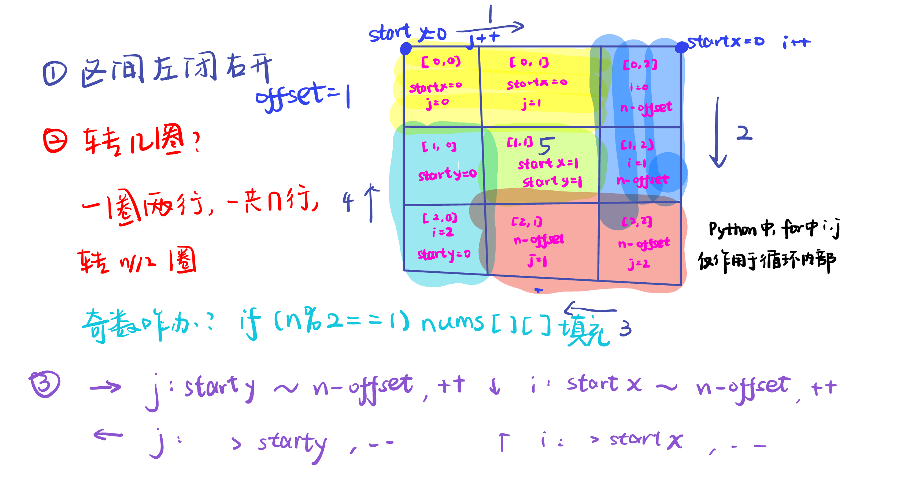

# 209.长度最小的子数组  
[题目链接](https://leetcode.cn/problems/minimum-size-subarray-sum/) [文章讲解](https://programmercarl.com/0209.%E9%95%BF%E5%BA%A6%E6%9C%80%E5%B0%8F%E7%9A%84%E5%AD%90%E6%95%B0%E7%BB%84.html) [视频讲解](https://www.bilibili.com/video/BV1tZ4y1q7XE)

- 暴力解法：（超出时间限制）

```Python
from typing import List

class Solution:
    def minSubArrayLen(self, target: int, nums: List[int]) -> int:
        sublength = 0
        result = float('inf')
        for i in range(0, len(nums)):
            sum = 0
            for j in range(i, len(nums)):
                sum += nums[j]
                if sum >= target:
                    sublength = j - i + 1
                    result = min(result, sublength)  # Python 没有三元比较符，更新最小长度
                    break
        return result if result != float('inf') else 0  # 如果没有找到满足条件的子数组，返回 0
```

- 滑动窗口：
  
**滑动窗口**：不断调节子序列的起始位置和终止位置。终止位置需要遍历到最后，因此关键点是如何确定起始位置，否则仍然是暴力解法。
  
需要明确的问题：1.窗口内是什么？是求和的元素集合。2.如何移动窗口的起始位置？如果当前窗口的值大于等于s，窗口就要向前移动了，也就是窗口该缩小了。3.如何移动窗口的结束位置？窗口的结束位置就是遍历数组的指针，也就是for循环里的索引。

为什么用while不用if？集合需要不断缩小。

**时间复杂度**：每个元素在滑动窗后进来操作一次，出去操作一次，每个元素都是被操作两次，所以时间复杂度是 2 × n 也就是O(n)。  

```Python
from typing import List

class Solution:
    def minSubArrayLen(self, target: int, nums: List[int]) -> int:
        sublength = 0
        result = float('inf')
        i = 0 
        sum = 0
        for j in range(0, len(nums)):
            sum += nums [j]
            while sum >= target:
                sublength = j - i + 1
                result = min(result, sublength)
                sum -= nums[i]
                i += 1
        return result if result != float('inf') else 0  
```

# 59.螺旋矩阵II  

[题目链接](https://leetcode.cn/problems/spiral-matrix-ii/) [文章讲解](https://programmercarl.com/0059.%E8%9E%BA%E6%97%8B%E7%9F%A9%E9%98%B5II.html) [视频讲解](https://www.bilibili.com/video/BV1SL4y1N7mV/)



循环不变量，左闭右开。

```Python
class Solution:
    def generateMatrix(self, n: int) -> List[List[int]]:
        matrix = [[0] * n for _ in range(n)]
        startx = 0
        starty = 0
        offset = 1
        count = 1
        loop = n // 2
        while loop > 0 :
            for j in range (starty, n - offset) :
                matrix[startx][j] = count
                count += 1
            for i in range (startx, n - offset) :
                matrix[i][n - offset] = count
                count += 1
            for j in range(n - offset, starty, -1):
                matrix[n - offset][j] = count
                count += 1
            for i in range(n - offset, startx, -1):
                matrix[i][starty] = count
                count += 1
            startx += 1
            starty += 1
            offset += 1
            loop -= 1
        if n % 2 == 1:
            matrix[startx][starty] = count
        return matrix
```

# 区间和  

[文章讲解](https://www.programmercarl.com/kamacoder/0058.%E5%8C%BA%E9%97%B4%E5%92%8C.html)  

暴力解法：把这个区间的和都累加一遍

**前缀和**：重复利用计算过的子数组之和，从而降低区间查询需要累加计算的次数。  

新数组：先做累加，即$`p[i]`$表示下标$`0到i的vec[i]`$累加之和

如果我们要求区间下标$`[2, 5]`$的区间和，那么应该是$`p[5] - p[1]`$，而不是$`p[5] - p[2]`$。

```Python
import sys
input = sys.stdin.read

def main():
    data = input().split()
    index = 0
    n = int(data[index])
    index += 1 
    vec = []
    for i in range(n):
        vec.append(int(data[index + i]))
    index += n 
    
    p = [0] * n 
    presum = 0
    for i in range(n):
        presum += vec[i]
        p[i] = presum
        
    results = []
    while index < len(data):
        a = int(data[index])
        b = int(data[index+1])
        index += 2
        
        if a == 0:
            sum_value = p[b]
        else:
            sum_value = p[b] - p[a-1]
        
        results.append(sum_value)
    
    for result in results:
        print(result)
    
if __name__=="__main__":
    main()
```
 
# 开发商购买土地

[文章讲解](https://www.programmercarl.com/kamacoder/0044.%E5%BC%80%E5%8F%91%E5%95%86%E8%B4%AD%E4%B9%B0%E5%9C%9F%E5%9C%B0.html)  

- 暴力解法：两遍区间和
  
  通过两层嵌套的 for 循环，将矩阵中每一行的元素累加到 horizontal 列表的对应位置。通过两层嵌套的 for 循环，将矩阵中每一列的元素累加到 vertical 列表的对应位置。
     
  通过 for 循环遍历每一行，将当前行的元素和累加到 horizontalCut 中，然后计算当前划分下两个子区域元素和的差值的绝对值 abs(sum - 2 * horizontalCut)，并更新 result 为较小值。通过 for 循环遍历每一列，将当前列的元素和累加到 verticalCut 中，然后计算当前划分下两个子区域元素和的差值的绝对值 abs(sum - 2 * verticalCut)，并更新 result 为较小值。
  
```Python
import sys
input = sys.stdin.read 

def main():
    data = input().split() 
    
    index = 0
    n = int(data[index])
    index += 1 
    m = int(data[index])
    index += 1 
    
    sum = 0
    vec=[]
    for i in range(n):
        row = []
        for j in range(m):
            num = int(data[index])
            index += 1 
            row.append(num)
            sum += num
        vec.append(row)
        
    horizontal = [0] * n 
    for i in range(n):
        for j in range(m):
            horizontal[i] += vec[i][j]
    
    vertical = [0] * m 
    for j in range(m):
        for i in range(n):
            vertical[j] += vec[i][j]
    
    result = float('inf')
    
    horizontalCut = 0
    for i in range(n):
        horizontalCut += horizontal[i]
        result = min(result, abs(sum - 2 * horizontalCut))
    
    verticalCut = 0
    for j in range(m):
        verticalCut += vertical[j]
        result = min(result, abs(sum - 2 * verticalCut))
    
    print(result)

if __name__=="__main__":
    main()
```

-优化暴力解法：

当遍历到一行的末尾元素（即 j == m - 1）时，计算当前划分下两个子区域元素和的差值的绝对值 abs(sum - 2 * count)，并更新 result 为较小值。当遍历到一列的末尾元素（即 i == n - 1）时，计算当前划分下两个子区域元素和的差值的绝对值 abs(sum - 2 * count)，并更新 result 为较小值。

```Python
import sys
input = sys.stdin.read 

def main():
    data = input().split() 
    
    index = 0
    n = int(data[index])
    index += 1 
    m = int(data[index])
    index += 1 
    
    sum = 0
    vec=[]
    for i in range(n):
        row = []
        for j in range(m):
            num = int(data[index])
            index += 1 
            row.append(num)
            sum += num
        vec.append(row)
    
    result = float('inf')
    
    horizontal = 0 
    for i in range(n):
        for j in range(m):
            horizontal += vec[i][j]
            if j == m - 1:
                result = min(result, abs(sum - 2 * horizontal))
    
    vertical = 0 
    for j in range(m):
        for i in range(n):
            vertical += vec[i][j]
            if i == n - 1:
                result = min(result, abs(sum - 2 * vertical))

    print(result)

if __name__=="__main__":
    main()
```

# 数组总结 

[文章链接](https://programmercarl.com/%E6%95%B0%E7%BB%84%E6%80%BB%E7%BB%93%E7%AF%87.html)

01. 循环不变量：只有在循环中坚持对区间的定义，才能清楚的把握循环中的各种细节  
02. 双指针：通过一个快指针和慢指针在一个for循环下完成两个for循环的工作  
03. 滑动窗口：根据当前子序列和大小的情况，不断调节子序列的起始位置  
04. 前缀和：空间换时间，另起一个数组计算
