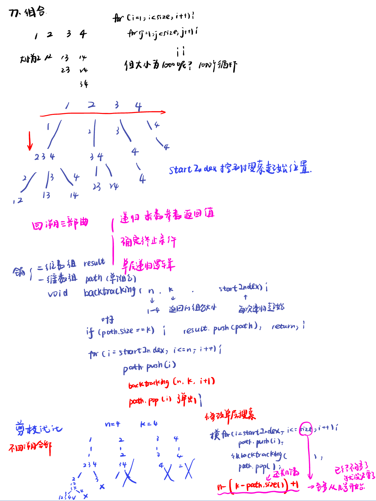
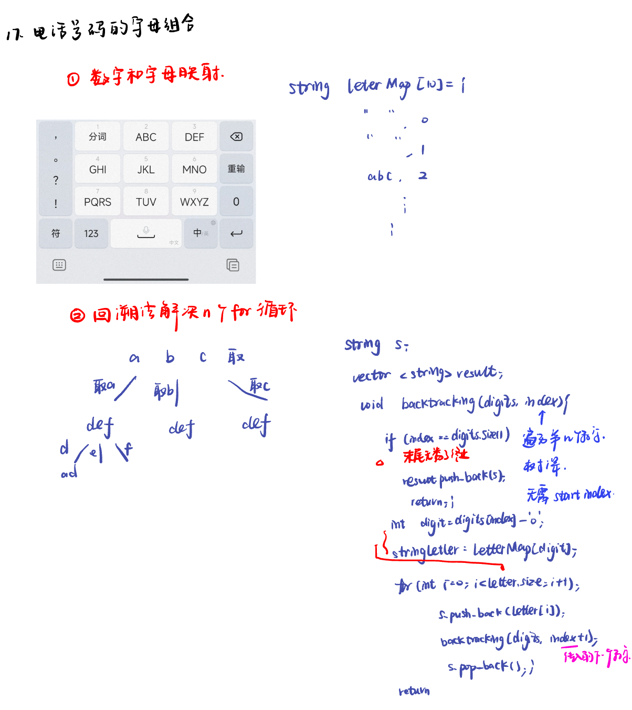

List: 理论基础，77. 组合，216.组合总和III，17.电话号码的字母组合

[理论基础](#01)，[77. 组合combinations](#02)，[216.组合总和IIIcombination-sum-iii](#03)，[](#04)

# <span id="01">理论基础</span>

[Learning Materials](https://programmercarl.com/%E5%9B%9E%E6%BA%AF%E7%AE%97%E6%B3%95%E7%90%86%E8%AE%BA%E5%9F%BA%E7%A1%80.html)


# <span id="02">77. 组合combinations</span>

[Leetcode](https://leetcode.cn/problems/combinations/description/) 

[Learning Materials](https://programmercarl.com/0077.%E7%BB%84%E5%90%88.html#%E7%AE%97%E6%B3%95%E5%85%AC%E5%BC%80%E8%AF%BE)



```python
class Solution:
    def __init__(self):
        self.result = []
        self.path = []
    def combine(self, n: int, k: int) -> List[List[int]]:
        self.backtracking(n, k, 1)
        return self.result
    def backtracking(self, n, k, startIndex):
        if len(self.path) == k:
            self.result.append(self.path[:])
            return
        for i in range(startIndex, n + 1):
            self.path.append(i)
            self.backtracking(n, k, i + 1)
            self.path.pop()
```

区分：self.result.append(self.path)

这行代码直接将 self.path 列表对象本身添加到 self.result 列表中，而不是添加它的副本。也就是说，self.result 列表中的元素和 self.path 指向的是同一个列表对象。因此，后续对 self.path 的修改会反映在 self.result 列表中对应的元素上。

## 剪枝优化：

```python
class Solution:
    def __init__(self):
        self.result = []
        self.path = []
    def combine(self, n: int, k: int) -> List[List[int]]:
        self.backtracking(n, k, 1)
        return self.result
    def backtracking(self, n, k, startIndex):
        if len(self.path) == k:
            self.result.append(self.path[:])
            return
        for i in range(startIndex, n - (k - len(self.path)) + 2):
            self.path.append(i)
            self.backtracking(n, k, i + 1)
            self.path.pop()
```

# <span id="03">216.组合总和IIIcombination-sum-iii</span>

[Leetcode](https://leetcode.cn/problems/combination-sum-iii/description/) 

[Learning Materials](https://programmercarl.com/0216.%E7%BB%84%E5%90%88%E6%80%BB%E5%92%8CIII.html#%E7%AE%97%E6%B3%95%E5%85%AC%E5%BC%80%E8%AF%BE)


## 包括两重剪枝：

```python
class Solution:
    def combinationSum3(self, k: int, n: int) -> List[List[int]]:
        result = []
        self.backtracking(k, n, 0, [], result, 1)
        return result
    def backtracking(self, k, n, Sum, path, result, startIndex):
        # targetSum：目标和，也就是题目中的n。
        # k：题目中要求k个数的集合。
        # sum：已经收集的元素的总和，也就是path里元素的总和。
        # startIndex：下一层for循环搜索的起始位置。
        if Sum > n:
            return
        if len(path) == k:
            if Sum == n:
                result.append(path[:])
            return
        for i in range(startIndex, 9 - (k - len(path)) + 2):
            Sum += i
            path.append(i)
            self.backtracking(k, n, Sum, path, result, i + 1)
            Sum -= i
            path.pop()
```

# <span id="04">17.电话号码的字母组合letter-combinations-of-a-phone-number</span>

[Leetcode](https://leetcode.cn/problems/letter-combinations-of-a-phone-number/) 

[Learning Materials](https://programmercarl.com/0017.%E7%94%B5%E8%AF%9D%E5%8F%B7%E7%A0%81%E7%9A%84%E5%AD%97%E6%AF%8D%E7%BB%84%E5%90%88.html)



```python
class Solution:
    def __init__(self):
        self.lettermap = [
            "",
            "",
            "abc",
            "def",
            "ghi",
            "jkl",
            "mno",
            "pqrs",
            "tuv",
            "wxyz"
        ]
        self.result = []
        self.s = ""
    def letterCombinations(self, digits: str) -> List[str]:
        if len(digits) == 0:
            return self.result
        self.backtracking(digits, 0)
        return self.result
    def backtracking(self, digits, index):
        if index == len(digits):
            self.result.append(self.s)
            return
        digit = int(digits[index]) # 将index指向的数字转为int
        letters = self.lettermap[digit] #取数字对应的字符集
        for i in range(len(letters)):
            self.s += letters[i]
            self.backtracking(digits, index + 1)
            self.s = self.s[:-1]
        # 横向遍历第一个数字的letter集，纵向遍历第二个数字的letter集
```
