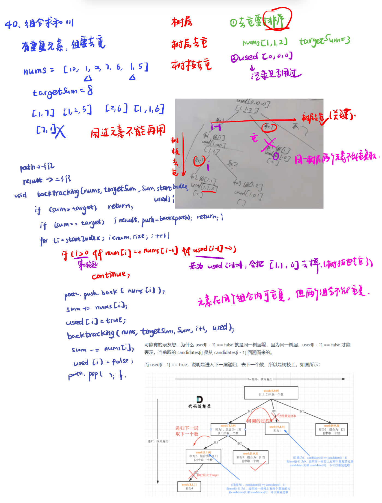

List: 39. 组合总和，40.组合总和II，131.分割回文串 

[39. 组合总和combination-sum](#01)，[40.组合总和IIcombination-sum-ii](#02)，[131.分割回文串palindrome-partitioning](#03)

# <span id="01">39. 组合总和combination-sum</span>

[Leetcode](https://leetcode.cn/problems/combination-sum/description/) 

[Learning Materials](https://programmercarl.com/0039.%E7%BB%84%E5%90%88%E6%80%BB%E5%92%8C.html)


```python
class Solution:
    def __init__(self):
        self.result = []
        self.path = []
    def combinationSum(self, candidates: List[int], target: int) -> List[List[int]]:
        self.backtracking(candidates, target, 0, 0)
        return self.result
    def backtracking(self, candidates, target, Sum, startIndex):
        if Sum > target :
            return
        if Sum == target:
            self.result.append(self.path[:])
            return 
        for i in range(startIndex, len(candidates)):
            self.path.append(candidates[i])
            Sum += candidates[i]
            self.backtracking(candidates, target, Sum, i)
            Sum -= candidates[i]
            self.path.pop()
```

- 剪枝：先排序，再剪枝

```python
class Solution:
    def __init__(self):
        self.result = []
        self.path = []
    def combinationSum(self, candidates: List[int], target: int) -> List[List[int]]:
        candidates.sort()  # 需要先有序
        self.backtracking(candidates, target, 0, 0)
        return self.result
    def backtracking(self, candidates, target, Sum, startIndex):
        if Sum == target:
            self.result.append(self.path[:])
            return 
        for i in range(startIndex, len(candidates)):
            if Sum + candidates[i] > target:  #剪枝
                break 
            self.path.append(candidates[i])
            Sum += candidates[i]
            self.backtracking(candidates, target, Sum, i)
            Sum -= candidates[i]
            self.path.pop()
```

# <span id="02">40.组合总和IIcombination-sum-ii</span>

[Leetcode](https://leetcode.cn/problems/combination-sum-ii/description/) 

[Learning Materials](https://programmercarl.com/0040.%E7%BB%84%E5%90%88%E6%80%BB%E5%92%8CII.html#%E7%AE%97%E6%B3%95%E5%85%AC%E5%BC%80%E8%AF%BE)



```python
class Solution:
    def __init__(self):
        self.result = []
        self.path = []
    def combinationSum2(self, candidates: List[int], target: int) -> List[List[int]]:
        used = [0] * len(candidates)
        candidates.sort()
        self.backtracking(candidates, target, 0, 0, used)
        return self.result
    def backtracking(self, candidates, target, total, startIndex, used):
        if total > target:
            return
        if total == target:
            self.result.append(self.path[:])
            return
        for i in range(startIndex, len(candidates)):
            if i > 0 and candidates[i] == candidates[i - 1] and used[i - 1] == 0:
                continue
            total += candidates[i]
            used[i] = 1
            self.path.append(candidates[i])
            self.backtracking(candidates, target, total, i + 1, used)
            self.path.pop()
            total -= candidates[i]
            used[i] = 0
```

# <span id="03">131.分割回文串palindrome-partitioning</span>

[Leetcode](https://leetcode.cn/problems/palindrome-partitioning/description/) 

[Learning Materials](https://programmercarl.com/0131.%E5%88%86%E5%89%B2%E5%9B%9E%E6%96%87%E4%B8%B2.html#%E7%AE%97%E6%B3%95%E5%85%AC%E5%BC%80%E8%AF%BE)


```python
class Solution:
    """
    递归用于纵向遍历
        for循环用于横向遍历
        当切割线迭代至字符串末尾，说明找到一种方法
        类似组合问题，为了不重复切割同一位置，需要start_index来做标记下一轮递归的起始位置(切割线)
    """
    def __init__(self):
        self.path = []
        self.result = []
    def partition(self, s: str) -> List[List[str]]:
        self.backtracking(s, 0)
        return self.result
    def ispalindrome(self, s, start, end):
        i = start
        j = end
        while i < j:
            if s[i] != s[j]:
                return False
            i += 1
            j -= 1
        return True
    def backtracking(self, s, startindex):
        if startindex >= len(s): #如果起始位置已经大于s的大小，说明已经找到了一组分割方案了
            self.result.append(self.path[:])
            return
        for i in range(startindex, len(s)): 
            if self.ispalindrome(s, startindex, i): #[startIndex, i] 就是要截取的子串
                self.path.append(s[startindex : i + 1])
                self.backtracking(s, i + 1) #寻找i+1为起始位置的子串
                self.path.pop()
            else:
                continue
```
