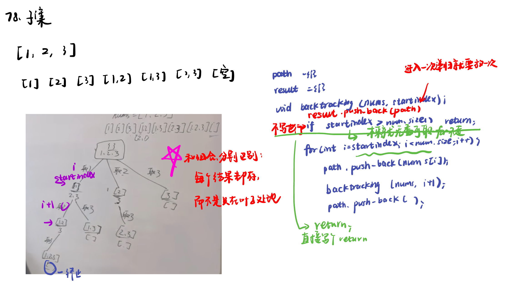

List: 93.复原IP地址，78.子集，90.子集II

[93.复原IP地址problems/restore-ip-addresses](#01)，[78.子集subsets](#02)，[90.子集IIsubsets-ii](#03)

# <span id="01">93.复原IP地址problems/restore-ip-addresses</span>

[Leetcode](https://leetcode.cn/problems/restore-ip-addresses/) 

[Learning Materials](https://programmercarl.com/0093.复原IP地址.html)


```python
class Solution:
    def __init__(self):
        self.result = []
    def restoreIpAddresses(self, s: str) -> List[str]:
        self.backtracking(s, 0, 0)
        return self.result
    def backtracking(self, s, pointsum, startindex):
        if pointsum == 3:
            if self.isvalid(s, startindex, len(s) - 1):#逗点加到3了，后边那点是不是合法
                self.result.append(s)
                return
        for i in range(startindex, len(s)):
            if self.isvalid(s, startindex, i): #每个区间是否合法
                new_s = s[:i + 1] + '.' + s[i + 1:]
                pointsum += 1
                self.backtracking(new_s, pointsum, i + 2)
                pointsum -= 1
            else:
                break
    def isvalid(self, s, start, end):
        if start > end:
            return False
        if s[start] == '0' and start != end: # 允许单独出现 但不能为0
            return False
        num = 0
        for i in range(start, end + 1):
            if s[i] > '9' or s[i] < '0':
                return False
            num = num * 10 + int(s[i])
            if num > 255:
                return False
        return True
```

## debug的地方：

- 错误例子：

```python
class Solution:
    def __init__(self):
        self.result = []
    def restoreIpAddresses(self, s: str) -> List[str]:
        self.backtracking(s, 0, 0)
        return self.result
    def backtracking(self, s, pointsum, startindex):
        if pointsum == 3:
            if self.isvalid(s, startindex, len(s) - 1):#逗点加到3了，后边那点是不是合法
                self.result.append(s)
                return
        for i in range(startindex, len(s)):
            if self.isvalid(s, startindex, i): #每个区间是否合法
                new_s = s[:i + 1] + '.' + s[i + 1:]
            pointsum += 1
            self.backtracking(new_s, pointsum, i + 2)
            pointsum -= 1
    def isvalid(self, s, start, end):
        if start > end:
            return 
        if s[start] == '0' and start != end: # 允许单独出现 但不能为0
            return
        num = 0
        for i in range(start, end):
            if s[i] > '9' or s[i] < '0':
                return
            num = num * 10 + int(s[i])
            if num > 255:
                return 
        return True
```

### 1. `isvalid` 函数返回值问题
在 `isvalid` 函数中，当不满足某些条件时，代码只是简单地执行 `return`，而没有明确返回 `False`。在 Python 中，如果函数执行到 `return` 语句但没有指定返回值，默认返回 `None`。在条件判断中，`None` 不会被正确处理，应该明确返回 `False` 来表示不合法的情况。

### 2. `for` 循环范围问题
在 `isvalid` 函数里，`for` 循环的范围是 `range(start, end)`，这会导致最后一个字符没有被检查。应该将范围改为 `range(start, end + 1)` 以包含区间内的所有字符。

### 3. 点号插入逻辑问题
在 `backtracking` 函数中，当 `if self.isvalid(s, startindex, i)` 条件为 `True` 时，仅创建了 `new_s` 但没有正确处理不合法的情况。并且如果 `isvalid` 为 `False` 时，没有相应的处理逻辑，应该添加 `else` 分支进行处理，避免无效递归。

### 4. 字符串拼接导致的索引问题
在递归调用 `self.backtracking(new_s, pointsum, i + 2)` 时，由于插入了点号，字符串长度发生了变化，后续的索引计算会出错。实际上，插入点号后，新的起始索引应该是 `i + 1 + 1`（因为插入了一个点号）。


## 如果把判断合法放入循环里面：

```python
for i in range(startIndex, min(startIndex+3, len(s))):
            # 如果 i 往后遍历了，并且当前地址的第一个元素是 0 ，就直接退出
            if i > startIndex and s[startIndex] == '0':
                break
            # 比如 s 长度为 5，当前遍历到 i = 3 这个元素
            # 因为还没有执行任何操作，所以此时剩下的元素数量就是 5 - 3 = 2 ，即包括当前的 i 本身
            # path 里面是当前包含的子串，所以有几个元素就表示储存了几个地址
            # 所以 (4 - len(path)) * 3 表示当前路径至多能存放的元素个数
            # 4 - len(path) 表示至少要存放的元素个数
            if (4 - len(path)) * 3 < len(s) - i or 4 - len(path) > len(s) - i:
                break
            if i - startIndex == 2:
                if not int(s[startIndex:i+1]) <= 255:
                    break
            path.append(s[startIndex:i+1])
            self.backtracking(s, i+1, path, result)
            path.pop()
```

# <span id="02">78.子集subsets</span>

[Leetcode](https://leetcode.cn/problems/subsets/) 

[Learning Materials](https://programmercarl.com/0078.%E5%AD%90%E9%9B%86.html#%E7%AE%97%E6%B3%95%E5%85%AC%E5%BC%80%E8%AF%BE)



```python
class Solution:
    def subsets(self, nums: List[int]) -> List[List[int]]:
        result = []
        self.backtracking(nums, 0, [], result)
        return result
    def backtracking(self, nums, startindex, path, result):
        result.append(path[:])
        if startindex > len(nums):
            return
        for i in range(startindex, len(nums)):
            path.append(nums[i])
            self.backtracking(nums, i + 1, path, result)
            path.pop()
```

# <span id="03">90.子集IIsubsets-ii</span>

[Leetcode](https://leetcode.cn/problems/subsets-ii/description/) 

[Learning Materials](https://programmercarl.com/0090.%E5%AD%90%E9%9B%86II.html#%E7%AE%97%E6%B3%95%E5%85%AC%E5%BC%80%E8%AF%BE)


```python
class Solution:
    def subsetsWithDup(self, nums: List[int]) -> List[List[int]]:
        result = []
        used = [0] * len(nums)
        nums.sort()
        self.backtracking(nums, 0, [], result, used)
        return result
    def backtracking(self, nums, startindex, path, result, used):
        result.append(path[:])
        for i in range(startindex, len(nums)):
            if i > 0 and nums[i] == nums[i - 1] and used[i - 1] == 0:
                continue
            path.append(nums[i])
            used[i] = 1
            self.backtracking(nums, i + 1, path, result, used)
            used[i] = 0
            path.pop()
```

- 也可以使用uset = set()直接去重

- 直接用startindex去重：利用递归的时候下一个startIndex是i+1而不是0去重

```python
if i > startIndex and nums[i] == nums[i - 1]:
                continue
```
