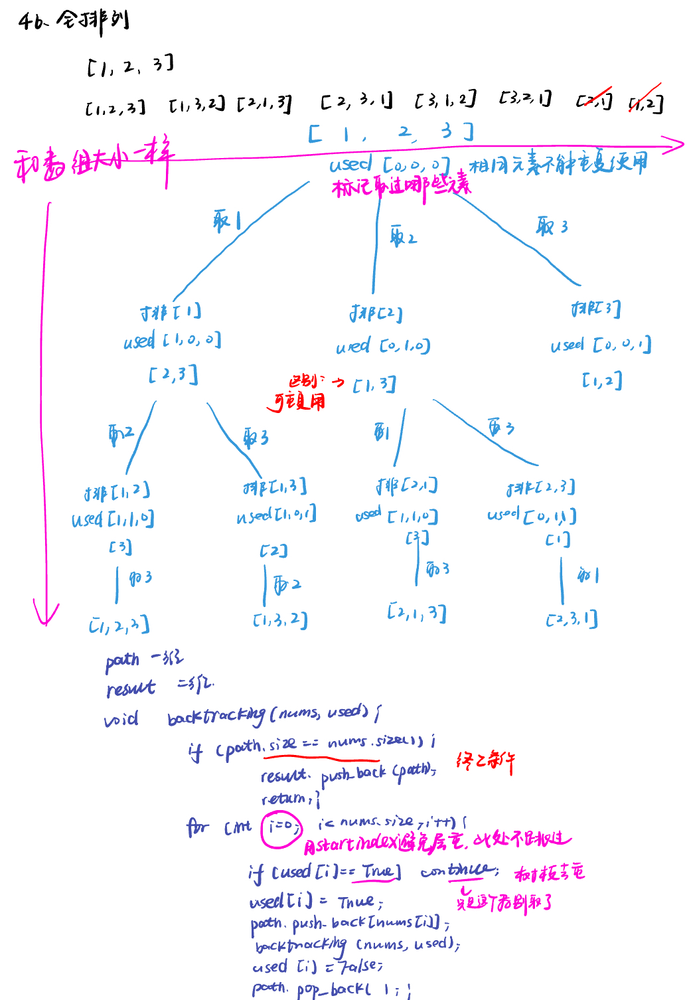
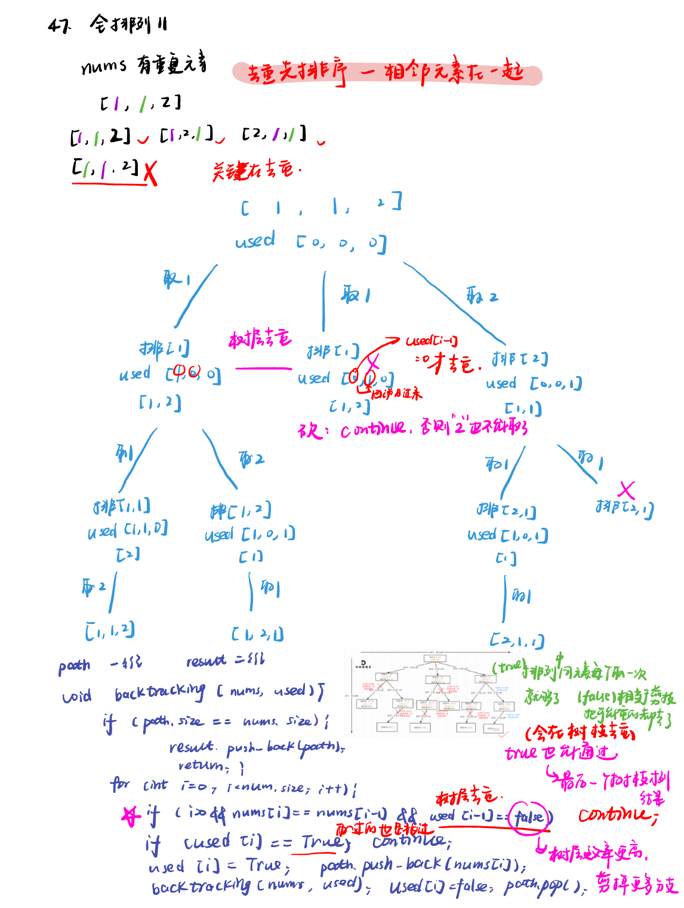
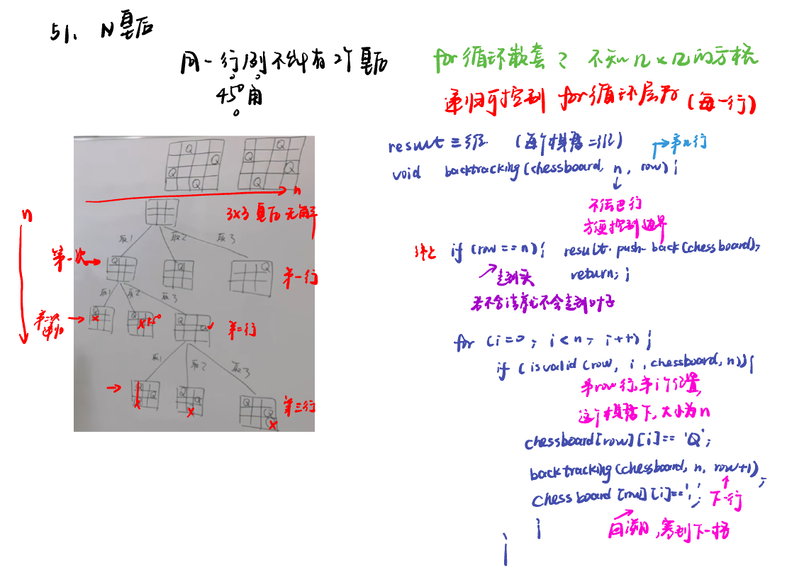
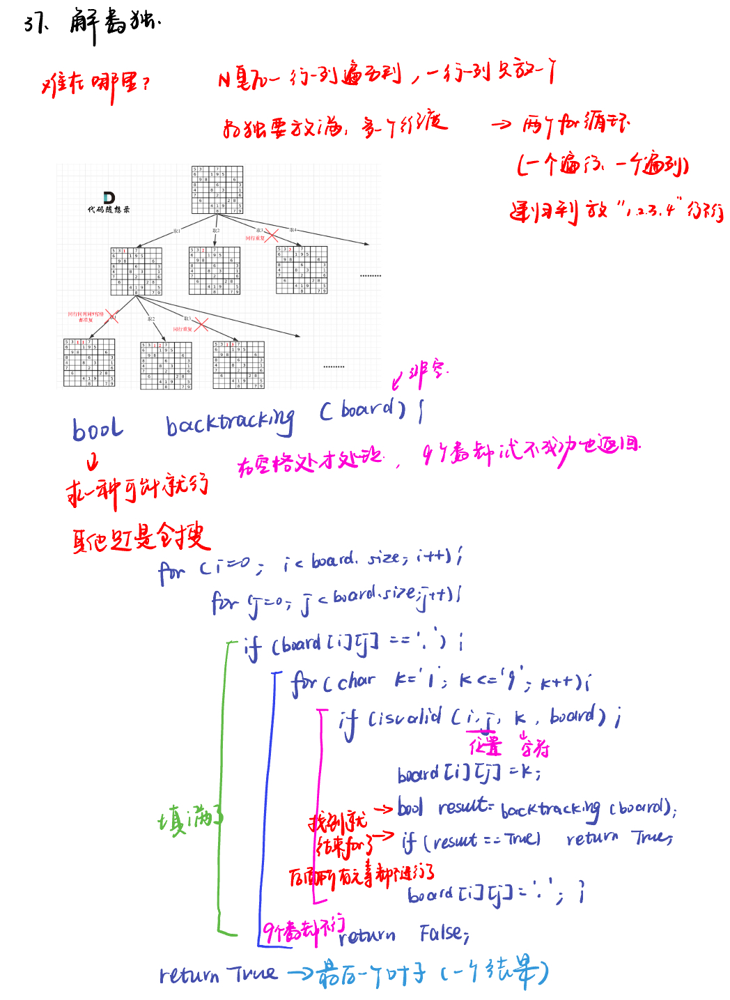

List: 491.递增子序列，46.全排列，47.全排列 II，332.重新安排行程，51.N皇后，37.解数独，总结

[491.递增子序列non-decreasing-subsequences](#01)，[46.全排列permutations](#02)，[47.全排列 IIpermutations-ii](#03)，[](#04),[51. N皇后n-queens](#05)，[37. 解数独sudoku-solver](#06),[](#07)

# <span id="01">491.递增子序列non-decreasing-subsequences</span>

[Leetcode](https://leetcode.cn/problems/non-decreasing-subsequences/description/) 

[Learning Materials](https://programmercarl.com/0491.%E9%80%92%E5%A2%9E%E5%AD%90%E5%BA%8F%E5%88%97.html)


## 字典去重

```python
class Solution:
    def findSubsequences(self, nums: List[int]) -> List[List[int]]:
        path  = []
        result = []
        self.backtracking(nums, 0, path, result)
        return result
    def backtracking(self, nums, startindex, path, result):
        if len(path) > 1: #题目要求递增子序列大小至少为2
            result.append(path[:])# 注意要使用切片将当前路径的副本加入结果集
            # 注意这里不要加return，要取树上的节点
        uset = set()
        for i in range(startindex, len(nums)):
            if path and nums[i] < path[-1] or nums[i] in uset:
                continue
            uset.add(nums[i]) # 记录这个元素在本层用过了，本层后面不能再用了
            path.append(nums[i])
            self.backtracking(nums, i + 1, path, result)
            path.pop()
```

## 哈希表去重

- 注意题目中说了，数值范围`[-100,100]`，所以完全可以用数组来做哈希。

- 程序运行的时候对unordered_set 频繁的insert，unordered_set需要做哈希映射（也就是把key通过hash function映射为唯一的哈希值）相对费时间，而且每次重新定义set，insert的时候其底层的符号表也要做相应的扩充，也是费事的。

```python
class Solution:
    def findSubsequences(self, nums: List[int]) -> List[List[int]]:
        path  = []
        result = []
        self.backtracking(nums, 0, path, result)
        return result
    def backtracking(self, nums, startindex, path, result):
        if len(path) > 1: #题目要求递增子序列大小至少为2
            result.append(path[:])# 注意要使用切片将当前路径的副本加入结果集
            # 注意这里不要加return，要取树上的节点
        used = [0] * 201  # 使用数组来进行去重操作，题目说数值范围[-100, 100]
        for i in range(startindex, len(nums)):
            if path and nums[i] < path[-1] or used[nums[i] + 100] == 1:
                continue
            used[nums[i] + 100] = 1  # 标记当前元素已经使用过
            path.append(nums[i])
            self.backtracking(nums, i + 1, path, result)
            path.pop()
```

# <span id="02">46.全排列permutations</span>

[Leetcode](https://leetcode.cn/problems/permutations/description/) 

[Learning Materials](https://programmercarl.com/0046.%E5%85%A8%E6%8E%92%E5%88%97.html#%E7%AE%97%E6%B3%95%E5%85%AC%E5%BC%80%E8%AF%BE)



```python
class Solution:
    def permute(self, nums: List[int]) -> List[List[int]]:
        path = []
        result = []
        used = [0] * len(nums)
        self.backtracking(nums, used, path, result)
        return result
    def backtracking(self, nums, used, path, result):
        if len(path) == len(nums):
            result.append(path[:])
            return
        for i in range(0, len(nums)):
            if  used[i] == 1:
                continue
            used[i] = 1
            path.append(nums[i])
            self.backtracking(nums, used, path, result)
            path.pop()
            used[i] = 0
```

# <span id="03">47.全排列 IIpermutations-ii</span>

[Leetcode](https://leetcode.cn/problems/permutations-ii/description/) 

[Learning Materials](https://programmercarl.com/0047.%E5%85%A8%E6%8E%92%E5%88%97II.html#%E7%AE%97%E6%B3%95%E5%85%AC%E5%BC%80%E8%AF%BE)



```python
class Solution:
    def permuteUnique(self, nums: List[int]) -> List[List[int]]:
        nums.sort() #去重先排序
        path = []
        result = []
        used = [0] * len(nums)
        self.backtracking(nums, used, path, result)
        return result
    def backtracking(self, nums, used, path, result):
        if len(path) == len(nums):
            result.append(path[:])
            return
        for i in range(0, len(nums)):
            if i > 0 and nums[i] == nums[i - 1] and used[i - 1] == 0:
                continue
            if  used[i] == 1:
                continue
            used[i] = 1
            path.append(nums[i])
            self.backtracking(nums, used, path, result)
            path.pop()
            used[i] = 0
```

# <span id="04">理论基础</span>

[Leetcode]() 

[Learning Materials]()


# <span id="05">51. N皇后n-queens</span>

[Leetcode](https://leetcode.cn/problems/n-queens/description/) 

[Learning Materials](https://programmercarl.com/0051.N%E7%9A%87%E5%90%8E.html#%E7%AE%97%E6%B3%95%E5%85%AC%E5%BC%80%E8%AF%BE)



```python
class Solution:
    def solveNQueens(self, n: int) -> List[List[str]]:
        result = []
        chessboard = [['.' for _ in range(n)] for _ in range(n)] 
        self.backtracking(chessboard, n, 0, result)
        return result
    def backtracking(self, chessboard, n, row, result):
        if row == n:
            result.append(["".join(row) for row in chessboard])
            return
        for i in range(0, n):
            if self.isvalid(row, i, chessboard, n):
                chessboard[row][i] = 'Q'
                self.backtracking(chessboard, n, row + 1, result)
                chessboard[row][i] = '.'
    def isvalid(self, row, col, chessboard, n): #同行同列同一斜线都不能有！
        for i in range(0, row):
            if chessboard[i][col] == 'Q':
                return False
        # 检查 45 度角是否有皇后
        i, j = row - 1, col - 1
        while i >= 0 and j >= 0:
            if chessboard[i][j] == 'Q':
                return False # 左上方向已经存在皇后，不合法
            i -= 1
            j -= 1
        # 检查 135 度角是否有皇后
        i, j = row - 1, col + 1
        while i >= 0 and j < n:
            if chessboard[i][j] == 'Q':
                return False # 右上方向已经存在皇后，不合法
            i -= 1
            j += 1
        return True
```

# <span id="06">37. 解数独sudoku-solver</span>

[Leetcode](https://leetcode.cn/problems/sudoku-solver/description/) 

[Learning Materials](https://programmercarl.com/0037.%E8%A7%A3%E6%95%B0%E7%8B%AC.html#%E7%AE%97%E6%B3%95%E5%85%AC%E5%BC%80%E8%AF%BE)



本题递归不用终止条件，解数独是要遍历整个树形结构寻找可能的叶子节点就立刻返回。

不用终止条件会不会死循环？

递归的下一层的棋盘一定比上一层的棋盘多一个数，等数填满了棋盘自然就终止（填满当然好了，说明找到结果了），所以不需要终止条件！

```python
class Solution:
    def solveSudoku(self, board: List[List[str]]) -> None:
        """
        Do not return anything, modify board in-place instead.
        """
        self.backtracking(board)
    def backtracking(self, board):
        for i in range(0, len(board)):
            for j in range(0, len(board)):
                if board[i][j] == '.':
                    for k in range(1, 10):
                        if self.isvalid(i, j, str(k), board):
                            board[i][j] = str(k)
                            result = self.backtracking(board)
                            if result == True:
                                return True
                            board[i][j] = '.'
                    return False
        return True
    def isvalid(self, row, col, val, board):
        for i in range(0, 9): #判断行里是否重复
            if board[row][i] == val:
                return False
        for j in range(0, 9): #判断列里是否重复
            if board[j][col] == val:
                return False
        startrow = (row // 3) * 3 # 判断9方格里是否重复
        startcol = (col // 3) * 3
        for i in range(startrow, startrow + 3):
            for j in range(startcol, startcol + 3):
                if board[i][j] == val:
                    return False
        return True
```

# <span id="07">理论基础</span>

[Leetcode]() 

[Learning Materials]()


