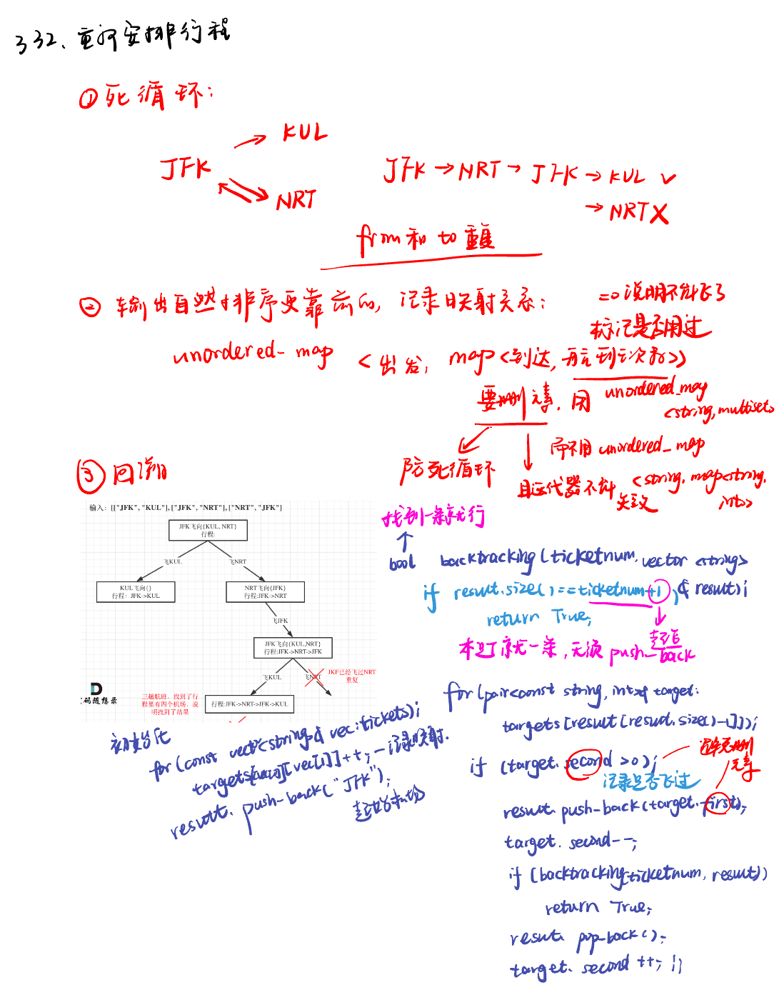

List: 491.递增子序列，46.全排列，47.全排列 II，332.重新安排行程，51.N皇后，37.解数独，总结

[491.递增子序列non-decreasing-subsequences](#01)，[46.全排列permutations](#02)，[47.全排列 IIpermutations-ii](#03)，[332.重新安排行程reconstruct-itinerary](#04),[51. N皇后n-queens](#05)，[37. 解数独sudoku-solver](#06),[总结](#07)

# <span id="01">491.递增子序列non-decreasing-subsequences</span>

[Leetcode](https://leetcode.cn/problems/non-decreasing-subsequences/description/) 

[Learning Materials](https://programmercarl.com/0491.%E9%80%92%E5%A2%9E%E5%AD%90%E5%BA%8F%E5%88%97.html)


## 字典去重

```python
class Solution:
    def findSubsequences(self, nums: List[int]) -> List[List[int]]:
        path  = []
        result = []
        self.backtracking(nums, 0, path, result)
        return result
    def backtracking(self, nums, startindex, path, result):
        if len(path) > 1: #题目要求递增子序列大小至少为2
            result.append(path[:])# 注意要使用切片将当前路径的副本加入结果集
            # 注意这里不要加return，要取树上的节点
        uset = set()
        for i in range(startindex, len(nums)):
            if path and nums[i] < path[-1] or nums[i] in uset:
                continue
            uset.add(nums[i]) # 记录这个元素在本层用过了，本层后面不能再用了
            path.append(nums[i])
            self.backtracking(nums, i + 1, path, result)
            path.pop()
```

## 哈希表去重

- 注意题目中说了，数值范围`[-100,100]`，所以完全可以用数组来做哈希。

- 程序运行的时候对unordered_set 频繁的insert，unordered_set需要做哈希映射（也就是把key通过hash function映射为唯一的哈希值）相对费时间，而且每次重新定义set，insert的时候其底层的符号表也要做相应的扩充，也是费事的。

```python
class Solution:
    def findSubsequences(self, nums: List[int]) -> List[List[int]]:
        path  = []
        result = []
        self.backtracking(nums, 0, path, result)
        return result
    def backtracking(self, nums, startindex, path, result):
        if len(path) > 1: #题目要求递增子序列大小至少为2
            result.append(path[:])# 注意要使用切片将当前路径的副本加入结果集
            # 注意这里不要加return，要取树上的节点
        used = [0] * 201  # 使用数组来进行去重操作，题目说数值范围[-100, 100]
        for i in range(startindex, len(nums)):
            if path and nums[i] < path[-1] or used[nums[i] + 100] == 1:
                continue
            used[nums[i] + 100] = 1  # 标记当前元素已经使用过
            path.append(nums[i])
            self.backtracking(nums, i + 1, path, result)
            path.pop()
```

# <span id="02">46.全排列permutations</span>

[Leetcode](https://leetcode.cn/problems/permutations/description/) 

[Learning Materials](https://programmercarl.com/0046.%E5%85%A8%E6%8E%92%E5%88%97.html#%E7%AE%97%E6%B3%95%E5%85%AC%E5%BC%80%E8%AF%BE)


```python
class Solution:
    def permute(self, nums: List[int]) -> List[List[int]]:
        path = []
        result = []
        used = [0] * len(nums)
        self.backtracking(nums, used, path, result)
        return result
    def backtracking(self, nums, used, path, result):
        if len(path) == len(nums):
            result.append(path[:])
            return
        for i in range(0, len(nums)):
            if  used[i] == 1:
                continue
            used[i] = 1
            path.append(nums[i])
            self.backtracking(nums, used, path, result)
            path.pop()
            used[i] = 0
```

# <span id="03">47.全排列 IIpermutations-ii</span>

[Leetcode](https://leetcode.cn/problems/permutations-ii/description/) 

[Learning Materials](https://programmercarl.com/0047.%E5%85%A8%E6%8E%92%E5%88%97II.html#%E7%AE%97%E6%B3%95%E5%85%AC%E5%BC%80%E8%AF%BE)


```python
class Solution:
    def permuteUnique(self, nums: List[int]) -> List[List[int]]:
        nums.sort() #去重先排序
        path = []
        result = []
        used = [0] * len(nums)
        self.backtracking(nums, used, path, result)
        return result
    def backtracking(self, nums, used, path, result):
        if len(path) == len(nums):
            result.append(path[:])
            return
        for i in range(0, len(nums)):
            if i > 0 and nums[i] == nums[i - 1] and used[i - 1] == 0:
                continue
            if  used[i] == 1:
                continue
            used[i] = 1
            path.append(nums[i])
            self.backtracking(nums, used, path, result)
            path.pop()
            used[i] = 0
```

# <span id="04">332.重新安排行程reconstruct-itinerary</span>

[Leetcode](https://leetcode.cn/problems/reconstruct-itinerary/description/) 

[Learning Materials](https://programmercarl.com/0332.%E9%87%8D%E6%96%B0%E5%AE%89%E6%8E%92%E8%A1%8C%E7%A8%8B.html#%E7%AE%97%E6%B3%95%E5%85%AC%E5%BC%80%E8%AF%BE)




## 回溯法：

```python
class Solution:
    def findItinerary(self, tickets: List[List[str]]) -> List[str]:
        targets = defaultdict(list) # 创建默认字典，用于存储机场映射关系
        for ticket in tickets:
            targets[ticket[0]].append(ticket[1]) # 将机票输入到字典中
        for key in targets:
            targets[key].sort(reverse = True) # 对到达机场列表进行字母逆序排序
        result = []
        self.backtracking("JFK", targets, result)
        return result[::-1]
    def backtracking(self, airport, targets, result):
        while targets[airport]: # 当机场还有可到达的机场时
            next_airport = targets[airport].pop() # 弹出下一个机场
            self.backtracking(next_airport, targets, result)
        result.append(airport) # 将当前机场添加到行程路径中
```

### 整体思路概述
这也是解决力扣 332 题“重新安排行程”的代码，其核心思路同样是基于深度优先搜索（DFS）结合回溯的思想。通过构建一个机场的映射关系，即从每个出发机场到其可到达的目的机场的映射，然后从起点 `JFK` 开始进行深度优先搜索，不断探索可能的行程，最终找出符合条件的行程路径。

### 代码详细解释

#### 1. `findItinerary` 方法
```python
from collections import defaultdict
from typing import List

class Solution:
    def findItinerary(self, tickets: List[List[str]]) -> List[str]:
        # 创建默认字典，用于存储机场映射关系
        targets = defaultdict(list)
        # 将机票输入到字典中
        for ticket in tickets:
            targets[ticket[0]].append(ticket[1])
        # 对到达机场列表进行字母逆序排序
        for key in targets:
            targets[key].sort(reverse = True)
        result = []
        self.backtracking("JFK", targets, result)
        return result[::-1]
```
- **`targets = defaultdict(list)`**：使用 `defaultdict` 是为了方便处理当字典中不存在某个键时的情况。如果访问一个不存在的键，`defaultdict` 会自动创建一个空列表作为该键的值，避免了手动检查键是否存在的麻烦。
- **机票信息录入**：
    ```python
    for ticket in tickets:
        targets[ticket[0]].append(ticket[1])
    ```
    遍历所有的机票信息，将每张机票的出发机场作为键，目的机场作为值添加到 `targets` 字典中。这样就构建了一个从出发机场到其可到达目的机场的映射关系。
- **逆序排序**：
    ```python
    for key in targets:
        targets[key].sort(reverse = True)
    ```
    对每个出发机场对应的可到达目的机场列表进行逆序排序。之所以逆序排序，是因为后续在深度优先搜索时会使用 `pop` 方法从列表末尾取出元素，逆序排序后，每次取出的元素就是字典序最小的元素，从而保证最终得到的行程是字典序最小的。
- **调用回溯函数并返回结果**：
    ```python
    result = []
    self.backtracking("JFK", targets, result)
    return result[::-1]
    ```
    初始化一个空列表 `result` 用于存储最终的行程路径。从 `JFK` 机场开始调用 `backtracking` 方法进行深度优先搜索。最后将结果列表反转，因为在回溯过程中是从行程的末尾开始添加机场的，反转后得到的就是正确的行程顺序。

#### 2. `backtracking` 方法
```python
    def backtracking(self, airport, targets, result):
        # 当机场还有可到达的机场时
        while targets[airport]:
            # 弹出下一个机场
            next_airport = targets[airport].pop()
            self.backtracking(next_airport, targets, result)
        # 将当前机场添加到行程路径中
        result.append(airport)
```
- **循环条件**：
    ```python
    while targets[airport]:
    ```
    只要当前机场 `airport` 还有可到达的目的机场（即 `targets[airport]` 列表不为空），就继续循环。
- **递归调用**：
    ```python
    next_airport = targets[airport].pop()
    self.backtracking(next_airport, targets, result)
    ```
    从当前机场的可到达目的机场列表中弹出一个机场作为下一个要访问的机场 `next_airport`，然后递归调用 `backtracking` 方法，继续从 `next_airport` 开始探索。
- **添加机场到结果列表**：
    ```python
    result.append(airport)
    ```
    当当前机场没有可到达的目的机场时，将该机场添加到结果列表 `result` 中。这是回溯的过程，意味着已经探索完了从该机场出发的所有可能行程。

### 复杂度分析
- **时间复杂度**：$O(n log n)$，其中 $n$ 是机票的数量。主要的时间开销在于对每个出发机场对应的可到达目的机场列表进行排序。
- **空间复杂度**：$O(n)$，主要用于存储机场的映射关系。

通过这种方法，利用深度优先搜索和回溯的思想，结合对机场列表的排序，最终找到了从 `JFK` 出发的字典序最小的行程路径。 

## 深度优先搜索方法：

下面对代码的每一部分进行详细解释：

1. **类和方法定义**：
```python
class Solution:
    def findItinerary(self, tickets: List[List[str]]) -> List[str]:
```
定义了一个名为 `Solution` 的类，其中包含一个方法 `findItinerary`，该方法接受一个二维列表 `tickets` 作为参数，返回值是一个字符串列表，表示最终的行程。

2. **初始化邻接表和对机票排序**：
```python
self.adj = {}
# 根据航班每一站的重点字母顺序排序
tickets.sort(key = lambda x: x[1])
```
- `self.adj` 用于存储图的邻接表，其中键是出发地，值是一个列表，表示从该出发地可以到达的目的地。
- `tickets.sort(key = lambda x: x[1])` 对机票列表进行排序，排序的依据是每张机票的目的地（第二个元素）。这样做是为了保证在构建邻接表时，每个出发地的目的地列表是按照字典序排列的，从而在后续的深度优先搜索（DFS）过程中，能够优先访问字典序较小的目的地。

3. **构建邻接表**：
```python
# 罗列每一站的下一个可选项
for u, v in tickets:
    if u in self.adj:
        self.adj[u].append(v)
    else:
        self.adj[u] = [v]
```
遍历机票列表，对于每一张机票 `[u, v]`（`u` 是出发地，`v` 是目的地），如果 `u` 已经在邻接表中，就将 `v` 添加到 `self.adj[u]` 中；否则，创建一个新的列表 `[v]` 并将其作为 `self.adj[u]` 的值。

4. **初始化结果列表并开始 DFS**：
```python
# 从JFK出发
self.result = []
self.dfs("JFK")
```
- `self.result` 用于存储最终的行程，初始化为空列表。
- `self.dfs("JFK")` 从 `JFK` 出发开始深度优先搜索。

5. **深度优先搜索（DFS）方法**：
```python
def dfs(self, s):
    while s in self.adj and len(self.adj[s]) > 0:
        v = self.adj[s][0]
        self.adj[s].pop(0)
        self.dfs(v)
    self.result.append(s)
```
这是一个递归的 DFS 方法，接受一个参数 `s`，表示当前所在的机场。
    - `while s in self.adj and len(self.adj[s]) > 0:` 只要当前机场 `s` 在邻接表中并且还有可以到达的目的地（即 `self.adj[s]` 不为空），就执行循环体。
    - `v = self.adj[s][0]` 取出当前机场 `s` 的第一个目的地 `v`。
    - `self.adj[s].pop(0)` 从 `self.adj[s]` 中移除第一个目的地，这样下次循环就会访问下一个目的地。
    - `self.dfs(v)` 递归地从目的地 `v` 继续进行 DFS。
    - `self.result.append(s)` 当当前机场 `s` 没有可以到达的目的地时，将 `s` 添加到结果列表 `self.result` 中。

6. **返回结果**：
```python
return self.result[::-1]# reverse to get the result
```
由于在 DFS 过程中，是从叶子节点（没有后续航班的机场）开始往回添加节点到结果列表的，所以最终需要将结果列表反转，得到正确的行程顺序。

综上所述，这段代码通过构建邻接表并进行深度优先搜索，找到了从 `JFK` 出发的字典序最小的行程。 

# <span id="05">51. N皇后n-queens</span>

[Leetcode](https://leetcode.cn/problems/n-queens/description/) 

[Learning Materials](https://programmercarl.com/0051.N%E7%9A%87%E5%90%8E.html#%E7%AE%97%E6%B3%95%E5%85%AC%E5%BC%80%E8%AF%BE)


```python
class Solution:
    def solveNQueens(self, n: int) -> List[List[str]]:
        result = []
        chessboard = [['.' for _ in range(n)] for _ in range(n)] 
        self.backtracking(chessboard, n, 0, result)
        return result
    def backtracking(self, chessboard, n, row, result):
        if row == n:
            result.append(["".join(row) for row in chessboard])
            return
        for i in range(0, n):
            if self.isvalid(row, i, chessboard, n):
                chessboard[row][i] = 'Q'
                self.backtracking(chessboard, n, row + 1, result)
                chessboard[row][i] = '.'
    def isvalid(self, row, col, chessboard, n): #同行同列同一斜线都不能有！
        for i in range(0, row):
            if chessboard[i][col] == 'Q':
                return False
        # 检查 45 度角是否有皇后
        i, j = row - 1, col - 1
        while i >= 0 and j >= 0:
            if chessboard[i][j] == 'Q':
                return False # 左上方向已经存在皇后，不合法
            i -= 1
            j -= 1
        # 检查 135 度角是否有皇后
        i, j = row - 1, col + 1
        while i >= 0 and j < n:
            if chessboard[i][j] == 'Q':
                return False # 右上方向已经存在皇后，不合法
            i -= 1
            j += 1
        return True
```

# <span id="06">37. 解数独sudoku-solver</span>

[Leetcode](https://leetcode.cn/problems/sudoku-solver/description/) 

[Learning Materials](https://programmercarl.com/0037.%E8%A7%A3%E6%95%B0%E7%8B%AC.html#%E7%AE%97%E6%B3%95%E5%85%AC%E5%BC%80%E8%AF%BE)


本题递归不用终止条件，解数独是要遍历整个树形结构寻找可能的叶子节点就立刻返回。

不用终止条件会不会死循环？

递归的下一层的棋盘一定比上一层的棋盘多一个数，等数填满了棋盘自然就终止（填满当然好了，说明找到结果了），所以不需要终止条件！

- 判断棋盘是否合法有如下三个维度：

同行是否重复

同列是否重复

9宫格里是否重复

```python
class Solution:
    def solveSudoku(self, board: List[List[str]]) -> None:
        """
        Do not return anything, modify board in-place instead.
        """
        self.backtracking(board)
    def backtracking(self, board):
        for i in range(0, len(board)):
            for j in range(0, len(board)):
                if board[i][j] == '.':
                    for k in range(1, 10):
                        if self.isvalid(i, j, str(k), board):
                            board[i][j] = str(k)
                            result = self.backtracking(board)
                            if result == True:
                                return True
                            board[i][j] = '.'
                    return False
        return True
    def isvalid(self, row, col, val, board):
        for i in range(0, 9): #判断行里是否重复
            if board[row][i] == val:
                return False
        for j in range(0, 9): #判断列里是否重复
            if board[j][col] == val:
                return False
        startrow = (row // 3) * 3 # 判断9方格里是否重复
        startcol = (col // 3) * 3
        for i in range(startrow, startrow + 3):
            for j in range(startcol, startcol + 3):
                if board[i][j] == val:
                    return False
        return True
```

# <span id="07">理论基础</span>

[Leetcode]() 

[Learning Materials]()

回溯是递归的副产品，只要有递归就会有回溯，所以回溯法也经常和二叉树遍历，深度优先搜索混在一起，因为这两种方式都是用了递归。

回溯法就是暴力搜索，并不是什么高效的算法，最多再剪枝一下。

回溯算法能解决如下问题：

- 组合问题：N个数里面按一定规则找出k个数的集合 （树层去重、used的记录）
  
- 排列问题：N个数按一定规则全排列，有几种排列方式 （树层去重、used的记录；不需要startindex，从0开始循环遍历）
  
- 切割问题：一个字符串按一定规则有几种切割方式 （startindex，i这个区间切割，startindex充当分割线）

  切割过的地方不能重复切割所以递归函数需要传入i + 1

- 子集问题：一个N个数的集合里有多少符合条件的子集 （每个节点都要收集，在递归函数开始收集）

  不用终止条件：因为每次递归的下一层就是从i+1开始的。

  去重要排序！！！递增子序列和子集的区别：使用set针对同一父节点本层去重，但子集问题一定要排序。否则树枝把正确的结果给删了，而递增子序列本身就要把这些删掉。

  使用used数组在时间复杂度上几乎没有额外负担！使用set去重，不仅时间复杂度高了，空间复杂度也高了！

- 棋盘问题：N皇后，解数独等等 （多重循环，判断是否有效的函数）

  只要搜索到了树的叶子节点，说明就找到了皇后们的合理位置了。

剪枝：

for循环在寻找起点的时候要有一个范围，如果这个起点到集合终止之间的元素已经不够题目要求的k个元素了，就没有必要搜索了。

已选元素总和如果已经大于n（题中要求的和）了，那么往后遍历就没有意义了，直接剪掉。


### 时间复杂度：

- 子集问题分析：

时间复杂度：O(2^n)，因为每一个元素的状态无外乎取与不取，所以时间复杂度为O(2^n)

空间复杂度：O(n)，递归深度为n，所以系统栈所用空间为O(n)，每一层递归所用的空间都是常数级别，注意代码里的result和path都是全局变量，就算是放在参数里，传的也是引用，并不会新申请内存空间，最终空间复杂度为O(n)

- 排列问题分析：

时间复杂度：O(n!)，这个可以从排列的树形图中很明显发现，每一层节点为n，第二层每一个分支都延伸了n-1个分支，再往下又是n-2个分支，所以一直到叶子节点一共就是 n * n-1 * n-2 * ..... 1 = n!。

空间复杂度：O(n)，和子集问题同理。

- 组合问题分析：

时间复杂度：O(2^n)，组合问题其实就是一种子集的问题，所以组合问题最坏的情况，也不会超过子集问题的时间复杂度。

空间复杂度：O(n)，和子集问题同理。

- N皇后问题分析：

时间复杂度：O(n!) ，其实如果看树形图的话，直觉上是O(n^n)，但皇后之间不能见面所以在搜索的过程中是有剪枝的，最差也就是O（n!），n!表示n * (n-1) * .... * 1。

空间复杂度：O(n)，和子集问题同理。

- 解数独问题分析：

时间复杂度：O(9^m) , m是'.'的数目。

空间复杂度：O(n^2)，递归的深度是n^2

