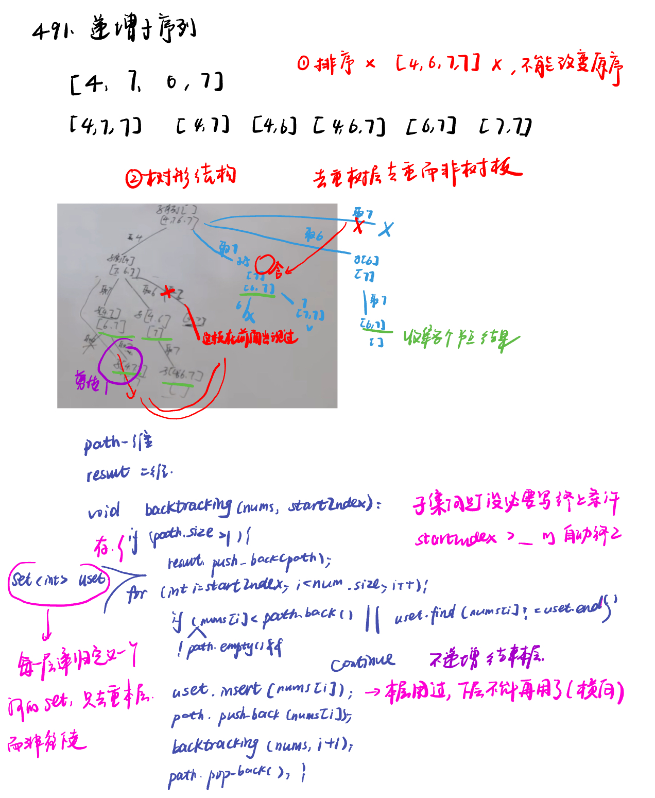

List: 491.递增子序列，46.全排列，47.全排列 II，332.重新安排行程，51.N皇后，37.解数独，总结

[491.递增子序列non-decreasing-subsequences](#01)，[](#02)，[](#03)，[](#04),[](#05)，[](#06),[](#07)

# <span id="01">491.递增子序列non-decreasing-subsequences</span>

[Leetcode](https://leetcode.cn/problems/non-decreasing-subsequences/description/) 

[Learning Materials](https://programmercarl.com/0491.%E9%80%92%E5%A2%9E%E5%AD%90%E5%BA%8F%E5%88%97.html)



## 字典去重

```python
class Solution:
    def findSubsequences(self, nums: List[int]) -> List[List[int]]:
        path  = []
        result = []
        self.backtracking(nums, 0, path, result)
        return result
    def backtracking(self, nums, startindex, path, result):
        if len(path) > 1: #题目要求递增子序列大小至少为2
            result.append(path[:])# 注意要使用切片将当前路径的副本加入结果集
            # 注意这里不要加return，要取树上的节点
        uset = set()
        for i in range(startindex, len(nums)):
            if path and nums[i] < path[-1] or nums[i] in uset:
                continue
            uset.add(nums[i]) # 记录这个元素在本层用过了，本层后面不能再用了
            path.append(nums[i])
            self.backtracking(nums, i + 1, path, result)
            path.pop()
```

## 哈希表去重

- 注意题目中说了，数值范围`[-100,100]`，所以完全可以用数组来做哈希。

程序运行的时候对unordered_set 频繁的insert，unordered_set需要做哈希映射（也就是把key通过hash function映射为唯一的哈希值）相对费时间，而且每次重新定义set，insert的时候其底层的符号表也要做相应的扩充，也是费事的。

```python
class Solution:
    def findSubsequences(self, nums: List[int]) -> List[List[int]]:
        path  = []
        result = []
        self.backtracking(nums, 0, path, result)
        return result
    def backtracking(self, nums, startindex, path, result):
        if len(path) > 1: #题目要求递增子序列大小至少为2
            result.append(path[:])# 注意要使用切片将当前路径的副本加入结果集
            # 注意这里不要加return，要取树上的节点
        used = [0] * 201  # 使用数组来进行去重操作，题目说数值范围[-100, 100]
        for i in range(startindex, len(nums)):
            if path and nums[i] < path[-1] or used[nums[i] + 100] == 1:
                continue
            used[nums[i] + 100] = 1  # 标记当前元素已经使用过
            path.append(nums[i])
            self.backtracking(nums, i + 1, path, result)
            path.pop()
```

# <span id="02">理论基础</span>

[Leetcode]() 

[Learning Materials]()


# <span id="03">理论基础</span>

[Leetcode]() 

[Learning Materials]()


# <span id="04">理论基础</span>

[Leetcode]() 

[Learning Materials]()


# <span id="05">理论基础</span>

[Leetcode]() 

[Learning Materials]()


# <span id="06">理论基础</span>

[Leetcode]() 

[Learning Materials]()


# <span id="07">理论基础</span>

[Leetcode]() 

[Learning Materials]()


