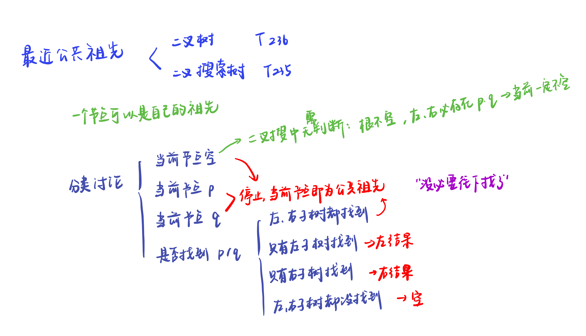
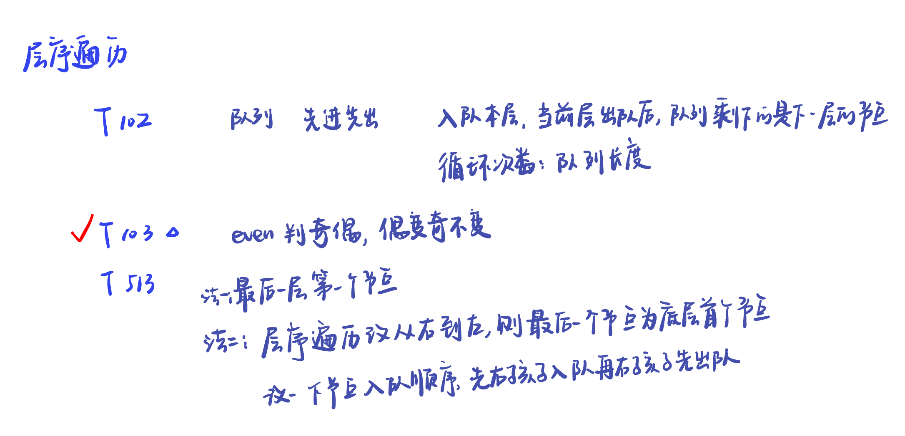

# 二叉树：最近公共祖先 & 层序遍历

## 最近公共祖先

 

本节涉及的题目在前面算法笔记里面写过了，可以看[note1](https://samuelssj123.github.io/contents/ALGORITHMNOTES/BinaryTree(6).html) [note2](https://samuelssj123.github.io/contents/ALGORITHMNOTES/BinaryTree(7).html)


## 层序遍历

 

本节涉及的题目在前面算法笔记里面写过了，可以看[note1](https://samuelssj123.github.io/contents/ALGORITHMNOTES/BinaryTree(1).html) [note2](https://samuelssj123.github.io/contents/ALGORITHMNOTES/BinaryTree(4).html)

第103题：

[leetcode](https://leetcode.cn/problems/binary-tree-zigzag-level-order-traversal/)

```python
# Definition for a binary tree node.
# class TreeNode:
#     def __init__(self, val=0, left=None, right=None):
#         self.val = val
#         self.left = left
#         self.right = right
class Solution:
    def zigzagLevelOrder(self, root: Optional[TreeNode]) -> List[List[int]]:
        if not root:
            return []
        result = []
        que = deque([root])
        even = False
        while que :
            size = len(que)
            vec = []
            while size:
                node = que.popleft()
                vec.append(node.val)
                if node.left:
                    que.append(node.left)
                if node.right:
                    que.append(node.right)
                size -= 1
            result.append(vec[::-1] if even else vec)
            even = not even
        return result      
```
