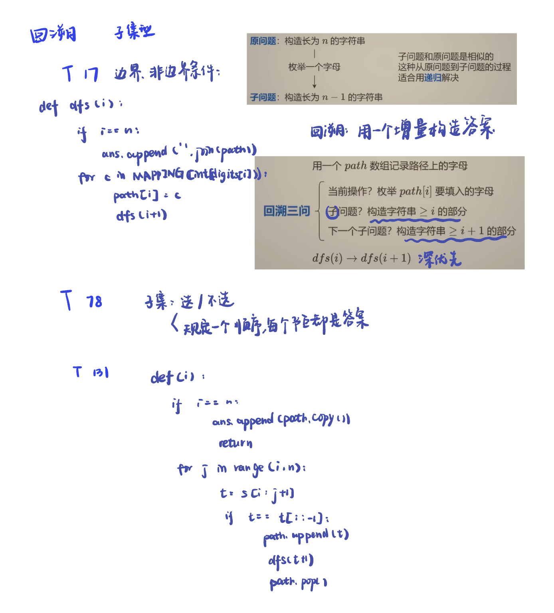
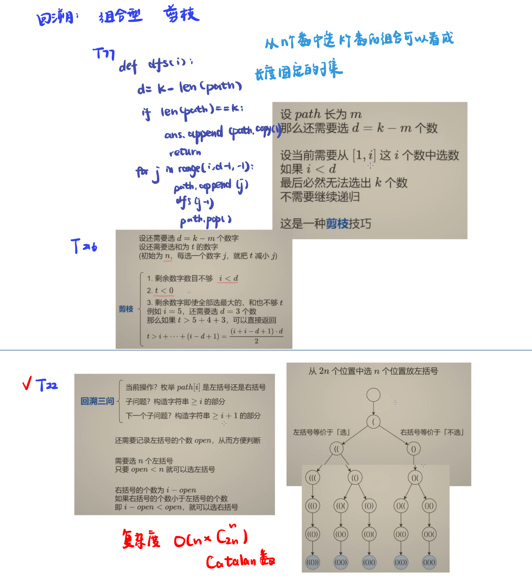
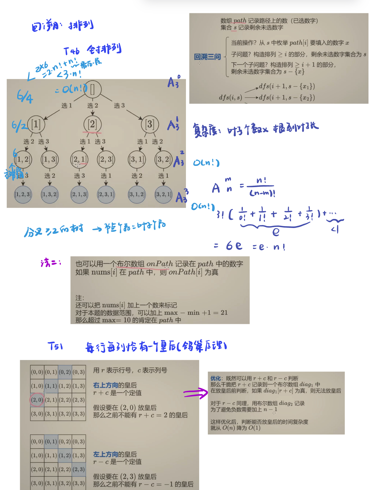

# 回溯：子集型、组合型、排列型

## 子集型

 

本节涉及的题目在前面算法笔记里面写过了，可以看[note1](https://samuelssj123.github.io/contents/ALGORITHMNOTES/BackTracking(1).html) 
[note2](https://samuelssj123.github.io/contents/ALGORITHMNOTES/BackTracking(2).html)


## 组合型

 

本节涉及的题目在前面算法笔记里面写过了，可以看[note](https://samuelssj123.github.io/contents/ALGORITHMNOTES/BackTracking(1).html) 

第22题

[leetcode](https://leetcode.cn/problems/generate-parentheses/description/)

```python
class Solution:
    def generateParenthesis(self, n: int) -> List[str]:
        m = n * 2
        ans = []
        path = [''] * m
        def dfs(i, open):
            if i == m:
                ans.append(''.join(path))
                return
            if open < n:
                path[i] = '('
                dfs(i + 1, open + 1)
            if i - open < open:
                path[i] = ')'
                dfs(i + 1, open)
        dfs(0 ,0)
        return ans
```


## 排列型

 

本节涉及的题目在前面算法笔记里面写过了，可以看[note](https://samuelssj123.github.io/contents/ALGORITHMNOTES/BackTracking(4).html) 
