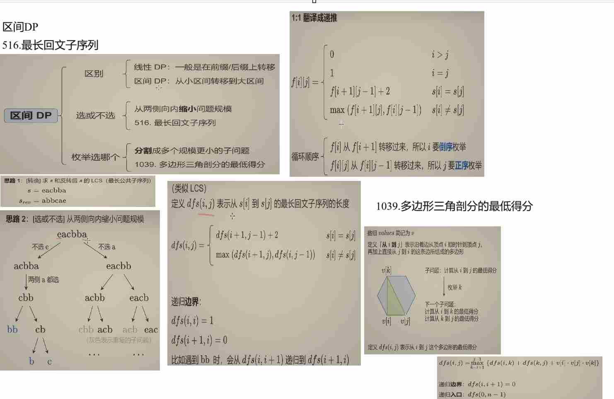
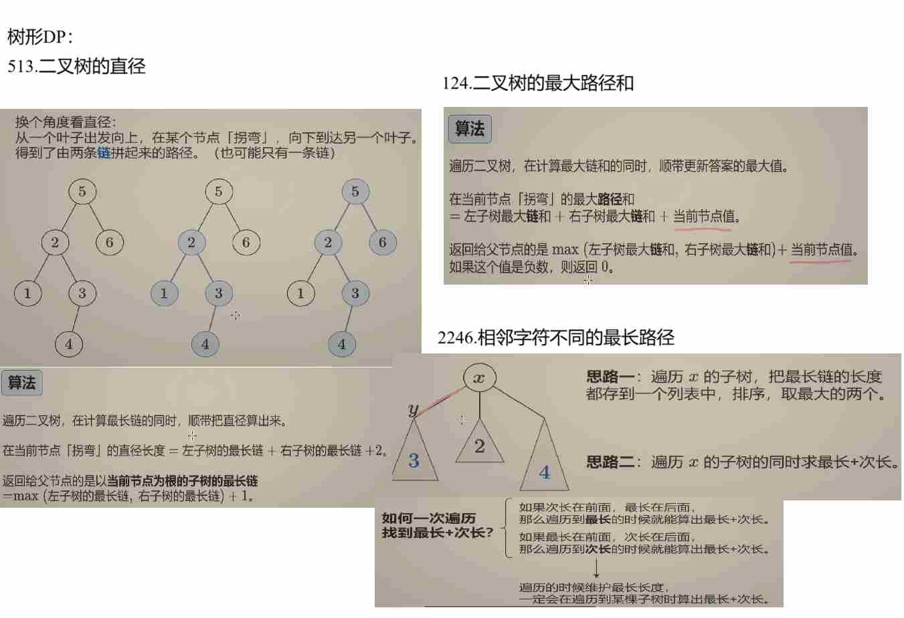

# Dynamic Programming

## 区间DP



T1: [516.最长回文子序列](https://leetcode.cn/problems/longest-palindromic-subsequence/description/)

```python
class Solution:
    def longestPalindromeSubseq(self, s: str) -> int:
        @cache
        def dfs(i, j):
            if i > j:
                return 0
            if i == j:
                return 1
            if s[i] == s[j]:
                return dfs(i + 1, j - 1) + 2
            return max(dfs(i + 1, j), dfs(i, j - 1))
        return dfs(0, len(s) - 1)
```

```python
class Solution:
    def longestPalindromeSubseq(self, s: str) -> int:
        n = len(s)
        f = [[0] * n for _ in range(n)]
        for i in range(n - 1, -1, -1):
            f[i][i] = 1
            for j in range(i + 1, n):
                if s[i] == s[j]:
                    f[i][j] = f[i + 1][j - 1] + 2
                else:
                    f[i][j] = max(f[i + 1][j], f[i][j - 1])
        return f[0][-1]
```

T2:[1039.多边形三角剖分的最低得分](https://leetcode.cn/problems/minimum-score-triangulation-of-polygon/description/)

```python
class Solution:
    def minScoreTriangulation(self, values: List[int]) -> int:
        @cache
        def dfs(i, j):
            if i + 1 == j:
                return 0
            return min(dfs(i, k) + dfs(k ,j) + values[i] * values[j] * values[k] for k in range(i + 1, j))  # 枚举顶点 k
        return dfs(0, len(values) - 1)
```

### 题目分析
本题是 LeetCode 1039 题“多边形三角剖分的最低得分”。给定一个表示凸多边形顶点值的数组 `values`，需要将这个凸多边形进行三角剖分（即将多边形分割成多个不重叠的三角形），每个三角形的分数是其三个顶点值的乘积，要求计算出所有三角剖分方案中分数总和的最小值。

### 代码思路详解

#### 1. 状态定义
使用二维数组 `f` 来记录子问题的解，其中 `f[i][j]` 表示由顶点 `i` 到顶点 `j` 所构成的子多边形进行三角剖分所能得到的最低得分。

#### 2. 初始化
```python
n = len(values)
f = [[0] * n for _ in range(n)]
```
- `n` 是多边形的顶点数量。
- `f` 是一个 `n x n` 的二维数组，初始值都设为 0。

#### 3. 状态转移
```python
for i in range(n - 3, -1, -1):
    for j in range(i + 2, n):
        f[i][j] = min(f[i][k] + f[k][j] + values[i] * values[j] * values[k] for k in range(i + 1, j))
```
- **外层循环**：`i` 从 `n - 3` 递减到 0。因为对于一个多边形，至少需要三个顶点才能构成三角形，所以 `i` 最大只能取到 `n - 3`。
- **内层循环**：`j` 从 `i + 2` 递增到 `n - 1`。`j` 要大于 `i + 1` 是因为需要至少三个顶点来构成三角形。
- **状态转移方程**：对于由顶点 `i` 到顶点 `j` 构成的子多边形，枚举其中一个顶点 `k`（`i < k < j`），将子多边形分割成三个部分：由顶点 `i` 到顶点 `k` 构成的子多边形、由顶点 `k` 到顶点 `j` 构成的子多边形以及三角形 `(i, k, j)`。那么 `f[i][j]` 就等于所有可能的分割方案中的最小值，即 `f[i][k] + f[k][j] + values[i] * values[j] * values[k]` 的最小值。

#### 4. 返回结果
```python
return f[0][-1]
```
最终结果是由顶点 0 到顶点 `n - 1` 所构成的整个多边形进行三角剖分的最低得分，即 `f[0][n - 1]`（在 Python 中可以用 `f[0][-1]` 表示）。

### 代码

```python
from typing import List

class Solution:
    def minScoreTriangulation(self, values: List[int]) -> int:
        n = len(values)
        f = [[0] * n for _ in range(n)]
        for i in range(n - 3, -1, -1):
            for j in range(i + 2, n):
                # 枚举顶点 k，计算所有可能分割方案的最小值
                f[i][j] = min(f[i][k] + f[k][j] + values[i] * values[j] * values[k] for k in range(i + 1, j))
        return f[0][-1]

```

### 复杂度分析
- **时间复杂度**：$O(n^3)$，其中 $n$ 是多边形的顶点数量。有两层嵌套循环遍历 `i` 和 `j`，对于每个 `(i, j)` 组合，还需要枚举中间顶点 `k`，所以总的时间复杂度是 $O(n^3)$。
- **空间复杂度**：$O(n^2)$，主要用于存储二维数组 `f`。


## 树形DP



T3:[543.二叉树的直径](https://leetcode.cn/problems/diameter-of-binary-tree/description/)
