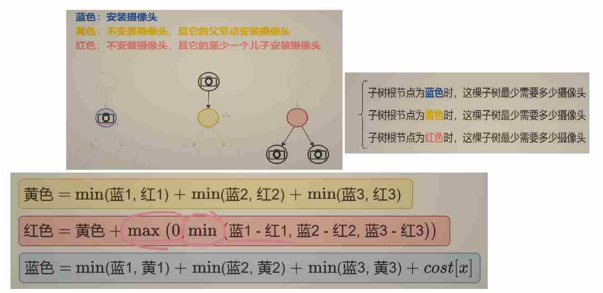

# Dynamic Programming

## 区间DP


T1: [516.最长回文子序列](https://leetcode.cn/problems/longest-palindromic-subsequence/description/)

```python
class Solution:
    def longestPalindromeSubseq(self, s: str) -> int:
        @cache
        def dfs(i, j):
            if i > j:
                return 0
            if i == j:
                return 1
            if s[i] == s[j]:
                return dfs(i + 1, j - 1) + 2
            return max(dfs(i + 1, j), dfs(i, j - 1))
        return dfs(0, len(s) - 1)
```

```python
class Solution:
    def longestPalindromeSubseq(self, s: str) -> int:
        n = len(s)
        f = [[0] * n for _ in range(n)]
        for i in range(n - 1, -1, -1):
            f[i][i] = 1
            for j in range(i + 1, n):
                if s[i] == s[j]:
                    f[i][j] = f[i + 1][j - 1] + 2
                else:
                    f[i][j] = max(f[i + 1][j], f[i][j - 1])
        return f[0][-1]
```

T2:[1039.多边形三角剖分的最低得分](https://leetcode.cn/problems/minimum-score-triangulation-of-polygon/description/)

```python
class Solution:
    def minScoreTriangulation(self, values: List[int]) -> int:
        @cache
        def dfs(i, j):
            if i + 1 == j:
                return 0
            return min(dfs(i, k) + dfs(k ,j) + values[i] * values[j] * values[k] for k in range(i + 1, j))  # 枚举顶点 k
        return dfs(0, len(values) - 1)
```

### 题目分析
本题是 LeetCode 1039 题“多边形三角剖分的最低得分”。给定一个表示凸多边形顶点值的数组 `values`，需要将这个凸多边形进行三角剖分（即将多边形分割成多个不重叠的三角形），每个三角形的分数是其三个顶点值的乘积，要求计算出所有三角剖分方案中分数总和的最小值。

### 代码思路详解

#### 1. 状态定义
使用二维数组 `f` 来记录子问题的解，其中 `f[i][j]` 表示由顶点 `i` 到顶点 `j` 所构成的子多边形进行三角剖分所能得到的最低得分。

#### 2. 初始化
```python
n = len(values)
f = [[0] * n for _ in range(n)]
```
- `n` 是多边形的顶点数量。
- `f` 是一个 `n x n` 的二维数组，初始值都设为 0。

#### 3. 状态转移
```python
for i in range(n - 3, -1, -1):
    for j in range(i + 2, n):
        f[i][j] = min(f[i][k] + f[k][j] + values[i] * values[j] * values[k] for k in range(i + 1, j))
```
- **外层循环**：`i` 从 `n - 3` 递减到 0。因为对于一个多边形，至少需要三个顶点才能构成三角形，所以 `i` 最大只能取到 `n - 3`。
- **内层循环**：`j` 从 `i + 2` 递增到 `n - 1`。`j` 要大于 `i + 1` 是因为需要至少三个顶点来构成三角形。
- **状态转移方程**：对于由顶点 `i` 到顶点 `j` 构成的子多边形，枚举其中一个顶点 `k`（`i < k < j`），将子多边形分割成三个部分：由顶点 `i` 到顶点 `k` 构成的子多边形、由顶点 `k` 到顶点 `j` 构成的子多边形以及三角形 `(i, k, j)`。那么 `f[i][j]` 就等于所有可能的分割方案中的最小值，即 `f[i][k] + f[k][j] + values[i] * values[j] * values[k]` 的最小值。

#### 4. 返回结果
```python
return f[0][-1]
```
最终结果是由顶点 0 到顶点 `n - 1` 所构成的整个多边形进行三角剖分的最低得分，即 `f[0][n - 1]`（在 Python 中可以用 `f[0][-1]` 表示）。

### 代码

```python
from typing import List

class Solution:
    def minScoreTriangulation(self, values: List[int]) -> int:
        n = len(values)
        f = [[0] * n for _ in range(n)]
        for i in range(n - 3, -1, -1):
            for j in range(i + 2, n):
                # 枚举顶点 k，计算所有可能分割方案的最小值
                f[i][j] = min(f[i][k] + f[k][j] + values[i] * values[j] * values[k] for k in range(i + 1, j))
        return f[0][-1]

```

### 复杂度分析
- **时间复杂度**：$O(n^3)$，其中 $n$ 是多边形的顶点数量。有两层嵌套循环遍历 `i` 和 `j`，对于每个 `(i, j)` 组合，还需要枚举中间顶点 `k`，所以总的时间复杂度是 $O(n^3)$。
- **空间复杂度**：$O(n^2)$，主要用于存储二维数组 `f`。


## 树形DP


T3:[543.二叉树的直径](https://leetcode.cn/problems/diameter-of-binary-tree/description/)

```python
# Definition for a binary tree node.
# class TreeNode:
#     def __init__(self, val=0, left=None, right=None):
#         self.val = val
#         self.left = left
#         self.right = right
class Solution:
    def diameterOfBinaryTree(self, root: Optional[TreeNode]) -> int:
        self.ans = 0
        def dfs(node):
            if not node:
                return -1
            llen = dfs(node.left) 
            rlen = dfs(node.right) 
            self.ans = max(self.ans, llen + rlen + 2) 
            return max(llen, rlen) + 1
        dfs(root)
        return self.ans
```

T4:[124.二叉树的最大路径和](https://leetcode.cn/problems/binary-tree-maximum-path-sum/description/)

```python
# Definition for a binary tree node.
# class TreeNode:
#     def __init__(self, val=0, left=None, right=None):
#         self.val = val
#         self.left = left
#         self.right = right
class Solution:
    def maxPathSum(self, root: Optional[TreeNode]) -> int:
        self.ans = -inf
        def dfs(node):
            if not node:
                return 0
            llen = dfs(node.left) 
            rlen = dfs(node.right) 
            self.ans = max(self.ans, llen + rlen + node.val) 
            return max(max(llen, rlen) + node.val, 0)
        dfs(root)
        return self.ans
```

T5:[2246.相邻字符不同的最长路径](https://leetcode.cn/problems/longest-path-with-different-adjacent-characters/description/)

### 题目描述

给定一棵由 `n` 个节点组成的树，每个节点对应一个字符。找到树中最长的路径，使得路径上的每两个相邻节点的字符不同。返回该路径的长度。

输入格式：
- `parent`：长度为 `n` 的数组，`parent[i]` 表示节点 `i` 的父节点，根节点的父节点为 `-1`。
- `s`：长度为 `n` 的字符串，`s[i]` 表示节点 `i` 的字符。

### 示例

输入：  
`parent = [-1,0,0,1,1,2], s = "abacbe"`  
输出：  
`3`  
解释：最长的路径是 `3 → 1 → 4`，对应的字符分别为 `'c', 'b', 'e'`。

---

### 动态规划思路

#### 状态定义

对于每个节点 `x`，定义 `max_len` 表示以 `x` 为起点的最长有效路径的**边数**。这里的“有效路径”指路径上相邻节点的字符不同。

#### 核心思想

1. **后序遍历**：从叶子节点向根节点处理，确保先处理子节点再处理父节点。
2. **维护最长链**：每个节点维护其子节点中最长的有效链（字符不同的路径）。
3. **组合路径**：对于每个节点，其最长路径可能由两个子节点的最长链组合而成。

#### 关键步骤

1. **遍历子节点**：对于节点 `x`，遍历其所有子节点 `y`。
2. **递归处理子节点**：获取子节点 `y` 的最长有效链边数 `cur_len`，并加 1（表示 `x` 到 `y` 的边）。
3. **筛选有效链**：若 `x` 和 `y` 的字符不同，则这是一个有效链。
4. **更新全局最大值**：将当前子节点的链长度与之前的最长子链长度相加，得到经过 `x` 的最长路径边数。
5. **维护最长链**：保留当前节点的最长有效链长度。

#### 为什么选择最大的两个子链？

路径可以经过节点 `x` 并连接两个子节点的最长有效链，形成一条更长的路径。例如，若两个子链的边数分别为 `a` 和 `b`，则总边数为 `a + b`，对应节点数为 `a + b + 1`。

---

### 代码实现

```python
class Solution:
    def longestPath(self, parent: List[int], s: str) -> int:
        n = len(parent)
        # 构建树的邻接表
        g = [[] for _ in range(n)]
        for i in range(1, n):
            g[parent[i]].append(i)

        self.ans = 0  # 记录最长路径的边数

        def dfs(x, fa):
            max_len = 0  # 以x为起点的最长链的边数
            for y in g[x]:
                if y == fa:
                    continue
                # 递归处理子节点y，返回其最长链边数，并加1（x到y的边）
                cur_len = dfs(y, x) + 1
                if s[y] != s[x]:
                    # 更新全局最大值：当前子链长度 + 之前的最长子链长度
                    self.ans = max(self.ans, max_len + cur_len)
                    # 更新当前节点的最长链长度
                    max_len = max(max_len, cur_len)
            return max_len  # 返回以x为起点的最长链边数

        dfs(0, -1)  # 从根节点开始遍历
        return self.ans + 1  # 边数转换为节点数
```

#### 代码解释

1. **构建树结构**：使用邻接表 `g` 存储每个节点的子节点。
2. **初始化全局最大值**：`self.ans` 记录最长路径的边数。
3. **DFS 递归函数**：
   - `max_len` 维护当前节点的最长有效链边数。
   - 遍历子节点，递归计算子节点的最长链边数 `cur_len`。
   - 若子节点字符与当前节点不同，更新全局最大值 `self.ans`，并维护 `max_len`。
4. **返回结果**：将边数 `self.ans` 转换为节点数（加 1）。

---

### 复杂度分析

- **时间复杂度**：O(n)，每个节点仅被访问一次。
- **空间复杂度**：O(n)，用于存储树结构和递归栈。

---

### 示例解析

以输入 `parent = [-1,0,0,1,1,2], s = "abacbe"` 为例：

1. **树结构**：
   - 节点 0 的子节点为 1 和 2。
   - 节点 1 的子节点为 3 和 4。
   - 节点 2 的子节点为 5。
2. **DFS 过程**：
   - 节点 3（字符 `'c'`）无子节点，返回 0。其父节点 1（字符 `'b'`）有效，`cur_len = 0 + 1 = 1`，更新 `max_len = 1`。
   - 节点 4（字符 `'b'`）与父节点 1（字符 `'b'`）无效，不更新。
   - 节点 1 的 `max_len = 1`，传递给父节点 0（字符 `'a'`），`cur_len = 1 + 1 = 2`。更新 `self.ans = 2`，`max_len = 2`。
   - 节点 2（字符 `'a'`）与父节点 0 无效，不更新。
   - 最终 `self.ans = 2`，返回 `2 + 1 = 3`，对应路径节点数 3。

T6：树上最大独立集[337.打家劫舍Ⅲ](https://leetcode.cn/problems/house-robber-iii/description/)


### 代码思路分析

这段代码解决的是 LeetCode 337 题“打家劫舍 III”，要求计算在不触动警报的情况下，抢劫二叉树中节点的最大金额。其核心思路是使用**后序遍历结合动态规划**，每个节点返回两种状态下的最大值：

1. **状态定义**：
   - `dfs(node)` 返回一个元组 `(rob, not_rob)`，其中：
     - `rob` 表示抢劫当前节点时，以该节点为根的子树能获得的最大金额。
     - `not_rob` 表示不抢劫当前节点时，以该节点为根的子树能获得的最大金额。

2. **递归逻辑**：
   - **递归终止条件**：若节点为空，返回 `(0, 0)`，因为没有节点时无法抢劫。
   - **递归左右子树**：分别计算左子树和右子树在抢劫和不抢劫状态下的最大值。
   - **计算当前节点的两种状态**：
     - **抢劫当前节点**：此时左右子节点都不能被抢劫，因此总金额为 `左子树不抢劫的最大值 + 右子树不抢劫的最大值 + 当前节点的值`。
     - **不抢劫当前节点**：此时左右子节点可以选择抢劫或不抢劫，取左右子树的最大值之和。

3. **最终结果**：
   - 根节点有两种选择（抢劫或不抢劫），取两者的最大值即为整个二叉树的最大抢劫金额。

### 代码实现与解释

```python
# Definition for a binary tree node.
class TreeNode:
    def __init__(self, val=0, left=None, right=None):
        self.val = val
        self.left = left
        self.right = right

from typing import Optional

class Solution:
    def rob(self, root: Optional[TreeNode]) -> int:
        def dfs(node: Optional[TreeNode]) -> (int, int):
            if node is None:  # 递归终止条件：空节点
                return 0, 0  # 无论是否抢劫，金额都是 0

            # 递归计算左子树的两种状态
            l_rob, l_not_rob = dfs(node.left)
            # 递归计算右子树的两种状态
            r_rob, r_not_rob = dfs(node.right)

            # 抢劫当前节点：左右子节点都不能被抢劫
            rob = l_not_rob + r_not_rob + node.val
            # 不抢劫当前节点：左右子节点可以选择抢劫或不抢劫，取最大值
            not_rob = max(l_rob, l_not_rob) + max(r_rob, r_not_rob)

            return rob, not_rob  # 返回当前节点的两种状态

        # 根节点有两种选择（抢劫或不抢劫），取最大值
        return max(dfs(root))
```

### 正确性证明

1. **子问题独立性**：
   - 每个节点的决策（抢劫或不抢劫）只依赖于其左右子节点的决策，与其他节点无关。因此，通过递归分解问题，可以保证子问题的独立性。

2. **最优子结构**：
   - 若抢劫当前节点，则左右子节点不能被抢劫；若不抢劫当前节点，则左右子节点可以自由选择。这种选择方式确保了每一步都能得到当前子树的最优解。

3. **后序遍历的合理性**：
   - 后序遍历保证了在处理当前节点时，其左右子节点的状态已经被计算完毕，从而可以直接利用子节点的结果进行决策。

### 复杂度分析

- **时间复杂度**：$O(n)$，其中 $n$ 是二叉树的节点数。每个节点被访问一次，递归深度为树的高度。
- **空间复杂度**：$O(h)$，其中 $h$ 是二叉树的高度。空间开销主要来自递归调用栈，最坏情况下（树退化为链表）为 $O(n)$。

### 示例分析

以二叉树 `[3,4,5,1,3,null,1]` 为例：
- 根节点为 `3`，左子节点为 `4`，右子节点为 `5`。
- 递归计算 `4` 的左右子节点 `1` 和 `3`，以及 `5` 的右子节点 `1`。
- 最终，根节点选择不抢劫时（`4` 和 `5` 中较大的路径），总金额最大。

通过这种递归动态规划的方式，代码能够高效地计算出二叉树的最大抢劫金额。

最大独立集需要从图中选择尽量多的点，使得这些点互不相邻。

变形：最大化点权之和。

树和子树的关系，类似原问题和子问题的关系，所以树天然地具有递归的特点。

如何由子问题算出原问题，是思考树形DP的出发点。

常见套路：1. 选或不选。2.枚举选哪个。

T7:树上最大支配集[968.监控二叉树](https://leetcode.cn/problems/binary-tree-cameras/description/)




### 题目描述

给定一棵二叉树的根节点 `root`，要求在树的节点上安装摄像头，使得每个节点都被监控。每个摄像头可以监控自身、父节点和直接子节点。求最少需要多少个摄像头。

### 示例

输入：  
`root = [0,0,null,0,0]`  
输出：  
`1`  
解释：在根节点安装一个摄像头即可覆盖所有节点。

---

### 动态规划思路

#### 状态定义

对于每个节点 `x`，定义三个状态：
1. **`choose`**：在 `x` 处安装摄像头时，覆盖其子树所需的最小摄像头数。
2. **`by_fa`**：`x` 不安装摄像头，但被父节点的摄像头覆盖时，子树的最小摄像头数。
3. **`by_children`**：`x` 不安装摄像头，但被某个子节点的摄像头覆盖时，子树的最小摄像头数。

#### 状态转移

1. **`choose`**：
   - `x` 安装摄像头，可以覆盖父节点和子节点。
   - 子节点可选择安装或不安装，但需满足覆盖条件。取子节点的 `min(choose, by_fa)` 之和，再加 1（当前摄像头）。

2. **`by_fa`**：
   - `x` 被父节点覆盖，因此子节点必须自己处理覆盖（不能依赖 `x`）。
   - 子节点可选择安装或被其子节点覆盖。取子节点的 `min(choose, by_children)` 之和。

3. **`by_children`**：
   - `x` 被子节点覆盖，至少有一个子节点必须安装摄像头。
   - 组合左/右子节点的安装情况：左安装右覆盖、右安装左覆盖、左右都安装。取三者最小值。

#### 边界条件

- 空节点：无法安装摄像头，无需覆盖。返回 `(inf, 0, 0)`。

#### 根节点处理

根节点无父节点，因此最终结果为 `min(choose, by_children)`。

---

### 代码实现

```python
class Solution:
    def minCameraCover(self, root: Optional[TreeNode]) -> int:
        def dfs(node):
            if not node:
                return float('inf'), 0, 0  # 空节点不能安装，且无需覆盖
            
            l_choose, l_by_fa, l_by_child = dfs(node.left)
            r_choose, r_by_fa, r_by_child = dfs(node.right)
            
            # 当前节点安装摄像头：子节点可以是 choose 或 by_fa
            choose = min(l_choose, l_by_fa) + min(r_choose, r_by_fa) + 1
            
            # 当前节点被父覆盖：子节点可以是 choose 或 by_children（无法依赖父）
            by_fa = min(l_choose, l_by_child) + min(r_choose, r_by_child)
            
            # 当前节点被子覆盖：至少一个子节点安装
            by_child = min(
                l_choose + r_by_child,  # 左安装，右被覆盖
                l_by_child + r_choose,   # 右安装，左被覆盖
                l_choose + r_choose      # 左右均安装
            )
            
            return choose, by_fa, by_child
        
        choose, _, by_child = dfs(root)
        return min(choose, by_child)
```

---

### 保安站岗问题（洛谷 P2458）

#### 题目差异

保安站岗问题中，每个保安可以覆盖自身和所有相邻节点（父节点和所有子节点）。覆盖范围更广，但解法思路类似。

#### 调整思路

1. **状态定义**：
   - `choose`：在当前节点放保安。
   - `by_fa`：被父节点的保安覆盖。
   - `by_child`：被某个子节点的保安覆盖。

2. **状态转移**：
   - `choose`：子节点可处于任意状态。
   - `by_fa`：子节点必须自己处理覆盖（不能依赖父节点）。
   - `by_child`：至少一个子节点安装保安。

#### 公式调整示例

```python
# 保安站岗问题的状态转移（伪代码）
choose = sum(min(c, by_fa, by_child) for child) + 1
by_fa = sum(min(choose_child, by_child_child) for child)
by_child = min_one_child_choose + sum(...)  # 至少一个子节点 choose
```

---

### 总结

- **核心思想**：通过后序遍历和状态压缩，动态规划处理树形覆盖问题。
- **关键点**：明确状态定义，合理处理父子节点间的覆盖依赖。
- **变式训练**：根据具体覆盖规则调整状态转移逻辑，如保安站岗问题需考虑更广的覆盖范围。
