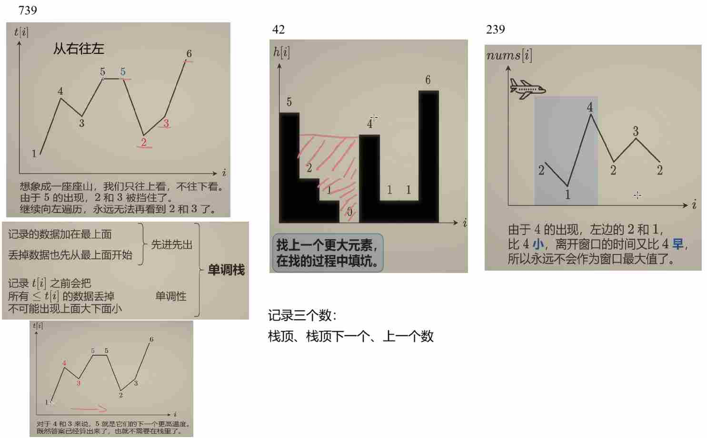

# 单调栈



T1:[739.每日温度](https://leetcode.cn/problems/daily-temperatures/description/)

**及时去掉无用数据, 保证栈中数据有序**

- 从右往左：
  
```python
class Solution:
    def dailyTemperatures(self, temperatures: List[int]) -> List[int]:
        n = len(temperatures)
        ans = [0] * n
        st = []
        for i in range(n - 1, -1, -1):
            t = temperatures[i]
            while st and t>= temperatures[st[-1]]:
                st.pop()
            if st:
                ans[i] = st[-1] - i 
            st.append(i)
        return ans
```

- 从左往右：
  
```python
class Solution:
    def dailyTemperatures(self, temperatures: List[int]) -> List[int]:
        n = len(temperatures)
        ans = [0] * n
        st = []
        for i, t in enumerate(temperatures):
            while st and t> temperatures[st[-1]]:
                j = st.pop()
                ans[j] = i - j
            st.append(i)
        return ans
```

T2:[42.接雨水](https://leetcode.cn/problems/trapping-rain-water/)


```python
class Solution:
    def trap(self, height: List[int]) -> int:
        ans = 0
        st = []
        for i, h in enumerate(height):
            while st and h >= height[st[-1]]:
                bottom_h = height[st.pop()]
                if not st:  # len(st) == 0
                    break
                left = st[-1]
                dh = min(height[left], h) - bottom_h  # 面积的高
                ans += dh * (i - left - 1)
            st.append(i)
        return ans
```

T3:[239.滑动窗口最大值](https://leetcode.cn/problems/sliding-window-maximum/)


### 题目描述
这是 LeetCode 第 239 题“滑动窗口最大值”。给定一个整数数组 `nums` 和一个整数 `k`，找出所有长度为 `k` 的滑动窗口中的最大值。

### 方法思路
本题使用 **双端队列（deque）** 来优化时间复杂度，核心思想是通过维护一个单调递减的队列，使得队列头部始终是当前窗口的最大值。具体步骤如下：

1. **维护队列单调性**：遍历数组时，对于每个元素，若队列尾部元素对应的值小于当前元素，则将其弹出，直到队列为空或找到比当前元素大的元素。这样保证队列中的元素值是单调递减的。
2. **移除过期索引**：当队列头部的索引超出当前窗口范围时（即 `i - q[0] >= k`），将其移出队列。
3. **记录结果**：当遍历到第 `k-1` 个元素时，开始记录队列头部对应的元素值，即为当前窗口的最大值。

这种方法的时间复杂度为 `O(n)`，因为每个元素最多入队和出队一次。

### 代码解释
```python
from typing import List
from collections import deque

class Solution:
    def maxSlidingWindow(self, nums: List[int], k: int) -> List[int]:
        ans = []
        q = deque()  # 双端队列，存储元素索引，对应值单调递减
        
        for i, x in enumerate(nums):
            # 1. 维护队列单调性：移除所有比当前元素小的队列尾部元素
            while q and nums[q[-1]] <= x:
                q.pop()  # 弹出队列尾部索引
            q.append(i)  # 将当前元素索引加入队列
            
            # 2. 移除过期索引：如果队列头部索引不在当前窗口内
            if i - q[0] >= k:
                q.popleft()
            
            # 3. 记录结果：当窗口形成（i >= k-1）时，队列头部即为最大值索引
            if i >= k - 1:
                ans.append(nums[q[0]])
        
        return ans
```

#### 代码步骤详解：
1. **初始化**：
   - `ans` 数组用于存储每个窗口的最大值。
   - `q` 是双端队列，存储元素的索引，这些索引对应的值在队列中保持单调递减。

2. **遍历数组**：
   - 使用 `enumerate` 遍历数组，`i` 是当前元素的索引，`x` 是当前元素的值。

3. **维护队列单调性**：
   - 当队列不为空且队列尾部索引对应的值小于当前元素 `x` 时，弹出队列尾部索引。这一步确保队列中的元素值始终单调递减，因为较小的元素不可能成为后续窗口的最大值。
   - 将当前元素的索引 `i` 加入队列。

4. **移除过期索引**：
   - 如果队列头部的索引 `q[0]` 与当前索引 `i` 的差大于等于 `k`，说明该索引已不在当前窗口内，将其移出队列。

5. **记录结果**：
   - 当 `i >= k-1` 时，说明已经形成了一个完整的窗口。此时队列头部的索引对应的值即为当前窗口的最大值，将其加入 `ans`。

### 复杂度分析
- **时间复杂度**：`O(n)`，其中 `n` 是数组 `nums` 的长度。每个元素最多入队和出队一次，因此总时间复杂度为 `O(n)`。
- **空间复杂度**：`O(k)`，在最坏情况下（如数组单调递增），队列中会存储 `k` 个元素，因此空间复杂度为 `O(k)`。

### 示例分析
以 `nums = [1,3,-1,-3,5,3,6,7]`，`k = 3` 为例：
1. 遍历到 `i=0`（值为 1），队列空，加入队列 `q = [0]`。
2. 遍历到 `i=1`（值为 3），队列尾部值 1 <= 3，弹出 `0`，加入 `1`，队列 `q = [1]`。
3. 遍历到 `i=2`（值为 -1），队列尾部值 3 > -1，加入 `2`，队列 `q = [1,2]`。此时 `i >= 2`，记录 `nums[1] = 3`。
4. 继续遍历，维护队列，最终得到结果 `[3,3,5,5,6,7]`。

这种方法通过巧妙维护双端队列的单调性，高效地解决了滑动窗口最大值问题。

代码思路参考作者：灵茶山艾府
