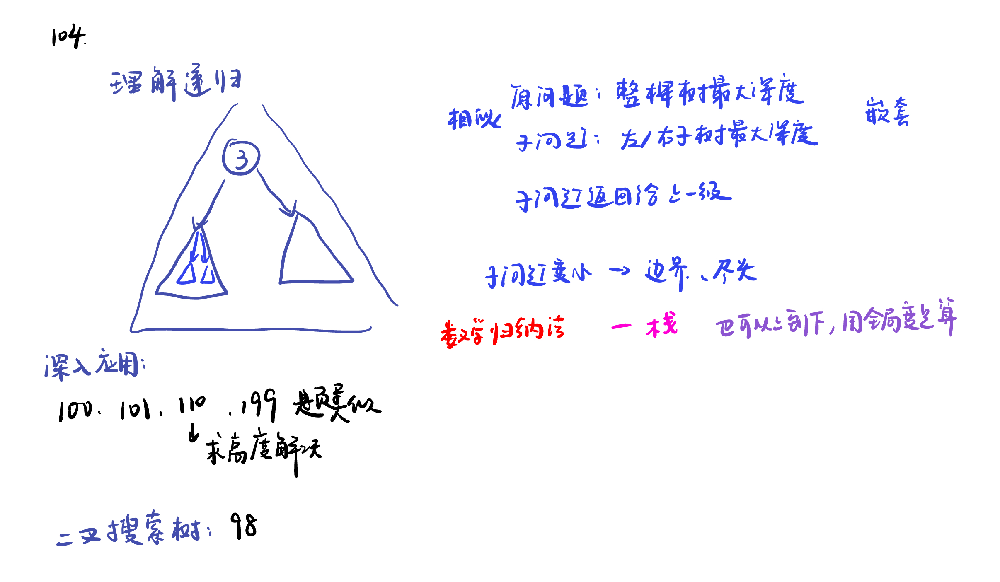

# 二叉树综合：递归的应用、二叉搜索树



# 199题的递归法：

[leetcode](https://leetcode.cn/problems/binary-tree-right-side-view/description/)

```python
# Definition for a binary tree node.
# class TreeNode:
#     def __init__(self, val=0, left=None, right=None):
#         self.val = val
#         self.left = left
#         self.right = right
class Solution:
    def rightSideView(self, root: Optional[TreeNode]) -> List[int]:
        #递归法
        ans = []
        def f(node, depth):
            if not node:
                return
            if depth == len(ans):
                ans.append(node.val)
            f(node.right, depth + 1)
            f(node.left, depth + 1)
        f(root, 0)
        return ans
```


# 98.二叉搜索树

[leetcode]()

## 前序遍历：先判断，再递归

```python
class Solution:
    def isValidBST(self, root: Optional[TreeNode]) -> bool:
        if not root:
            return True
        x = root.val
        return left < x < right and self.isValidBST(root.left, left, x) and self.isValidBST(root.right, x, right)
```

## 中序遍历：比较上一个节点

```python
# Definition for a binary tree node.
# class TreeNode:
#     def __init__(self, val=0, left=None, right=None):
#         self.val = val
#         self.left = left
#         self.right = right
class Solution:
    pre = -inf
    def isValidBST(self, root: Optional[TreeNode]) -> bool:
        if not root:
            return True
        if not self.isValidBST(root.left):
            return False
        if root.val <= self.pre:
            return False
        self.pre = root.val
        return self.isValidBST(root.right)
```

## 后序遍历：先递归，再判断

```python
# Definition for a binary tree node.
# class TreeNode:
#     def __init__(self, val=0, left=None, right=None):
#         self.val = val
#         self.left = left
#         self.right = right
class Solution:
    def isValidBST(self, root: Optional[TreeNode]) -> bool:
        # 左边、右边的最大值、最小值都要比较，空节点返回一个正无穷、负无穷
        def f(node):
            if not node:
                return inf, -inf
            lmin, lmax = f(node.left)
            rmin, rmax = f(node.right)
            x = node.val
            if x <= lmax or x >= rmin:
                return -inf, inf
            return min(lmin, x), max(rmax, x)
        return f(root)[1] != inf
```
