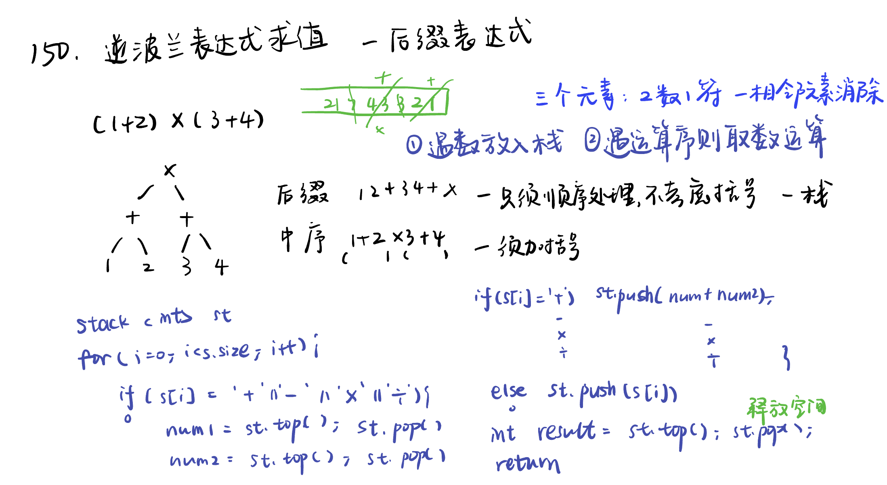

List: 理论基础，二叉树的递归遍历，二叉树的迭代遍历，二叉树的统一迭代法，二叉树的层序遍历

[理论基础](#01)，[239. 滑动窗口最大值sliding-window-maximum](#02)，[347.前 K 个高频元素top-k-frequent-elements](#03)，[栈和队列总结](#04),[栈和队列总结](#05)

# 理论基础

[Learning Materials](https://programmercarl.com/%E4%BA%8C%E5%8F%89%E6%A0%91%E7%90%86%E8%AE%BA%E5%9F%BA%E7%A1%80.html#%E7%AE%97%E6%B3%95%E5%85%AC%E5%BC%80%E8%AF%BE)

[Leetcode](https://leetcode.cn/problems/evaluate-reverse-polish-notation/description/) [Learning Materials](https://programmercarl.com/0150.%E9%80%86%E6%B3%A2%E5%85%B0%E8%A1%A8%E8%BE%BE%E5%BC%8F%E6%B1%82%E5%80%BC.html)

