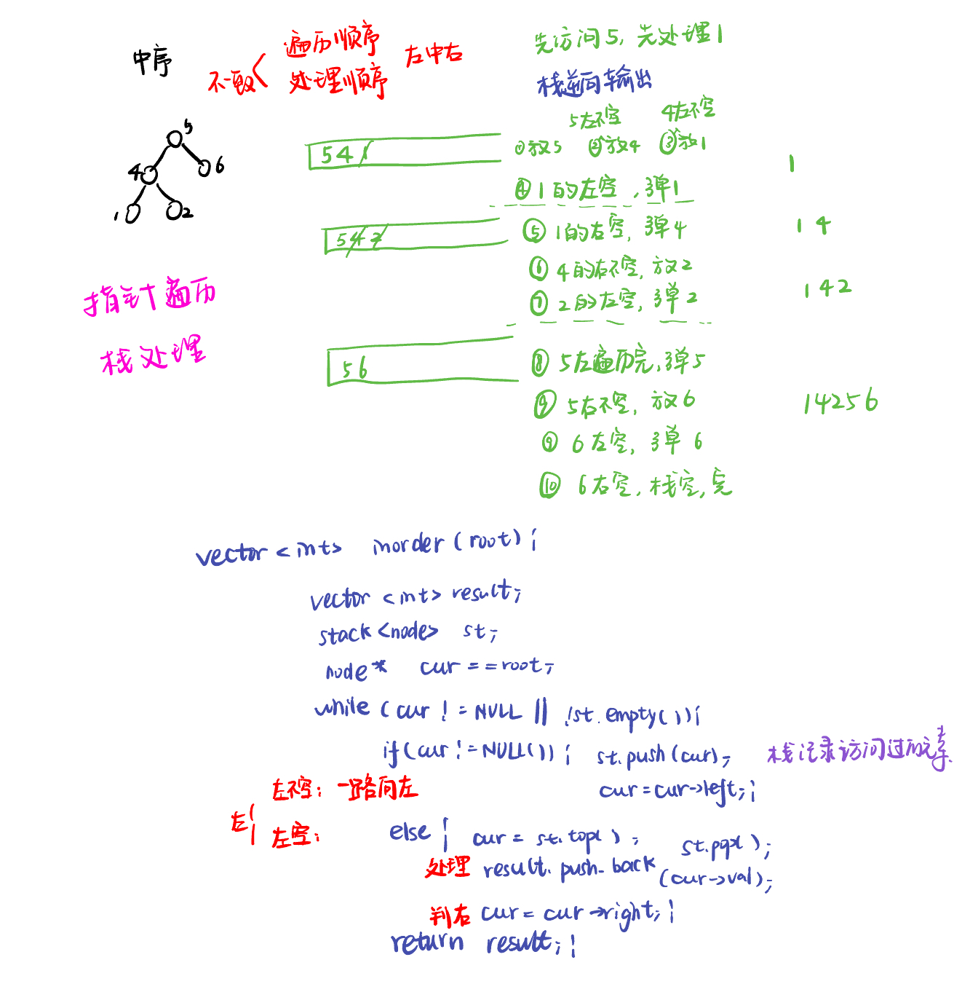
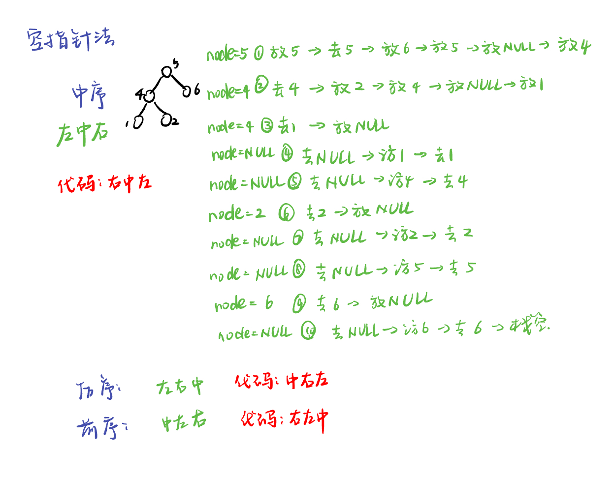

List: 理论基础，二叉树的递归遍历，二叉树的迭代遍历，二叉树的统一迭代法，二叉树的层序遍历

[理论基础](#01)，[二叉树的递归遍历](#02)，[二叉树的迭代遍历](#03)，[二叉树的统一迭代法](#04),[二叉树的层序遍历](#05)

# <span id="01">理论基础</span>

[Learning Materials](https://programmercarl.com/%E4%BA%8C%E5%8F%89%E6%A0%91%E7%90%86%E8%AE%BA%E5%9F%BA%E7%A1%80.html#%E7%AE%97%E6%B3%95%E5%85%AC%E5%BC%80%E8%AF%BE)


```python
class TreeNode:
    def __init__(self, val, left = None, right = None):
        self.val = val
        self.left = left
        self.right = right
```

# <span id="02">二叉树的递归遍历</span>

[Learning Materials](https://programmercarl.com/%E4%BA%8C%E5%8F%89%E6%A0%91%E7%9A%84%E9%80%92%E5%BD%92%E9%81%8D%E5%8E%86.html#%E7%AE%97%E6%B3%95%E5%85%AC%E5%BC%80%E8%AF%BE)

[Leetcode前序](https://leetcode.cn/problems/binary-tree-preorder-traversal/description/) 

[Leetcode中序](https://leetcode.cn/problems/binary-tree-inorder-traversal/description/) 

[Leetcode后序](https://leetcode.cn/problems/binary-tree-postorder-traversal/description/) 


## 前序递归遍历

```python
# Definition for a binary tree node.
# class TreeNode:
#     def __init__(self, val=0, left=None, right=None):
#         self.val = val
#         self.left = left
#         self.right = right
class Solution:
    def preorderTraversal(self, root: Optional[TreeNode]) -> List[int]:
        res = []
        def preorder(node):
            if node is None : 
                return
            res.append(node.val)
            preorder(node.left)
            preorder(node.right)
        preorder(root)
        return res
```

## 中序递归遍历

```python
# Definition for a binary tree node.
# class TreeNode:
#     def __init__(self, val=0, left=None, right=None):
#         self.val = val
#         self.left = left
#         self.right = right
class Solution:
    def inorderTraversal(self, root: Optional[TreeNode]) -> List[int]:
        res = []
        def inorder(node):
            if node is None : 
                return
            inorder(node.left)
            res.append(node.val)
            inorder(node.right)
        inorder(root)
        return res
```

## 后序递归遍历

```python
# Definition for a binary tree node.
# class TreeNode:
#     def __init__(self, val=0, left=None, right=None):
#         self.val = val
#         self.left = left
#         self.right = right
class Solution:
    def postorderTraversal(self, root: Optional[TreeNode]) -> List[int]:
        res = []
        def postorder(node):
            if node is None : 
                return
            postorder(node.left)
            postorder(node.right)
            res.append(node.val)
        postorder(root)
        return res
```

# <span id="03">理论基础</span>

[Learning Materials](https://programmercarl.com/%E4%BA%8C%E5%8F%89%E6%A0%91%E7%9A%84%E8%BF%AD%E4%BB%A3%E9%81%8D%E5%8E%86.html#%E7%AE%97%E6%B3%95%E5%85%AC%E5%BC%80%E8%AF%BE)

[Leetcode前序](https://leetcode.cn/problems/binary-tree-preorder-traversal/description/) 

[Leetcode中序](https://leetcode.cn/problems/binary-tree-inorder-traversal/description/) 

[Leetcode后序](https://leetcode.cn/problems/binary-tree-postorder-traversal/description/) 


## 前序的遍历节点和处理节点的顺序一致，后序也类似，代码类似

**根节点为空则返回空列表，时刻注意判空**


- 前序遍历：
  
```python
# Definition for a binary tree node.
# class TreeNode:
#     def __init__(self, val=0, left=None, right=None):
#         self.val = val
#         self.left = left
#         self.right = right
class Solution:
    def preorderTraversal(self, root: Optional[TreeNode]) -> List[int]:
        st = []
        result = []
        if root:
            st.append(root)
        while st:
            node = st.pop()
            if node:
                result.append(node.val)
            if node.right:
                st.append(node.right)
            if node.left:
                st.append(node.left)
        return result
```

- 后序遍历：一颠左右，二翻转

```python
# Definition for a binary tree node.
# class TreeNode:
#     def __init__(self, val=0, left=None, right=None):
#         self.val = val
#         self.left = left
#         self.right = right
class Solution:
    def postorderTraversal(self, root: Optional[TreeNode]) -> List[int]:
        st = []
        result = []
        if root:
            st.append(root)
        while st:
            node = st.pop()
            if node:
                result.append(node.val)
            if node.left:  
                st.append(node.left)
            if node.right:
                st.append(node.right)
        return result[::-1]
```

## 中序遍历：

**因为前序遍历中访问节点（遍历节点）和处理节点（将元素放进result数组中）可以同步处理，但是中序就无法做到同步。**



```python
# Definition for a binary tree node.
# class TreeNode:
#     def __init__(self, val=0, left=None, right=None):
#         self.val = val
#         self.left = left
#         self.right = right
class Solution:
    def inorderTraversal(self, root: Optional[TreeNode]) -> List[int]:
        st = []
        result = []
        if not root:
            return []
        node = root
        while node or st:    # 如果是and的话，就没法运行else分支了。
            if node: # 先迭代访问最底层的左子树节点
                st.append(node)
                node = node.left 
            else: # 到达最左节点后处理栈顶节点
                node = st.pop()
                result.append(node.val)
                node = node.right
        return result
```

# <span id="04">二叉树的统一迭代法：迭代但只改变两行顺序</span>

[Learning Materials](https://programmercarl.com/%E4%BA%8C%E5%8F%89%E6%A0%91%E7%9A%84%E7%BB%9F%E4%B8%80%E8%BF%AD%E4%BB%A3%E6%B3%95.html#%E6%80%9D%E8%B7%AF)

[Leetcode前序](https://leetcode.cn/problems/binary-tree-preorder-traversal/description/) 

[Leetcode中序](https://leetcode.cn/problems/binary-tree-inorder-traversal/description/) 

[Leetcode后序](https://leetcode.cn/problems/binary-tree-postorder-traversal/description/) 

如何处理风格不统一的问题？先想问题是如何造成的。使用栈的话，无法同时解决访问节点（遍历节点）和处理节点（将元素放进结果集）不一致的情况。

因此，那我们就将访问的节点放入栈中，把要处理的节点也放入栈中但是要做标记。

如何标记呢？

方法一：就是要处理的节点放入栈之后，紧接着放入一个空指针作为标记。 这种方法可以叫做空指针标记法。

方法二：加一个 `boolean` 值跟随每个节点，`false` (默认值) 表示需要为该节点和它的左右儿子安排在栈中的位次，`true` 表示该节点的位次之前已经安排过了，可以收割节点了。 这种方法可以叫做`boolean` 标记法。

## 空指针标记法

**由于栈先进后出，因此中序遍历是左中右，代码为右中左；前序遍历是中左右，代码为右左中；后序遍历的左右中，代码为中右左。**

- 中序遍历：把中节点放入，不空的话：取出中，放入右、中（再次放入）、NULL、左；空的话：去栈的NULL、访问栈的top



```python
# Definition for a binary tree node.
# class TreeNode:
#     def __init__(self, val=0, left=None, right=None):
#         self.val = val
#         self.left = left
#         self.right = right
class Solution:
    def inorderTraversal(self, root: Optional[TreeNode]) -> List[int]:
        st = []
        result = []
        if root:
            st.append(root)
        
        while st:
            node = st.pop()
            if node:
                if node.right:
                    st.append(node.right)
                st.append(node)
                st.append(None)
                if node.left:
                    st.append(node.left)
            else:
                node = st.pop()
                result.append(node.val)
        
        return result
```

- 中序遍历：

```python
# Definition for a binary tree node.
# class TreeNode:
#     def __init__(self, val=0, left=None, right=None):
#         self.val = val
#         self.left = left
#         self.right = right
class Solution:
    def postorderTraversal(self, root: Optional[TreeNode]) -> List[int]:
        st = []
        result = []
        if root:
            st.append(root)
        
        while st:
            node = st.pop()
            if node:
                st.append(node)
                st.append(None)
                if node.right:
                    st.append(node.right)
                if node.left:
                    st.append(node.left)
                
            else:
                node = st.pop()
                result.append(node.val)
        
        return result
```

- 前序遍历：

```python
# Definition for a binary tree node.
# class TreeNode:
#     def __init__(self, val=0, left=None, right=None):
#         self.val = val
#         self.left = left
#         self.right = right
class Solution:
    def preorderTraversal(self, root: Optional[TreeNode]) -> List[int]:
        st = []
        result = []
        if root:
            st.append(root)
        
        while st:
            node = st.pop()
            if node:
                if node.right:
                    st.append(node.right)
                if node.left:
                    st.append(node.left)
                st.append(node)
                st.append(None)
            else:
                node = st.pop()
                result.append(node.val)
        
        return result
```

## boolean 标记法

- 中序遍历：

```python
# Definition for a binary tree node.
# class TreeNode:
#     def __init__(self, val=0, left=None, right=None):
#         self.val = val
#         self.left = left
#         self.right = right
class Solution:
    def inorderTraversal(self, root: Optional[TreeNode]) -> List[int]:
        result = []
        st = [(root, False)] if root else []

        while st:
            node, visited = st.pop()  # 多加一个 visited 参数
            if visited: # visited 为 True，表示该节点和两个儿子的位次之前已经安排过了，现在可以收割节点了
                result.append(node.val)
                continue
            # visited 当前为 False, 表示初次访问本节点，此次访问的目的是“把自己和两个儿子在栈中安排好位次”。
            # 中序遍历是'左中右'，右儿子最先入栈，最后出栈。
            if node.right:
                st.append((node.right, False))
            st.append((node,True)) # 把自己加回到栈中，位置居中。同时，设置 visited 为 True，表示下次再访问本节点时，允许收割
            if node.left:
                st.append((node.left, False)) # 左儿子最后入栈，最先出栈
        
        return result
```

- 前序遍历：

```python
# Definition for a binary tree node.
# class TreeNode:
#     def __init__(self, val=0, left=None, right=None):
#         self.val = val
#         self.left = left
#         self.right = right
class Solution:
    def preorderTraversal(self, root: Optional[TreeNode]) -> List[int]:
        result = []
        st = [(root, False)] if root else []

        while st:
            node, visited = st.pop()  # 多加一个 visited 参数
            if visited: # visited 为 True，表示该节点和两个儿子的位次之前已经安排过了，现在可以收割节点了
                result.append(node.val)
                continue
            # visited 当前为 False, 表示初次访问本节点，此次访问的目的是“把自己和两个儿子在栈中安排好位次”。
            # 前序遍历是'中左右'
            if node.right:
                st.append((node.right, False))
            if node.left:
                st.append((node.left, False)) # 左儿子最后入栈，最先出栈
            st.append((node,True)) # 把自己加回到栈中，位置居中。同时，设置 visited 为 True，表示下次再访问本节点时，允许收割
            
        return result
```

- 后序遍历：

```python
# Definition for a binary tree node.
# class TreeNode:
#     def __init__(self, val=0, left=None, right=None):
#         self.val = val
#         self.left = left
#         self.right = right
class Solution:
    def postorderTraversal(self, root: Optional[TreeNode]) -> List[int]:
        result = []
        st = [(root, False)] if root else []

        while st:
            node, visited = st.pop()  # 多加一个 visited 参数
            if visited: # visited 为 True，表示该节点和两个儿子的位次之前已经安排过了，现在可以收割节点了
                result.append(node.val)
                continue
            # visited 当前为 False, 表示初次访问本节点，此次访问的目的是“把自己和两个儿子在栈中安排好位次”。
            # 后序遍历是'左右中'
            st.append((node,True)) # 把自己加回到栈中，位置居中。同时，设置 visited 为 True，表示下次再访问本节点时，允许收割
            if node.right:
                st.append((node.right, False))
            if node.left:
                st.append((node.left, False)) # 左儿子最后入栈，最先出栈
        
        return result
```

# <span id="05">二叉树的层序遍历</span>

[Leetcode]() [Learning Materials]()


