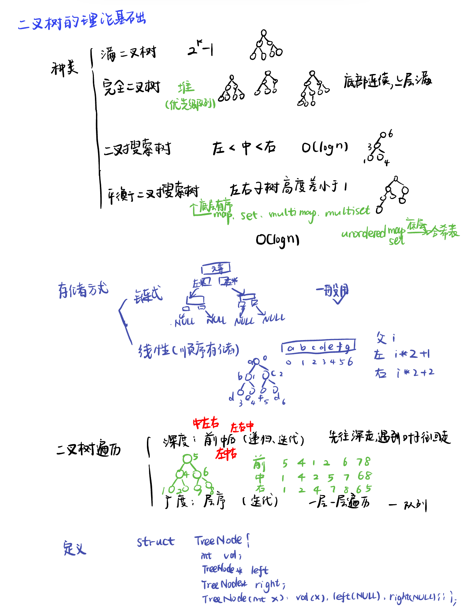
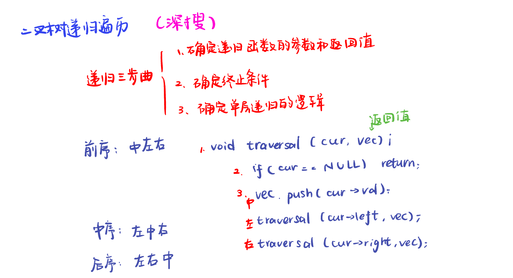
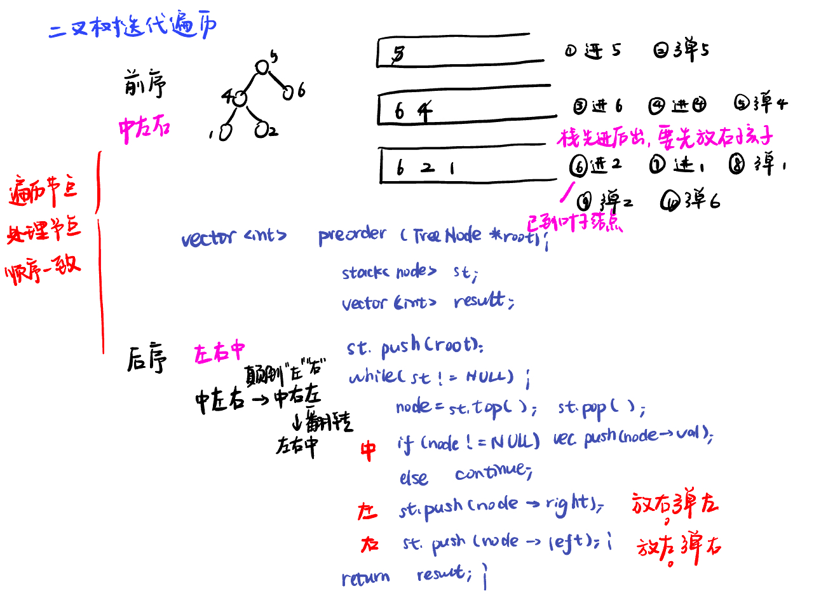

List: 理论基础，二叉树的递归遍历，二叉树的迭代遍历，二叉树的统一迭代法，二叉树的层序遍历

[理论基础](#01)，[二叉树的递归遍历](#02)，[](#03)，[](#04),[](#05)

# <span id="01">理论基础</span>

[Learning Materials](https://programmercarl.com/%E4%BA%8C%E5%8F%89%E6%A0%91%E7%90%86%E8%AE%BA%E5%9F%BA%E7%A1%80.html#%E7%AE%97%E6%B3%95%E5%85%AC%E5%BC%80%E8%AF%BE)



```python
class TreeNode:
    def __init__(self, val, left = None, right = None):
        self.val = val
        self.left = left
        self.right = right
```

# <span id="02">二叉树的递归遍历</span>

[Learning Materials](https://programmercarl.com/%E4%BA%8C%E5%8F%89%E6%A0%91%E7%9A%84%E9%80%92%E5%BD%92%E9%81%8D%E5%8E%86.html#%E7%AE%97%E6%B3%95%E5%85%AC%E5%BC%80%E8%AF%BE)

[Leetcode前序](https://leetcode.cn/problems/binary-tree-preorder-traversal/description/) 

[Leetcode中序](https://leetcode.cn/problems/binary-tree-inorder-traversal/description/) 

[Leetcode后序](https://leetcode.cn/problems/binary-tree-postorder-traversal/description/) 




## 前序递归遍历

```python
# Definition for a binary tree node.
# class TreeNode:
#     def __init__(self, val=0, left=None, right=None):
#         self.val = val
#         self.left = left
#         self.right = right
class Solution:
    def preorderTraversal(self, root: Optional[TreeNode]) -> List[int]:
        res = []
        def preorder(node):
            if node is None : 
                return
            res.append(node.val)
            preorder(node.left)
            preorder(node.right)
        preorder(root)
        return res
```

## 中序递归遍历

```python
# Definition for a binary tree node.
# class TreeNode:
#     def __init__(self, val=0, left=None, right=None):
#         self.val = val
#         self.left = left
#         self.right = right
class Solution:
    def inorderTraversal(self, root: Optional[TreeNode]) -> List[int]:
        res = []
        def inorder(node):
            if node is None : 
                return
            inorder(node.left)
            res.append(node.val)
            inorder(node.right)
        inorder(root)
        return res
```

## 后序递归遍历

```python
# Definition for a binary tree node.
# class TreeNode:
#     def __init__(self, val=0, left=None, right=None):
#         self.val = val
#         self.left = left
#         self.right = right
class Solution:
    def postorderTraversal(self, root: Optional[TreeNode]) -> List[int]:
        res = []
        def postorder(node):
            if node is None : 
                return
            postorder(node.left)
            postorder(node.right)
            res.append(node.val)
        postorder(root)
        return res
```

# <span id="03">理论基础</span>

[Learning Materials](https://programmercarl.com/%E4%BA%8C%E5%8F%89%E6%A0%91%E7%9A%84%E8%BF%AD%E4%BB%A3%E9%81%8D%E5%8E%86.html#%E7%AE%97%E6%B3%95%E5%85%AC%E5%BC%80%E8%AF%BE)

[Leetcode前序](https://leetcode.cn/problems/binary-tree-preorder-traversal/description/) 

[Leetcode中序](https://leetcode.cn/problems/binary-tree-inorder-traversal/description/) 

[Leetcode后序](https://leetcode.cn/problems/binary-tree-postorder-traversal/description/) 



## 前序的遍历节点和处理节点的顺序一致，后序也类似，代码类似

**根节点为空则返回空列表，时刻注意判空**

- 前序遍历：
  
```python
# Definition for a binary tree node.
# class TreeNode:
#     def __init__(self, val=0, left=None, right=None):
#         self.val = val
#         self.left = left
#         self.right = right
class Solution:
    def preorderTraversal(self, root: Optional[TreeNode]) -> List[int]:
        st = []
        result = []
        if root:
            st.append(root)
        while st:
            node = st.pop()
            if node:
                result.append(node.val)
            if node.right:
                st.append(node.right)
            if node.left:
                st.append(node.left)
        return result
```

- 后序遍历：一颠左右，二翻转

```python
# Definition for a binary tree node.
# class TreeNode:
#     def __init__(self, val=0, left=None, right=None):
#         self.val = val
#         self.left = left
#         self.right = right
class Solution:
    def postorderTraversal(self, root: Optional[TreeNode]) -> List[int]:
        st = []
        result = []
        if root:
            st.append(root)
        while st:
            node = st.pop()
            if node:
                result.append(node.val)
            if node.left:  
                st.append(node.left)
            if node.right:
                st.append(node.right)
        return result[::-1]
```
# <span id="04">理论基础</span>

[Leetcode]() [Learning Materials]()


# <span id="05">理论基础</span>

[Leetcode]() [Learning Materials]()


