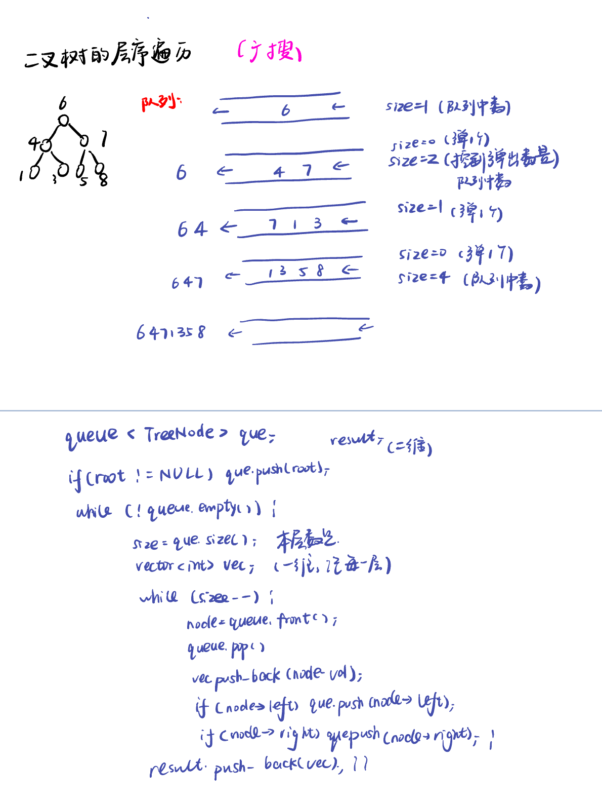

List: 理论基础，二叉树的递归遍历，二叉树的迭代遍历，二叉树的统一迭代法，二叉树的层序遍历

[理论基础](#01)，[二叉树的递归遍历](#02)，[二叉树的迭代遍历](#03)，[二叉树的统一迭代法](#04),[二叉树的层序遍历](#05)

# <span id="01">理论基础</span>

[Learning Materials](https://programmercarl.com/%E4%BA%8C%E5%8F%89%E6%A0%91%E7%90%86%E8%AE%BA%E5%9F%BA%E7%A1%80.html#%E7%AE%97%E6%B3%95%E5%85%AC%E5%BC%80%E8%AF%BE)


```python
class TreeNode:
    def __init__(self, val, left = None, right = None):
        self.val = val
        self.left = left
        self.right = right
```

# <span id="02">二叉树的递归遍历</span>

[Learning Materials](https://programmercarl.com/%E4%BA%8C%E5%8F%89%E6%A0%91%E7%9A%84%E9%80%92%E5%BD%92%E9%81%8D%E5%8E%86.html#%E7%AE%97%E6%B3%95%E5%85%AC%E5%BC%80%E8%AF%BE)

[Leetcode前序](https://leetcode.cn/problems/binary-tree-preorder-traversal/description/) 

[Leetcode中序](https://leetcode.cn/problems/binary-tree-inorder-traversal/description/) 

[Leetcode后序](https://leetcode.cn/problems/binary-tree-postorder-traversal/description/) 


## 前序递归遍历

```python
# Definition for a binary tree node.
# class TreeNode:
#     def __init__(self, val=0, left=None, right=None):
#         self.val = val
#         self.left = left
#         self.right = right
class Solution:
    def preorderTraversal(self, root: Optional[TreeNode]) -> List[int]:
        res = []
        def preorder(node):
            if node is None : 
                return
            res.append(node.val)
            preorder(node.left)
            preorder(node.right)
        preorder(root)
        return res
```

## 中序递归遍历

```python
# Definition for a binary tree node.
# class TreeNode:
#     def __init__(self, val=0, left=None, right=None):
#         self.val = val
#         self.left = left
#         self.right = right
class Solution:
    def inorderTraversal(self, root: Optional[TreeNode]) -> List[int]:
        res = []
        def inorder(node):
            if node is None : 
                return
            inorder(node.left)
            res.append(node.val)
            inorder(node.right)
        inorder(root)
        return res
```

## 后序递归遍历

```python
# Definition for a binary tree node.
# class TreeNode:
#     def __init__(self, val=0, left=None, right=None):
#         self.val = val
#         self.left = left
#         self.right = right
class Solution:
    def postorderTraversal(self, root: Optional[TreeNode]) -> List[int]:
        res = []
        def postorder(node):
            if node is None : 
                return
            postorder(node.left)
            postorder(node.right)
            res.append(node.val)
        postorder(root)
        return res
```

# <span id="03">理论基础</span>

[Learning Materials](https://programmercarl.com/%E4%BA%8C%E5%8F%89%E6%A0%91%E7%9A%84%E8%BF%AD%E4%BB%A3%E9%81%8D%E5%8E%86.html#%E7%AE%97%E6%B3%95%E5%85%AC%E5%BC%80%E8%AF%BE)

[Leetcode前序](https://leetcode.cn/problems/binary-tree-preorder-traversal/description/) 

[Leetcode中序](https://leetcode.cn/problems/binary-tree-inorder-traversal/description/) 

[Leetcode后序](https://leetcode.cn/problems/binary-tree-postorder-traversal/description/) 


## 前序的遍历节点和处理节点的顺序一致，后序也类似，代码类似

**根节点为空则返回空列表，时刻注意判空**


- 前序遍历：
  
```python
# Definition for a binary tree node.
# class TreeNode:
#     def __init__(self, val=0, left=None, right=None):
#         self.val = val
#         self.left = left
#         self.right = right
class Solution:
    def preorderTraversal(self, root: Optional[TreeNode]) -> List[int]:
        st = []
        result = []
        if root:
            st.append(root)
        while st:
            node = st.pop()
            if node:
                result.append(node.val)
            if node.right:
                st.append(node.right)
            if node.left:
                st.append(node.left)
        return result
```

- 后序遍历：一颠左右，二翻转

```python
# Definition for a binary tree node.
# class TreeNode:
#     def __init__(self, val=0, left=None, right=None):
#         self.val = val
#         self.left = left
#         self.right = right
class Solution:
    def postorderTraversal(self, root: Optional[TreeNode]) -> List[int]:
        st = []
        result = []
        if root:
            st.append(root)
        while st:
            node = st.pop()
            if node:
                result.append(node.val)
            if node.left:  
                st.append(node.left)
            if node.right:
                st.append(node.right)
        return result[::-1]
```

## 中序遍历：

**因为前序遍历中访问节点（遍历节点）和处理节点（将元素放进result数组中）可以同步处理，但是中序就无法做到同步。**


```python
# Definition for a binary tree node.
# class TreeNode:
#     def __init__(self, val=0, left=None, right=None):
#         self.val = val
#         self.left = left
#         self.right = right
class Solution:
    def inorderTraversal(self, root: Optional[TreeNode]) -> List[int]:
        st = []
        result = []
        if not root:
            return []
        node = root
        while node or st:    # 如果是and的话，就没法运行else分支了。
            if node: # 先迭代访问最底层的左子树节点
                st.append(node)
                node = node.left 
            else: # 到达最左节点后处理栈顶节点
                node = st.pop()
                result.append(node.val)
                node = node.right
        return result
```

# <span id="04">二叉树的统一迭代法：迭代但只改变两行顺序</span>

[Learning Materials](https://programmercarl.com/%E4%BA%8C%E5%8F%89%E6%A0%91%E7%9A%84%E7%BB%9F%E4%B8%80%E8%BF%AD%E4%BB%A3%E6%B3%95.html#%E6%80%9D%E8%B7%AF)

[Leetcode前序](https://leetcode.cn/problems/binary-tree-preorder-traversal/description/) 

[Leetcode中序](https://leetcode.cn/problems/binary-tree-inorder-traversal/description/) 

[Leetcode后序](https://leetcode.cn/problems/binary-tree-postorder-traversal/description/) 

如何处理风格不统一的问题？先想问题是如何造成的。使用栈的话，无法同时解决访问节点（遍历节点）和处理节点（将元素放进结果集）不一致的情况。

因此，那我们就将访问的节点放入栈中，把要处理的节点也放入栈中但是要做标记。

如何标记呢？

方法一：就是要处理的节点放入栈之后，紧接着放入一个空指针作为标记。 这种方法可以叫做空指针标记法。

方法二：加一个 `boolean` 值跟随每个节点，`false` (默认值) 表示需要为该节点和它的左右儿子安排在栈中的位次，`true` 表示该节点的位次之前已经安排过了，可以收割节点了。 这种方法可以叫做`boolean` 标记法。

## 空指针标记法

**由于栈先进后出，因此中序遍历是左中右，代码为右中左；前序遍历是中左右，代码为右左中；后序遍历的左右中，代码为中右左。**

- 中序遍历：把中节点放入，不空的话：取出中，放入右、中（再次放入）、NULL、左；空的话：去栈的NULL、访问栈的top


```python
# Definition for a binary tree node.
# class TreeNode:
#     def __init__(self, val=0, left=None, right=None):
#         self.val = val
#         self.left = left
#         self.right = right
class Solution:
    def inorderTraversal(self, root: Optional[TreeNode]) -> List[int]:
        st = []
        result = []
        if root:
            st.append(root)
        
        while st:
            node = st.pop() // 将该节点弹出，避免重复操作，下面再将右中左节点添加到栈中（→if语句）   // 将空节点弹出 （→else语句）
            if node:
                if node.right:
                    st.append(node.right)  // 添加右节点（空节点不入栈）
                st.append(node)   // 添加中节点
                st.append(None)  // 中节点访问过，但是还没有处理，加入空节点做为标记。
                if node.left:
                    st.append(node.left)  // 添加左节点（空节点不入栈）
            else:   // 只有遇到空节点的时候，才将下一个节点放进结果集
                node = st.pop()  // 重新取出栈中元素
                result.append(node.val) // 加入到结果集
        
        return result
```

- 中序遍历：

```python
# Definition for a binary tree node.
# class TreeNode:
#     def __init__(self, val=0, left=None, right=None):
#         self.val = val
#         self.left = left
#         self.right = right
class Solution:
    def postorderTraversal(self, root: Optional[TreeNode]) -> List[int]:
        st = []
        result = []
        if root:
            st.append(root)
        
        while st:
            node = st.pop()
            if node:
                st.append(node)
                st.append(None)
                if node.right:
                    st.append(node.right)
                if node.left:
                    st.append(node.left)
                
            else:
                node = st.pop()
                result.append(node.val)
        
        return result
```

- 前序遍历：

```python
# Definition for a binary tree node.
# class TreeNode:
#     def __init__(self, val=0, left=None, right=None):
#         self.val = val
#         self.left = left
#         self.right = right
class Solution:
    def preorderTraversal(self, root: Optional[TreeNode]) -> List[int]:
        st = []
        result = []
        if root:
            st.append(root)
        
        while st:
            node = st.pop()
            if node:
                if node.right:
                    st.append(node.right)
                if node.left:
                    st.append(node.left)
                st.append(node)
                st.append(None)
            else:
                node = st.pop()
                result.append(node.val)
        
        return result
```

## boolean 标记法

- 中序遍历：

```python
# Definition for a binary tree node.
# class TreeNode:
#     def __init__(self, val=0, left=None, right=None):
#         self.val = val
#         self.left = left
#         self.right = right
class Solution:
    def inorderTraversal(self, root: Optional[TreeNode]) -> List[int]:
        result = []
        st = [(root, False)] if root else []

        while st:
            node, visited = st.pop()  # 多加一个 visited 参数
            if visited: # visited 为 True，表示该节点和两个儿子的位次之前已经安排过了，现在可以收割节点了
                result.append(node.val)
                continue
            # visited 当前为 False, 表示初次访问本节点，此次访问的目的是“把自己和两个儿子在栈中安排好位次”。
            # 中序遍历是'左中右'，右儿子最先入栈，最后出栈。
            if node.right:
                st.append((node.right, False))
            st.append((node,True)) # 把自己加回到栈中，位置居中。同时，设置 visited 为 True，表示下次再访问本节点时，允许收割
            if node.left:
                st.append((node.left, False)) # 左儿子最后入栈，最先出栈
        
        return result
```

- 前序遍历：

```python
# Definition for a binary tree node.
# class TreeNode:
#     def __init__(self, val=0, left=None, right=None):
#         self.val = val
#         self.left = left
#         self.right = right
class Solution:
    def preorderTraversal(self, root: Optional[TreeNode]) -> List[int]:
        result = []
        st = [(root, False)] if root else []

        while st:
            node, visited = st.pop()  # 多加一个 visited 参数
            if visited: # visited 为 True，表示该节点和两个儿子的位次之前已经安排过了，现在可以收割节点了
                result.append(node.val)
                continue
            # visited 当前为 False, 表示初次访问本节点，此次访问的目的是“把自己和两个儿子在栈中安排好位次”。
            # 前序遍历是'中左右'
            if node.right:
                st.append((node.right, False))
            if node.left:
                st.append((node.left, False)) # 左儿子最后入栈，最先出栈
            st.append((node,True)) # 把自己加回到栈中，位置居中。同时，设置 visited 为 True，表示下次再访问本节点时，允许收割
            
        return result
```

- 后序遍历：

```python
# Definition for a binary tree node.
# class TreeNode:
#     def __init__(self, val=0, left=None, right=None):
#         self.val = val
#         self.left = left
#         self.right = right
class Solution:
    def postorderTraversal(self, root: Optional[TreeNode]) -> List[int]:
        result = []
        st = [(root, False)] if root else []

        while st:
            node, visited = st.pop()  # 多加一个 visited 参数
            if visited: # visited 为 True，表示该节点和两个儿子的位次之前已经安排过了，现在可以收割节点了
                result.append(node.val)
                continue
            # visited 当前为 False, 表示初次访问本节点，此次访问的目的是“把自己和两个儿子在栈中安排好位次”。
            # 后序遍历是'左右中'
            st.append((node,True)) # 把自己加回到栈中，位置居中。同时，设置 visited 为 True，表示下次再访问本节点时，允许收割
            if node.right:
                st.append((node.right, False))
            if node.left:
                st.append((node.left, False)) # 左儿子最后入栈，最先出栈
        
        return result
```

# <span id="05">二叉树的层序遍历</span>

[Learning Materials]()



[102.二叉树的层序遍历(opens new window)](https://leetcode.cn/problems/binary-tree-level-order-traversal/description/)

```python
# Definition for a binary tree node.
# class TreeNode:
#     def __init__(self, val=0, left=None, right=None):
#         self.val = val
#         self.left = left
#         self.right = right
class Solution:
    def levelOrder(self, root: Optional[TreeNode]) -> List[List[int]]:
        if not root:
            return []
        result = []
        que = deque([root])
        while que :
            size = len(que)
            vec = []
            while size:
                node = que.popleft()
                vec.append(node.val)
                if node.left:
                    que.append(node.left)
                if node.right:
                    que.append(node.right)
                size -= 1
            result.append(vec)
        return result
```

[107.二叉树的层次遍历II(opens new window)](https://leetcode.cn/problems/binary-tree-level-order-traversal-ii/description/)

```python
# Definition for a binary tree node.
# class TreeNode:
#     def __init__(self, val=0, left=None, right=None):
#         self.val = val
#         self.left = left
#         self.right = right
class Solution:
    def levelOrderBottom(self, root: Optional[TreeNode]) -> List[List[int]]:
        if not root:
            return []
        result = []
        que = deque([root])
        while que :
            size = len(que)
            vec = []
            while size:
                node = que.popleft()
                vec.append(node.val)
                if node.left:
                    que.append(node.left)
                if node.right:
                    que.append(node.right)
                size -= 1
            result.append(vec)
        return result[::-1]  #自底向上遍历
```

[199.二叉树的右视图(opens new window)](https://leetcode.cn/problems/binary-tree-right-side-view/description/)

```python
# Definition for a binary tree node.
# class TreeNode:
#     def __init__(self, val=0, left=None, right=None):
#         self.val = val
#         self.left = left
#         self.right = right
class Solution:
    def rightSideView(self, root: Optional[TreeNode]) -> List[int]:
        if not root:
            return []
        result = []
        que = deque([root])
        while que :
            size = len(que)
            for i in range(size):
                node = que.popleft()
                if i == size - 1:
                    result.append(node.val) # 将每一层的最后元素放入result数组中，只需要记录每层最右的数
                if node.left:
                    que.append(node.left)
                if node.right:
                    que.append(node.right)
        return result
```

[637.二叉树的层平均值(opens new window)](https://leetcode.cn/problems/average-of-levels-in-binary-tree/description/)

```python
# Definition for a binary tree node.
# class TreeNode:
#     def __init__(self, val=0, left=None, right=None):
#         self.val = val
#         self.left = left
#         self.right = right
class Solution:
    def averageOfLevels(self, root: Optional[TreeNode]) -> List[float]:
        if not root:
            return []
        result = []
        que = deque([root])
        while que :
            size = len(que)
            levelsum = 0  #额外记录一下每层的和
            for i in range(size):
                node = que.popleft()
                levelsum += node.val
                if node.left:
                    que.append(node.left)
                if node.right:
                    que.append(node.right)
            result.append(levelsum / size)
        return result
```

[429.N叉树的层序遍历(opens new window)](https://leetcode.cn/problems/n-ary-tree-level-order-traversal/description/)

```python
"""
# Definition for a Node.
class Node:
    def __init__(self, val: Optional[int] = None, children: Optional[List['Node']] = None):
        self.val = val
        self.children = children
"""

class Solution:
    def levelOrder(self, root: 'Node') -> List[List[int]]:
        if not root:
            return []
        result = []
        que = deque([root])
        while que :
            size = len(que)
            vec = []
            while size:
                node = que.popleft()
                vec.append(node.val)
                for child in node.children:
                    que.append(child)
                size -= 1
            result.append(vec)
        return result
```

[515.在每个树行中找最大值(opens new window)](https://leetcode.cn/problems/find-largest-value-in-each-tree-row/description/)

```python
# Definition for a binary tree node.
# class TreeNode:
#     def __init__(self, val=0, left=None, right=None):
#         self.val = val
#         self.left = left
#         self.right = right
class Solution:
    def largestValues(self, root: Optional[TreeNode]) -> List[int]:
        if not root:
            return []
        result = []
        que = deque([root])
        while que :
            size = len(que)
            vec = []
            while size:
                node = que.popleft()
                vec.append(node.val)
                if node.left:
                    que.append(node.left)
                if node.right:
                    que.append(node.right)
                size -= 1
            result.append(max(vec))
        return result
```

[116.填充每个节点的下一个右侧节点指针(opens new window)](https://leetcode.cn/problems/populating-next-right-pointers-in-each-node/description/)

本题依然是层序遍历，只不过在单层遍历的时候记录一下本层的头部节点，然后在遍历的时候让前一个节点指向本节点就可以了

```python
"""
# Definition for a Node.
class Node:
    def __init__(self, val: int = 0, left: 'Node' = None, right: 'Node' = None, next: 'Node' = None):
        self.val = val
        self.left = left
        self.right = right
        self.next = next
"""

class Solution:
    def connect(self, root: 'Optional[Node]') -> 'Optional[Node]':
        if not root:
            return root
        que = deque([root]) #创建一个 deque 对象 que，并将列表 [root] 中的元素依次添加到这个双端队列中。由于 [root] 只有一个元素 root，所以最终 que 这个双端队列中初始只有一个元素，即根节点 root。
        while que :
            size = len(que)
            prev = None
            while size:
                node = que.popleft()
                if prev:
                    prev.next = node
                prev = node
                if node.left:
                    que.append(node.left)
                if node.right:
                    que.append(node.right)
                size -= 1
        return root
```

[117.填充每个节点的下一个右侧节点指针II(opens new window)](https://leetcode.cn/problems/populating-next-right-pointers-in-each-node-ii/)

这道题目说是二叉树，但116题目说是完整二叉树，其实没有任何差别，一样的代码一样的逻辑一样的味道。

```python
"""
# Definition for a Node.
class Node:
    def __init__(self, val: int = 0, left: 'Node' = None, right: 'Node' = None, next: 'Node' = None):
        self.val = val
        self.left = left
        self.right = right
        self.next = next
"""

class Solution:
    def connect(self, root: 'Node') -> 'Node':
        if not root:
            return root
        que = deque([root]) #创建一个 deque 对象 que，并将列表 [root] 中的元素依次添加到这个双端队列中。由于 [root] 只有一个元素 root，所以最终 que 这个双端队列中初始只有一个元素，即根节点 root。
        while que :
            size = len(que)
            prev = None
            while size:
                node = que.popleft()
                if prev:
                    prev.next = node
                prev = node
                if node.left:
                    que.append(node.left)
                if node.right:
                    que.append(node.right)
                size -= 1
        return root
```


[104.二叉树的最大深度(opens new window)](https://leetcode.cn/problems/maximum-depth-of-binary-tree/description/)

```python
# Definition for a binary tree node.
# class TreeNode:
#     def __init__(self, val=0, left=None, right=None):
#         self.val = val
#         self.left = left
#         self.right = right
class Solution:
    def maxDepth(self, root: Optional[TreeNode]) -> int:
        if not root:
            return 0 #返回深度
        result = []
        que = deque([root])
        while que :
            size = len(que)
            vec = []
            while size:
                node = que.popleft()
                vec.append(node.val)
                if node.left:
                    que.append(node.left)
                if node.right:
                    que.append(node.right)
                size -= 1
            result.append(vec)
        return len(result) #返回深度
```

[111.二叉树的最小深度](https://leetcode.cn/problems/minimum-depth-of-binary-tree/)

需要注意的是，只有当左右孩子都为空的时候，才说明遍历的最低点了。如果其中一个孩子为空则不是最低点。

```python
# Definition for a binary tree node.
# class TreeNode:
#     def __init__(self, val=0, left=None, right=None):
#         self.val = val
#         self.left = left
#         self.right = right
class Solution:
    def minDepth(self, root: Optional[TreeNode]) -> int:
        if not root:
            return 0
        que = deque([root])
        depth = 0 #额外记录一下深度
        while que :
            size = len(que)
            depth += 1
            while size:
                node = que.popleft()
                if node.left:
                    que.append(node.left)
                if node.right:
                    que.append(node.right)
                size -= 1
                if not node.left and not node.right:
                    return depth  #记录一下深度
```
