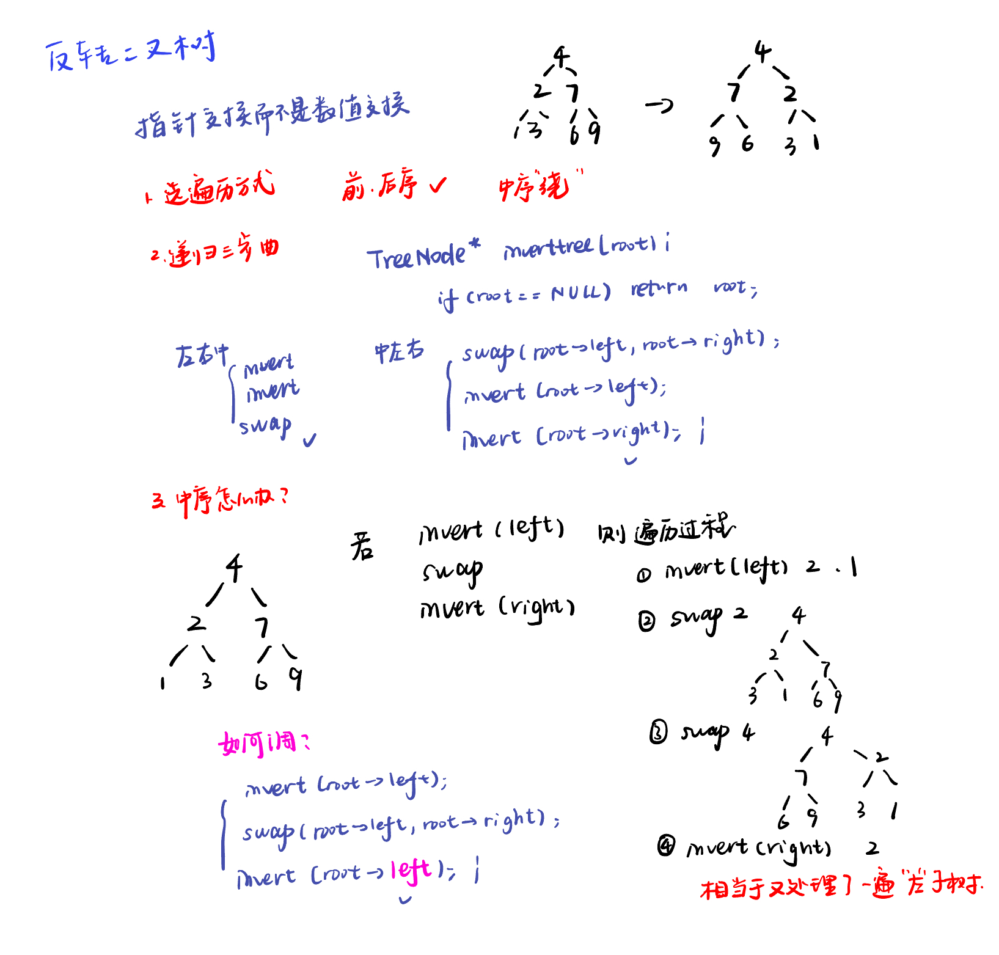
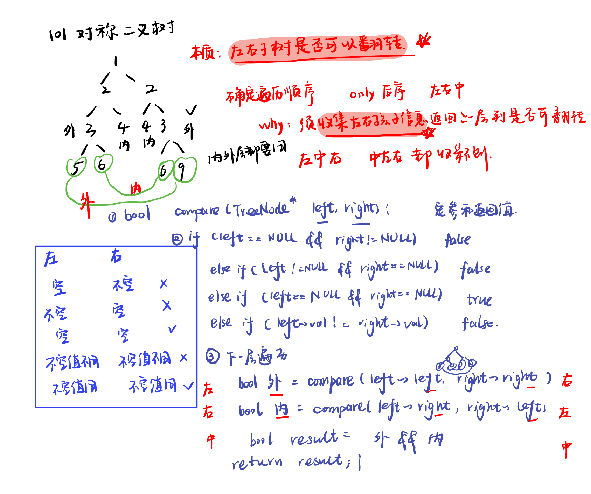
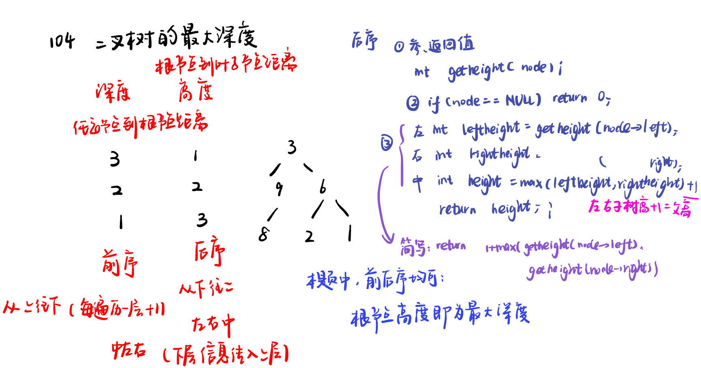

List: 226.翻转二叉树，101. 对称二叉树（含100.相同的树、572.另一个树的子树），104.二叉树的最大深度（含559.n叉树的最大深度），111.二叉树的最小深度

[226.翻转二叉树invert-binary-tree](#01)，[101. 对称二叉树symmetric-tree](#02)，[104.二叉树的最大深度maximum-depth-of-binary-tree](#03)，[](#04),[](#05)

# <span id="01">226.翻转二叉树invert-binary-tree</span>

[Leetcode](https://leetcode.cn/problems/invert-binary-tree/description/)

[Learning Materials](https://programmercarl.com/0226.%E7%BF%BB%E8%BD%AC%E4%BA%8C%E5%8F%89%E6%A0%91.html#%E7%AE%97%E6%B3%95%E5%85%AC%E5%BC%80%E8%AF%BE)



## 前序遍历：递归

```python
# Definition for a binary tree node.
# class TreeNode:
#     def __init__(self, val=0, left=None, right=None):
#         self.val = val
#         self.left = left
#         self.right = right
class Solution:
    def invertTree(self, root: Optional[TreeNode]) -> Optional[TreeNode]:
        if not root:
            return None
        root.left, root.right = root.right, root.left
        self.invertTree(root.left)
        self.invertTree(root.right)
        return root
```

## 后序遍历：递归

```python
# Definition for a binary tree node.
# class TreeNode:
#     def __init__(self, val=0, left=None, right=None):
#         self.val = val
#         self.left = left
#         self.right = right
class Solution:
    def invertTree(self, root: Optional[TreeNode]) -> Optional[TreeNode]:
        if not root:
            return None
        self.invertTree(root.left)
        self.invertTree(root.right)
        root.left, root.right = root.right, root.left
        return root
```

## 中序遍历：递归

```python
# Definition for a binary tree node.
# class TreeNode:
#     def __init__(self, val=0, left=None, right=None):
#         self.val = val
#         self.left = left
#         self.right = right
class Solution:
    def invertTree(self, root: Optional[TreeNode]) -> Optional[TreeNode]:
        if not root:
            return None
        self.invertTree(root.left)
        root.left, root.right = root.right, root.left
        self.invertTree(root.left)
        return root
```

## 前序遍历：迭代

```python
# Definition for a binary tree node.
# class TreeNode:
#     def __init__(self, val=0, left=None, right=None):
#         self.val = val
#         self.left = left
#         self.right = right
class Solution:
    def invertTree(self, root: Optional[TreeNode]) -> Optional[TreeNode]:
        if not root:
            return 
        st = [root]
        while st:
            node = st.pop()
            node.left, node.right = node.right, node.left
            if node.right:
                st.append(node.right)
            if node.left:
                st.append(node.left)
        return root
```

## 伪后序遍历：迭代（实际上它是前序遍历，只不过把中间节点处理逻辑放到了最后）

```python
# Definition for a binary tree node.
# class TreeNode:
#     def __init__(self, val=0, left=None, right=None):
#         self.val = val
#         self.left = left
#         self.right = right
class Solution:
    def invertTree(self, root: Optional[TreeNode]) -> Optional[TreeNode]:
        if not root:
            return 
        st = [root]
        while st:
            node = st.pop()
            if node.right:
                st.append(node.right)
            if node.left:
                st.append(node.left)
            node.left, node.right = node.right, node.left
        return root
```

## 伪中序遍历：迭代（实际上它是前序遍历，只不过把中间节点处理逻辑放到了中间。）

```python
# Definition for a binary tree node.
# class TreeNode:
#     def __init__(self, val=0, left=None, right=None):
#         self.val = val
#         self.left = left
#         self.right = right
class Solution:
    def invertTree(self, root: Optional[TreeNode]) -> Optional[TreeNode]:
        if not root:
            return 
        st = [root]
        while st:
            node = st.pop()
            if node.right:
                st.append(node.right)
            node.left, node.right = node.right, node.left
            if node.right:
                st.append(node.right)
        return root
```

## 层序遍历：迭代

```python
# Definition for a binary tree node.
# class TreeNode:
#     def __init__(self, val=0, left=None, right=None):
#         self.val = val
#         self.left = left
#         self.right = right
class Solution:
    def invertTree(self, root: Optional[TreeNode]) -> Optional[TreeNode]:
        if not root:
            return 
        que = deque([root])
        while que:
            node = que.popleft()
            node.left, node.right = node.right, node.left
            if node.left:
                que.append(node.left)
            if node.right:
                que.append(node.right)
        return root
```

# <span id="02">101. 对称二叉树symmetric-tree</span>

[Leetcode](https://leetcode.cn/problems/symmetric-tree/description/) [Learning Materials](https://programmercarl.com/0101.%E5%AF%B9%E7%A7%B0%E4%BA%8C%E5%8F%89%E6%A0%91.html#%E7%AE%97%E6%B3%95%E5%85%AC%E5%BC%80%E8%AF%BE)



## 递归法

```python
# Definition for a binary tree node.
# class TreeNode:
#     def __init__(self, val=0, left=None, right=None):
#         self.val = val
#         self.left = left
#         self.right = right
class Solution:
    def isSymmetric(self, root: Optional[TreeNode]) -> bool:
        if not root:
            return True
        def comparenode(left, right):
            if not left and right:
                return False
            if left and not right:
                return False
            if not left and not right:
                return True
            if left.val != right.val:
                return False
            outside = comparenode(left.left, right.right)
            inside = comparenode(left.right, right.left)
            return inside and outside
        return comparenode(root.left, root.right)
```

## 迭代法：

本题并非用二叉树前中后序的迭代法求解，毕竟其核心是判断两棵树（根节点的左右子树）是否相互翻转，与二叉树遍历的前中后序关系不大。

我们可以借助队列来判断这两棵树是否相互翻转（注意，这并非层序遍历）。

### 使用队列

思路就是**两两进队列，两两判断**。

```python
# Definition for a binary tree node.
# class TreeNode:
#     def __init__(self, val=0, left=None, right=None):
#         self.val = val
#         self.left = left
#         self.right = right
class Solution:
    def isSymmetric(self, root: Optional[TreeNode]) -> bool:
        if not root:
            return True
        que = deque()
        que.append(root.left)
        que.append(root.right)

        while que:
            left = que.popleft()
            right = que.popleft()

            if not left and right:
                return False
            if left and not right:
                return False
            if not left and not right:
                continue
            if left.val != right.val:
                return False
            
            que.append(left.left)
            que.append(right.right)
            que.append(left.right)
            que.append(right.left)
        return True
```

## 使用栈

思路还是两两进，两两判断，上述方法的本质都是把左右两个子树要比较的元素顺序放进一个容器，然后成对成对的取出来进行比较。

由于两两进，两两出，这“两两”的顺序无所谓，所以无所谓栈和队列。

```python
# Definition for a binary tree node.
# class TreeNode:
#     def __init__(self, val=0, left=None, right=None):
#         self.val = val
#         self.left = left
#         self.right = right
class Solution:
    def isSymmetric(self, root: Optional[TreeNode]) -> bool:
        if not root:
            return True
        st = []
        st.append(root.left)
        st.append(root.right)

        while st:
            left = st.pop()
            right = st.pop()

            if not left and right:
                return False
            if left and not right:
                return False
            if not left and not right:
                continue
            if left.val != right.val:
                return False
            
            st.append(left.left)
            st.append(right.right)
            st.append(left.right)
            st.append(right.left)
        return True
```


## 变式训练、相关题目

[100.相同的树(opens new window)](https://leetcode.cn/problems/same-tree/description/)

```python
# Definition for a binary tree node.
# class TreeNode:
#     def __init__(self, val=0, left=None, right=None):
#         self.val = val
#         self.left = left
#         self.right = right
class Solution:
    def isSameTree(self, p: Optional[TreeNode], q: Optional[TreeNode]) -> bool:
        if (p and not q) or (not p and q):
            return False
        elif (not p and not q):
            return True
        root = TreeNode(0, left = p, right = q)
        def comparenode(left, right):
            if not left and right:
                return False
            if left and not right:
                return False
            if not left and not right:
                return True
            if left.val != right.val:
                return False
            outside = comparenode(left.left, right.left)
            inside = comparenode(left.right, right.right)
            return inside and outside
        return comparenode(root.left, root.right)
```

[572.另一个树的子树(opens new window)](https://leetcode.cn/problems/subtree-of-another-tree/description/)

```python
# Definition for a binary tree node.
# class TreeNode:
#     def __init__(self, val=0, left=None, right=None):
#         self.val = val
#         self.left = left
#         self.right = right
class Solution:
    def isSubtree(self, root: Optional[TreeNode], subRoot: Optional[TreeNode]) -> bool:
        if not root:
            return False
        if self.comparenode(root, subRoot):
            return True
        return self.isSubtree(root.left, subRoot) or self.isSubtree(root.right, subRoot)

    def comparenode(self, p, q):
        if not p and q:
            return False
        if p and not q:
            return False
        if not p and not q:
            return True
        if p.val != q.val:
            return False
        return self.comparenode(p.left, q.left) and self.comparenode(p.right, q.right)
```

# <span id="03">104.二叉树的最大深度maximum-depth-of-binary-tree</span>

[Leetcode](https://leetcode.cn/problems/maximum-depth-of-binary-tree/description/) [Learning Materials](https://programmercarl.com/0104.%E4%BA%8C%E5%8F%89%E6%A0%91%E7%9A%84%E6%9C%80%E5%A4%A7%E6%B7%B1%E5%BA%A6.html#%E7%AE%97%E6%B3%95%E5%85%AC%E5%BC%80%E8%AF%BE)



## 递归-后序遍历求高度：根节点的最大高度就是本题要求的二叉树的最大深度

```python
# Definition for a binary tree node.
# class TreeNode:
#     def __init__(self, val=0, left=None, right=None):
#         self.val = val
#         self.left = left
#         self.right = right
class Solution:
    def maxDepth(self, root: Optional[TreeNode]) -> int:
        if not root:
            return 0
        leftheight = self.maxDepth(root.left)
        rightheight = self.maxDepth(root.right)
        height = 1 + max(leftheight, rightheight)
        return height
```

- 极简版：

```python
# Definition for a binary tree node.
# class TreeNode:
#     def __init__(self, val=0, left=None, right=None):
#         self.val = val
#         self.left = left
#         self.right = right
class Solution:
    def maxDepth(self, root: Optional[TreeNode]) -> int:
        if not root:    return 0
        return 1 + max(self.maxDepth(root.left), self.maxDepth(root.right))
```

## 迭代-层序遍历：

最大的深度就是二叉树的层数，和层序遍历的方式极其吻合。

只需要加入一个变量来记录深度即可。

```python
# Definition for a binary tree node.
# class TreeNode:
#     def __init__(self, val=0, left=None, right=None):
#         self.val = val
#         self.left = left
#         self.right = right
class Solution:
    def maxDepth(self, root: Optional[TreeNode]) -> int:
        if not root:    
            return 0
        que = deque([root])
        depth = 0
        while que:
            size = len(que)
            depth += 1
            for i in range(size):
                node = que.popleft()
                if node.left:
                    que.append(node.left)
                if node.right:
                    que.append(node.right)
        return depth
```

## 相关题目：

[559.n叉树的最大深度](https://leetcode.cn/problems/maximum-depth-of-n-ary-tree/description/)

```python
"""
# Definition for a Node.
class Node:
    def __init__(self, val: Optional[int] = None, children: Optional[List['Node']] = None):
        self.val = val
        self.children = children
"""

class Solution:
    def maxDepth(self, root: 'Node') -> int:
        if not root:
            return 0
        depth = 0
        for i in range(len(root.children)):
            depth = max(depth, self.maxDepth(root.children[i]))
        return depth + 1
```

# <span id="04">理论基础</span>

[Leetcode]() [Learning Materials]()


# <span id="05">理论基础</span>

[Leetcode]() [Learning Materials]()


