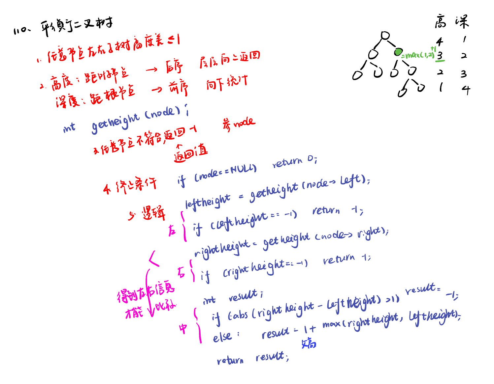
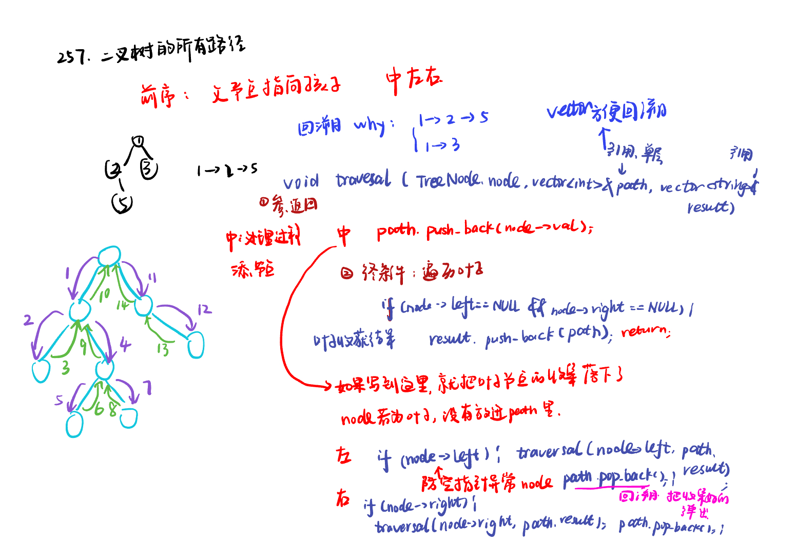
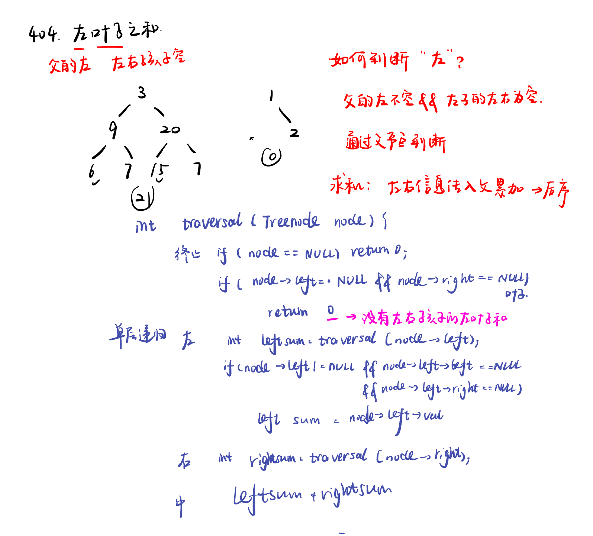
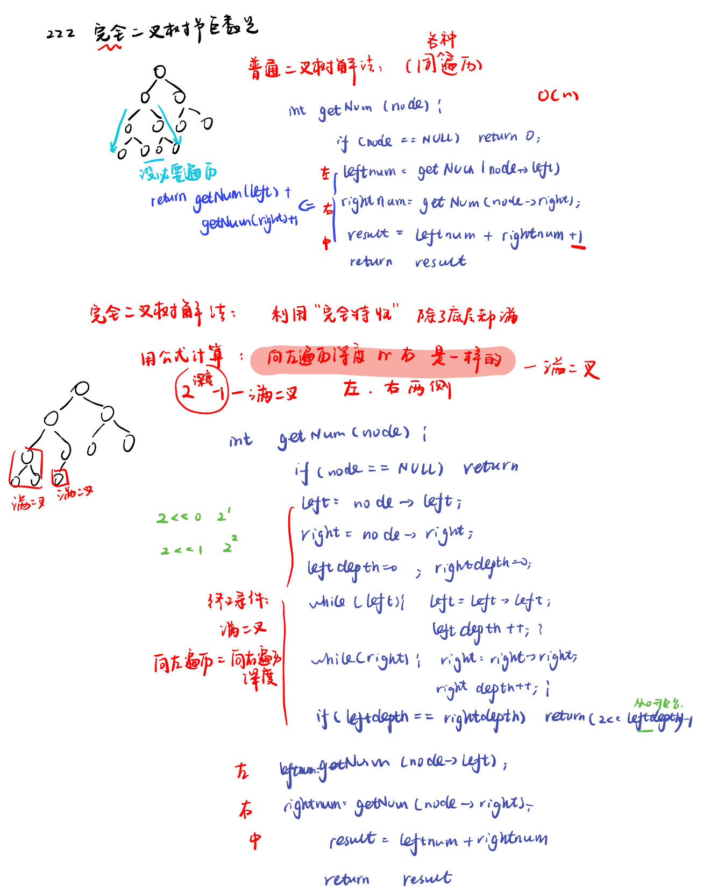

List: 110.平衡二叉树，257. 二叉树的所有路径，404.左叶子之和，222.完全二叉树的节点个数

[110.平衡二叉树balanced-binary-tree](#01)，[257. 二叉树的所有路径binary-tree-paths](#02)，[404.左叶子之和sum-of-left-leaves](#03)，[222.完全二叉树的节点个数count-complete-tree-nodes](#04)

# <span id="01">110.平衡二叉树balanced-binary-tree</span>

[Leetcode](https://leetcode.cn/problems/balanced-binary-tree/description/) 

[Learning Materials](https://programmercarl.com/0110.%E5%B9%B3%E8%A1%A1%E4%BA%8C%E5%8F%89%E6%A0%91.html)



## 递归法：后序求高度

```python
# Definition for a binary tree node.
# class TreeNode:
#     def __init__(self, val=0, left=None, right=None):
#         self.val = val
#         self.left = left
#         self.right = right
class Solution:
    def isBalanced(self, root: Optional[TreeNode]) -> bool:
        return self.getheight(root) != -1
    def getheight(self, root): 
        if not root:
            return 0
        leftheight = self.getheight(root.left)
        if leftheight == -1:
            return -1
        rightheight = self.getheight(root.right)
        if rightheight == -1:
            return -1
        if abs(rightheight - leftheight) > 1:
            return -1
        else:
            return 1 + max(leftheight, rightheight)
```

## 迭代法：栈模拟、专门求高度

在求二叉树最大深度时可以使用层序遍历求深度，但是不能用层次遍历求高度，深度、高度不是相反的关系，每个节点的深度、高度可能不对称。

通过栈模拟的后序遍历可以求每一个节点的高度，其实是通过求传入节点为根节点的最大深度来求的高度。


### 思路详细分析

大体思路：通过不断计算每个节点的左右子树高度，并比较它们的高度差，一旦发现高度差超过 1，就可以判定该二叉树不是平衡二叉树。

判断平衡：后序遍历入栈顺序应该是中、右、左。每次弹出一个节点，判断左右高度差是否符合条件。

计算每棵子树求高度：这里用了遍历的空指针法，每次从栈中弹出一个节点 node，如果 node 不为空，说明是真实的节点，不是标记。 深度 depth 加 1，表示进入了下一层。

如果弹出的是 None，说明已经处理完当前节点的左右子树，可以计算当前节点的高度了。 弹出栈顶的真实节点 node，深度 depth 减 1，表示回到上一层。

```python
# Definition for a binary tree node.
# class TreeNode:
#     def __init__(self, val=0, left=None, right=None):
#         self.val = val
#         self.left = left
#         self.right = right
class Solution:
    def isBalanced(self, root: Optional[TreeNode]) -> bool:
        st = []
        if not root:
            return True
        st.append(root)
        while st:
            node = st.pop()
            if (abs(self.getheight(node.right) - self.getheight(node.left)) > 1):
                return False
            if node.right:
                st.append(node.right)
            if node.left:
                st.append(node.left)
        return True
        
    def getheight(self, cur):
        st = []
        depth = 0
        result = 0
        if cur:
            st.append(cur)
        while st:
            node = st.pop()
            if node:
                st.append(node)
                st.append(None) # 中
                depth += 1
                if node.right:
                    st.append(node.right) #右
                if node.left:
                    st.append(node.left) #左
            else:
                node = st.pop()
                depth -= 1
            result = max(result, depth)
        return result
```


# <span id="02">257. 二叉树的所有路径binary-tree-paths</span>

[Leetcode](https://leetcode.cn/problems/binary-tree-paths/description/) 

[Learning Materials](https://programmercarl.com/0257.%E4%BA%8C%E5%8F%89%E6%A0%91%E7%9A%84%E6%89%80%E6%9C%89%E8%B7%AF%E5%BE%84.html#%E7%AE%97%E6%B3%95%E5%85%AC%E5%BC%80%E8%AF%BE)



## 递归法：

- map函数：第一个参数是一个函数，第二个参数是一个可迭代对象（如列表、元组等）。map 函数会将第一个参数指定的函数应用到第二个参数可迭代对象的每个元素上，并返回一个迭代器，该迭代器中的元素是应用函数后的结果。
str 函数：str 是 Python 内置的用于将对象转换为字符串的函数。

- join函数：join 是字符串对象的一个方法，它接受一个可迭代对象作为参数，该可迭代对象中的元素必须是字符串。join 方法会将可迭代对象中的所有字符串元素用调用该方法的字符串作为分隔符连接成一个新的字符串。

```python
# Definition for a binary tree node.
# class TreeNode:
#     def __init__(self, val=0, left=None, right=None):
#         self.val = val
#         self.left = left
#         self.right = right
class Solution:
    def traversal(self, node, path, result):
        path.append(node.val) #中
        if not node.left and not node.right:
            spath = '->'.join(map(str, path))
            result.append(spath)
            return
        if node.left: # 左
            self.traversal(node.left, path, result)
            path.pop() #回溯
        if node.right: # 右
            self.traversal(node.right,path, result)
            path.pop() #回溯

    def binaryTreePaths(self, root: Optional[TreeNode]) -> List[str]:
        path = []
        result = []
        if not root:
            return result
        self.traversal(root, path, result)
        return result
```

- 隐形回溯：

- 代码区别只有两行：

```python
        if node.left: # 左
            self.traversal(node.left, path[:], result)
        if node.right: # 右
            self.traversal(node.right, path[:], result)
```
这两段代码都用于解决力扣257题“二叉树的所有路径”，即找出二叉树中从根节点到叶子节点的所有路径，并将这些路径以字符串形式存储在列表中返回。下面详细分析这两段代码的区别：

### 原始代码
```python
# Definition for a binary tree node.
# class TreeNode:
#     def __init__(self, val=0, left=None, right=None):
#         self.val = val
#         self.left = left
#         self.right = right
class Solution:
    def traversal(self, node, path, result):
        path.append(node.val) #中
        if not node.left and not node.right:
            spath = '->'.join(map(str, path))
            result.append(spath)
            return
        if node.left: # 左
            self.traversal(node.left, path, result)
            path.pop()
        if node.right: # 右
            self.traversal(node.right, path, result)
            path.pop()

    def binaryTreePaths(self, root: Optional[TreeNode]) -> List[str]:
        path = []
        result = []
        if not root:
            return result
        self.traversal(root, path, result)
        return result
```

### 修改后的代码
```python
# Definition for a binary tree node.
# class TreeNode:
#     def __init__(self, val=0, left=None, right=None):
#         self.val = val
#         self.left = left
#         self.right = right
class Solution:
    def traversal(self, node, path, result):
        path.append(node.val) #中
        if not node.left and not node.right:
            spath = '->'.join(map(str, path))
            result.append(spath)
            return
        if node.left: # 左
            self.traversal(node.left, path[:], result)
        if node.right: # 右
            self.traversal(node.right, path[:], result)

    def binaryTreePaths(self, root: Optional[TreeNode]) -> List[str]:
        path = []
        result = []
        if not root:
            return result
        self.traversal(root, path, result)
        return result
```

在递归调用 `traversal` 函数时，使用 `path[:]` 传递 `path` 列表的副本。`path[:]` 是 Python 中创建列表副本的一种方式，它会创建一个新的列表对象，其元素与原列表相同。因此，每次递归调用都会使用一个独立的 `path` 列表副本，不会影响其他递归分支中的 `path` 列表。这种方式不需要手动管理列表的状态，但会增加内存开销，因为每个递归分支都会创建一个新的列表副本。

```python
# Definition for a binary tree node.
# class TreeNode:
#     def __init__(self, val=0, left=None, right=None):
#         self.val = val
#         self.left = left
#         self.right = right
class Solution:
    def traversal(self, node, path, result):
        path.append(node.val) #中
        if not node.left and not node.right:
            spath = '->'.join(map(str, path))
            result.append(spath)
            return
        if node.left: # 左
            self.traversal(node.left, path[:], result)
        if node.right: # 右
            self.traversal(node.right, path[:], result)

    def binaryTreePaths(self, root: Optional[TreeNode]) -> List[str]:
        path = []
        result = []
        if not root:
            return result
        self.traversal(root, path, result)
        return result
```

- 隐形回溯2：

当递归到叶子节点时，将路径字符串添加到 result 列表中，然后递归会自动返回上一层（因为函数执行完毕）。

```python
# Definition for a binary tree node.
# class TreeNode:
#     def __init__(self, val=0, left=None, right=None):
#         self.val = val
#         self.left = left
#         self.right = right
class Solution:
    def traversal(self, node, path, result):
        path += str(node.val) #中
        if not node.left and not node.right:
            result.append(path)
        if node.left: # 左
            self.traversal(node.left, path + '->', result)
        if node.right: # 右
            self.traversal(node.right, path + '->', result)

    def binaryTreePaths(self, root: Optional[TreeNode]) -> List[str]:
        path = ''
        result = []
        if not root:
            return result
        self.traversal(root, path, result)
        return result
```

## 迭代法：模拟递归需要一个栈，同时还需要一个栈来存放对应的遍历路径。

```python
# Definition for a binary tree node.
# class TreeNode:
#     def __init__(self, val=0, left=None, right=None):
#         self.val = val
#         self.left = left
#         self.right = right
class Solution:
    def binaryTreePaths(self, root: Optional[TreeNode]) -> List[str]:
        # 题目中节点数至少为1
        st = [root]
        path = [str(root.val)]
        result = []

        while st:
            node = st.pop()
            spath = path.pop()
            if not node.left and not node.right:
                result.append(spath)
            if node.right:
                st.append(node.right)
                path.append(spath + '->' + str(node.right.val))
            if node.left:
                st.append(node.left)
                path.append(spath + '->' + str(node.left.val))
        return result
```

下面我们详细模拟代码的运行过程，以此来解释为什么这么写是正确的。我们以一个简单的二叉树为例，假设二叉树结构如下：

```
    1
   / \
  2   3
 /
4
```

初始化，`st = [TreeNode(1)]`，`path = ["1"]`，`result = []`。


#### 第一次循环
- `node = st.pop()`：从栈 `st` 中弹出节点 `TreeNode(1)`，此时 `st = []`。
- `spath = path.pop()`：从路径列表 `path` 中弹出路径字符串 `"1"`，此时 `path = []`。
- `if not node.left and not node.right:`：节点 `TreeNode(1)` 有左子节点和右子节点，不满足条件，继续执行。
- `if node.right:`：节点 `TreeNode(1)` 有右子节点 `TreeNode(3)`，将右子节点压入栈 `st` 中，即 `st = [TreeNode(3)]`；同时构建新的路径字符串 `"1->3"` 并添加到路径列表 `path` 中，即 `path = ["1->3"]`。
- `if node.left:`：节点 `TreeNode(1)` 有左子节点 `TreeNode(2)`，将左子节点压入栈 `st` 中，即 `st = [TreeNode(3), TreeNode(2)]`；同时构建新的路径字符串 `"1->2"` 并添加到路径列表 `path` 中，即 `path = ["1->3", "1->2"]`。

此时，`st = [TreeNode(3), TreeNode(2)]`，`path = ["1->3", "1->2"]`，`result = []`。

#### 第二次循环
- `node = st.pop()`：从栈 `st` 中弹出节点 `TreeNode(2)`，此时 `st = [TreeNode(3)]`。
- `spath = path.pop()`：从路径列表 `path` 中弹出路径字符串 `"1->2"`，此时 `path = ["1->3"]`。
- `if not node.left and not node.right:`：节点 `TreeNode(2)` 有左子节点，不满足条件，继续执行。
- `if node.right:`：节点 `TreeNode(2)` 没有右子节点，不执行该分支。
- `if node.left:`：节点 `TreeNode(2)` 有左子节点 `TreeNode(4)`，将左子节点压入栈 `st` 中，即 `st = [TreeNode(3), TreeNode(4)]`；同时构建新的路径字符串 `"1->2->4"` 并添加到路径列表 `path` 中，即 `path = ["1->3", "1->2->4"]`。

此时，`st = [TreeNode(3), TreeNode(4)]`，`path = ["1->3", "1->2->4"]`，`result = []`。

#### 第三次循环
- `node = st.pop()`：从栈 `st` 中弹出节点 `TreeNode(4)`，此时 `st = [TreeNode(3)]`。
- `spath = path.pop()`：从路径列表 `path` 中弹出路径字符串 `"1->2->4"`，此时 `path = ["1->3"]`。
- `if not node.left and not node.right:`：节点 `TreeNode(4)` 没有左子节点和右子节点，满足条件，将路径字符串 `"1->2->4"` 添加到结果列表 `result` 中，即 `result = ["1->2->4"]`。
- `if node.right:`：节点 `TreeNode(4)` 没有右子节点，不执行该分支。
- `if node.left:`：节点 `TreeNode(4)` 没有左子节点，不执行该分支。

此时，`st = [TreeNode(3)]`，`path = ["1->3"]`，`result = ["1->2->4"]`。

#### 第四次循环
- `node = st.pop()`：从栈 `st` 中弹出节点 `TreeNode(3)`，此时 `st = []`。
- `spath = path.pop()`：从路径列表 `path` 中弹出路径字符串 `"1->3"`，此时 `path = []`。
- `if not node.left and not node.right:`：节点 `TreeNode(3)` 没有左子节点和右子节点，满足条件，将路径字符串 `"1->3"` 添加到结果列表 `result` 中，即 `result = ["1->2->4", "1->3"]`。
- `if node.right:`：节点 `TreeNode(3)` 没有右子节点，不执行该分支。
- `if node.left:`：节点 `TreeNode(3)` 没有左子节点，不执行该分支。

此时，`st = []`，`path = []`，`result = ["1->2->4", "1->3"]`。

循环结束：由于栈 `st` 为空，循环结束，返回结果列表 `result`，即 `["1->2->4", "1->3"]`，这正是从根节点到叶子节点的所有路径。


# <span id="03">404.左叶子之和sum-of-left-leaves</span>

[Leetcode](https://leetcode.cn/problems/sum-of-left-leaves/description/) 

[Learning Materials](https://programmercarl.com/0404.%E5%B7%A6%E5%8F%B6%E5%AD%90%E4%B9%8B%E5%92%8C.html)



## 递归法：

```python
# Definition for a binary tree node.
# class TreeNode:
#     def __init__(self, val=0, left=None, right=None):
#         self.val = val
#         self.left = left
#         self.right = right
class Solution:
    def sumOfLeftLeaves(self, root: Optional[TreeNode]) -> int:
        if not root:
            return 0
        if not root.left and not root.right:
            return 0
        leftsum = self.sumOfLeftLeaves(root.left)
        if root.left and not root.left.left and not root.left.right:
            leftsum = root.left.val
        rightsum = self.sumOfLeftLeaves(root.right)
        left_sum = leftsum + rightsum
        return left_sum
```

判断条件放在后面也是可以通过的。

```python
# Definition for a binary tree node.
# class TreeNode:
#     def __init__(self, val=0, left=None, right=None):
#         self.val = val
#         self.left = left
#         self.right = right
class Solution:
    def sumOfLeftLeaves(self, root: Optional[TreeNode]) -> int:
        if not root:
            return 0
        if not root.left and not root.right:
            return 0
        leftsum = self.sumOfLeftLeaves(root.left)
        rightsum = self.sumOfLeftLeaves(root.right)
        if root.left and not root.left.left and not root.left.right:
            leftsum = root.left.val
        left_sum = leftsum + rightsum
        return left_sum
```

## 迭代法：

```python
# Definition for a binary tree node.
# class TreeNode:
#     def __init__(self, val=0, left=None, right=None):
#         self.val = val
#         self.left = left
#         self.right = right
class Solution:
    def sumOfLeftLeaves(self, root: Optional[TreeNode]) -> int:
        if not root:
            return 0
        st = [root]
        result = 0
        while st:
            node = st.pop()
            if node.right:
                st.append(node.right)
            if node.left:
                st.append(node.left)
            if node.left and not node.left.left and not node.left.right:
                result += node.left.val
        return result
```

# <span id="04">222.完全二叉树的节点个数count-complete-tree-nodes</span>

[Leetcode](https://leetcode.cn/problems/count-complete-tree-nodes/description/) 

[Learning Materials](https://programmercarl.com/0222.%E5%AE%8C%E5%85%A8%E4%BA%8C%E5%8F%89%E6%A0%91%E7%9A%84%E8%8A%82%E7%82%B9%E4%B8%AA%E6%95%B0.html#%E7%AE%97%E6%B3%95%E5%85%AC%E5%BC%80%E8%AF%BE)



```python
# Definition for a binary tree node.
# class TreeNode:
#     def __init__(self, val=0, left=None, right=None):
#         self.val = val
#         self.left = left
#         self.right = right
class Solution:
    def countNodes(self, root: Optional[TreeNode]) -> int:
        if not root:
            return 0
        left = root.left
        right = root.right
        leftdepth = 0
        rightdepth = 0
        while left:
            left = left.left
            leftdepth += 1
        while right:
            right = right.right
            rightdepth += 1
        if leftdepth == rightdepth:
            return (2 << leftdepth) -1
        leftnum = self.countNodes(root.left)
        rightnum = self.countNodes(root.right)
        return leftnum + rightnum + 1
```

#### 1. 利用完全二叉树特性
对于完全二叉树，如果从根节点开始，不断向左遍历得到的深度 `leftdepth` 和不断向右遍历得到的深度 `rightdepth` 相等，说明这是一棵满二叉树。满二叉树的节点数量可以通过公式 $2^{h + 1}-1$ 来计算，其中 $h$ 是树的高度。在代码中，`(2 << leftdepth) - 1` 等价于 $2^{leftdepth + 1}-1$，这样就可以直接得出该满二叉树的节点数量，避免了对满二叉树内部节点的重复计算。

#### 2. 递归处理非满二叉树部分
如果 `leftdepth` 不等于 `rightdepth`，说明这不是一棵满二叉树。此时，将树拆分为左子树和右子树，分别递归调用 `countNodes` 函数计算左子树和右子树的节点数量，最后加上根节点（即 `+ 1`），得到整棵树的节点数量。由于每次递归调用都会处理不同的子树，不会出现重复计算的情况。


