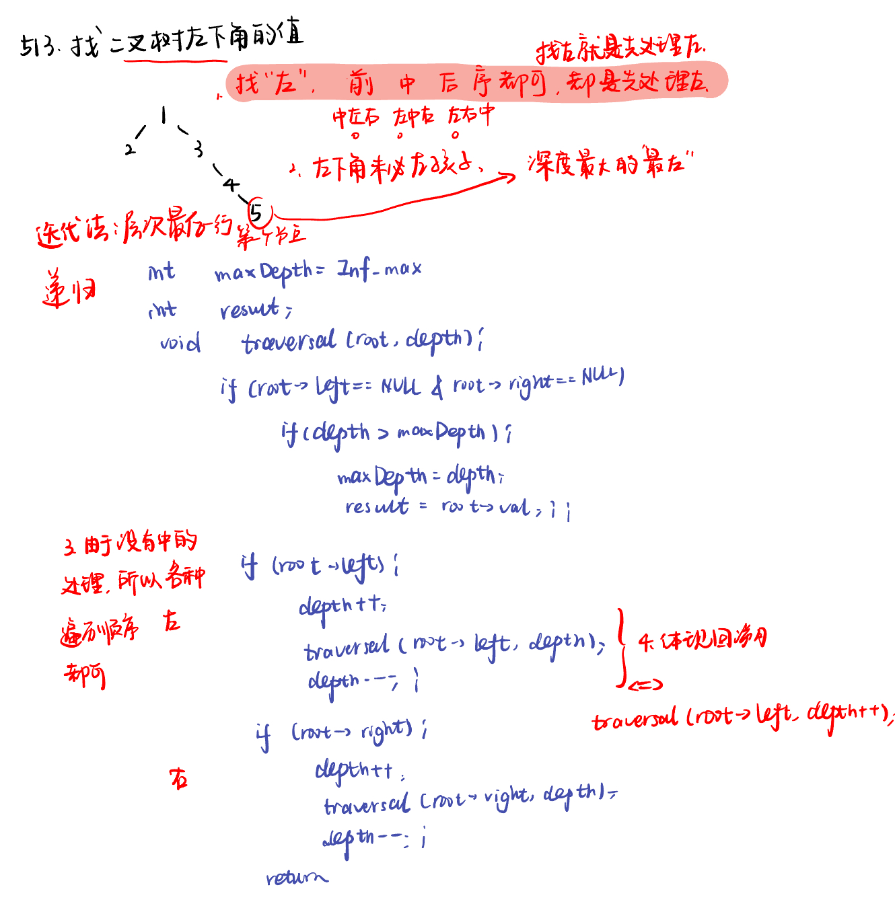
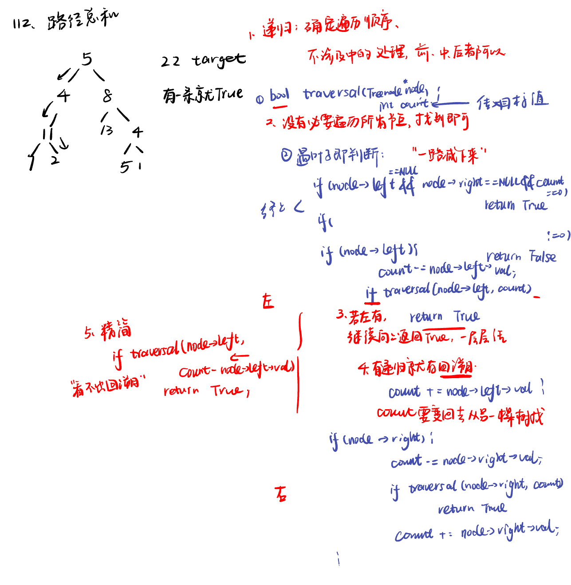

List: 找树左下角的值，路径总和(力扣112/113)，从中序与后序遍历序列构造二叉树

[513.找树左下角的值find-bottom-left-tree-value](#01)，[112. 路径总和path-sum](#02)，[](#03)

# <span id="01">513.找树左下角的值find-bottom-left-tree-value</span>

[Leetcode](https://leetcode.cn/problems/find-bottom-left-tree-value/description/) 

[Learning Materials](https://programmercarl.com/0513.%E6%89%BE%E6%A0%91%E5%B7%A6%E4%B8%8B%E8%A7%92%E7%9A%84%E5%80%BC.html)




## 递归法：

```python
# Definition for a binary tree node.
# class TreeNode:
#     def __init__(self, val=0, left=None, right=None):
#         self.val = val
#         self.left = left
#         self.right = right
class Solution:
    def findBottomLeftValue(self, root: Optional[TreeNode]) -> int: 
        self.maxdepth = float('-inf')
        self.result = None
        def getdepth(node, depth):
            if not node.left and not node.right:
                if depth > self.maxdepth:
                    self.maxdepth = depth
                    self.result = node.val #只有判断是叶子，才运行
                return
            if node.left:
                getdepth(node.left, depth + 1)
            if node.right:
                getdepth(node.right, depth + 1)
        getdepth(root, 0)
        return self.result
```

## 迭代法：

只需要在层次遍历过程中，记录每一行的第一个节点的值并不断迭代这个值，最后一次循环得到的就是最后一行最左的元素。

```python
# Definition for a binary tree node.
# class TreeNode:
#     def __init__(self, val=0, left=None, right=None):
#         self.val = val
#         self.left = left
#         self.right = right
class Solution:
    def findBottomLeftValue(self, root: Optional[TreeNode]) -> int: 
        if not root:
            return
        que  = deque([root])
        result = 0
        while que:
            size = len(que)
            for i in range(size):
                node = que.popleft()
                if i == 0:
                    result = node.val
                if node.left:
                    que.append(node.left)
                if node.right:
                    que.append(node.right)
        return result
```

# <span id="02">112. 路径总和path-sum</span>

[Leetcode](https://leetcode.cn/problems/path-sum/description/) 

[Learning Materials](https://programmercarl.com/0112.%E8%B7%AF%E5%BE%84%E6%80%BB%E5%92%8C.html#%E7%AE%97%E6%B3%95%E5%85%AC%E5%BC%80%E8%AF%BE)



# 递归法：

```python
# Definition for a binary tree node.
# class TreeNode:
#     def __init__(self, val=0, left=None, right=None):
#         self.val = val
#         self.left = left
#         self.right = right
class Solution:
    def hasPathSum(self, root: Optional[TreeNode], targetSum: int) -> bool:
        if not root:
            return False
        return self.traversal(root, targetSum - root.val)  #由于没有对中处理，需要先把根节点去掉

    def traversal(self, node, count) :
        if not node.left and not node.right and count == 0:
            return True
        if not node.left and not node.right and count != 0:
            return False

        if node.left:
            count -= node.left.val
            if self.traversal(node.left, count):
                return True
            count += node.left.val

        if node.right:
            count -= node.right.val
            if self.traversal(node.right, count):
                return True
            count += node.right.val
        
        return False
```

- 精简版：

```python
# Definition for a binary tree node.
# class TreeNode:
#     def __init__(self, val=0, left=None, right=None):
#         self.val = val
#         self.left = left
#         self.right = right
class Solution:
    def hasPathSum(self, root: Optional[TreeNode], targetSum: int) -> bool:
        if not root:
            return False
        if not root.left and not root.right and targetSum == root.val:
            return True 
        return self.hasPathSum(root.left, targetSum - root.val) or self.hasPathSum(root.right, targetSum - root.val)
```

## 迭代法

此时栈里一个元素不仅要记录该节点指针，还要记录从头结点到该节点的路径数值总和。

```python
# Definition for a binary tree node.
# class TreeNode:
#     def __init__(self, val=0, left=None, right=None):
#         self.val = val
#         self.left = left
#         self.right = right
class Solution:
    def hasPathSum(self, root: Optional[TreeNode], targetSum: int) -> bool:
        if not root:
            return False
         # 此时栈里要放的是pair<节点指针，路径数值>
        st = [(root, root.val)]
        while st:
            node, path_sum = st.pop()
            # 如果该节点是叶子节点了，同时该节点的路径数值等于sum，那么就返回true
            if not node.left and not node.right and path_sum == targetSum:
                return True 
            # 右节点，压进去一个节点的时候，将该节点的路径数值也记录下来
            if node.right:
                st.append((node.right, path_sum + node.right.val))
             # 左节点，压进去一个节点的时候，将该节点的路径数值也记录下来
            if node.left:
                st.append((node.left, path_sum + node.left.val))

        return False
```
## 相关题目：

[113.路径之和Ⅱ]（https://leetcode.cn/problems/path-sum-ii/description/）

区别在于要找到所有路径。所以递归函数不要返回值.

## 递归法

```python
# Definition for a binary tree node.
# class TreeNode:
#     def __init__(self, val=0, left=None, right=None):
#         self.val = val
#         self.left = left
#         self.right = right
class Solution:
    def pathSum(self, root: Optional[TreeNode], targetSum: int) -> List[List[int]]:
        self.result = []
        self.path = []
        if not root:
            return self.result
        self.path.append(root.val)
        self.traversal(root, targetSum - root.val)
        return self.result
    
    def traversal(self, node, count):
        if not node.left and not node.right and count == 0:
            self.result.append(self.path[:])
            return 
        if not node.left and not node.right:
            return
        
        if node.left:
            self.path.append(node.left.val)
            count -= node.left.val
            self.traversal(node.left, count)
            count += node.left.val
            self.path.pop()

        if node.right:
            self.path.append(node.right.val)
            count -= node.right.val
            self.traversal(node.right, count)
            count += node.right.val
            self.path.pop()
        
        return
```

## 迭代法

需要记录下来path的路径，就是多了一个值去记录累加。

```python
# Definition for a binary tree node.
# class TreeNode:
#     def __init__(self, val=0, left=None, right=None):
#         self.val = val
#         self.left = left
#         self.right = right
class Solution:
    def pathSum(self, root: Optional[TreeNode], targetSum: int) -> List[List[int]]:
        if not root:
            return []
        st = [(root, [root.val])]
        res = []
        while st:
            node, path = st.pop()
            if not node.left and not node.right and sum(path) == targetSum:
                res.append(path)
            if node.right:
                st.append((node.right, path + [node.right.val]))
            if node.left:
                st.append((node.left, path + [node.left.val]))
        return res
```

# <span id="03">理论基础</span>

[Leetcode]() 

[Learning Materials]()


