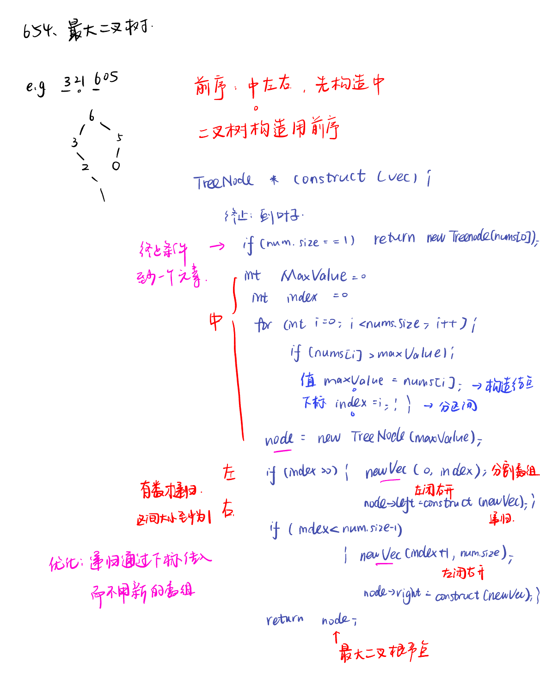

List: 654.最大二叉树，617.合并二叉树，700.二叉搜索树中的搜索，98.验证二叉搜索树


[654.最大二叉树maximum-binary-tree](#01)，[](#02)，[](#03)，[](#04),[](#05)

# <span id="01">654.最大二叉树maximum-binary-tree</span>

[Leetcode](https://leetcode.cn/problems/maximum-binary-tree/description/) 

[Learning Materials](https://programmercarl.com/0654.%E6%9C%80%E5%A4%A7%E4%BA%8C%E5%8F%89%E6%A0%91.html)



```python
class TreeNode:
    def __init__(self, val, left = None, right = None):
        self.val = val
        self.left = left
        self.right = right
```

# <span id="02">理论基础</span>

[Leetcode]() 

[Learning Materials]()


# <span id="03">理论基础</span>

[Leetcode]() 

[Learning Materials]()


# <span id="04">理论基础</span>

[Leetcode]() 

[Learning Materials]()


# <span id="05">理论基础</span>

[Leetcode]() 

[Learning Materials]()


