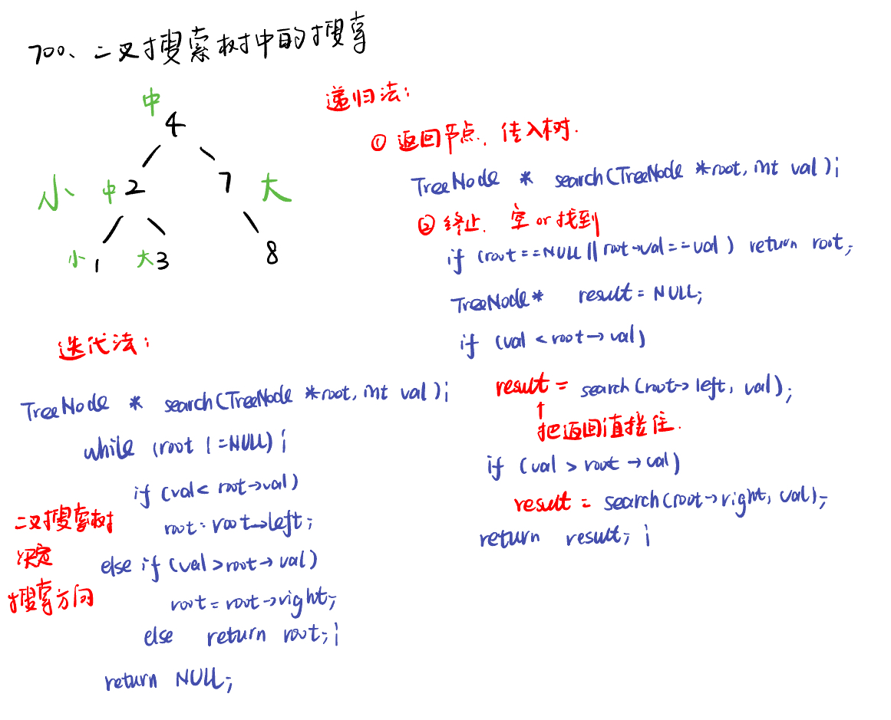
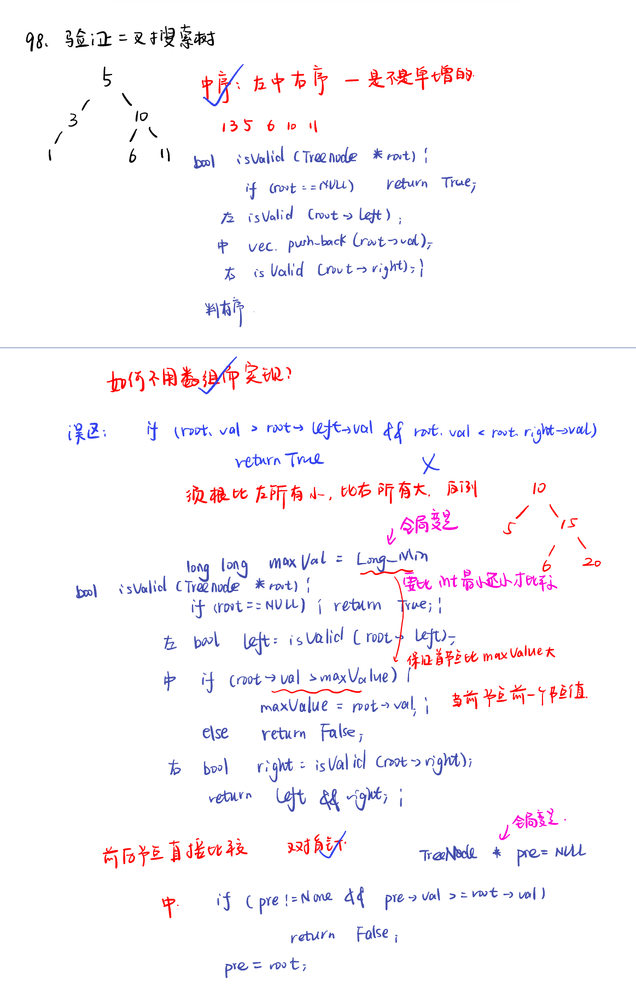

List: 654.最大二叉树，617.合并二叉树，700.二叉搜索树中的搜索，98.验证二叉搜索树


[654.最大二叉树maximum-binary-tree](#01)，[617.合并二叉树merge-two-binary-trees](#02)，[700.二叉搜索树中的搜索search-in-a-binary-search-tree](#03)，[98.验证二叉搜索树validate-binary-search-tree](#04)

# <span id="01">654.最大二叉树maximum-binary-tree</span>

[Leetcode](https://leetcode.cn/problems/maximum-binary-tree/description/) 

[Learning Materials](https://programmercarl.com/0654.%E6%9C%80%E5%A4%A7%E4%BA%8C%E5%8F%89%E6%A0%91.html)

 

```python
# Definition for a binary tree node.
# class TreeNode:
#     def __init__(self, val=0, left=None, right=None):
#         self.val = val
#         self.left = left
#         self.right = right
class Solution:
    def constructMaximumBinaryTree(self, nums: List[int]) -> Optional[TreeNode]:
        if len(nums) == 1:
            return TreeNode(nums[0])
        maxvalue, index = 0, 0
        for i in range(len(nums)):
            if maxvalue < nums[i]:
                maxvalue = nums[i]
                index = i 
        node = TreeNode(maxvalue)
        if index > 0:
            lnums = nums[:index]
            node.left = self.constructMaximumBinaryTree(lnums)
        if index < len(nums) - 1:
            rnums = nums[index + 1:]
            node.right = self.constructMaximumBinaryTree(rnums)
        return node
```

## 优化：不使用新数组，直接用下标：

允许空节点进入递归，所以不用在递归的时候加判断节点是否为空。终止条件也要有相应的改变。

类似用数组构造二叉树的题目，每次分隔尽量不要定义新的数组，而是通过下标索引直接在原数组上操作，这样可以节约时间和空间上的开销。

**要不要加if？如果让空节点（空指针）进入递归，就不加if，如果不让空节点进入递归，就加if限制一下， 终止条件也会相应的调整。**

```python
# Definition for a binary tree node.
# class TreeNode:
#     def __init__(self, val=0, left=None, right=None):
#         self.val = val
#         self.left = left
#         self.right = right
class Solution:
    def constructMaximumBinaryTree(self, nums: List[int]) -> Optional[TreeNode]:
        return self.construct(nums, 0, len(nums))
    def construct(self, nums, left, right):
        #在左闭右开区间[left, right)，构造二叉树
        if left >= right: #左闭右开区间，相等时为空
            return
        # 分割点下标：
        index = left
        for i in range(left, right): #只需要在 [left, right) 这个区间内找到最大值
            if nums[index] < nums[i]:
                index = i 
        node = TreeNode(nums[index])
        # 左闭右开：[left, maxValueIndex)
        node.left = self.construct(nums, left, index)
        # 左闭右开：[maxValueIndex + 1, right)
        node.right = self.construct(nums, index + 1, right)
        return node
```

# <span id="02">617.合并二叉树merge-two-binary-trees</span>

[Leetcode](https://leetcode.cn/problems/merge-two-binary-trees/description/) 

[Learning Materials](https://programmercarl.com/0617.%E5%90%88%E5%B9%B6%E4%BA%8C%E5%8F%89%E6%A0%91.html#%E7%AE%97%E6%B3%95%E5%85%AC%E5%BC%80%E8%AF%BE)


## 递归法：

```python
# Definition for a binary tree node.
# class TreeNode:
#     def __init__(self, val=0, left=None, right=None):
#         self.val = val
#         self.left = left
#         self.right = right
class Solution:
    def mergeTrees(self, root1: Optional[TreeNode], root2: Optional[TreeNode]) -> Optional[TreeNode]:
        if not root1:
            return root2
        if not root2:
            return root1
        root1.val += root2.val  
        root1.left = self.mergeTrees(root1.left, root2.left)
        root1.right = self.mergeTrees(root1.right, root2.right)
        return root1
```

- 递归的下面顺序也是可以的

```python
        root1.left = self.mergeTrees(root1.left, root2.left)
        root1.val += root2.val  
        root1.right = self.mergeTrees(root1.right, root2.right)
```

```python
        root1.left = self.mergeTrees(root1.left, root2.left)
        root1.right = self.mergeTrees(root1.right, root2.right)
        root1.val += root2.val
```

## 迭代法：

使用队列、层序遍历。

```python
# Definition for a binary tree node.
# class TreeNode:
#     def __init__(self, val=0, left=None, right=None):
#         self.val = val
#         self.left = left
#         self.right = right
class Solution:
    def mergeTrees(self, root1: Optional[TreeNode], root2: Optional[TreeNode]) -> Optional[TreeNode]:
        if not root1:
            return root2
        if not root2:
            return root1
        
        que = deque()
        que.append(root1)
        que.append(root2)
    #用队列处理两个要相加的情况，直接在t1上修改，只需要额外考虑t1空而t2不空的情况。
        while que:
            node1 = que.popleft()
            node2 = que.popleft()
            #此时两个节点一定不为空，val相加
            node1.val += node2.val
            #如果两棵树左节点都不为空，加入队列
            if node1.left and node2.left:
                que.append(node1.left)
                que.append(node2.left)
            #如果两棵树右节点都不为空，加入队列
            if node1.right and node2.right:
                que.append(node1.right)
                que.append(node2.right)
            #当t1的左节点 为空 t2左节点不为空，就赋值过去
            if not node1.left and node2.left:
                node1.left = node2.left
            #当t1的右节点 为空 t2右节点不为空，就赋值过去
            if not node1.right and node2.right:
                node1.right = node2.right
        return root1
```

# <span id="03">700.二叉搜索树中的搜索search-in-a-binary-search-tree</span>

[Leetcode](https://leetcode.cn/problems/search-in-a-binary-search-tree/description/) 

[Learning Materials](https://programmercarl.com/0700.%E4%BA%8C%E5%8F%89%E6%90%9C%E7%B4%A2%E6%A0%91%E4%B8%AD%E7%9A%84%E6%90%9C%E7%B4%A2.html#%E7%AE%97%E6%B3%95%E5%85%AC%E5%BC%80%E8%AF%BE)



## 递归法：

```python
# Definition for a binary tree node.
# class TreeNode:
#     def __init__(self, val=0, left=None, right=None):
#         self.val = val
#         self.left = left
#         self.right = right
class Solution:
    def searchBST(self, root: Optional[TreeNode], val: int) -> Optional[TreeNode]:
        if not root or root.val == val:
            return root
        if root.val > val:
            result = self.searchBST(root.left, val)
        if root.val < val:
            result = self.searchBST(root.right, val)
        return result
```

## 迭代法：

```python
# Definition for a binary tree node.
# class TreeNode:
#     def __init__(self, val=0, left=None, right=None):
#         self.val = val
#         self.left = left
#         self.right = right
class Solution:
    def searchBST(self, root: Optional[TreeNode], val: int) -> Optional[TreeNode]:
        while root:
            if root.val > val:
                root = root.left
            elif root.val < val:
                root = root.right
            else:
                return root
        return None
```

# <span id="04">98.验证二叉搜索树validate-binary-search-tree</span>

[Leetcode](https://leetcode.cn/problems/validate-binary-search-tree/description/) 

[Learning Materials](https://programmercarl.com/0098.%E9%AA%8C%E8%AF%81%E4%BA%8C%E5%8F%89%E6%90%9C%E7%B4%A2%E6%A0%91.html#%E7%AE%97%E6%B3%95%E5%85%AC%E5%BC%80%E8%AF%BE)



## 方法一：中序+检查顺序

```python
# Definition for a binary tree node.
# class TreeNode:
#     def __init__(self, val=0, left=None, right=None):
#         self.val = val
#         self.left = left
#         self.right = right
class Solution:
    def isValidBST(self, root: Optional[TreeNode]) -> bool:
        self.result = []
        self.isValid(root)
        for i in range(1, len(self.result)):
            if self.result[i - 1] >= self.result[i]: #注意要小于等于，搜索树里不能有相同元素
                return False
        return True
    def isValid(self, root):
        if not root:
            return True
        self.isValid(root.left)
        self.result.append(root.val)
        self.isValid(root.right)
```

## 方法二：不额外用数组判定顺序，直接在递归中判断

```python
# Definition for a binary tree node.
# class TreeNode:
#     def __init__(self, val=0, left=None, right=None):
#         self.val = val
#         self.left = left
#         self.right = right
class Solution:
    def isValidBST(self, root: Optional[TreeNode]) -> bool:
        self.value = float('-inf')
        return self.isValid(root)
    def isValid(self, root):
        if not root:
            return True
        left = self.isValid(root.left)
        if root.val > self.value:
            self.value = root.val
        else:
            return False
        right = self.isValid(root.right)
        return left and right
```

## 方法三：由于测试数据中有很小的数，用双指针判断，记录前一个节点：

```python
# Definition for a binary tree node.
# class TreeNode:
#     def __init__(self, val=0, left=None, right=None):
#         self.val = val
#         self.left = left
#         self.right = right
class Solution:
    def isValidBST(self, root: Optional[TreeNode]) -> bool:
        self.pre = None
        return self.isValid(root)
    def isValid(self, root):
        if not root:
            return True
        left = self.isValid(root.left)
        if self.pre and root.val <= self.pre.val:
            return False
        self.pre = root
        right = self.isValid(root.right)
        return left and right
```

## 方法四：迭代法，直接在中序遍历上改编

```python
# Definition for a binary tree node.
# class TreeNode:
#     def __init__(self, val=0, left=None, right=None):
#         self.val = val
#         self.left = left
#         self.right = right
class Solution:
    def isValidBST(self, root: Optional[TreeNode]) -> bool:
        st = []
        node = root
        pre = None
        while st and node:
            if node:
                st.append(node) 
                node = node.left #左
            else:
                node = node.pop() #弹出的数据就是要处理的数据， 中
                if pre and node.val <= pre.val:
                    return False
                pre = node # 保存前一个节点的值
                node = node.right #右
        return True
```

```
