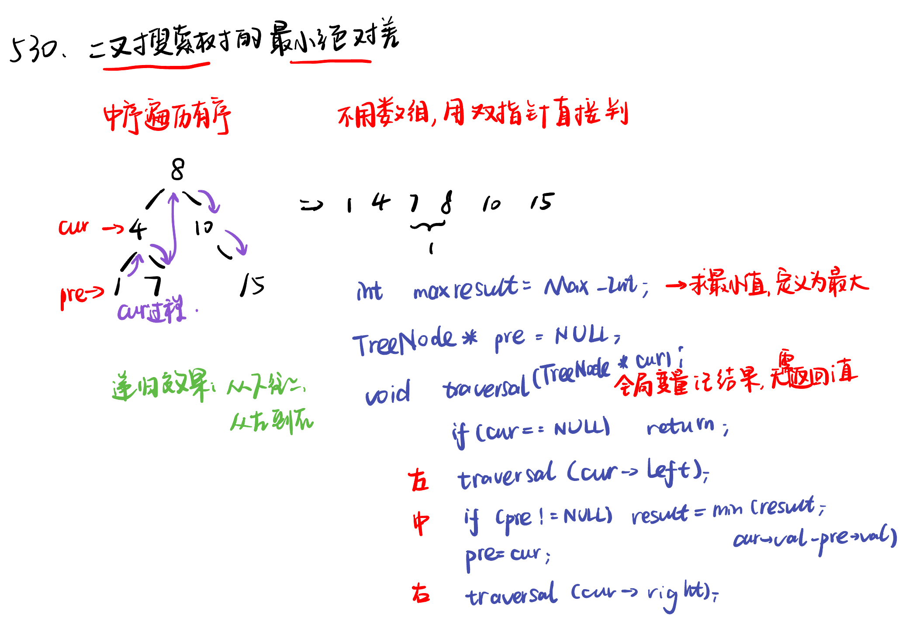

List: 530.二叉搜索树的最小绝对差，501.二叉搜索树中的众数，236. 二叉树的最近公共祖先 

[530.二叉搜索树的最小绝对差minimum-absolute-difference-in-bst](#01)，[](#02)，[](#03)，[](#04),[](#05)

# <span id="01">530.二叉搜索树的最小绝对差minimum-absolute-difference-in-bst</span>

[Leetcode](https://leetcode.cn/problems/minimum-absolute-difference-in-bst/description/) 

[Learning Materials](https://programmercarl.com/0530.%E4%BA%8C%E5%8F%89%E6%90%9C%E7%B4%A2%E6%A0%91%E7%9A%84%E6%9C%80%E5%B0%8F%E7%BB%9D%E5%AF%B9%E5%B7%AE.html)




## 递归法：

```python
# Definition for a binary tree node.
# class TreeNode:
#     def __init__(self, val=0, left=None, right=None):
#         self.val = val
#         self.left = left
#         self.right = right
class Solution:
    def __init__(self):
        self.result = float('inf')
        self.pre = None #如果写成 self.pre = TreeNode()，那么在开始遍历时，self.pre 就被初始化为一个新的节点对象
    def getMinimumDifference(self, root: Optional[TreeNode]) -> int:
        if not root:
            return
        self.getMinimumDifference(root.left)
        if self.pre:
            self.result = min(self.result, root.val - self.pre.val)
        self.pre = root
        self.getMinimumDifference(root.right)
        return self.result
```

# 迭代法：使用中序遍历

```python
# Definition for a binary tree node.
# class TreeNode:
#     def __init__(self, val=0, left=None, right=None):
#         self.val = val
#         self.left = left
#         self.right = right
class Solution:
    def getMinimumDifference(self, root: Optional[TreeNode]) -> int:
        st = []
        cur = root
        pre = None
        result = float('inf')
        while cur or st:
            if cur:
                st.append(cur)
                cur = cur.left
            else:
                cur = st.pop()
                if pre:
                    result = min(result, cur.val - pre.val)
                pre = cur
                cur = cur.right
        return result
```

# <span id="02">理论基础</span>

[Leetcode]() 

[Learning Materials]()


# <span id="03">理论基础</span>

[Leetcode]() 

[Learning Materials]()


# <span id="04">理论基础</span>

[Leetcode]() 

[Learning Materials]()


# <span id="05">理论基础</span>

[Leetcode]() 

[Learning Materials]()


