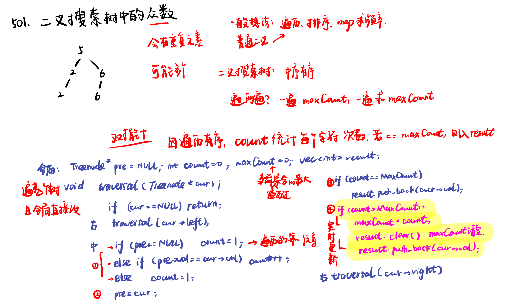
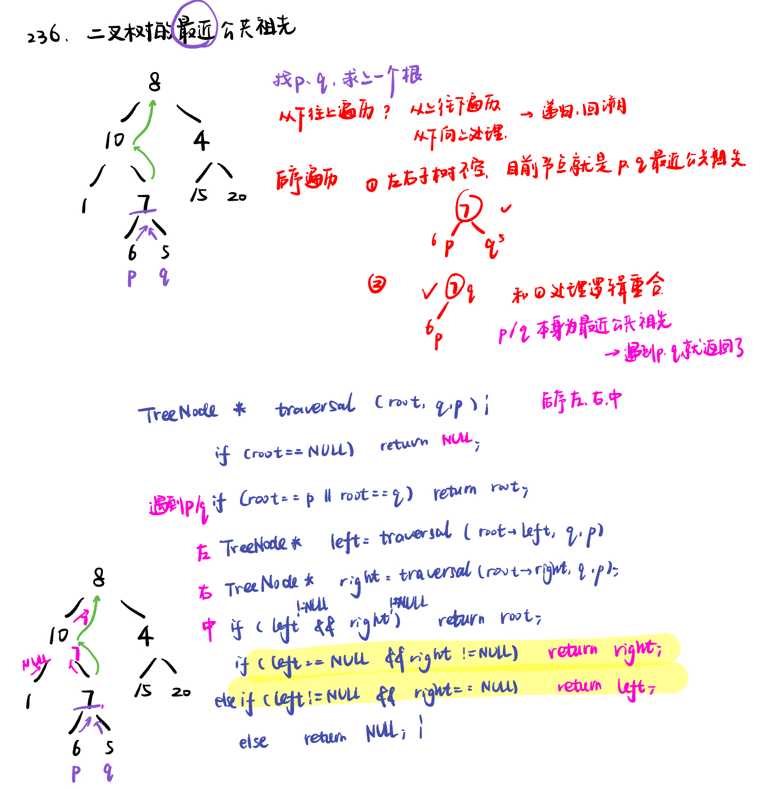

List: 530.二叉搜索树的最小绝对差，501.二叉搜索树中的众数，236. 二叉树的最近公共祖先 

[530.二叉搜索树的最小绝对差minimum-absolute-difference-in-bst](#01)，[501.二叉搜索树中的众数find-mode-in-binary-search-tree](#02)，[236. 二叉树的最近公共祖先lowest-common-ancestor-of-a-binary-tree](#03)

# <span id="01">530.二叉搜索树的最小绝对差minimum-absolute-difference-in-bst</span>

[Leetcode](https://leetcode.cn/problems/minimum-absolute-difference-in-bst/description/) 

[Learning Materials](https://programmercarl.com/0530.%E4%BA%8C%E5%8F%89%E6%90%9C%E7%B4%A2%E6%A0%91%E7%9A%84%E6%9C%80%E5%B0%8F%E7%BB%9D%E5%AF%B9%E5%B7%AE.html)


## 递归法：

```python
# Definition for a binary tree node.
# class TreeNode:
#     def __init__(self, val=0, left=None, right=None):
#         self.val = val
#         self.left = left
#         self.right = right
class Solution:
    def __init__(self):
        self.result = float('inf')
        self.pre = None #如果写成 self.pre = TreeNode()，那么在开始遍历时，self.pre 就被初始化为一个新的节点对象
    def getMinimumDifference(self, root: Optional[TreeNode]) -> int:
        if not root:
            return
        self.getMinimumDifference(root.left)
        if self.pre:
            self.result = min(self.result, root.val - self.pre.val)
        self.pre = root
        self.getMinimumDifference(root.right)
        return self.result
```

# 迭代法：使用中序遍历

```python
# Definition for a binary tree node.
# class TreeNode:
#     def __init__(self, val=0, left=None, right=None):
#         self.val = val
#         self.left = left
#         self.right = right
class Solution:
    def getMinimumDifference(self, root: Optional[TreeNode]) -> int:
        st = []
        cur = root
        pre = None
        result = float('inf')
        while cur or st:
            if cur:
                st.append(cur)
                cur = cur.left
            else:
                cur = st.pop()
                if pre:
                    result = min(result, cur.val - pre.val)
                pre = cur
                cur = cur.right
        return result
```

# <span id="02">501.二叉搜索树中的众数find-mode-in-binary-search-tree</span>

[Leetcode](https://leetcode.cn/problems/find-mode-in-binary-search-tree/description/) 

[Learning Materials](https://programmercarl.com/0501.%E4%BA%8C%E5%8F%89%E6%90%9C%E7%B4%A2%E6%A0%91%E4%B8%AD%E7%9A%84%E4%BC%97%E6%95%B0.html#%E7%AE%97%E6%B3%95%E5%85%AC%E5%BC%80%E8%AF%BE)



## 递归法：

```python
# Definition for a binary tree node.
# class TreeNode:
#     def __init__(self, val=0, left=None, right=None):
#         self.val = val
#         self.left = left
#         self.right = right
class Solution:
    def __init__(self):
        self.pre = None
        self.count = 0
        self.maxcount = 0
        self.result = []
    def findMode(self, root: Optional[TreeNode]) -> List[int]:
        if not root:
            return
        self.findMode(root.left)
        # count的更新
        if not self.pre:
            self.count = 1
        elif self.pre.val == root.val:
            self.count += 1
        else:
            self.count = 1
        # pre的更新
        self.pre = root
        # result的更新1
        if self.count == self.maxcount:
            self.result.append(root.val)
        # maxcount的更新和result的实时更新2
        if self.count > self.maxcount:
            self.maxcount = self.count
            self.result = []
            self.result.append(root.val)
        self.findMode(root.right)
        return self.result
```

为什么没有这个技巧一定要遍历两次呢？ 因为要求的是集合，会有多个众数，如果规定只有一个众数，那么就遍历一次稳稳的了。

## 迭代法：直接改中序遍历的逻辑即可，几乎不怎么需要变代码，直接改一下逻辑就好了

```python
# Definition for a binary tree node.
# class TreeNode:
#     def __init__(self, val=0, left=None, right=None):
#         self.val = val
#         self.left = left
#         self.right = right
class Solution:
    def __init__(self):
        self.pre = None
        self.count = 0
        self.maxcount = 0
        self.result = []
    def findMode(self, root: Optional[TreeNode]) -> List[int]:
        st = []
        cur = root
        while st or cur:
            if cur:
                st.append(cur)
                cur = cur.left
            else:
                cur = st.pop()
                # count的更新
                if not self.pre:
                    self.count = 1
                elif self.pre.val == cur.val:
                    self.count += 1
                else:
                    self.count = 1
                # pre的更新
                self.pre = cur
                # result的更新1
                if self.count == self.maxcount:
                    self.result.append(cur.val)
                # maxcount的更新和result的实时更新2
                if self.count > self.maxcount:
                    self.maxcount = self.count
                    self.result = []
                    self.result.append(cur.val)
                cur = cur.right
        return self.result
```

# <span id="03">236. 二叉树的最近公共祖先lowest-common-ancestor-of-a-binary-tree</span>

[Leetcode](https://leetcode.cn/problems/lowest-common-ancestor-of-a-binary-tree/description/) 

[Learning Materials](https://programmercarl.com/0236.%E4%BA%8C%E5%8F%89%E6%A0%91%E7%9A%84%E6%9C%80%E8%BF%91%E5%85%AC%E5%85%B1%E7%A5%96%E5%85%88.html#%E7%AE%97%E6%B3%95%E5%85%AC%E5%BC%80%E8%AF%BE)




