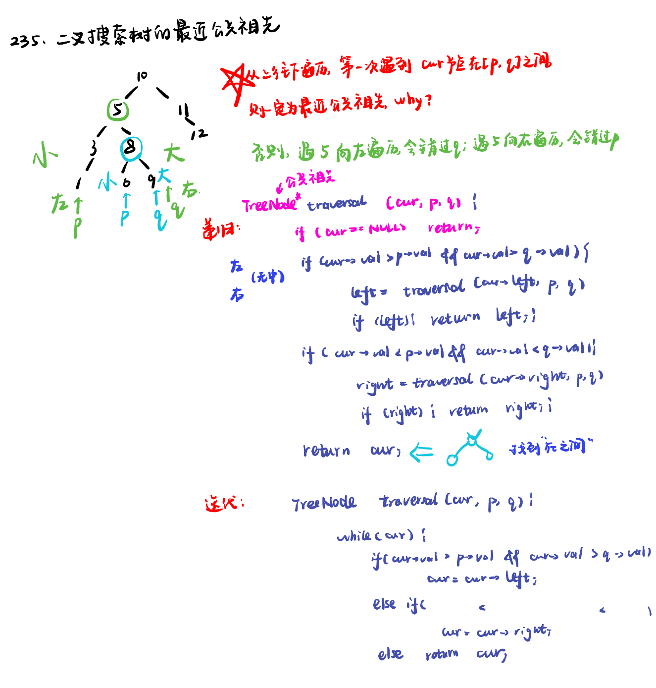
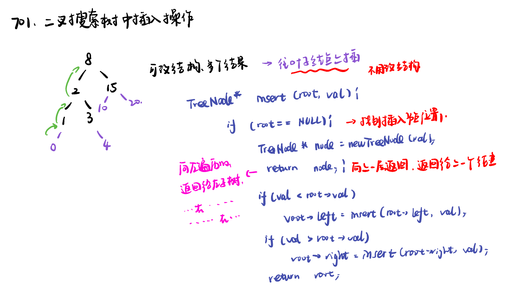
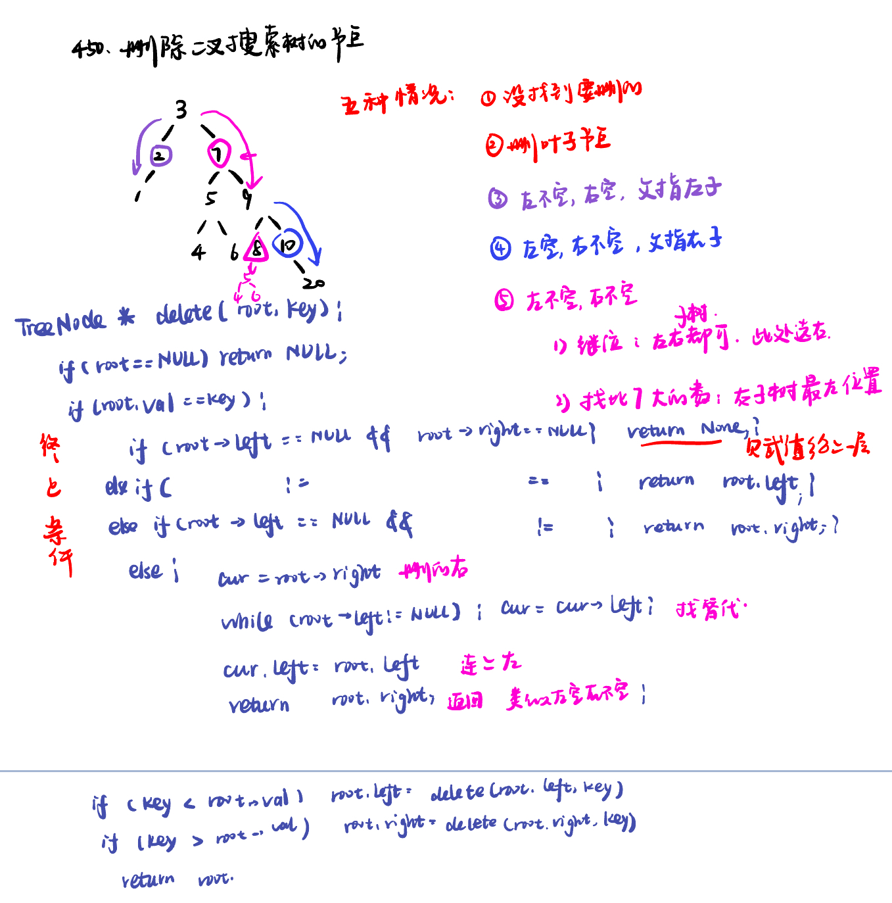

List: 235. 二叉搜索树的最近公共祖先，701.二叉搜索树中的插入操作，450.删除二叉搜索树中的节点

[235. 二叉搜索树的最近公共祖先lowest-common-ancestor-of-a-binary-search-tree](#01)，[701.二叉搜索树中的插入操作insert-into-a-binary-search-tree](#02)，[450.删除二叉搜索树中的节点delete-node-in-a-bst](#03)

# <span id="01">235. 二叉搜索树的最近公共祖先lowest-common-ancestor-of-a-binary-search-tree</span>

[Leetcode](https://leetcode.cn/problems/lowest-common-ancestor-of-a-binary-search-tree/description/) 

[Learning Materials](https://programmercarl.com/0235.%E4%BA%8C%E5%8F%89%E6%90%9C%E7%B4%A2%E6%A0%91%E7%9A%84%E6%9C%80%E8%BF%91%E5%85%AC%E5%85%B1%E7%A5%96%E5%85%88.html)



## 递归法：

```python
# Definition for a binary tree node.
# class TreeNode:
#     def __init__(self, x):
#         self.val = x
#         self.left = None
#         self.right = None

class Solution:
    def lowestCommonAncestor(self, root: 'TreeNode', p: 'TreeNode', q: 'TreeNode') -> 'TreeNode':
        def traversal(cur, p, q):
            if not cur:
                return
            if cur.val > p.val and cur.val > q.val:
                left = traversal(cur.left, p, q) 
                if left:
                    return left
            if cur.val < p.val and cur.val < q.val:
                right = traversal(cur.right, p, q)
                if right:
                    return right
            return cur
        return traversal(root, p, q)
```

## 迭代法：

```python
# Definition for a binary tree node.
# class TreeNode:
#     def __init__(self, x):
#         self.val = x
#         self.left = None
#         self.right = None

class Solution:
    def lowestCommonAncestor(self, root: 'TreeNode', p: 'TreeNode', q: 'TreeNode') -> 'TreeNode':
        while root:
            if root.val > p.val and root.val > q.val:
                root = root.left
            elif root.val < p.val and root.val < q.val:
                root = root.right
            else:
                return root
        return None
```

# <span id="02">701.二叉搜索树中的插入操作insert-into-a-binary-search-tree</span>

[Leetcode](https://leetcode.cn/problems/insert-into-a-binary-search-tree/description/) 

[Learning Materials](https://programmercarl.com/0701.%E4%BA%8C%E5%8F%89%E6%90%9C%E7%B4%A2%E6%A0%91%E4%B8%AD%E7%9A%84%E6%8F%92%E5%85%A5%E6%93%8D%E4%BD%9C.html#%E7%AE%97%E6%B3%95%E5%85%AC%E5%BC%80%E8%AF%BE)



## 递归法：

```python
# Definition for a binary tree node.
# class TreeNode:
#     def __init__(self, val=0, left=None, right=None):
#         self.val = val
#         self.left = left
#         self.right = right
class Solution:
    def insertIntoBST(self, root: Optional[TreeNode], val: int) -> Optional[TreeNode]:
        if not root:
            node = TreeNode(val)
            return node
        if root.val > val:
            root.left = self.insertIntoBST(root.left, val)
        if root.val < val:
            root.right = self.insertIntoBST(root.right, val)
        return root
```

## 迭代法：

在迭代法遍历的过程中，需要记录一下当前遍历的节点的父节点，这样才能做插入节点的操作。

```python
# Definition for a binary tree node.
# class TreeNode:
#     def __init__(self, val=0, left=None, right=None):
#         self.val = val
#         self.left = left
#         self.right = right
class Solution:
    def insertIntoBST(self, root: Optional[TreeNode], val: int) -> Optional[TreeNode]:
        if not root:
            node = TreeNode(val)
            return node
        cur = root
        parent = root
        while cur: # 需要记录上一个节点的值，否则无法赋值新节点
            parent = cur
            if cur.val > val:
                cur = cur.left
            else:
                cur = cur.right
        node = TreeNode(val)
        if val < parent.val:  # 赋值
            parent.left = node
        else:
            parent.right = node
        return root
```


# <span id="03">450.删除二叉搜索树中的节点delete-node-in-a-bst</span>

[Leetcode](https://leetcode.cn/problems/delete-node-in-a-bst/description/) 

[Learning Materials](https://programmercarl.com/0450.%E5%88%A0%E9%99%A4%E4%BA%8C%E5%8F%89%E6%90%9C%E7%B4%A2%E6%A0%91%E4%B8%AD%E7%9A%84%E8%8A%82%E7%82%B9.html#%E7%AE%97%E6%B3%95%E5%85%AC%E5%BC%80%E8%AF%BE)



# 递归法：

```python
# Definition for a binary tree node.
# class TreeNode:
#     def __init__(self, val=0, left=None, right=None):
#         self.val = val
#         self.left = left
#         self.right = right
class Solution:
    def deleteNode(self, root: Optional[TreeNode], key: int) -> Optional[TreeNode]:
        if not root:
            return
        if root.val == key:
            if not root.left and not root.right:
                return
            elif root.left and not root.right:
                return root.left
            elif not root.left and root.right:
                return root.right
            else:
                cur = root.right
                while cur.left:
                    cur = cur.left
                cur.left = root.left
                return root.right
        if key < root.val:
            root.left = self.deleteNode(root.left, key)
        if key > root.val:
            root.right = self.deleteNode(root.right,key)
        return root
```


## 迭代法：

### 题目概述
力扣 450 题“删除二叉搜索树中的节点”要求在给定的二叉搜索树（BST）中删除值为 `key` 的节点，并返回删除节点后的二叉搜索树的根节点。在删除节点时，需要保证删除操作后树仍然是一棵二叉搜索树。

### 代码思路详解

#### 整体思路
该代码采用迭代的方式先找到要删除的节点，然后通过一个辅助函数 `deleteOneNode` 来处理删除节点的逻辑，最后根据删除节点与父节点的关系更新父节点的指针。

#### 辅助函数 `deleteOneNode`
```python
def deleteOneNode (self, target: TreeNode) -> TreeNode:
    """
    将目标节点（删除节点）的左子树放到目标节点的右子树的最左面节点的左孩子位置上
    并返回目标节点右孩子为新的根节点
    """
    if not target:
        return
    if not target.right:
        return target.left
    cur = target.right
    while cur.left:
        cur = cur.left
    cur.left = target.left
    return target.right
```
- **功能**：该函数用于处理删除单个节点的逻辑。它的核心思想是将目标节点的左子树连接到目标节点右子树的最左节点的左孩子位置，然后返回目标节点的右子树作为新的子树的根节点。
- **具体步骤**：
    1. **处理目标节点为空的情况**：如果 `target` 为空，直接返回 `None`。
    2. **处理目标节点右子树为空的情况**：如果目标节点的右子树为空，直接返回其左子树。
    3. **找到目标节点右子树的最左节点**：使用 `while` 循环找到目标节点右子树的最左节点。
    4. **连接左子树**：将目标节点的左子树连接到最左节点的左孩子位置。
    5. **返回新的根节点**：返回目标节点的右子树作为新的子树的根节点。

#### 主函数 `deleteNode`
```python
def deleteNode(self, root: Optional[TreeNode], key: int) -> Optional[TreeNode]:
    if not root:
        return
    cur = root
    pre = None
    while cur:
        if cur.val == key:
            break
        pre = cur
        if cur.val > key:
            cur = cur.left
        else:
            cur = cur.right
    if not pre:
        return self.deleteOneNode(cur)
    if pre.left and pre.left.val == key:
        pre.left = self.deleteOneNode(cur)
    if pre.right and pre.right.val == key:
        pre.right = self.deleteOneNode(cur)
    return root
```
- **功能**：该函数用于在二叉搜索树中找到要删除的节点，并调用 `deleteOneNode` 函数进行删除操作。
- **具体步骤**：
    1. **处理根节点为空的情况**：如果根节点为空，直接返回 `None`。
    2. **寻找要删除的节点**：使用 `while` 循环遍历二叉搜索树，`cur` 指针指向当前节点，`pre` 指针指向 `cur` 的父节点。当 `cur.val == key` 时，找到要删除的节点，跳出循环。
    3. **处理要删除的节点是根节点的情况**：如果 `pre` 为空，说明要删除的节点是根节点，直接调用 `deleteOneNode` 函数处理，并返回处理后的结果。
    4. **处理要删除的节点不是根节点的情况**：根据 `cur` 是 `pre` 的左子节点还是右子节点，更新 `pre` 的相应指针。
    5. **返回根节点**：最后返回根节点。

### 复杂度分析
- **时间复杂度**：$O(h)$，其中 $h$ 是二叉搜索树的高度。在最坏情况下，二叉搜索树退化为链表，时间复杂度为 $O(n)$；在平均情况下，时间复杂度为 $O(\log n)$。
- **空间复杂度**：$O(1)$，只使用了常数级的额外空间。

### 示例
假设二叉搜索树如下：
```
    5
   / \
  3   6
 / \   \
2   4   7
```
要删除值为 3 的节点，具体步骤如下：
1. 找到值为 3 的节点，其父节点为 5。
2. 调用 `deleteOneNode` 函数处理值为 3 的节点：
    - 找到值为 3 的节点的右子树（值为 4）的最左节点（即 4 本身）。
    - 将值为 3 的节点的左子树（值为 2）连接到 4 的左孩子位置。
    - 返回值为 4 的节点作为新的子树的根节点。
3. 更新父节点 5 的左子节点为 4。
最终得到的二叉搜索树如下：
```
    5
   / \
  4   6
 /     \
2       7
```

通过这种方式，就完成了在二叉搜索树中删除指定节点的操作。


## 补充：普通二叉树的删除（C++）

```c++
class Solution {
public:
    TreeNode* deleteNode(TreeNode* root, int key) {
        if (root == nullptr) return root;
        if (root->val == key) {
            if (root->right == nullptr) { // 这里第二次操作目标值：最终删除的作用
                return root->left;
            }
            TreeNode *cur = root->right;
            while (cur->left) {
                cur = cur->left;
            }
            swap(root->val, cur->val); // 这里第一次操作目标值：交换目标值其右子树最左面节点。
        }
        root->left = deleteNode(root->left, key);
        root->right = deleteNode(root->right, key);
        return root;
    }
};
```
