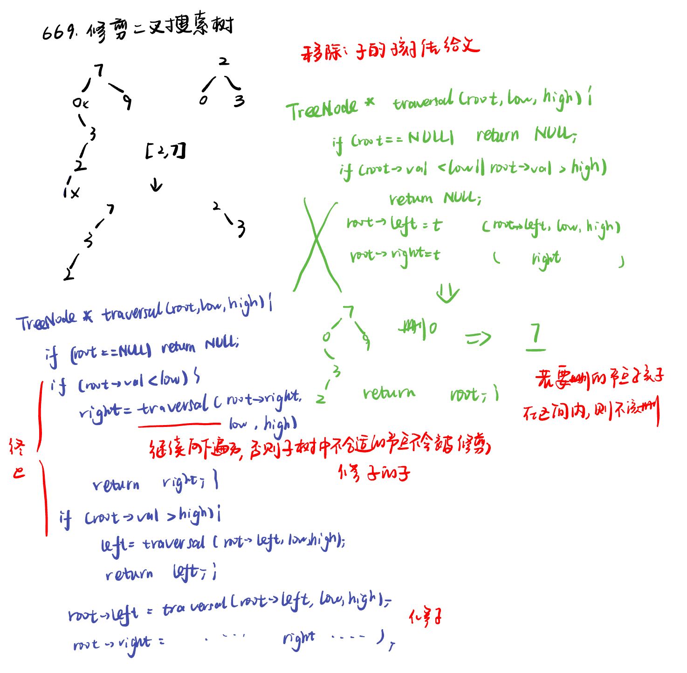
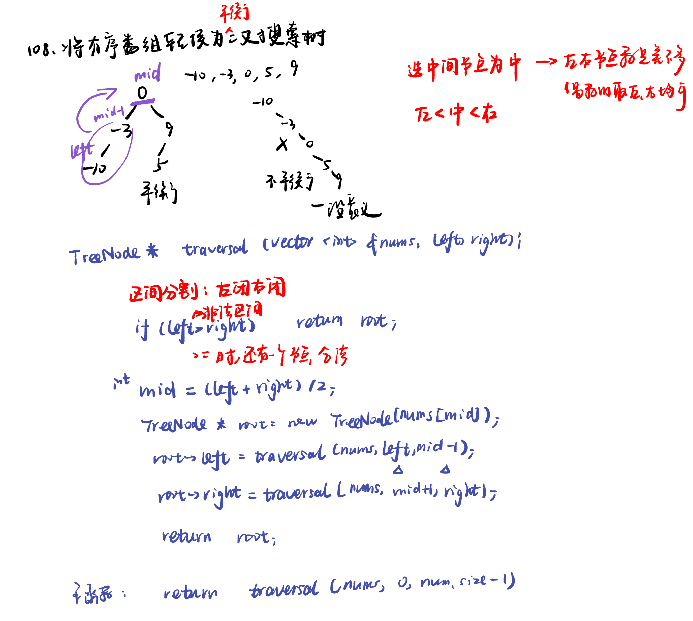
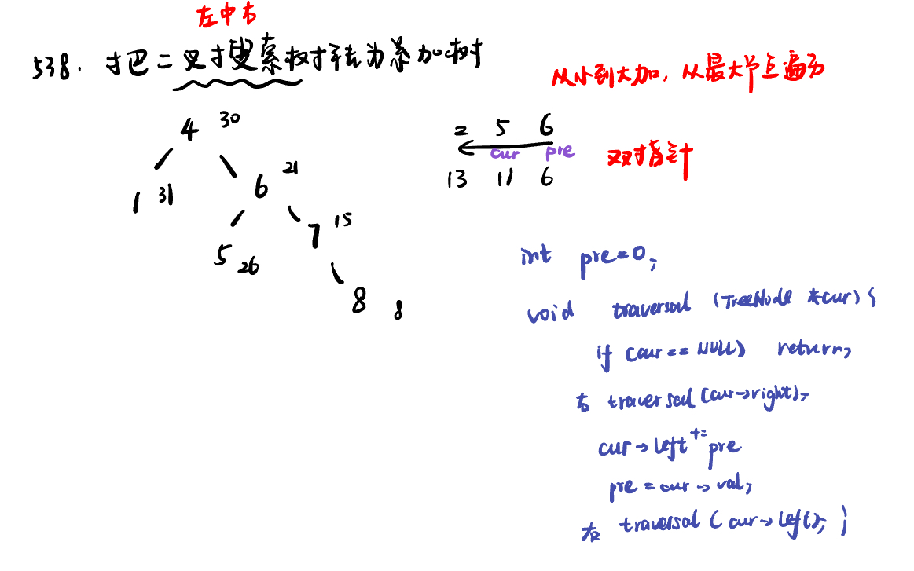

ist:  669. 修剪二叉搜索树，108.将有序数组转换为二叉搜索树，538.把二叉搜索树转换为累加树，538.把二叉搜索树转换为累加树

[669. 修剪二叉搜索树trim-a-binary-search-tree](#01)，[108.将有序数组转换为二叉搜索树convert-sorted-array-to-binary-search-tree](#02)，[538.把二叉搜索树转换为累加树convert-bst-to-greater-tree](#03)，[](#04)

# <span id="01">669. 修剪二叉搜索树trim-a-binary-search-tree</span>

[Leetcode](https://leetcode.cn/problems/trim-a-binary-search-tree/description/) 

[Learning Materials](https://programmercarl.com/0669.%E4%BF%AE%E5%89%AA%E4%BA%8C%E5%8F%89%E6%90%9C%E7%B4%A2%E6%A0%91.html)



```python
class TreeNode:
    def __init__(self, val, left = None, right = None):
        self.val = val
        self.left = left
        self.right = right
```

## 递归法：

因为二叉搜索树的有序性，不需要使用栈模拟递归的过程。

在剪枝的时候，可以分为三步：

将root移动到[L, R] 范围内，注意是左闭右闭区间

剪枝左子树

剪枝右子树

```python
# Definition for a binary tree node.
# class TreeNode:
#     def __init__(self, val=0, left=None, right=None):
#         self.val = val
#         self.left = left
#         self.right = right
class Solution:
    def trimBST(self, root: Optional[TreeNode], low: int, high: int) -> Optional[TreeNode]:
        if not root:
            return 
        if root.val < low:
            right = self.trimBST(root.right, low, high)
            return right
        if root.val > high:
            left = self.trimBST(root.left, low, high)
            return left
        root.left = self.trimBST(root.left, low, high)
        root.right = self.trimBST(root.right, low, high)
        return root
```

## 迭代法：

```python
# Definition for a binary tree node.
# class TreeNode:
#     def __init__(self, val=0, left=None, right=None):
#         self.val = val
#         self.left = left
#         self.right = right
class Solution:
    def trimBST(self, root: Optional[TreeNode], low: int, high: int) -> Optional[TreeNode]:
        if not root:
            return 
        
        # 处理头结点，让root移动到[L, R] 范围内，注意是左闭右闭
        while root and (root.val < low or root.val > high): #不在区间就继续找
            if root.val < low:
                root = root.right # 二叉搜索有序，小于L往右走
            else:
                root = root.left # 二叉搜索有序，大于R往左走
        
        cur = root
        #此时root已经在[L, R] 范围内，处理左孩子元素小于L的情况
        while cur:
            while cur.left and cur.left.val < low:
                cur.left = cur.left.right  #确保把当前节点左子树中所有值小于 low 的节点都修剪掉
            cur = cur.left   # 检查新的左子树

        cur = root # 回退
        #此时root已经在[L, R] 范围内，处理右孩子元素大于L的情况
        while cur:
            while cur.right and cur.right.val > high:
                cur.right = cur.right.left
            cur = cur.right

        return root

        
```

# <span id="02">108.将有序数组转换为二叉搜索树convert-sorted-array-to-binary-search-tree</span>

[Leetcode](https://leetcode.cn/problems/convert-sorted-array-to-binary-search-tree/description/) 

[Learning Materials](https://programmercarl.com/0108.%E5%B0%86%E6%9C%89%E5%BA%8F%E6%95%B0%E7%BB%84%E8%BD%AC%E6%8D%A2%E4%B8%BA%E4%BA%8C%E5%8F%89%E6%90%9C%E7%B4%A2%E6%A0%91.html#%E7%AE%97%E6%B3%95%E5%85%AC%E5%BC%80%E8%AF%BE)



## 递归法：

```python
# Definition for a binary tree node.
# class TreeNode:
#     def __init__(self, val=0, left=None, right=None):
#         self.val = val
#         self.left = left
#         self.right = right
class Solution:
    def traversal(self, nums, left, right):
        if left > right:
            return
        mid = (left +  right) // 2
        root = TreeNode(nums[mid])
        root.left = self.traversal(nums, left, mid - 1)
        root.right = self.traversal(nums, mid + 1, right)
        return root
    def sortedArrayToBST(self, nums: List[int]) -> Optional[TreeNode]:
        return self.traversal(nums, 0, len(nums) - 1)
```

## 迭代法：

```python
# Definition for a binary tree node.
# class TreeNode:
#     def __init__(self, val=0, left=None, right=None):
#         self.val = val
#         self.left = left
#         self.right = right
class Solution:
    def sortedArrayToBST(self, nums: List[int]) -> Optional[TreeNode]:
        if len(nums) == 0:
            return None
        
        root = TreeNode(0) # 初始根节点
        nodeQue = deque() # 放遍历的节点
        leftQue = deque() # 保存左区间下标
        rightQue = deque() # 保存右区间下标

        nodeQue.append(root)  # 根节点入队列
        leftQue.append(0) # 0为左区间下标初始位置
        rightQue.append(len(nums) - 1) # len(nums) - 1为右区间下标初始位置

        while nodeQue:
            cur = nodeQue.popleft()
            left = leftQue.popleft()
            right = rightQue.popleft()
            mid = left + (right - left) // 2

            cur.val = nums[mid] # 把mid传给中间节点

            if left <= mid - 1:  # 处理左区间
                cur.left = TreeNode(0)
                nodeQue.append(cur.left)
                leftQue.append(left)
                rightQue.append(mid - 1)

            if right >= mid + 1: # 处理右区间
                cur.right = TreeNode(0)
                nodeQue.append(cur.right)
                leftQue.append(mid + 1)
                rightQue.append(right)

        return root
```


# <span id="03">538.把二叉搜索树转换为累加树convert-bst-to-greater-tree</span>

[Leetcode](https://leetcode.cn/problems/convert-bst-to-greater-tree/description/) 

[Learning Materials](https://programmercarl.com/0538.%E6%8A%8A%E4%BA%8C%E5%8F%89%E6%90%9C%E7%B4%A2%E6%A0%91%E8%BD%AC%E6%8D%A2%E4%B8%BA%E7%B4%AF%E5%8A%A0%E6%A0%91.html#%E7%AE%97%E6%B3%95%E5%85%AC%E5%BC%80%E8%AF%BE)



## 递归法：

```python
# Definition for a binary tree node.
# class TreeNode:
#     def __init__(self, val=0, left=None, right=None):
#         self.val = val
#         self.left = left
#         self.right = right
class Solution:
    def __init__(self):
        self.pre = 0
    def convertBST(self, root: Optional[TreeNode]) -> Optional[TreeNode]:
        if not root:
            return
        self.convertBST(root.right)
        root.val += self.pre
        self.pre = root.val
        self.convertBST(root.left)
        return root
```

## 迭代法：


```python
# Definition for a binary tree node.
# class TreeNode:
#     def __init__(self, val=0, left=None, right=None):
#         self.val = val
#         self.left = left
#         self.right = right
class Solution:
    def convertBST(self, root: Optional[TreeNode]) -> Optional[TreeNode]:
        st = []
        cur = root
        pre = 0
        while cur or st:
            if cur:
                st.append(cur)
                cur = cur.right
            else:
                cur = st.pop()
                cur.val += pre
                pre = cur.val
                cur = cur.left
        return root
```

# <span id="04">理论基础</span>

[Learning Materials](https://programmercarl.com/%E4%BA%8C%E5%8F%89%E6%A0%91%E6%80%BB%E7%BB%93%E7%AF%87.html#%E9%98%B6%E6%AE%B5%E6%80%BB%E7%BB%93)

涉及到二叉树的构造，无论普通二叉树还是二叉搜索树一定前序，都是先构造中节点。

求普通二叉树的属性，一般是后序，一般要通过递归函数的返回值做计算。

求二叉搜索树的属性，一定是中序了，要不白瞎了有序性了。

