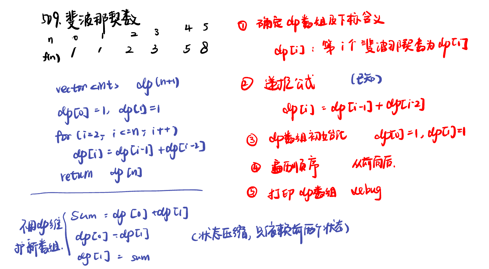
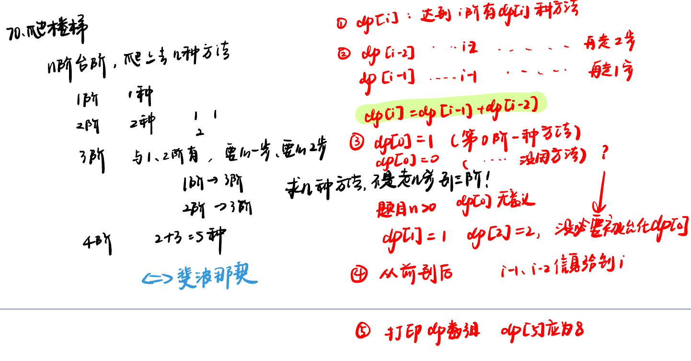
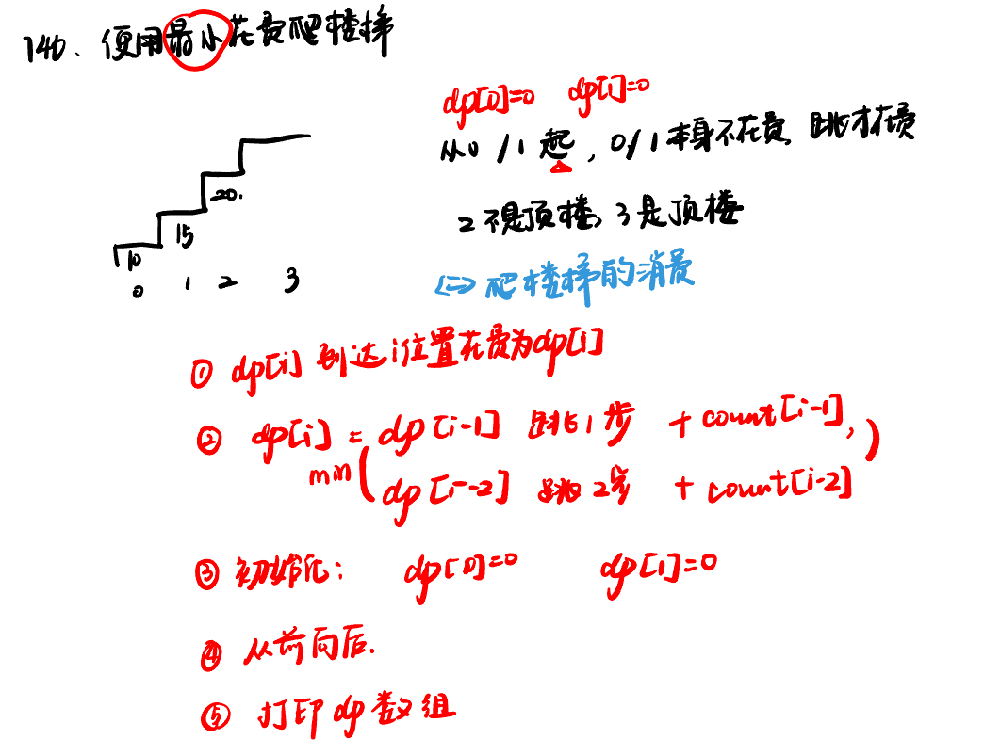

List: 理论基础，509. 斐波那契数，70. 爬楼梯，746. 使用最小花费爬楼梯 


[理论基础](#01)，[509.斐波那契数fibonacci-number](#02)，[70. 爬楼梯climbing-stairs](#03)，[746. 使用最小花费爬楼梯min-cost-climbing-stairs](#04)

# <span id="01">理论基础</span>


[Learning Materials](https://programmercarl.com/%E5%8A%A8%E6%80%81%E8%A7%84%E5%88%92%E7%90%86%E8%AE%BA%E5%9F%BA%E7%A1%80.html)


# <span id="02">509.斐波那契数fibonacci-number</span>

[Leetcode](https://leetcode.cn/problems/fibonacci-number/) 

[Learning Materials](https://programmercarl.com/0509.%E6%96%90%E6%B3%A2%E9%82%A3%E5%A5%91%E6%95%B0.html#%E7%AE%97%E6%B3%95%E5%85%AC%E5%BC%80%E8%AF%BE)



```python
class Solution:
    def fib(self, n: int) -> int:
        dp = [0] * (n + 1)
        dp[0] = 0
        if n >= 1:
            dp[1] = 1
        for i in range(2, n + 1):
            dp[i] = dp[i - 1] + dp[i - 2]
        return dp[n]
```

# <span id="03">70. 爬楼梯climbing-stairs</span>

[Leetcode](https://leetcode.cn/problems/climbing-stairs/description/) 

[Learning Materials](https://programmercarl.com/0070.爬楼梯.html#算法公开课)



```python
class Solution:
    def climbStairs(self, n: int) -> int:
        if n == 1:
            return 1
        if n == 2:
            return 2
        dp = [0] * (n + 1)
        dp[1] = 1
        dp[2] = 2
        for i in range(3, n + 1):
            dp[i] = dp[i - 1] + dp[i - 2]
        return dp[n]
```

# <span id="03">746. 使用最小花费爬楼梯min-cost-climbing-stairs</span>

[Leetcode](https://leetcode.cn/problems/min-cost-climbing-stairs/description/) 

[Learning Materials](https://programmercarl.com/0746.%E4%BD%BF%E7%94%A8%E6%9C%80%E5%B0%8F%E8%8A%B1%E8%B4%B9%E7%88%AC%E6%A5%BC%E6%A2%AF.html#%E7%AE%97%E6%B3%95%E5%85%AC%E5%BC%80%E8%AF%BE)



```python
class Solution:
    def minCostClimbingStairs(self, cost: List[int]) -> int:
        dp = [0] * (len(cost) + 1)
        for i in range(2, len(cost) + 1):
            dp[i] = min(dp[i - 1] + cost[i - 1], dp[i - 2] + cost[i - 2])
        return dp[-1]
```


