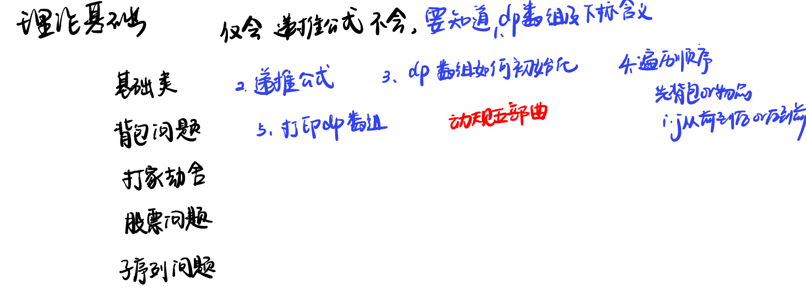

List: 理论基础，509. 斐波那契数，70. 爬楼梯，746. 使用最小花费爬楼梯 

[理论基础](#01)，，，,

# 理论基础

[Learning Materials](https://programmercarl.com/%E5%8A%A8%E6%80%81%E8%A7%84%E5%88%92%E7%90%86%E8%AE%BA%E5%9F%BA%E7%A1%80.html)

# 理论基础

[Leetcode]() 

[Learning Materials]()

# 理论基础

[Leetcode]() 

[Learning Materials]()

# 理论基础

[Leetcode]() 

[Learning Materials]()

# 理论基础

[Leetcode]() 

[Learning Materials]()

