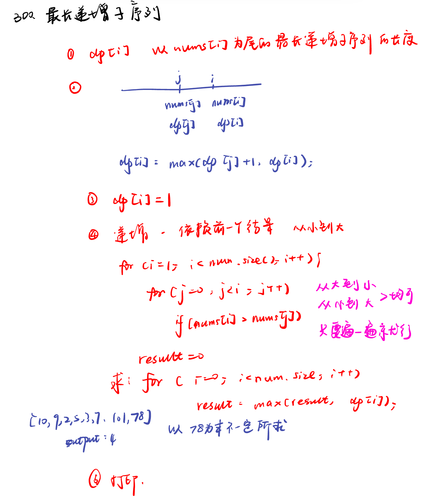
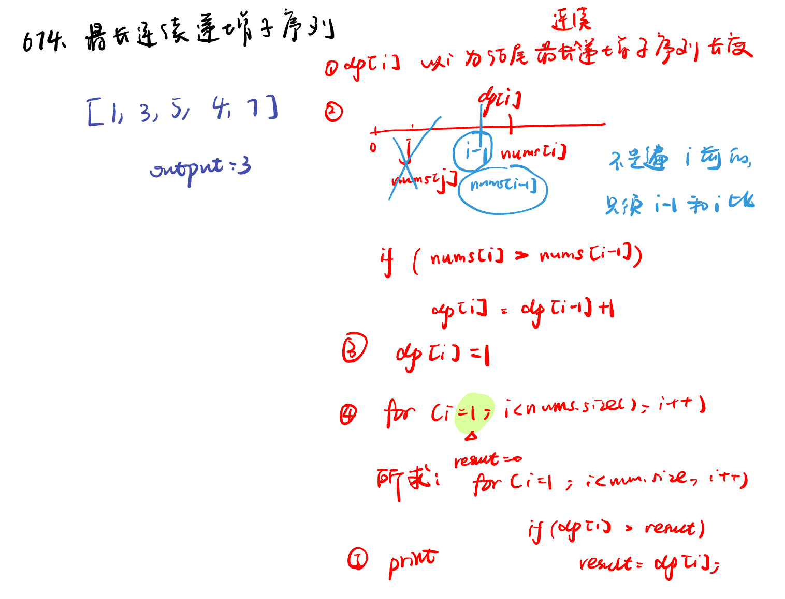
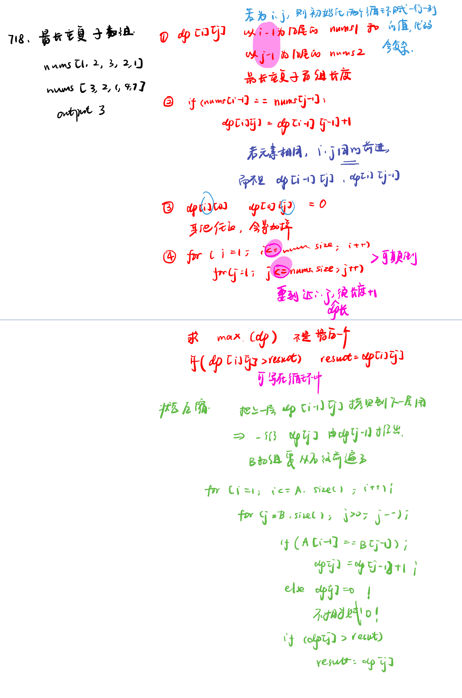

List: 300.最长递增子序列，674. 最长连续递增序列，718. 最长重复子数组

[300.最长递增子序列longest-increasing-subsequence](#01)，[674. 最长连续递增序列longest-continuous-increasing-subsequence](#02)，[718. 最长重复子数组maximum-length-of-repeated-subarray](#03)

# <span id="01">300.最长递增子序列longest-increasing-subsequence</span>

[Leetcode](https://leetcode.cn/problems/longest-increasing-subsequence/) 

[Learning Materials](https://programmercarl.com/0300.%E6%9C%80%E9%95%BF%E4%B8%8A%E5%8D%87%E5%AD%90%E5%BA%8F%E5%88%97.html#%E7%AE%97%E6%B3%95%E5%85%AC%E5%BC%80%E8%AF%BE)



```python
class Solution:
    def lengthOfLIS(self, nums: List[int]) -> int:
        dp = [1] * len(nums)
        for i in range(len(nums)):
            for j in range(i):
                if nums[i] > nums[j]:
                    dp[i] = max(dp[i], dp[j] + 1)
        return max(dp)
```

# <span id="02">674. 最长连续递增序列longest-continuous-increasing-subsequence</span>

[Leetcode](https://leetcode.cn/problems/longest-continuous-increasing-subsequence/description/) 

[Learning Materials](https://programmercarl.com/0674.%E6%9C%80%E9%95%BF%E8%BF%9E%E7%BB%AD%E9%80%92%E5%A2%9E%E5%BA%8F%E5%88%97.html#%E7%AE%97%E6%B3%95%E5%85%AC%E5%BC%80%E8%AF%BE)



```python
class Solution:
    def findLengthOfLCIS(self, nums: List[int]) -> int:
        dp = [1] * len(nums)
        for i in range(1, len(nums)):
            if nums[i] > nums[i - 1]:
                dp[i] = dp[i - 1] + 1
        return max(dp)
```

# <span id="03">718. 最长重复子数组maximum-length-of-repeated-subarray</span>

[Leetcode](https://leetcode.cn/problems/maximum-length-of-repeated-subarray/description/) 

[Learning Materials](https://programmercarl.com/0718.%E6%9C%80%E9%95%BF%E9%87%8D%E5%A4%8D%E5%AD%90%E6%95%B0%E7%BB%84.html)



```python
class Solution:
    def findLength(self, nums1: List[int], nums2: List[int]) -> int:
        dp = [[0] * (len(nums2) + 1) for _ in range(len(nums1) + 1)] # 注意行列顺序
        result = 0
        for i in range(1, len(nums1) + 1):
            for j in range(1, len(nums2) + 1):
                if nums1[i - 1] == nums2[j - 1]:
                    dp[i][j] = dp[i - 1][j - 1] + 1
                    if dp[i][j] > result:
                        result = dp[i][j]
        return result
```
