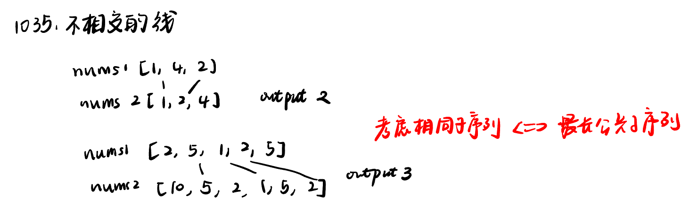
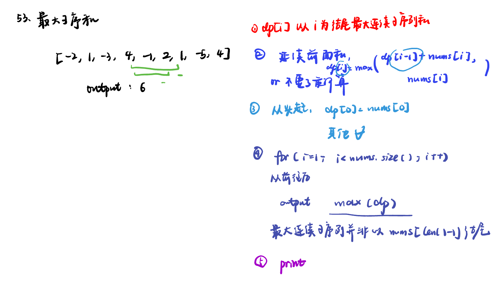
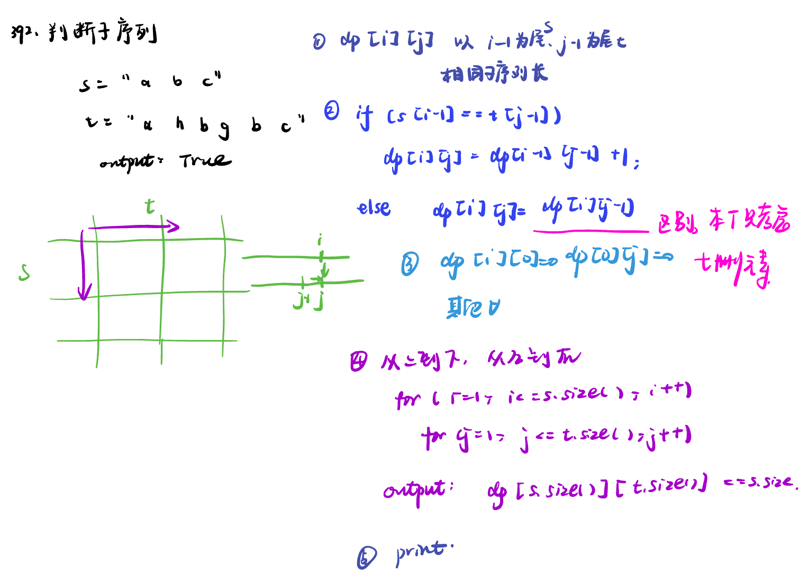

List: 1143.最长公共子序列，1035.不相交的线，53. 最大子序和，392.判断子序列


[1143.最长公共子序列longest-common-subsequence](#01)，[1035.不相交的线uncrossed-lines](#02)，[53. 最大子序和maximum-subarray](#03)，[392.判断子序列is-subsequence](#04)

# <span id="01">1143.最长公共子序列longest-common-subsequence</span>

[Leetcode](https://leetcode.cn/problems/longest-common-subsequence/description/) 

[Learning Materials](https://programmercarl.com/1143.%E6%9C%80%E9%95%BF%E5%85%AC%E5%85%B1%E5%AD%90%E5%BA%8F%E5%88%97.html#%E7%AE%97%E6%B3%95%E5%85%AC%E5%BC%80%E8%AF%BE)


```python
class Solution:
    def longestCommonSubsequence(self, text1: str, text2: str) -> int:
        dp = [[0] * (len(text2) + 1) for _ in range(len(text1) + 1)]
        for i in range(1, len(text1) + 1):
            for j in range(1, len(text2) + 1):
                if text1[i - 1] == text2[j - 1]:
                    dp[i][j] = dp[i - 1][j - 1] + 1
                else:
                    dp[i][j] = max(dp[i - 1][j], dp[i][j - 1])
        return dp[len(text1)][len(text2)]
```

# <span id="02">1035.不相交的线uncrossed-lines</span>

[Leetcode](https://leetcode.cn/problems/uncrossed-lines/description/) 

[Learning Materials](https://programmercarl.com/1035.%E4%B8%8D%E7%9B%B8%E4%BA%A4%E7%9A%84%E7%BA%BF.html)



- 和上一题完全一样

```python
class Solution:
    def maxUncrossedLines(self, nums1: List[int], nums2: List[int]) -> int:
        dp = [[0] * (len(nums2) + 1) for _ in range(len(nums1) + 1)]
        for i in range(1, len(nums1) + 1):
            for j in range(1, len(nums2) + 1):
                if nums1[i - 1] == nums2[j - 1]:
                    dp[i][j] = dp[i - 1][j - 1] + 1
                else:
                    dp[i][j] = max(dp[i - 1][j], dp[i][j - 1])
        return dp[len(nums1)][len(nums2)]
```

# <span id="03">53. 最大子序和maximum-subarray</span>

[Leetcode](https://leetcode.cn/problems/maximum-subarray/description/) 

[Learning Materials](https://programmercarl.com/0053.%E6%9C%80%E5%A4%A7%E5%AD%90%E5%BA%8F%E5%92%8C%EF%BC%88%E5%8A%A8%E6%80%81%E8%A7%84%E5%88%92%EF%BC%89.html)



```python
class Solution:
    def maxSubArray(self, nums: List[int]) -> int:
        dp = [0] * len(nums)
        dp[0] = nums[0]
        for i in range(1, len(nums)):
            dp[i] = max(dp[i - 1] + nums[i], nums[i])
        return max(dp)
```

# <span id="04">392.判断子序列is-subsequence</span>

[Leetcode](https://leetcode.cn/problems/is-subsequence/description/) 

[Learning Materials](https://programmercarl.com/0392.%E5%88%A4%E6%96%AD%E5%AD%90%E5%BA%8F%E5%88%97.html)



```python
class Solution:
    def isSubsequence(self, s: str, t: str) -> bool:
        dp = [[0] * (len(t) + 1) for _ in range(len(s) + 1)]
        for i in range(1, len(s) + 1):
            for j in range(1, len(t) + 1):
                if s[i - 1] == t[j - 1]:
                    dp[i][j] = dp[i - 1][j - 1] + 1
                else:
                    dp[i][j] = dp[i][j - 1]
        return dp[len(s)][len(t)] == len(s)
```
