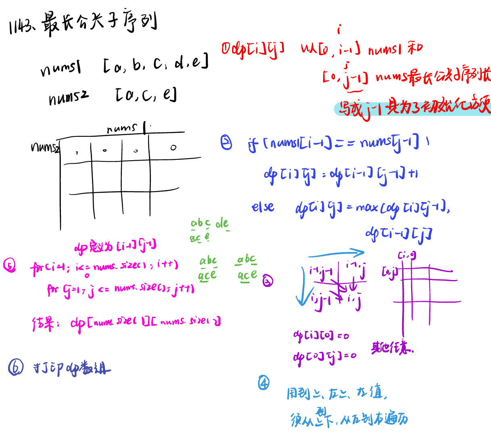

List: 1143.最长公共子序列，1035.不相交的线，53. 最大子序和，392.判断子序列


[1143.最长公共子序列longest-common-subsequence](#01)，[](#02)，[](#03)，[](#04),[](#05)

# <span id="01">1143.最长公共子序列longest-common-subsequence</span>

[Leetcode](https://leetcode.cn/problems/longest-common-subsequence/description/) 

[Learning Materials](https://programmercarl.com/1143.%E6%9C%80%E9%95%BF%E5%85%AC%E5%85%B1%E5%AD%90%E5%BA%8F%E5%88%97.html#%E7%AE%97%E6%B3%95%E5%85%AC%E5%BC%80%E8%AF%BE)



```python
class TreeNode:
    def __init__(self, val, left = None, right = None):
        self.val = val
        self.left = left
        self.right = right
```

# <span id="02">理论基础</span>

[Leetcode]() 

[Learning Materials]()


# <span id="03">理论基础</span>

[Leetcode]() 

[Learning Materials]()


# <span id="04">理论基础</span>

[Leetcode]() 

[Learning Materials]()


# <span id="05">理论基础</span>

[Leetcode]() 

[Learning Materials]()


