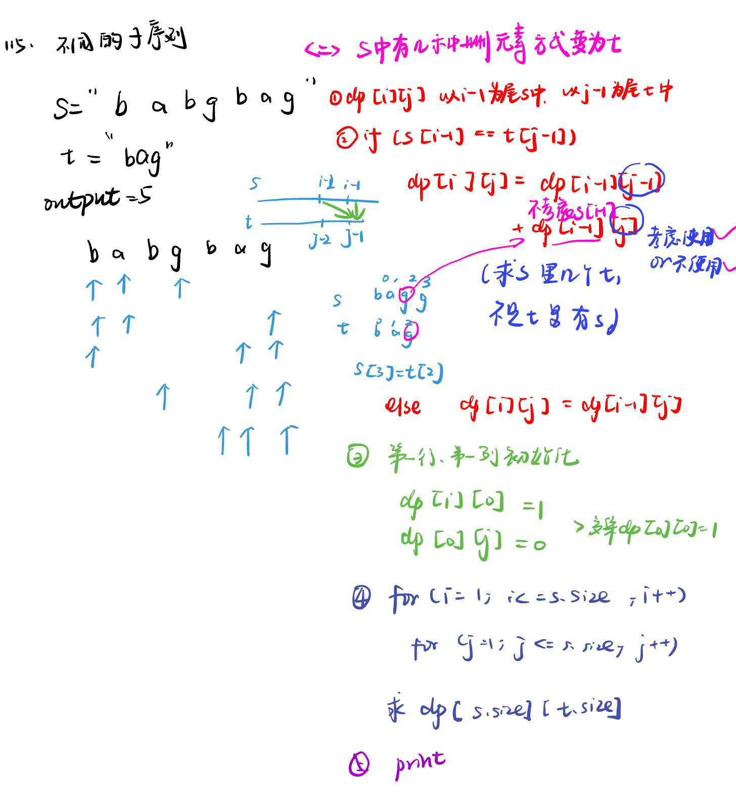
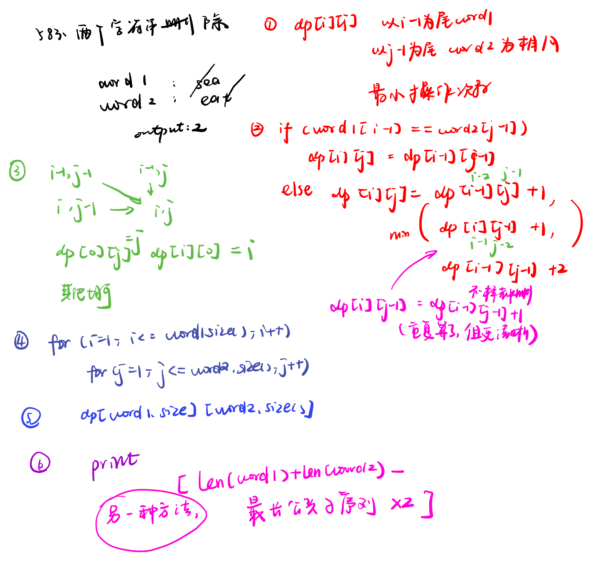
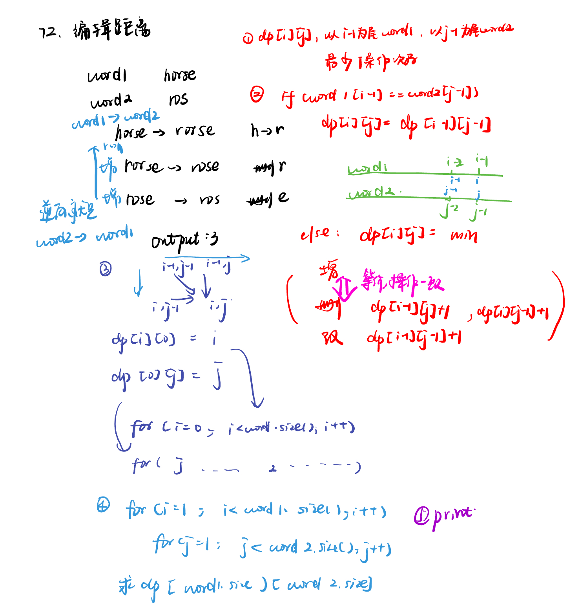

List: 115.不同的子序列，583. 两个字符串的删除操作，72. 编辑距离，编辑距离总结篇 

[115.不同的子序列distinct-subsequences](#01)，[583. 两个字符串的删除操作delete-operation-for-two-strings](#02)，[72. 编辑距离edit-distance](#03)，[](#04)

# <span id="01">115.不同的子序列distinct-subsequences</span>

[Leetcode](https://leetcode.cn/problems/distinct-subsequences/) 

[Learning Materials](https://programmercarl.com/0115.%E4%B8%8D%E5%90%8C%E7%9A%84%E5%AD%90%E5%BA%8F%E5%88%97.html#%E7%AE%97%E6%B3%95%E5%85%AC%E5%BC%80%E8%AF%BE)



```python
class Solution:
    def numDistinct(self, s: str, t: str) -> int:
        dp = [[0] * (len(t) + 1) for _ in range(len(s) + 1)]
        for i in range(len(s) + 1):
            dp[i][0] = 1
        for i in range(1, len(s) + 1):
            for j in range(1, len(t) + 1):
                if s[i - 1] == t[j - 1]:
                    dp[i][j] = dp[i - 1][j] + dp[i - 1][j - 1]
                else:
                    dp[i][j] = dp[i - 1][j]
        return dp[len(s)][len(t)]
```

# <span id="02">583. 两个字符串的删除操作delete-operation-for-two-strings</span>

[Leetcode](https://leetcode.cn/problems/delete-operation-for-two-strings/description/) 

[Learning Materials](https://programmercarl.com/0583.%E4%B8%A4%E4%B8%AA%E5%AD%97%E7%AC%A6%E4%B8%B2%E7%9A%84%E5%88%A0%E9%99%A4%E6%93%8D%E4%BD%9C.html#%E7%AE%97%E6%B3%95%E5%85%AC%E5%BC%80%E8%AF%BE)



```python
class Solution:
    def minDistance(self, word1: str, word2: str) -> int:
        dp = [[0] * (len(word2) + 1) for _ in range(len(word1) + 1)]
        for i in range(len(word1) + 1):
            dp[i][0] = i
        for j in range(len(word2) + 1):
            dp[0][j] = j
        for i in range(1, len(word1) + 1):
            for j in range(1, len(word2) + 1):
                if word1[i - 1] == word2[j - 1]:
                    dp[i][j] = dp[i - 1][j - 1]
                else:
                    dp[i][j] = min(dp[i - 1][j] + 1, dp[i][j - 1] + 1, dp[i - 1][j - 1] + 2)
        return dp[len(word1)][len(word2)]
  ```
  
## 方法二：用最长公共子序列方法

```python
class Solution:
    def minDistance(self, word1: str, word2: str) -> int:
        dp = [[0] * (len(word2) + 1) for _ in range(len(word1) + 1)]
        for i in range(1, len(word1) + 1):
            for j in range(1, len(word2) + 1):
                if word1[i - 1] == word2[j - 1]:
                    dp[i][j] = dp[i - 1][j - 1] + 1
                else:
                    dp[i][j] = max(dp[i - 1][j], dp[i][j - 1])
        return len(word1) + len(word2) - dp[len(word1)][len(word2)] * 2
```

# <span id="03">72. 编辑距离edit-distance</span>

[Leetcode](https://leetcode.cn/problems/edit-distance/description/) 

[Learning Materials](https://programmercarl.com/0072.%E7%BC%96%E8%BE%91%E8%B7%9D%E7%A6%BB.html)



```python
class Solution:
    def minDistance(self, word1: str, word2: str) -> int:
        dp = [[0] * (len(word2) + 1) for _ in range(len(word1) + 1)]
        for i in range(len(word1) + 1):
            dp[i][0] = i
        for j in range(len(word2) + 1):
            dp[0][j] = j
        for i in range(1, len(word1) + 1):
            for j in range(1, len(word2) + 1):
                if word1[i - 1] == word2[j - 1]:
                    dp[i][j] = dp[i - 1][j - 1]
                else:
                    dp[i][j] = min(dp[i - 1][j] + 1, dp[i][j - 1] + 1, dp[i - 1][j - 1] + 1)
        return dp[len(word1)][len(word2)]
```

# <span id="04">编辑距离总结</span>


### 动态规划之编辑距离知识点总结

#### 1. **判断子序列（LeetCode 392）**
- **问题**：判断字符串 `s` 是否为 `t` 的子序列。
- **解法**：
  - **动态规划**：定义 `dp[i][j]` 表示 `s` 的前 `i` 个字符和 `t` 的前 `j` 个字符的最长公共子序列长度。
  - **状态转移**：
    - 若 `s[i-1] == t[j-1]`，则 `dp[i][j] = dp[i-1][j-1] + 1`（匹配当前字符）。
    - 否则，`dp[i][j] = dp[i][j-1]`（删除 `t` 中的字符）。
  - **关键点**：仅需考虑删除操作，无需替换或插入。

#### 2. **不同的子序列（LeetCode 115）**
- **问题**：计算字符串 `s` 的子序列中 `t` 出现的个数。
- **解法**：
  - **动态规划**：定义 `dp[i][j]` 表示 `s` 的前 `i` 个字符中 `t` 的前 `j` 个字符的子序列个数。
  - **状态转移**：
    - 若 `s[i-1] == t[j-1]`，则 `dp[i][j] = dp[i-1][j-1] + dp[i-1][j]`（匹配当前字符或不匹配）。
    - 否则，`dp[i][j] = dp[i-1][j]`（不匹配当前字符）。
  - **关键点**：相同字符时需累加两种情况（匹配与不匹配）。

#### 3. **两个字符串的删除操作（LeetCode 583）**
- **问题**：求两个字符串通过删除操作变为相同的最少步数。
- **解法**：
  - **动态规划**：定义 `dp[i][j]` 表示 `word1` 前 `i` 个字符和 `word2` 前 `j` 个字符的最少删除次数。
  - **状态转移**：
    - 若 `word1[i-1] == word2[j-1]`，则 `dp[i][j] = dp[i-1][j-1]`（无需删除）。
    - 否则，`dp[i][j] = min(dp[i-1][j-1]+2, dp[i-1][j]+1, dp[i][j-1]+1)`（删除其中一个或两个字符）。
  - **关键点**：删除操作可双向选择，取最小值。

#### 4. **编辑距离（LeetCode 72）**
- **问题**：求将 `word1` 转换为 `word2` 的最少操作数（增删改）。
- **解法**：
  - **动态规划**：定义 `dp[i][j]` 表示 `word1` 前 `i` 个字符转换为 `word2` 前 `j` 个字符的最少操作数。
  - **状态转移**：
    - 若 `word1[i-1] == word2[j-1]`，则 `dp[i][j] = dp[i-1][j-1]`（无需操作）。
    - 否则，`dp[i][j] = min(dp[i-1][j-1], dp[i-1][j], dp[i][j-1]) + 1`（替换、删除或插入）。
  - **关键点**：需考虑增删改三种操作，取最小值加一。

#### 总结
- **共性**：均使用动态规划，通过二维数组 `dp[i][j]` 记录状态。
- **差异**：根据操作类型（增删改）调整状态转移方程：
  - **判断子序列**：仅删除。
  - **不同的子序列**：仅删除，但需累加计数。
  - **删除操作**：双向删除。
  - **编辑距离**：增删改综合处理。

