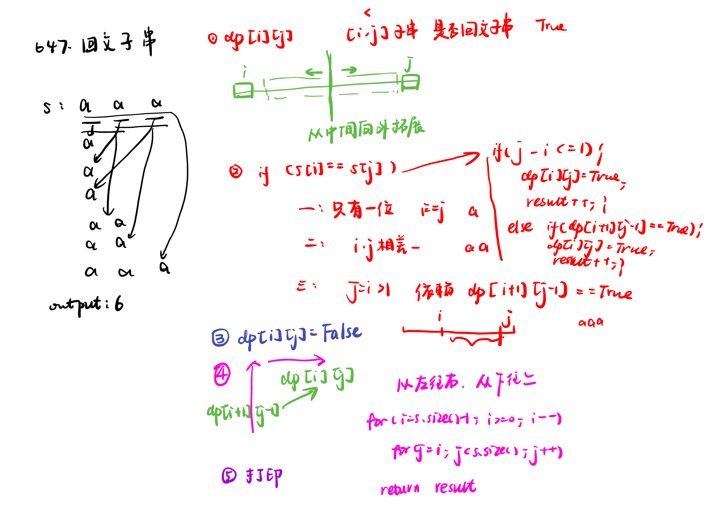
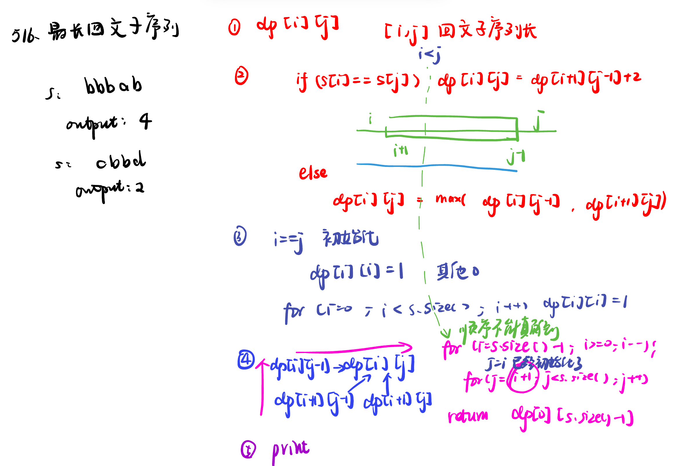

List: 647. 回文子串，516.最长回文子序列，动态规划总结

[647. 回文子串palindromic-substrings](#01)，[](#02)，[](#03)

# <span id="01">647. 回文子串palindromic-substrings</span>

[Leetcode](https://leetcode.cn/problems/palindromic-substrings/) 

[Learning Materials](https://programmercarl.com/0647.%E5%9B%9E%E6%96%87%E5%AD%90%E4%B8%B2.html)



```python
class Solution:
    def countSubstrings(self, s: str) -> int:
        dp = [[False] * len(s) for _ in range(len(s))]
        result = 0
        for i in range(len(s) - 1, -1, -1):
            for j in range(i, len(s)):
                if s[i] == s[j]:
                    if j - i <= 1:
                        dp[i][j] = True
                        result += 1
                    elif dp[i + 1][j - 1] == True:
                        dp[i][j] = True
                        result += 1
        return result
```

## 双指针法：

```python
class Solution:
    def countSubstrings(self, s: str) -> int:
        result = 0
        for i in range(len(s)):
            result += self.extend(s, i, i, len(s)) #以i为中心
            result += self.extend(s, i, i+1, len(s)) #以i和i+1为中心
        return result
    
    def extend(self, s, i, j, n):
        res = 0
        while i >= 0 and j < n and s[i] == s[j]:
            i -= 1
            j += 1
            res += 1
        return res
```

# <span id="02">516.最长回文子序列longest-palindromic-subsequence</span>

[Leetcode](https://leetcode.cn/problems/longest-palindromic-subsequence/description/) 

[Learning Materials](https://programmercarl.com/0516.%E6%9C%80%E9%95%BF%E5%9B%9E%E6%96%87%E5%AD%90%E5%BA%8F%E5%88%97.html#%E7%AE%97%E6%B3%95%E5%85%AC%E5%BC%80%E8%AF%BE)



```python
class Solution:
    def longestPalindromeSubseq(self, s: str) -> int:
        dp = [[0] * len(s) for _ in range(len(s))]
        for i in range(len(s)):
            dp[i][i] = 1
        for i in range(len(s) - 1, -1, -1):
            for j in range(i + 1, len(s)):
                if s[i] == s[j]:
                    dp[i][j] = dp[i + 1][j - 1] + 2
                else:
                    dp[i][j] = max(dp[i + 1][j], dp[i][j - 1])
        return dp[0][len(s) - 1]
```

# <span id="03">动态规划总结</span>


[Learning Materials](https://programmercarl.com/%E5%8A%A8%E6%80%81%E8%A7%84%E5%88%92%E6%80%BB%E7%BB%93%E7%AF%87.html)

- **基础题目**：以斐波那契数、爬楼梯等为代表，是理解动态规划基本概念和方法的入门题目，解题关键在于清晰地定义状态和状态转移方程，例如斐波那契数中通过定义`dp[i]`表示第`i`个斐波那契数，利用`dp[i]=dp[i - 1]+dp[i - 2]`的递推公式求解。

|题目名称|题目特点|解题要点|dp数组定义|注意事项|
|---|---|---|---|---|
|动态规划：斐波那契数|动规入门题|用动规五部曲解题，题目已给出递推公式和dp数组初始化方式|通常`dp[i]`表示第`i`个斐波那契数|用于熟悉动规解题方法|
|动态规划：爬楼梯|类似斐波那契数列|正常应先推导递推公式，再发现其与斐波那契数列的关系；初始化`dp[1]=1`，`dp[2]=2`，`i`从3开始遍历|`dp[i]`表示爬到第`i`层楼梯的方法数|`dp[0]`无意义，可不初始化；可深化为完全背包问题，如一步可爬1到m个台阶的情况|
|动态规划：使用最小花费爬楼梯|在爬楼梯基础上增加花费|理解题意中体力花费的方式，有不同的dp数组定义方式|可定义为第一步花费体力，最后一步不花费；也可定义为第一步不花费，最后一步花费|两种定义方式都能解题，代码实现略有不同|


**不同路径（包含无障碍和有障碍两种情况）**
   
- **无障碍**：给定一个m x n的网格，机器人从左上角出发，每次只能向下或向右移动一步，求到达右下角的不同路径数。定义二维数组`dp[i][j]`表示从(0, 0)到(i, j)的路径数，初始化`dp[i][0]`和`dp[0][j]`为1 ，因为从起点到第一行和第一列的每个位置都只有一种走法。通过双重循环遍历，利用递推公式`dp[i][j] = dp[i - 1][j] + dp[i][j - 1]`计算每个位置的路径数，即当前位置的路径数是其上方位置和左方位置的路径数之和。

- **有障碍**：在网格中增加了障碍，有障碍的位置不能通过。`dp[i][j]`的定义不变，但初始化时需要跳过障碍位置，若`obstacleGrid[i][0] == 1`，则`dp[i][0]`之后的元素为0；若`obstacleGrid[0][j] == 1`，则`dp[0][j]`之后的元素为0。遍历和递推过程中，遇到障碍位置`obstacleGrid[i][j] == 1`时，直接跳过该位置不进行计算，其他位置的递推公式与无障碍情况相同。

**整数拆分**：对于给定的正整数n，将其拆分为至少两个正整数的和，求这些正整数的最大乘积。定义`dp[i]`为分拆数字i的最大乘积，只初始化`dp[2] = 1` ，因为2只能拆分为1+1，乘积为1。通过双重循环遍历，内层循环从1到`i - 1` ，计算`dp[i] = max(dp[i], max((i - j) * j, dp[i - j] * j))` ，其中`(i - j) * j`表示将i拆分为j和`i - j`的乘积，`dp[i - j] * j`表示将i拆分为`i - j`和j ，且`dp[i - j]`是已计算出的最大乘积，取这两者的最大值与当前`dp[i]`比较并更新。

**不同的二叉搜索树**：给定一个整数n，求由1到n为节点组成的不同二叉搜索树的个数。定义`dp[i]`为1到i为节点组成的二叉搜索树的个数 ，初始化只需要`dp[0] = 1` ，这是为了后续计算方便，0个节点时可认为有一种空树的情况。通过循环遍历，对于每个i ，内层循环遍历j从1到i ，利用递推公式`dp[i] += dp[j - 1] * dp[i - j]`计算，其中`dp[j - 1]`表示以j - 1个节点组成的左子树的数量，`dp[i - j]`表示以`i - j`个节点组成的右子树的数量，两者相乘再累加得到`dp[i]`。 

      
- **背包问题系列**：包括01背包、完全背包、多重背包等。01背包中物品不可重复选取，完全背包物品可无限重复选取，多重背包物品有数量限制。这类问题通常需要仔细分析物品的选取策略，确定合适的状态和转移方程，如在分割等和子集中，通过将问题转化为01背包问题，利用`dp[j]`表示背包容量为`j`时能否达到目标和，根据物品的重量和价值更新`dp`数组。


- **01背包问题讲解**

- **二维dp数组实现**：用动规五部曲详细讲解。`dp[i][j]`表示从下标为`[0-i]`的物品里任意取，放进容量为`j`的背包，价值总和最大是多少。递推公式为`dp[i][j] = max(dp[i - 1][j], dp[i - 1][j - weight[i]] + value[i])` 。初始化时，先将`dp`数组全部置0，再对`dp[0][j]`（`j >= weight[0]`）进行特殊处理 。遍历顺序上，外层遍历物品，内层遍历背包容量，或反之均可，但先遍历物品更好理解。以背包最大重量为4，物品重量和价值分别为`[1,3,4]`和`[15,20,30]`为例，展示了`dp`数组的推导过程。

- **一维dp数组（滚动数组）实现**：`dp[j]`表示容量为`j`的背包，所背物品价值最大为`dp[j]`。递推公式是`dp[j] = max(dp[j], dp[j - weight[i]] + value[i])`。若物品价值都大于0，初始化时`dp`数组全为0。遍历顺序是外层遍历物品，内层从大到小遍历背包容量。同样以背包最大重量为4，物品重量和价值分别为`[1,3,4]`和`[15,20,30]`为例，展示了`dp`数组的推导过程。还给出一道面试题，通过让候选人实现二维和一维01背包，并回答循环顺序及初始化逻辑相关问题，考察其算法功底。

- **01背包应用题目**

- **分割等和子集**：要把01背包问题套用到本题，需确定四点：背包体积为`sum / 2` ；背包要放入的商品重量和价值为集合里元素的数值；背包正好装满说明找到总和为`sum / 2`的子集；元素不可重复放入。确定这些后，就可按01背包问题求解。

- **最后一块石头的重量II**：该题与“分割等和子集”相似，是尽量让石头分成重量相同的两堆，使相撞后剩下的石头最小，从而转化为01背包问题。二者区别在于对`dp[target]`的处理方式，“分割等和子集”求背包是否正好装满，本题求背包最多能装多少，这考验对`dp[i]`定义的理解。


- **目标和问题**：该问题要求在数列中加入“+”或“-”使和为S。通过将所有数总和设为sum，得出加法总和x = (S + sum) / 2 ，进而转化为01背包问题。
  
|项目|详情|
|---|---|
|`dp[j]`定义|填满j（包括j）这么大容积的包，有`dp[j]`种方法|
|递推公式|`dp[j] += dp[j - nums[i]]`|
|初始化|`dp[0]`初始化为1，其他下标初始化为0|
|遍历顺序|nums在外循环，target在内循环且内循环倒序|
|举例|输入`nums: [1, 1, 1, 1, 1]`，`S: 3`，`bagSize = 4`，展示了`dp`数组状态变化|

- **一和零问题**：这是一道有难度的二维01背包问题，不同长度字符串是待装物品，背包有m个0和n个1两个维度。
  
|项目|详情|
|---|---|
|`dp[i][j]`定义|最多有`i`个0和`j`个1的`strs`的最大子集的大小为`dp[i][j]`|
|递推公式|`dp[i][j] = max(dp[i][j], dp[i - zeroNum][j - oneNum] + 1)`，`zeroNum`和`oneNum`为字符串中0和1的数量|
|初始化|初始为0|
|遍历顺序|外层遍历物品，内层遍历背包容量且从后向前遍历|
|举例|输入`["10","0001","111001","1","0"]`，`m = 3`，`n = 3`，展示了`dp`数组最终状态|

- **完全背包理论基础**：完全背包与01背包的区别在于物品数量无限。递推公式与01背包类似，但遍历顺序不同，遍历背包容量需从小到大。对于纯完全背包，先遍历物品再遍历背包，或先遍历背包再遍历物品均可，但题目稍有变化，顺序就可能有影响。

- **零钱凑数问题**：该问题是完全背包的应用，与纯完全背包不同，它求的是装满背包（凑成`amount`）的方法数。若求组合数，外层for循环遍历物品，内层for遍历背包；若求排列数，外层for遍历背包，内层for循环遍历物品。

- **组合总和Ⅳ**：给定正整数数组和目标整数，求组成目标和的排列数。**递归公式**为`dp[i] += dp[i - nums[j]]` 。与组合问题不同，本题**遍历顺序**是`target`（背包）放在外循环，`nums`（物品）放在内循环且从前到后遍历。因为若将`nums`放在外循环，计算`dp[4]`时结果集不会出现`{3,1}`这种顺序，无法满足求排列数的要求。

- **爬楼梯进阶版**：每次可爬1到m个台阶，求爬到楼顶的方法数。这是一个完全背包问题，1到m阶是物品，楼顶是背包，且物品可重复使用。它和组合总和Ⅳ基本是一道题，**遍历顺序**一样，把组合总和Ⅳ代码中的`nums`换成1到m，就可解决本题。

- **零钱兑换**：给定不同面额硬币和总金额，求凑成总金额所需最少硬币个数，每种硬币数量无限。**递归公式**是`dp[j] = min(dp[j - coins[i]] + 1, dp[j])` 。本题不强调集合是组合还是排列，所以两个`for`循环，外层遍历物品、内层遍历背包，或者外层遍历背包、内层遍历物品都可以。

- **完全平方数**：给定正整数n，求使其由最少完全平方数组成的个数，平方数可重复使用。其`dp[i]`的定义、递推公式、初始化、遍历顺序都和零钱兑换一样。两个`for`循环，既可以先遍历背包再遍历物品，也可以先遍历物品再遍历背包。


#### 一、背包问题分类及核心要点

1. **背包类型**：
   • **0-1背包**：物品只能选或不选（每个物品1个）。
   • **完全背包**：物品可无限次使用。
   • **多重背包**：物品有数量限制（进阶问题）。
   • **特殊变种**：分组背包、多维背包等。

2. **动态规划五步法**：
   • 定义`dp`数组及下标含义 → 推导递推公式 → 初始化 → 遍历顺序 → 举例验证。


#### 二、递推公式与问题类型对应

| **问题类型**                | **递推公式**                                | **经典例题**                              |
|----------------------------|--------------------------------------------|------------------------------------------|
| 能否装满背包（最多装多少）   | `dp[j] = max(dp[j], dp[j-nums[i]]+nums[i])` | 分割等和子集、最后一块石头的重量II        |
| 装满背包的方法数             | `dp[j] += dp[j-nums[i]]`                   | 零钱兑换II、目标和、组合总和Ⅳ             |
| 背包装满后的最大价值         | `dp[j] = max(dp[j], dp[j-w[i]]+v[i])`       | 经典0-1背包问题（无具体例题链接）          |
| 装满背包的最小物品个数       | `dp[j] = min(dp[j], dp[j-coins[i]]+1)`      | 零钱兑换、完全平方数                      |


#### 三、遍历顺序核心规律

1. **0-1背包**：
   • **一维数组实现**：必须**先遍历物品**，背包容量**倒序**（防重复）。
   • 例题：分割等和子集、目标和。

2. **完全背包**：
   • **求组合数**（不考虑顺序）：外层物品，内层背包（正序）。
     ◦ 例题：零钱兑换II。
   • **求排列数**（考虑顺序）：外层背包，内层物品（正序）。
     ◦ 例题：组合总和Ⅳ、爬楼梯（进阶版）。
   • **求最小值**：遍历顺序无影响。
     ◦ 例题：零钱兑换、完全平方数。


- **打家劫舍系列**：解题要点在于处理好相邻元素不能同时选取的限制，通过合理定义状态来避免这种冲突。例如在经典的打家劫舍问题中，定义`dp[i]`表示抢劫到第`i`个房屋时能获得的最大金额，通过比较抢劫和不抢劫第`i`个房屋的情况来更新`dp`数组。

   • **打家劫舍I**（数组相邻不可偷）：
     ◦ `dp[i]`定义：考虑前i个房屋的最大金额。
     ◦ 递推公式：`dp[i] = max(dp[i-2] + nums[i], dp[i-1])`。
     ◦ 初始化：`dp[0] = nums[0]`, `dp[1] = max(nums[0], nums[1])`。
   • **打家劫舍II**（环形数组）：
     ◦ 分三种情况处理，最终取「不包含首」和「不包含尾」的最大值。
   • **打家劫舍III**（二叉树结构）：
     ◦ 树形DP，后序遍历，状态分「偷当前节点」和「不偷」：
       ◦ 偷：`val1 = cur.val + left不偷 + right不偷`。
       ◦ 不偷：`val2 = max(left偷/不偷) + max(right偷/不偷)`。
  
- **股票系列**：涉及不同买卖次数和条件下的股票买卖最佳时机问题。解题时需要根据具体的买卖规则，考虑多种状态，如是否持有股票、买卖的次数限制等，定义相应的状态和转移方程。例如在只能买卖一次的情况下，通过记录最低买入价格，计算当前卖出价格与最低买入价格的差值来更新最大利润。

   • **买卖股票的最佳时机**（单次交易）：
     ◦ 暴力法（O(n²)）、贪心法（取最低价与最大利润）、动态规划：
       ◦ `dp[i][0]`表示持有股票的最大利润，`dp[i][1]`表示不持有。
       ◦ 递推公式：`dp[i][0] = max(dp[i-1][0], -prices[i])`，`dp[i][1] = max(dp[i-1][1], dp[i-1][0]+prices[i])`。

   • **多次交易（II）**：
     ◦ 递推公式调整：买入时累加之前的利润（`dp[i][0] = max(dp[i-1][0], dp[i-1][1]-prices[i])`）。
   • **最多两笔交易（III）**：
     ◦ 定义5种状态（无操作、第一次买入/卖出、第二次买入/卖出）。
     ◦ 初始化奇数下标为`-prices[0]`，偶数下标为0。
   • **最多k笔交易（IV）**：
     ◦ 扩展为`2k+1`种状态，奇数为买入，偶数为卖出。
   • **含冷冻期（含冷冻期）**：
     ◦ 新增「冷冻期」状态，递推时考虑三种状态：
       ◦ 持有、不持有（可购买）、不持有（冷冻期）。

- **子序列系列**：分为不连续和连续子序列以及回文相关题目。对于不连续子序列问题，如最长上升子序列，通常需要遍历每个元素，比较其与之前元素的大小关系，确定状态转移方程；对于连续子序列问题，如最长连续递增序列，只需关注相邻元素的大小关系；回文相关题目则要根据回文的特性，通过动态规划的方法判断子串是否为回文，如在判断回文子串时，利用`dp[i][j]`表示从`i`到`j`的子串是否为回文，根据子串长度和两端字符是否相等来更新`dp`数组。 

  • **判断子序列**：
     ◦ 双指针或动态规划，仅考虑删除操作（`s`是否为`t`的子序列）。
   • **不同的子序列**（统计`s`中出现`t`的次数）：
     ◦ 递推公式分字符相等/不等，相等时累加两种选择（用/不用当前字符）。
   • **两个字符串的删除操作**：
     ◦ 计算使两字符串相同的最小删除次数，分情况讨论删除操作。
   • **编辑距离**（增/删/替换）：
     ◦ 状态转移分字符相等（不操作）或不等（取增、删、替换的最小代价）：
       ◦ `dp[i][j] = min(dp[i-1][j-1], dp[i-1][j], dp[i][j-1]) + 1`。
