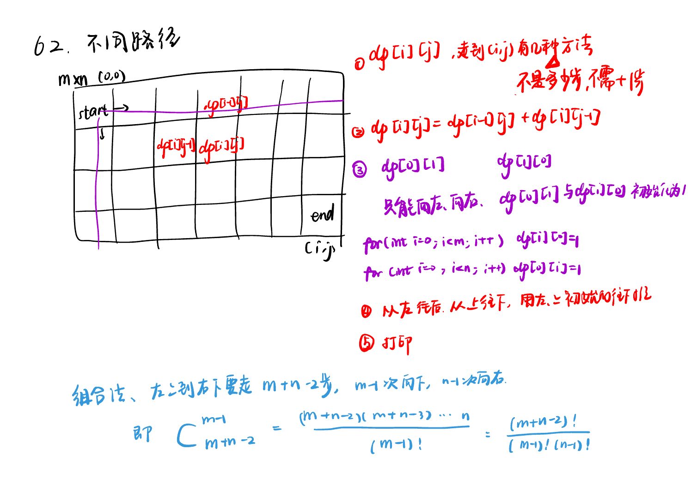
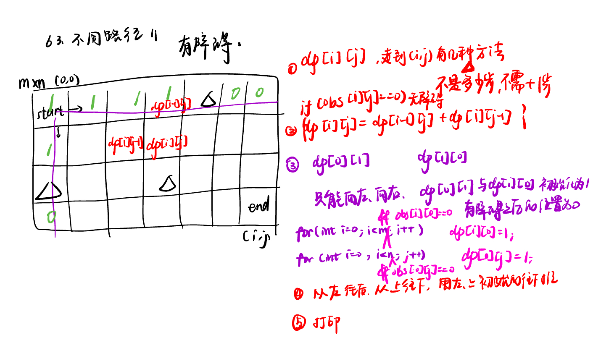
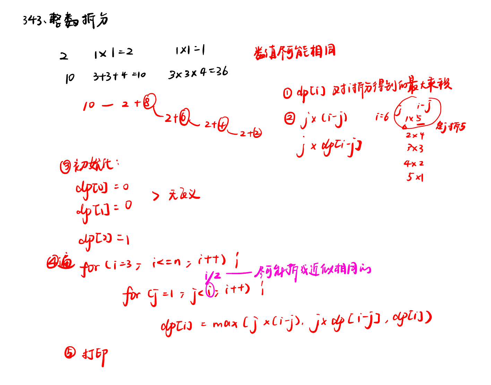
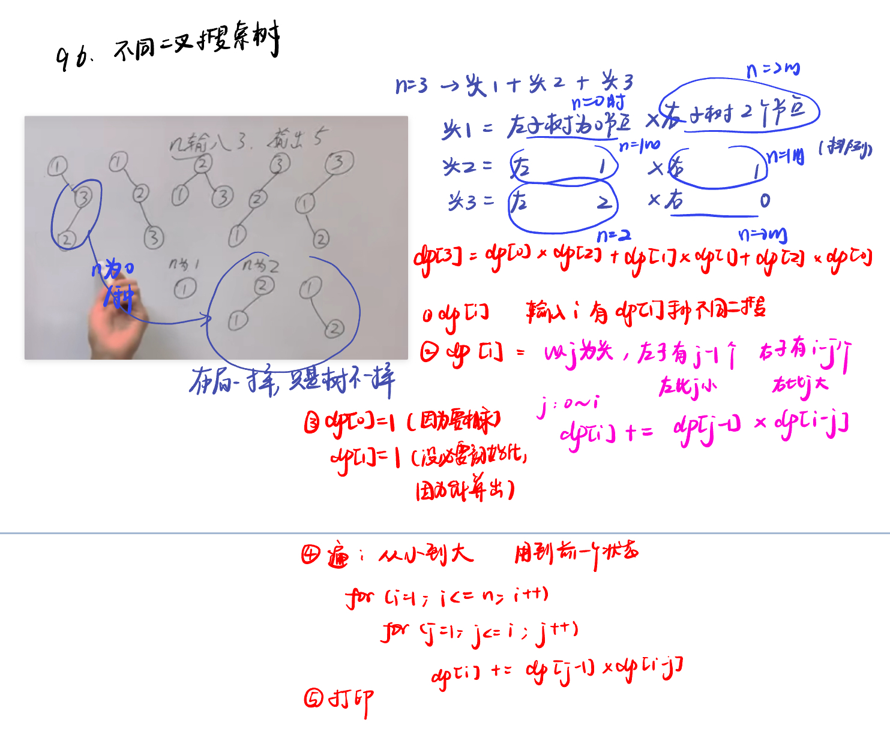

List: 62.不同路径，63. 不同路径 II，343. 整数拆分，96.不同的二叉搜索树


[62.不同路径unique-paths](#01)，[63. 不同路径 IIunique-paths-ii](#02)，[343. 整数拆分integer-break](#03)，[96.不同的二叉搜索树unique-binary-search-trees](#04)

# <span id="01">62.不同路径unique-paths</span>

[Leetcode](https://leetcode.cn/problems/unique-paths/) 

[Learning Materials](https://programmercarl.com/0062.%E4%B8%8D%E5%90%8C%E8%B7%AF%E5%BE%84.html)




## 方法一：动态规划

```python
class Solution:
    def uniquePaths(self, m: int, n: int) -> int:
        if m == 1 or n == 1:
            return 1
        dp = [[0] * n for _ in range(m)]
        for i in range(m):
            dp[i][0] = 1
        for j in range(n):
            dp[0][j] = 1
        for i in range(1, m):
            for j in range(1, n):
                dp[i][j] = dp[i - 1][j] + dp[i][j - 1]
        return dp[m - 1][n - 1]
```

## 方法二：滚动数组

由于 f(i,j) 仅与第 i 行和第 i−1 行的状态有关，因此我们可以使用滚动数组代替代码中的二维数组，使空间复杂度降低为 O(n)。

```python
class Solution:
    def uniquePaths(self, m: int, n: int) -> int:
        dp = [1] * n
        for i in range(1, m):
            for j in range(1, n):
                dp[j] += dp[j - 1]
        return dp[n - 1]
```

## 方法三：组合数

```python
class Solution:
    def uniquePaths(self, m: int, n: int) -> int:
        # 初始化分子为 1，用于存储组合数公式中的分子部分
        numerator = 1
        # 初始化分母为 m - 1，用于存储组合数公式中的分母部分
        denominator = m - 1
        # 记录需要进行乘法运算的次数，也就是分子中需要乘的数的个数
        count = m - 1
        # 计算总共需要移动的步数，即 m + n - 2
        t = m + n - 2
        # 循环 m - 1 次，计算分子部分
        while count > 0:
            # 分子乘以当前的步数 t
            numerator *= t
            # 步数 t 减 1，准备乘下一个数
            t -= 1
            # 当分母不为 0 且分子能被分母整除时，进行约分操作
            while denominator != 0 and numerator % denominator == 0:
                # 分子除以分母
                numerator //= denominator
                # 分母减 1，准备约下一个数
                denominator -= 1
            # 乘法运算次数减 1
            count -= 1
        # 最终的分子即为不同路径的数量，返回结果
        return numerator
```

# <span id="02">63. 不同路径 IIunique-paths-ii</span>

[Leetcode](https://leetcode.cn/problems/unique-paths-ii/description/) 

[Learning Materials](https://programmercarl.com/0063.%E4%B8%8D%E5%90%8C%E8%B7%AF%E5%BE%84II.html#%E7%AE%97%E6%B3%95%E5%85%AC%E5%BC%80%E8%AF%BE)



```python
class Solution:
    def uniquePathsWithObstacles(self, obstacleGrid: List[List[int]]) -> int:
        m = len(obstacleGrid)
        n = len(obstacleGrid[0])
        if obstacleGrid[0][0] == 1:
            return 0
        dp = [[0] * n for _ in range(m)]
        for i in range(m):
            if obstacleGrid[i][0] != 0:
                break
            dp[i][0] = 1
        for j in range(n):
            if obstacleGrid[0][j] != 0:
                break
            dp[0][j] = 1
        for i in range(1, m):
            for j in range(1, n):
                if obstacleGrid[i][j] == 0:
                    dp[i][j] = dp[i - 1][j] + dp[i][j - 1]
        return dp[m - 1][n - 1]
```

# <span id="03">343. 整数拆分integer-break</span>

[Leetcode](https://leetcode.cn/problems/integer-break/description/) 

[Learning Materials](https://programmercarl.com/0343.%E6%95%B4%E6%95%B0%E6%8B%86%E5%88%86.html#%E7%AE%97%E6%B3%95%E5%85%AC%E5%BC%80%E8%AF%BE)



```python
class Solution:
    def integerBreak(self, n: int) -> int:
        dp = [0] * (n + 1)
        dp[0] = 0
        dp[1] = 0
        dp[2] = 1
        if n == 2:
            return dp[2]
        for i in range(3, n + 1):
            for j in range(1, i):
                dp[i] = max(j * (i - j), j * dp[i - j], dp[i])
        return dp[-1]
```

## 递推公式的确定

### 问题背景
我们要把一个正整数 `n` 拆分成至少两个正整数的和，并且让这些拆分后的正整数的乘积达到最大。为了求解这个问题，我们使用动态规划的方法，创建一个数组 `dp`，其中 `dp[i]` 表示把整数 `i` 拆分成至少两个正整数的和之后，这些正整数所能得到的最大乘积。


#### 1. 两种拆分方式
当我们要计算 `dp[i]`（也就是把整数 `i` 拆分后得到的最大乘积）时，会从 `1` 到 `i - 1` 遍历一个数 `j`，通过两种不同的拆分方式来尝试得到最大乘积：
- **方式一：`j * (i - j)`**
    - 这种方式是把整数 `i` 直接拆分成两个数 `j` 和 `i - j`，然后计算它们的乘积。例如，当 `i = 5`，`j = 2` 时，就是把 `5` 拆分成 `2` 和 `3`，乘积就是 `2 * 3 = 6`。这相当于只把 `i` 拆成了两个数相乘的情况。
 - **方式二：`j * dp[i - j]`**
    - 这里的 `dp[i - j]` 表示把 `i - j` 这个数拆分成至少两个正整数的和之后得到的最大乘积。所以 `j * dp[i - j]` 表示把 `i` 拆分成 `j` 和对 `i - j` 进一步拆分后的结果相乘。例如，当 `i = 5`，`j = 2` 时，`i - j = 3`，而 `dp[3]` 是把 `3` 拆分后得到的最大乘积（`dp[3] = 2`，因为 `3 = 2 + 1`，`2 * 1 = 2`），那么 `j * dp[i - j] = 2 * 2 = 4`。这相当于把 `i` 拆分成两个以上的数相乘的情况。

#### 2. 为什么不拆分 `j`
在遍历 `j` 从 `1` 到 `i - 1` 的过程中，其实已经考虑过拆分 `j` 的所有情况了。比如说，当我们计算 `dp[5]` 时，对于 `j = 2`，我们考虑了 `2 * (5 - 2)` 和 `2 * dp[5 - 2]`；当 `j = 3` 时，又会考虑 `3 * (5 - 3)` 和 `3 * dp[5 - 3]`。在这个过程中，就已经涵盖了所有可能的拆分组合，所以不需要再额外拆分 `j`。

#### 3. 递推公式中的 `dp[i]`
递推公式 `dp[i] = max({dp[i], (i - j) * j, dp[i - j] * j})` 里，要比较 `dp[i]` 是因为在遍历 `j` 的过程中，每一次计算 `(i - j) * j` 和 `dp[i - j] * j` 都会得到一个新的可能的最大乘积。我们需要不断更新 `dp[i]`，让它始终存储到目前为止所找到的最大乘积。也就是说，在遍历 `j` 的每一步，都要比较当前得到的乘积和之前已经记录在 `dp[i]` 中的最大乘积，取其中的最大值作为新的 `dp[i]`。

#### 示例
假设 `i = 4`，我们来详细看一下计算 `dp[4]` 的过程：
- 当 `j = 1` 时：
    - `(i - j) * j = (4 - 1) * 1 = 3`
    - `dp[i - j] * j = dp[3] * 1 = 2 * 1 = 2`
    - 此时 `dp[4]` 初始为 `0`，更新 `dp[4] = max(0, 3, 2) = 3`
 - 当 `j = 2` 时：
    - `(i - j) * j = (4 - 2) * 2 = 4`
    - `dp[i - j] * j = dp[2] * 2 = 1 * 2 = 2`
    - 更新 `dp[4] = max(3, 4, 2) = 4`
 - 当 `j = 3` 时：
    - `(i - j) * j = (4 - 3) * 3 = 3`
    - `dp[i - j] * j = dp[1] * 3 = 0 * 3 = 0`
    - 更新 `dp[4] = max(4, 3, 0) = 4`

最终，`dp[4]` 的值为 `4`，这就是把 `4` 拆分成至少两个正整数的和之后得到的最大乘积（`4 = 2 + 2`，`2 * 2 = 4`）。 

# <span id="04">96.不同的二叉搜索树unique-binary-search-trees</span>

[Leetcode](https://leetcode.cn/problems/unique-binary-search-trees/description/) 

[Learning Materials](https://programmercarl.com/0096.%E4%B8%8D%E5%90%8C%E7%9A%84%E4%BA%8C%E5%8F%89%E6%90%9C%E7%B4%A2%E6%A0%91.html#%E7%AE%97%E6%B3%95%E5%85%AC%E5%BC%80%E8%AF%BE)




