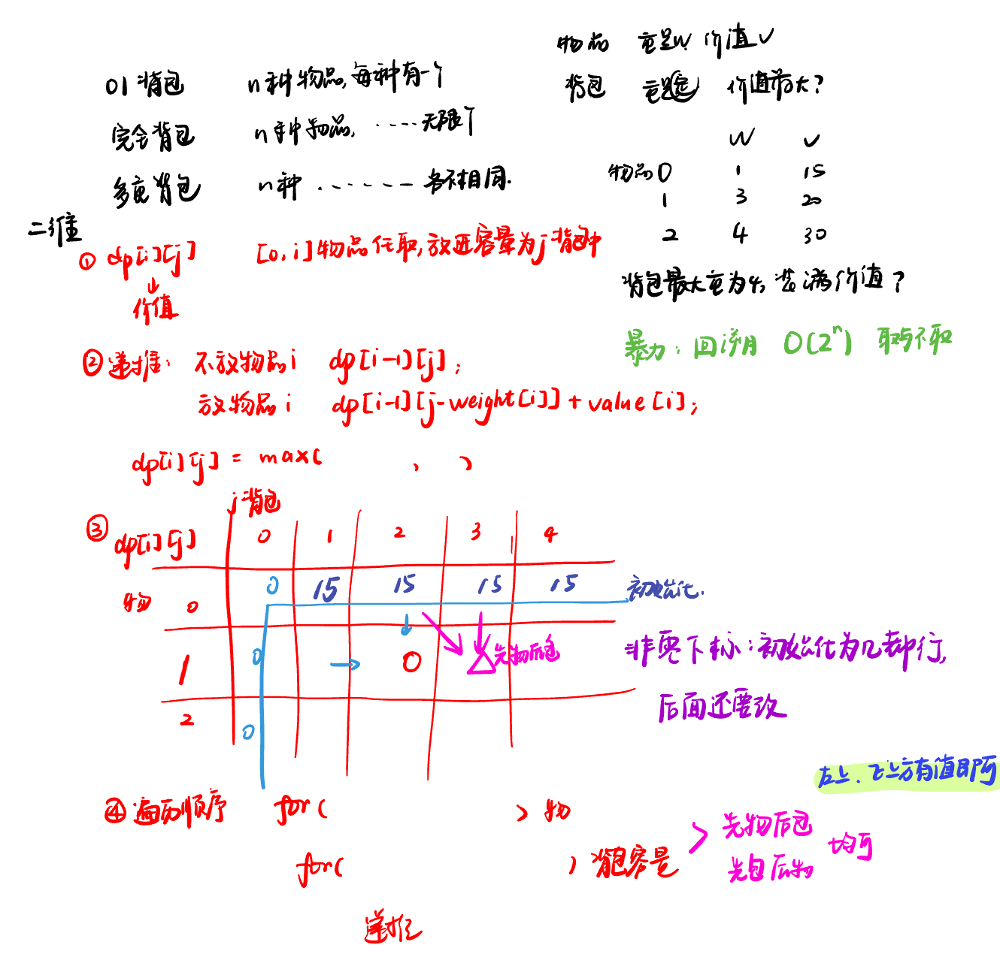
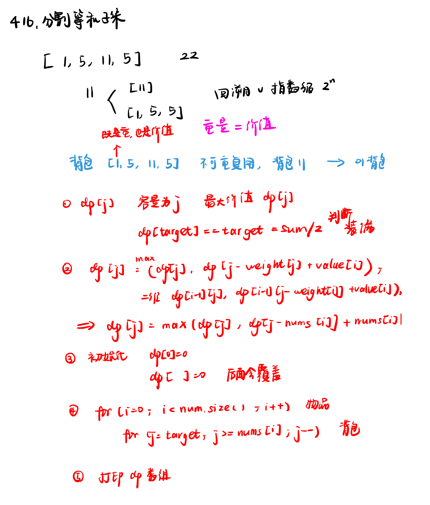

List: 01背包问题 二维，01背包问题 一维，416. 分割等和子集

[01背包问题 二维](#01)，[01背包问题 一维](#02)，[416. 分割等和子集partition-equal-subset-sum](#03)

# <span id="01">01背包问题 二维</span>


[Learning Materials](https://programmercarl.com/%E8%83%8C%E5%8C%85%E7%90%86%E8%AE%BA%E5%9F%BA%E7%A1%8001%E8%83%8C%E5%8C%85-1.html)



```python
n, bagweight = map(int, input().split())

weight = list(map(int, input().split()))
value = list(map(int, input().split()))

dp = [[0] * (bagweight + 1) for _ in range(n)]

for j in range(weight[0], bagweight + 1):
    dp[0][j] = value[0]

for i in range(1, n):
    for j in range(bagweight + 1):
        if j < weight[i]:
            dp[i][j] = dp[i - 1][j]
        else:
            dp[i][j] = max(dp[i - 1][j], dp[i - 1][j - weight[i]] + value[i])

print(dp[n - 1][bagweight])
```

# <span id="02">01背包问题 一维</span>

[Learning Materials](https://programmercarl.com/%E8%83%8C%E5%8C%85%E7%90%86%E8%AE%BA%E5%9F%BA%E7%A1%8001%E8%83%8C%E5%8C%85-2.html#%E7%AE%97%E6%B3%95%E5%85%AC%E5%BC%80%E8%AF%BE)


```python
n, bagweight = map(int, input().split())
weight = list(map(int, input().split()))
value = list(map(int, input().split()))

dp = [0] * (bagweight + 1)  # 创建一个动态规划数组dp，初始值为0

dp[0] = 0  # 初始化dp[0] = 0,背包容量为0，价值最大为0

for i in range(n):  # 应该先遍历物品，如果遍历背包容量放在上一层，那么每个dp[j]就只会放入一个物品
    for j in range(bagweight, weight[i]-1, -1):  # 倒序遍历背包容量是为了保证物品i只被放入一次
        dp[j] = max(dp[j], dp[j - weight[i]] + value[i])

print(dp[bagweight])
```

# <span id="03">416. 分割等和子集partition-equal-subset-sum</span>

[Leetcode](https://leetcode.cn/problems/partition-equal-subset-sum/description/) 

[Learning Materials](https://programmercarl.com/0416.%E5%88%86%E5%89%B2%E7%AD%89%E5%92%8C%E5%AD%90%E9%9B%86.html)



## 一维数组：

```python
class Solution:
    def canPartition(self, nums: List[int]) -> bool:
        if sum(nums) % 2 != 0:
            return False
        target = sum(nums) // 2
        dp = [0] * (target + 1)
        for i in range(len(nums)):
            for j in range(target, nums[i] - 1, -1):
                dp[j] = max(dp[j], dp[j - nums[i]] + nums[i])
        return dp[-1] == target
```

### 1. 为什么 `dp = [0] * (target + 1)` 是 `(target + 1)`？

在这个问题里，我们的目标是判断给定的数组 `nums` 是否能够被划分为两个子集，使得这两个子集的元素和相等。若数组元素总和为偶数，那么我们可以把问题转化为：是否能够从数组中选出一些元素，让这些元素的和等于 `target = sum(nums) // 2`。

这里的 `dp` 数组是一个一维动态规划数组，`dp[j]` 表示在考虑数组元素的情况下，能够凑出的不超过 `j` 的最大和。我们需要计算从 `0` 到 `target` 所有可能的和，所以 `dp` 数组的长度应该是 `target + 1`，这样就能覆盖从 `0` 到 `target` 的所有状态。

例如，若 `target = 5`，那么我们需要考虑 `dp[0]`（表示凑出和为 0 的情况）、`dp[1]`（表示凑出和为 1 的情况）、`dp[2]`（表示凑出和为 2 的情况）、`dp[3]`（表示凑出和为 3 的情况）、`dp[4]`（表示凑出和为 4 的情况）以及 `dp[5]`（表示凑出和为 5 的情况），总共 6 个状态，因此 `dp` 数组的长度为 `target + 1 = 6`。

### 2. 为什么 `for j in range(target, nums[i] - 1, -1)` 是 `(target, nums[i] - 1)`？

这是一个倒序遍历的过程，主要是为了避免重复使用同一个元素。在 0 - 1 背包问题中，每个元素只能使用一次。

- **范围起始点 `target`**：我们从 `target` 开始倒序遍历，是因为我们要计算在考虑当前元素 `nums[i]` 的情况下，从 `target` 到 `nums[i]` 这些和能否被凑出。
- **范围结束点 `nums[i] - 1`**：当 `j` 小于 `nums[i]` 时，当前元素 `nums[i]` 无法放入容量为 `j` 的“背包”中，因为 `nums[i]` 比 `j` 大，所以不需要再继续遍历 `j` 小于 `nums[i]` 的情况。

- **倒序遍历的原因**：如果采用正序遍历，在更新 `dp[j]` 时，可能会重复使用当前元素 `nums[i]`。例如，在更新 `dp[j]` 时用到了 `dp[j - nums[i]]`，如果是正序遍历，`dp[j - nums[i]]` 可能已经在本次循环中被更新过，即已经使用了当前元素 `nums[i]`，这样就会导致重复使用同一个元素，不符合 0 - 1 背包问题的要求。而倒序遍历可以保证在更新 `dp[j]` 时，`dp[j - nums[i]]` 还没有被本次循环更新，从而避免重复使用同一个元素。

## 二维数组：

```python
class Solution:
    def canPartition(self, nums: List[int]) -> bool:
        if sum(nums) % 2 != 0:
            return False
        target = sum(nums) // 2
        
        dp = [[False] * (target + 1) for _ in range(len(nums) + 1)]

        for i in range(len(nums) + 1):
            dp[i][0] = True
        
        for i in range(1, len(nums) + 1):
            for j in range(1, target + 1):
                if j < nums[i - 1]:
                    dp[i][j] = dp[i - 1][j]
                else:
                    dp[i][j] = dp[i - 1][j] or dp[i - 1][j - nums[i - 1]]
        
        return dp[len(nums)][target]
```


### 1. `dp = [[False] * (target + 1) for _ in range(len(nums) + 1)]` 中行列分别是什么，为什么是 `len(nums) + 1` 和 `target + 1`

- **行的含义及 `len(nums) + 1` 的原因**：
    - 二维数组 `dp` 的行代表考虑数组 `nums` 中元素的个数。`dp[i]` 表示在前 `i` 个元素中进行选择的情况。
    - 这里使用 `len(nums) + 1` 是为了处理边界情况，即当不考虑任何元素时（`i = 0`）也有对应的状态。例如，`dp[0]` 表示不选择任何元素时的状态，`dp[1]` 表示只考虑 `nums` 中第一个元素时的状态，以此类推，`dp[len(nums)]` 表示考虑 `nums` 中所有元素时的状态。

- **列的含义及 `target + 1` 的原因**：
    - 二维数组 `dp` 的列代表要凑出的目标和。`dp[i][j]` 表示在前 `i` 个元素中是否能够选出一些元素，使得它们的和等于 `j`。
    - 使用 `target + 1` 是因为我们需要考虑从 `0` 到 `target` 的所有可能的和。例如，`dp[i][0]` 表示凑出和为 0 的情况，`dp[i][1]` 表示凑出和为 1 的情况，以此类推，`dp[i][target]` 表示凑出和为 `target` 的情况。

### 2. `for i in range(len(nums) + 1): dp[i][0] = True` 代表什么

这行代码的作用是初始化 `dp` 数组的第一列。`dp[i][0]` 表示在前 `i` 个元素中是否能够选出一些元素，使得它们的和等于 0。显然，无论考虑多少个元素，我们都可以不选任何元素，这样就能凑出和为 0 的情况，所以对于所有的 `i`（从 0 到 `len(nums)`），`dp[i][0]` 都应该为 `True`。

### 3. `dp[i][j] = dp[i - 1][j] or dp[i - 1][j - nums[i - 1]]` 为什么用 `or`，为什么这么推

- **为什么用 `or`**：
    - `or` 是逻辑或运算符，在这里的含义是只要两种情况中有任意一种情况成立，那么 `dp[i][j]` 就为 `True`。具体来说，`dp[i - 1][j]` 表示不选择当前第 `i` 个元素（即 `nums[i - 1]`）时，在前 `i - 1` 个元素中是否能够凑出和为 `j`；`dp[i - 1][j - nums[i - 1]]` 表示选择当前第 `i` 个元素时，在前 `i - 1` 个元素中是否能够凑出和为 `j - nums[i - 1]`。只要这两种情况中有一种能够凑出和为 `j`，那么在前 `i` 个元素中就能够凑出和为 `j`。

- **为什么这么推**：
    - 当 `j < nums[i - 1]` 时，说明当前元素 `nums[i - 1]` 太大了，无法放入“背包”（即无法选择该元素来凑出和为 `j`），所以此时 `dp[i][j]` 的状态和 `dp[i - 1][j]` 相同，即不选择当前元素。
    - 当 `j >= nums[i - 1]` 时，我们有两种选择：
        - 不选择当前元素 `nums[i - 1]`，那么 `dp[i][j]` 的状态就取决于 `dp[i - 1][j]`。
        - 选择当前元素 `nums[i - 1]`，那么就需要在前 `i - 1` 个元素中凑出和为 `j - nums[i - 1]`，即 `dp[i - 1][j - nums[i - 1]]`。
    - 只要这两种选择中有一种能够凑出和为 `j`，那么 `dp[i][j]` 就为 `True`，所以使用 `or` 运算符来合并这两种情况。

