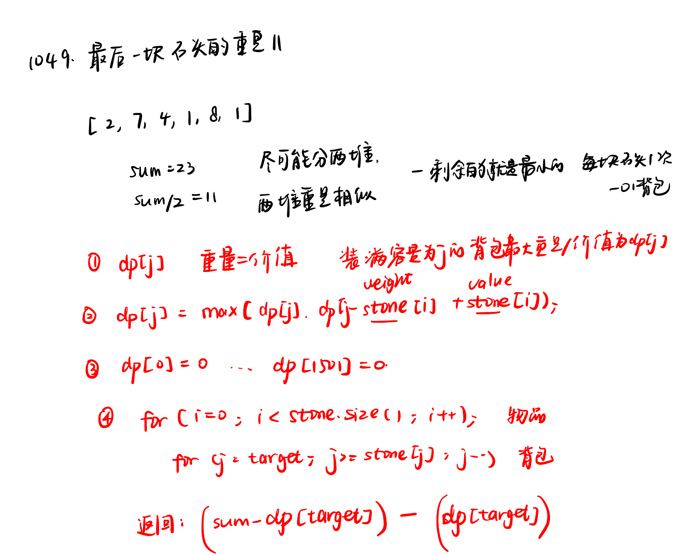

List: 1049. 最后一块石头的重量 II，494. 目标和，474.一和零

[1049.最后一块石头的重量II](#01)，[494.目标和target-sum](#02)，[474.一和零ones-and-zeroes](#03)

# <span id="01">1049.最后一块石头的重量II</span>

[Leetcode](https://leetcode.cn/problems/last-stone-weight-ii/description/) 

[Learning Materials](https://programmercarl.com/1049.%E6%9C%80%E5%90%8E%E4%B8%80%E5%9D%97%E7%9F%B3%E5%A4%B4%E7%9A%84%E9%87%8D%E9%87%8FII.html)



```python
class Solution:
    def lastStoneWeightII(self, stones: List[int]) -> int:
        target = sum(stones) // 2
        dp = [0] * (target + 1)
        for i in range(len(stones)):
            for j in range(target, stones[i] - 1, -1):
                dp[j] = max(dp[j], dp[j - stones[i]] + stones[i])
        return sum(stones) - 2 * dp[target]
```

### 1. 为什么 `dp` 数组初始化长度是 `target + 1`
在这个问题中，我们使用动态规划来解决，`dp` 数组的含义是背包容量为 `j` 时能装下的石头的最大重量。这里的背包容量 `j` 的取值范围是从 `0` 到 `target`，其中 `target = sum(stones) // 2`。

我们需要为每一个可能的背包容量记录其能装下的最大石头重量，所以 `dp` 数组的长度应该为 `target + 1`，这样才能覆盖从 `0` 到 `target` 的所有背包容量情况。例如，如果 `target` 是 `5`，那么我们需要记录 `dp[0]`（背包容量为 0 时）、`dp[1]`（背包容量为 1 时）、`dp[2]`、`dp[3]`、`dp[4]` 和 `dp[5]`（背包容量为 5 时）这些状态，总共是 `target + 1` 个状态。

### 2. 为什么 `i` 的索引范围是 `0` 到 `len(stones) - 1`
在 Python 中，列表（数组）的索引是从 `0` 开始的。对于一个长度为 `n` 的列表 `stones`，其有效的索引范围是从 `0` 到 `n - 1`。

在动态规划的过程中，我们需要遍历每一块石头，将其尝试放入不同容量的背包中。因此，我们使用 `for i in range(len(stones))` 来遍历 `stones` 列表中的每一个元素，这里 `i` 从 `0` 开始，到 `len(stones) - 1` 结束，正好对应了 `stones` 列表中所有石头的索引。

如果 `i` 从 `1` 开始到 `len(stones)` 结束，就会导致索引越界，因为 `stones[len(stones)]` 会访问到列表之外的元素。同时，`stones[0]` 这个元素会被跳过，导致没有考虑到所有的石头，从而得到错误的结果。

综上所述，`dp` 数组长度为 `target + 1` 是为了记录所有可能的背包容量状态，而 `i` 从 `0` 到 `len(stones) - 1` 是为了正确遍历 `stones` 列表中的每一个元素。 

# <span id="02">494.目标和target-sum</span>

[Leetcode](https://leetcode.cn/problems/target-sum/) 

[Learning Materials](https://programmercarl.com/0494.%E7%9B%AE%E6%A0%87%E5%92%8C.html)


```python
class Solution:
    def findTargetSumWays(self, nums: List[int], target: int) -> int:
        if (target + sum(nums)) % 2 != 0 or sum(nums) < abs(target):
            return 0
        left = (target + sum(nums)) // 2
        dp = [0] * (left + 1)
        dp[0] = 1
        for i in range(len(nums)):
            for j in range(left, nums[i] - 1, -1):
                dp[j] += dp[j - nums[i]]
        return dp[-1]
```

### 为什么背包容量是 `left`

本题要求通过给数组 `nums` 中的每个元素添加 `+` 或 `-` 号，使得表达式的结果等于目标值 `target`。我们可以将这个问题转化为一个子集和问题，下面是详细的推导过程：

设数组 `nums` 中所有元素的和为 `sum`，添加 `+` 号的元素之和为 `left`，添加 `-` 号的元素之和为 `right`。根据题意可以得到以下两个等式：
- **等式一：`left + right = sum`**：因为 `left` 和 `right` 分别是数组中添加 `+` 号和 `-` 号的元素之和，它们相加就等于数组所有元素的总和。
- **等式二：`left - right = target`**：由于表达式的结果等于目标值 `target`，而表达式是由 `left` 减去 `right` 得到的，所以有此等式。

将这两个等式相加，消去 `right`，可以得到：
\[
\begin{align*}
left + right + left - right&=sum + target\\
2\times left&=sum + target\\
left&=\frac{sum + target}{2}
\end{align*}
\]

这就表明，如果我们能从数组 `nums` 中选出一些元素，使得它们的和为 `left`，那么剩下元素的和就是 `right`，并且 `left - right` 就等于目标值 `target`。因此，这个问题就转化为从数组 `nums` 中选取若干元素，使得它们的和等于 `left` 的组合数量问题，而 `left` 就相当于背包问题中的背包容量。

### 如何想到边界条件的判定

#### 1. `(target + sum(nums)) % 2 != 0`

从前面的推导可知，`left = (sum + target) // 2`，这意味着 `sum + target` 必须是偶数，因为 `left` 表示元素的和，它必须是整数。如果 `sum + target` 是奇数，那么 `(sum + target) // 2` 会得到一个小数，在实际的元素组合中是无法实现的，所以此时不存在满足条件的组合，直接返回 `0`。

#### 2. `sum(nums) < abs(target)`

`sum(nums)` 表示数组中所有元素的和，`abs(target)` 表示目标值的绝对值。如果 `sum(nums)` 小于 `abs(target)`，那么无论怎么给数组中的元素添加 `+` 或 `-` 号，都无法得到目标值 `target`。

例如，假设数组 `nums = [1, 2]`，`sum(nums) = 3`，如果 `target = 5` 或者 `target = -5`，由于数组元素的总和只有 3，即使将所有元素都取正号或者负号，也无法达到 5 或者 -5，所以这种情况下不存在满足条件的组合，直接返回 `0`。

综上所述，通过对问题进行数学推导和逻辑分析，我们可以将原问题转化为子集和问题，并确定相应的背包容量和边界条件。

# <span id="03">474.一和零ones-and-zeroes</span>

[Leetcode](https://leetcode.cn/problems/ones-and-zeroes/description/) 

[Learning Materials](https://programmercarl.com/0474.%E4%B8%80%E5%92%8C%E9%9B%B6.html)


