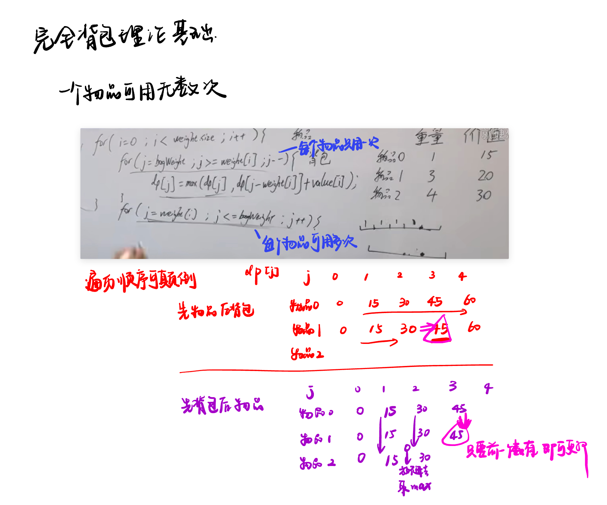
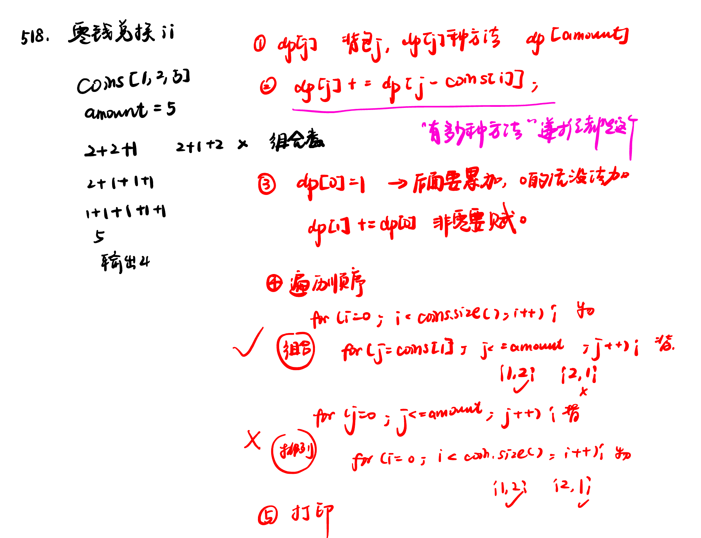
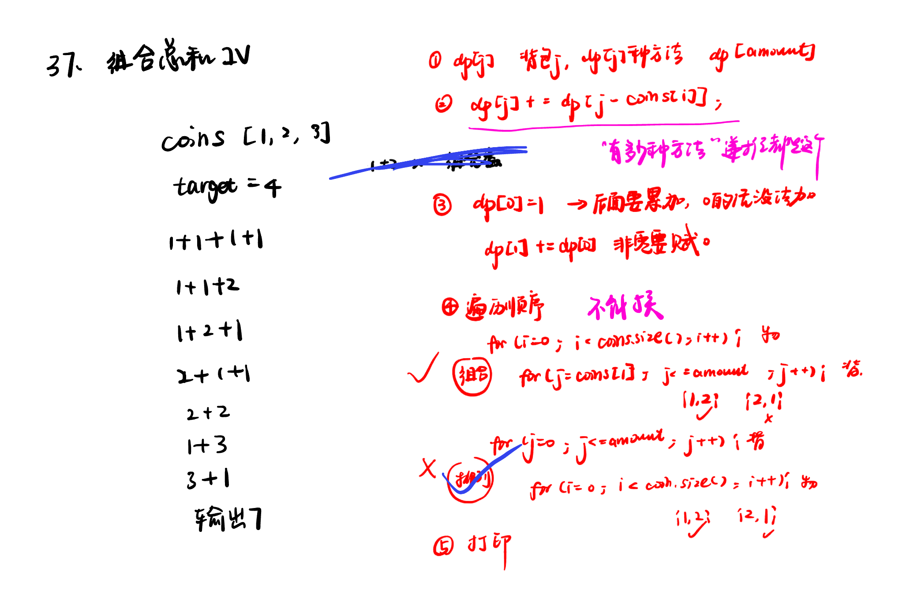

List: 完全背包理论基础，518. 零钱兑换 II，377. 组合总和 Ⅳ，70. 爬楼梯 （进阶） 


[完全背包理论基础](#01)，[518.零钱兑换IIcoin-change-ii](#02)，[377. 组合总和 Ⅳcombination-sum-iv](#03)，[70. 爬楼梯（进阶版）](#04)

# <span id="01">完全背包理论基础</span>

[Learning Materials](https://programmercarl.com/%E8%83%8C%E5%8C%85%E9%97%AE%E9%A2%98%E7%90%86%E8%AE%BA%E5%9F%BA%E7%A1%80%E5%AE%8C%E5%85%A8%E8%83%8C%E5%8C%85.html)



```python
def knapsack(n, bag_weight, weight, value):
    dp = [[0] * (bag_weight + 1) for _ in range(n)]

    # 初始化
    for j in range(weight[0], bag_weight + 1):
        dp[0][j] = dp[0][j - weight[0]] + value[0]

    # 动态规划
    for i in range(1, n):
        for j in range(bag_weight + 1):
            if j < weight[i]:
                dp[i][j] = dp[i - 1][j]
            else:
                dp[i][j] = max(dp[i - 1][j], dp[i][j - weight[i]] + value[i])

    return dp[n - 1][bag_weight]

# 输入
n, bag_weight = map(int, input().split())
weight = []
value = []
for _ in range(n):
    w, v = map(int, input().split())
    weight.append(w)
    value.append(v)

# 输出结果
print(knapsack(n, bag_weight, weight, value))

```

# <span id="02">518.零钱兑换IIcoin-change-ii</span>

[Leetcode](https://leetcode.cn/problems/coin-change-ii/) 

[Learning Materials](https://programmercarl.com/0518.%E9%9B%B6%E9%92%B1%E5%85%91%E6%8D%A2II.html#%E7%AE%97%E6%B3%95%E5%85%AC%E5%BC%80%E8%AF%BE)



```python
class Solution:
    def change(self, amount: int, coins: List[int]) -> int:
        dp = [0] * (amount + 1)
        dp[0] = 1
        for i in range(len(coins)):
            for j in range(coins[i], amount + 1):
                dp[j] += dp[j - coins[i]]
        return dp[-1]
```


在力扣518题（零钱兑换 II）的动态规划解法中，第二层循环使用 `range(coins[i], amount + 1)` 而非 `range(amount)`，主要原因如下：

---

### **1. 确保索引合法性**
- `range(coins[i], amount + 1)` 保证了循环变量 `j` 的最小值为 `coins[i]`。
- 当计算 `dp[j] += dp[j - coins[i]]` 时，`j - coins[i]` 的最小值为 `0`（当 `j = coins[i]` 时），避免了数组越界（如 `j - coins[i] < 0`）。

如果使用 `range(amount)`（即 `j` 从 `0` 到 `amount-1`），则当 `j < coins[i]` 时，`j - coins[i]` 会是负数，导致访问无效的数组索引。

---

### **2. 实现完全背包逻辑**
- 本题允许**重复使用硬币**，属于**完全背包问题**。
- 完全背包的内层循环需要**从小到大遍历**，以确保每个硬币可以被多次选择。
- `range(coins[i], amount + 1)` 的遍历顺序，使得在更新 `dp[j]` 时，`dp[j - coins[i]]` 已经包含了当前硬币 `coins[i]` 之前的状态，从而允许重复选择该硬币。

例如，当处理硬币 `1` 时，`j` 从 `1` 开始递增：
- `j=1` 时，`dp[1] += dp[0]`（选择一枚 `1`）。
- `j=2` 时，`dp[2] += dp[1]`（此时 `dp[1]` 已包含 `1`，相当于选择两枚 `1`）。

这种方式确保了硬币可以被重复使用。

---

### **3. 对比：若使用 `range(amount)` 的问题**
- 如果内层循环是 `range(amount)`（即 `j` 从 `0` 到 `amount-1`），则：
  - 当 `j < coins[i]` 时，`j - coins[i]` 为负数，导致错误。
  - 无法正确累加所有可能的组合，因为起始点错误，漏掉了从 `coins[i]` 开始的合法状态。

---

### **总结**
`range(coins[i], amount + 1)` 的设计是为了：
1. 避免数组越界，确保 `j - coins[i]` 始终非负。
2. 实现完全背包的逻辑，允许硬币被重复选择，从而正确计算所有组合数。

因此，第二层循环的范围选择是算法正确性的关键。

# <span id="03">377. 组合总和 Ⅳcombination-sum-iv</span>

[Leetcode](https://leetcode.cn/problems/combination-sum-iv/description/) 

[Learning Materials](https://programmercarl.com/0377.%E7%BB%84%E5%90%88%E6%80%BB%E5%92%8C%E2%85%A3.html)



```python
class Solution:
    def combinationSum4(self, nums: List[int], target: int) -> int:
        dp = [0] * (target + 1)
        dp[0] = 1
        for j in range(target + 1):
            for i in range(len(nums)):
                if j - nums[i] >= 0:
                    dp[j] += dp[j - nums[i]]
        return dp[-1]
```

# <span id="04">70. 爬楼梯（进阶版）</span>

假设你正在爬楼梯。需要 n 阶你才能到达楼顶。

每次你可以爬至多m (1 <= m < n)个台阶。你有多少种不同的方法可以爬到楼顶呢？

注意：给定 n 是一个正整数。

输入描述：输入共一行，包含两个正整数，分别表示n, m

输出描述：输出一个整数，表示爬到楼顶的方法数。

输入示例：3 2

输出示例：3

提示：

当 m = 2，n = 3 时，n = 3 这表示一共有三个台阶，m = 2 代表你每次可以爬一个台阶或者两个台阶。

此时你有三种方法可以爬到楼顶。

1 阶 + 1 阶 + 1 阶段
1 阶 + 2 阶
2 阶 + 1 阶

[Learning Materials](https://programmercarl.com/0070.%E7%88%AC%E6%A5%BC%E6%A2%AF%E5%AE%8C%E5%85%A8%E8%83%8C%E5%8C%85%E7%89%88%E6%9C%AC.html#%E6%80%9D%E8%B7%AF)


思路：

- dp含义：`dp[i]`：爬到有i个台阶的楼顶，有dp[i]种方法。

- 递推公式：`dp[i]` += `dp[i - j]`

- 初始化：`dp[0]` 一定为1，其他0

- 背包里求排列问题，即：1、2 步 和 2、1 步都是上三个台阶，但是这两种方法不一样！

所以需将target放在外循环，将nums放在内循环。

```python
def climbing_stairs(n,m):
    dp = [0]*(n+1) # 背包总容量
    dp[0] = 1 
    # 排列题，注意循环顺序，背包在外物品在内
    for j in range(1,n+1):
        for i in range(1,m+1):
            if j>=i:
                dp[j] += dp[j-i] # 这里i就是重量而非index
    return dp[n]

if __name__ == '__main__':
    n,m = list(map(int,input().split(' ')))
    print(climbing_stairs(n,m))
```
