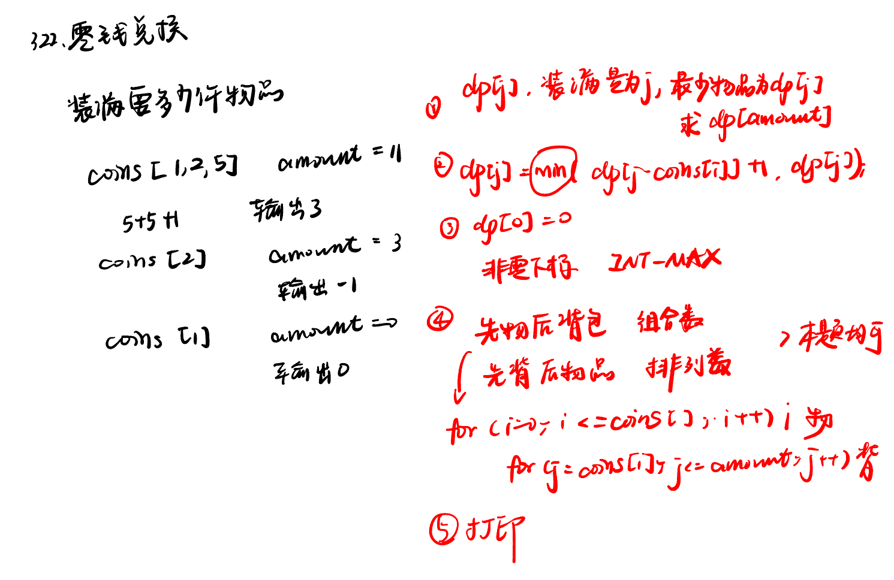
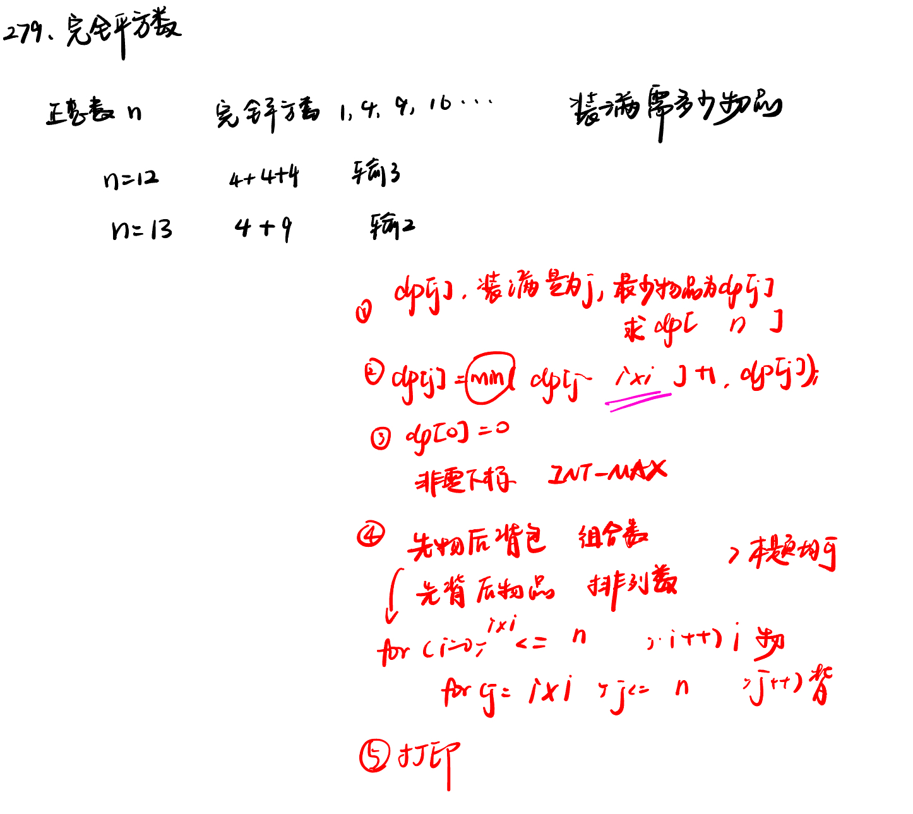
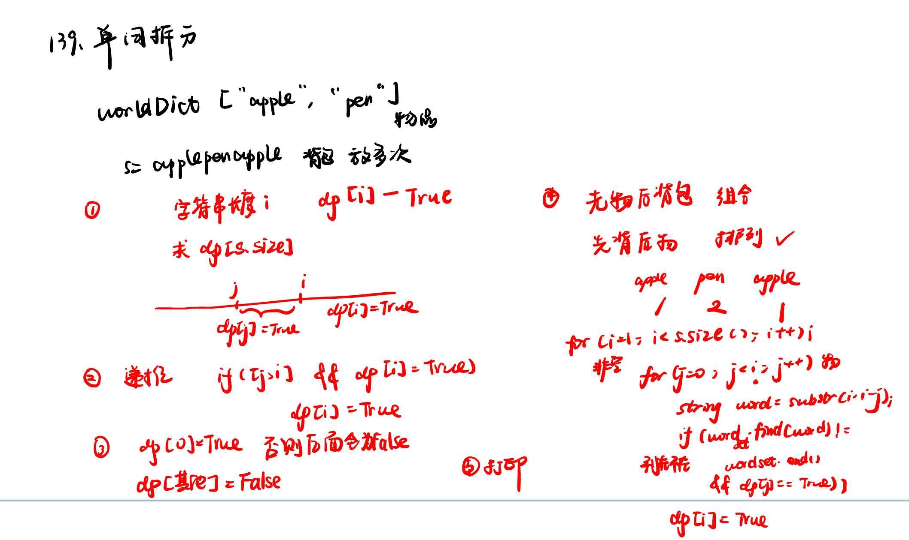

List: 322. 零钱兑换，279.完全平方数，139.单词拆分，多重背包，背包问题总结

[322. 零钱兑换coin-change](#01)，[279.完全平方数perfect-squares](#02)，[139.单词拆分word-break](#03)，[多重背包](#04)，[背包问题总结](#05)


# <span id="01">322. 零钱兑换coin-change</span>

[Leetcode](https://leetcode.cn/problems/coin-change/description/) 

[Learning Materials](https://programmercarl.com/0322.%E9%9B%B6%E9%92%B1%E5%85%91%E6%8D%A2.html)



```python
class Solution:
    def coinChange(self, coins: List[int], amount: int) -> int:
        dp = [float('inf')] * (amount + 1)
        dp[0] = 0
        for i in range(len(coins)):
            for j in range(coins[i], amount + 1):
                dp[j] = min(dp[j], dp[j - coins[i]] + 1)
        return dp[-1] if dp[-1] != float('inf') else -1
```

# <span id="02">279.完全平方数perfect-squares</span>

[Leetcode](https://leetcode.cn/problems/perfect-squares/description/) 

[Learning Materials](https://programmercarl.com/0279.%E5%AE%8C%E5%85%A8%E5%B9%B3%E6%96%B9%E6%95%B0.html#%E7%AE%97%E6%B3%95%E5%85%AC%E5%BC%80%E8%AF%BE)



```python
class Solution:
    def numSquares(self, n: int) -> int:
        dp = [float('inf')] * (n + 1)
        dp[0] = 0
        i = 0
        while i * i <= n:
            for j in range(i * i, n + 1):
                dp[j] = min(dp[j], dp[j - i * i] + 1)
            i += 1
        return dp[-1]
```

# <span id="03">139.单词拆分word-break</span>

[Leetcode](https://leetcode.cn/problems/word-break/description/) 

[Learning Materials](https://programmercarl.com/0139.%E5%8D%95%E8%AF%8D%E6%8B%86%E5%88%86.html#%E7%AE%97%E6%B3%95%E5%85%AC%E5%BC%80%E8%AF%BE)



```python
class Solution:
    def wordBreak(self, s: str, wordDict: List[str]) -> bool:
        dp = [False] * (len(s) + 1)
        wordset = set(wordDict)
        dp[0] = True
        for i in range(1, len(s) + 1):
            for j in range(i):
                if s[j : i] in wordset and dp[j]:
                    dp[i] = True
                    break
        return dp[len(s)]
```

# <span id="04">多重背包</span>

有N种物品和一个容量为V 的背包。第i种物品最多有Mi件可用，每件耗费的空间是Ci ，价值是Wi 。求解将哪些物品装入背包可使这些物品的耗费的空间 总和不超过背包容量，且价值总和最大。

多重背包和01背包是非常像的， 为什么和01背包像呢？

每件物品最多有Mi件可用，把Mi件摊开，其实就是一个01背包问题了。

时间复杂度：O(m × n × k)，m：物品种类个数，n背包容量，k单类物品数量

从代码里可以看出是01背包里面在加一个for循环遍历一个每种商品的数量。 和01背包还是如出一辙的。

[Learning Materials](https://programmercarl.com/%E8%83%8C%E5%8C%85%E9%97%AE%E9%A2%98%E7%90%86%E8%AE%BA%E5%9F%BA%E7%A1%80%E5%A4%9A%E9%87%8D%E8%83%8C%E5%8C%85.html#%E5%A4%9A%E9%87%8D%E8%83%8C%E5%8C%85)


```python
C, N = input().split(" ")
C, N = int(C), int(N)

# value数组需要判断一下非空不然过不了
weights = [int(x) for x in input().split(" ")]
values = [int(x) for x in input().split(" ") if x]
nums = [int(x) for x in input().split(" ")]

dp = [0] * (C + 1)
# 遍历背包容量
for i in range(N):
    for j in range(C, weights[i] - 1, -1):
        for k in range(1, nums[i] + 1):
            # 遍历 k，如果已经大于背包容量直接跳出循环
            if k * weights[i] > j:
                break
            dp[j] = max(dp[j], dp[j - weights[i] * k] + values[i] * k) 
print(dp[-1])
```
# <span id="05">背包问题总结</span>

[Learning Materials](https://programmercarl.com/%E8%83%8C%E5%8C%85%E6%80%BB%E7%BB%93%E7%AF%87.html#%E8%83%8C%E5%8C%85%E9%80%92%E6%8E%A8%E5%85%AC%E5%BC%8F)

- 递推公式：
  
问能否能装满背包（或者最多装多少）：dp[j] = max(dp[j], dp[j - nums[i]] + nums[i])

问装满背包有几种方法：dp[j] += dp[j - nums[i]] 

问背包装满最大价值：dp[j] = max(dp[j], dp[j - weight[i]] + value[i])

问装满背包所有物品的最小个数：dp[j] = min(dp[j - coins[i]] + 1, dp[j])

- 遍历顺序：

01背包：

二维dp数组01背包先遍历物品还是先遍历背包都是可以的，且第二层for循环是从小到大遍历。

一维dp数组01背包只能先遍历物品再遍历背包容量，且第二层for循环是从大到小遍历。

完全背包：本身循环可以颠倒，但

如果求组合数就是外层for循环遍历物品，内层for遍历背包。

如果求排列数就是外层for遍历背包，内层for循环遍历物品。
