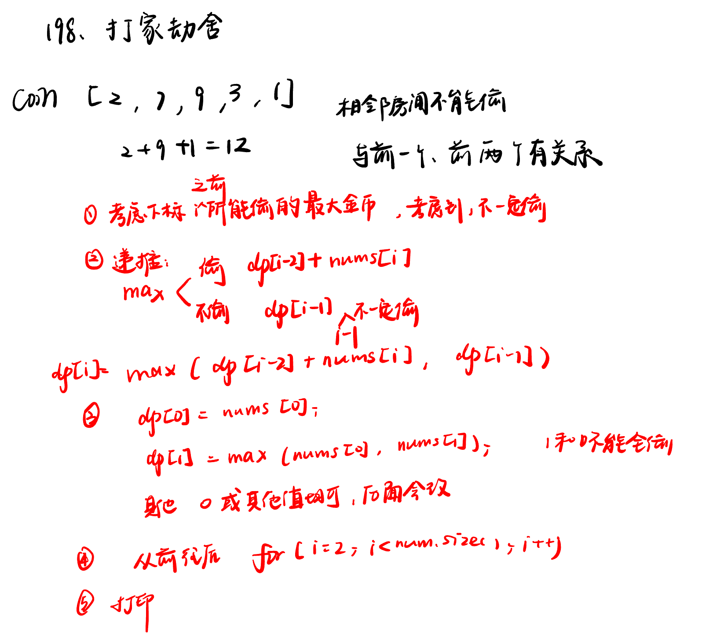
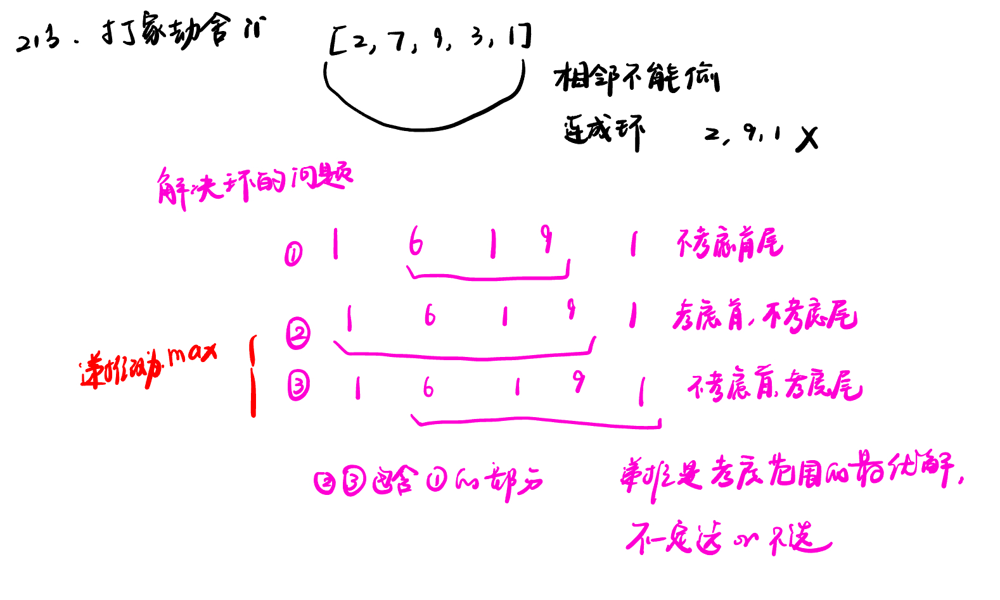
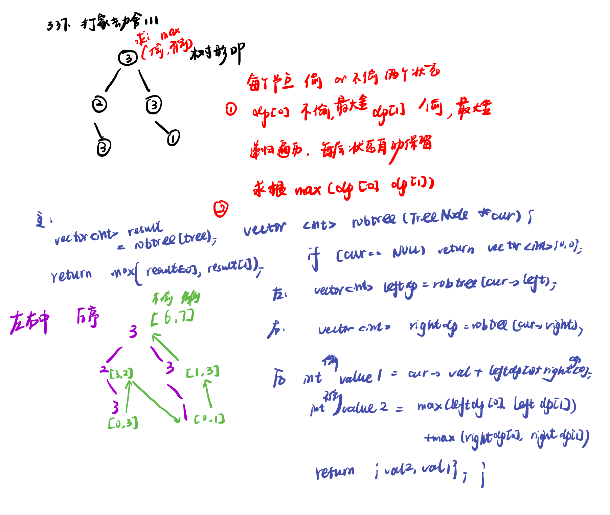

List: 198.打家劫舍，213.打家劫舍II，337.打家劫舍III  


[198.打家劫舍house-robber](#01)，[213.打家劫舍IIhouse-robber-ii](#02)，[337.打家劫舍 IIIhouse-robber-iii](#03)

# <span id="01">198.打家劫舍house-robber</span>

[Leetcode](https://leetcode.cn/problems/house-robber/description/) 

[Learning Materials](https://programmercarl.com/0198.%E6%89%93%E5%AE%B6%E5%8A%AB%E8%88%8D.html#%E7%AE%97%E6%B3%95%E5%85%AC%E5%BC%80%E8%AF%BE)



```python
class Solution:
    def rob(self, nums: List[int]) -> int:
        if len(nums) == 1:
            return nums[0]
        if len(nums) == 2:
            return max(nums[0], nums[1])
        dp = [0] * (len(nums))
        dp[0] = nums[0]
        dp[1] = max(nums[0], nums[1])
        for i in range(2, len(nums)):
            dp[i] = max(dp[i - 2] + nums[i], dp[i - 1])
        return dp[-1]
```

# <span id="02">213.打家劫舍IIhouse-robber-ii</span>

[Leetcode](https://leetcode.cn/problems/house-robber-ii/description/) 

[Learning Materials](https://programmercarl.com/0213.%E6%89%93%E5%AE%B6%E5%8A%AB%E8%88%8DII.html#%E7%AE%97%E6%B3%95%E5%85%AC%E5%BC%80%E8%AF%BE)



```python
class Solution:
    def rob(self, nums: List[int]) -> int:
        if len(nums) == 1:
            return nums[0]
        if len(nums) == 2:
            return max(nums[0], nums[1])
        dp = [0] * (len(nums))

        dp[0] = nums[0]
        dp[1] = max(nums[0], nums[1])
        for i in range(2, len(nums) - 1):
            dp[i] = max(dp[i - 2] + nums[i], dp[i - 1])
        result1 = dp[-2]

        dp[1] = nums[1]
        dp[2] = max(nums[1], nums[2])
        for i in range(3, len(nums)):
            dp[i] = max(dp[i - 2] + nums[i], dp[i - 1])
        result2 = dp[-1]

        return max(result1, result2)
```

# <span id="03">337.打家劫舍 IIIhouse-robber-iii</span>

[Leetcode](https://leetcode.cn/problems/house-robber-iii/description/) 

[Learning Materials](https://programmercarl.com/0337.%E6%89%93%E5%AE%B6%E5%8A%AB%E8%88%8DIII.html#%E7%AE%97%E6%B3%95%E5%85%AC%E5%BC%80%E8%AF%BE)




