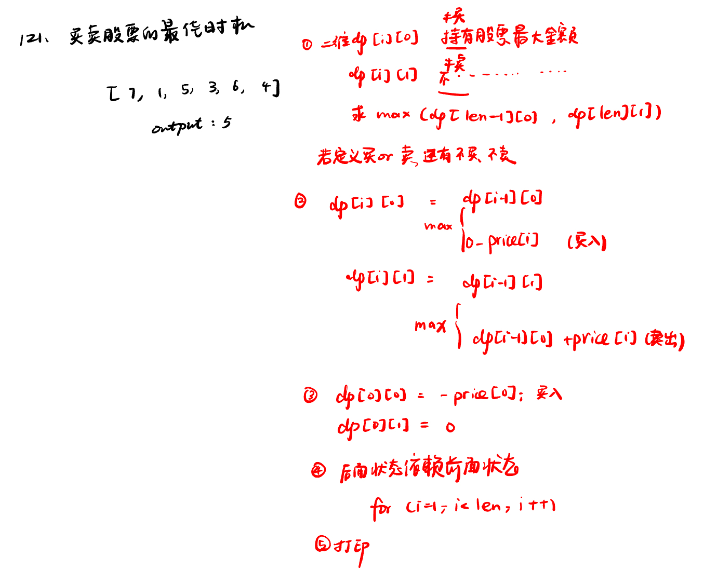
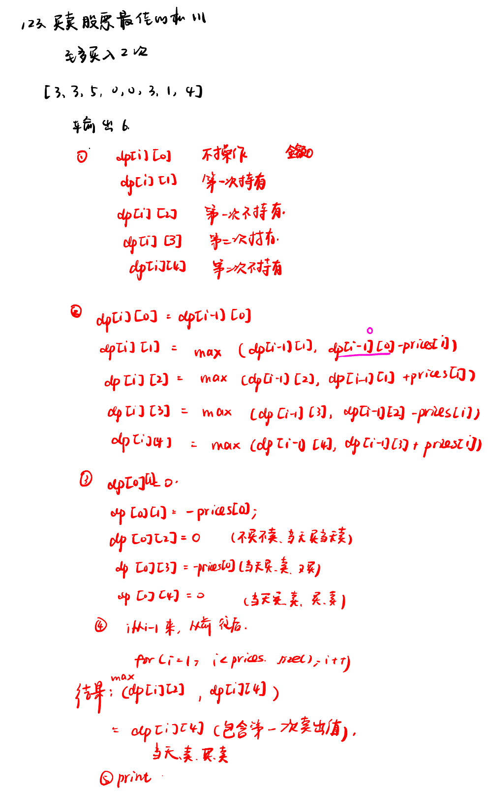

List: 121. 买卖股票的最佳时机，122.买卖股票的最佳时机II，123.买卖股票的最佳时机III

[121. 买卖股票的最佳时机](#01)，[122.买卖股票的最佳时机IIbest-time-to-buy-and-sell-stock-ii](#02)，[123.买卖股票的最佳时机IIIbest-time-to-buy-and-sell-stock-iii](#03)

# <span id="01">121. 买卖股票的最佳时机</span>

[Leetcode](https://leetcode.cn/problems/best-time-to-buy-and-sell-stock/) 

[Learning Materials](https://programmercarl.com/0121.%E4%B9%B0%E5%8D%96%E8%82%A1%E7%A5%A8%E7%9A%84%E6%9C%80%E4%BD%B3%E6%97%B6%E6%9C%BA.html)



```python
class Solution:
    def maxProfit(self, prices: List[int]) -> int:
        dp = [[0] * 2 for _ in range(len(prices))]
        dp[0][0] = -prices[0]
        dp[0][1] = 0
        for i in range(1, len(prices)):
            dp[i][0] = max(dp[i - 1][0], - prices[i])
            dp[i][1] = max(dp[i - 1][0] + prices[i], dp[i - 1][1])
        return max(dp[len(prices) - 1][0], dp[len(prices) - 1][1])
```

- 优化：从递推公式可以看出，dp[i]只是依赖于dp[i - 1]的状态。那么我们只需要记录 当前天的dp状态和前一天的dp状态就可以了，可以使用滚动数组来节省空间，代码如下：

```c++
        int len = prices.size();
        vector<vector<int>> dp(2, vector<int>(2)); // 注意这里只开辟了一个2 * 2大小的二维数组
        dp[0][0] -= prices[0];
        dp[0][1] = 0;
        for (int i = 1; i < len; i++) {
            dp[i % 2][0] = max(dp[(i - 1) % 2][0], -prices[i]);
            dp[i % 2][1] = max(dp[(i - 1) % 2][1], prices[i] + dp[(i - 1) % 2][0]);
        }
        return dp[(len - 1) % 2][1];
```

# <span id="02">122.买卖股票的最佳时机IIbest-time-to-buy-and-sell-stock-ii</span>

[Leetcode](https://leetcode.cn/problems/best-time-to-buy-and-sell-stock-ii/description/) 

[Learning Materials](https://programmercarl.com/0122.%E4%B9%B0%E5%8D%96%E8%82%A1%E7%A5%A8%E7%9A%84%E6%9C%80%E4%BD%B3%E6%97%B6%E6%9C%BAII%EF%BC%88%E5%8A%A8%E6%80%81%E8%A7%84%E5%88%92%EF%BC%89.html#%E7%AE%97%E6%B3%95%E5%85%AC%E5%BC%80%E8%AF%BE)


```python
class Solution:
    def maxProfit(self, prices: List[int]) -> int:
        dp = [[0] * 2 for _ in range(len(prices))]
        dp[0][0] = -prices[0]
        dp[0][1] = 0
        for i in range(1, len(prices)):
            dp[i][0] = max(dp[i - 1][0], dp[i - 1][1] - prices[i])  #唯一区别
            dp[i][1] = max(dp[i - 1][0] + prices[i], dp[i - 1][1])
        return max(dp[len(prices) - 1][0], dp[len(prices) - 1][1])
```

# <span id="03">123.买卖股票的最佳时机IIIbest-time-to-buy-and-sell-stock-iii</span>

[Leetcode](https://leetcode.cn/problems/best-time-to-buy-and-sell-stock-iii/description/) 

[Learning Materials](https://programmercarl.com/0123.%E4%B9%B0%E5%8D%96%E8%82%A1%E7%A5%A8%E7%9A%84%E6%9C%80%E4%BD%B3%E6%97%B6%E6%9C%BAIII.html)



```python
class Solution:
    def maxProfit(self, prices: List[int]) -> int:
        dp = [[0] * 5 for _ in range(len(prices))]
        dp[0][0] = 0
        dp[0][1] = -prices[0]
        dp[0][2] = 0
        dp[0][3] = -prices[0]
        dp[0][4] = 0
        for i in range(1, len(prices)):
            dp[i][0] = dp[i - 1][0]
            dp[i][1] = max(dp[i - 1][1], dp[i - 1][0] - prices[i])  
            dp[i][2] = max(dp[i - 1][2], dp[i - 1][1] + prices[i])
            dp[i][3] = max(dp[i - 1][3], dp[i - 1][2] - prices[i])  
            dp[i][4] = max(dp[i - 1][4], dp[i - 1][3] + prices[i])
        return dp[len(prices) - 1][4]
```


- 优化的c++版

```c++
// 版本二
class Solution {
public:
    int maxProfit(vector<int>& prices) {
        if (prices.size() == 0) return 0;
        vector<int> dp(5, 0);
        dp[1] = -prices[0];
        dp[3] = -prices[0];
        for (int i = 1; i < prices.size(); i++) {
            dp[1] = max(dp[1], dp[0] - prices[i]);
            dp[2] = max(dp[2], dp[1] + prices[i]);
            dp[3] = max(dp[3], dp[2] - prices[i]);
            dp[4] = max(dp[4], dp[3] + prices[i]);
        }
        return dp[4];
    }
};
```

- 解释：

dp[1] = max(dp[1], dp[0] - prices[i]); 如果dp[1]取dp[1]，即保持买入股票的状态，那么 dp[2] = max(dp[2], dp[1] + prices[i]);中dp[1] + prices[i] 就是今天卖出。

如果dp[1]取dp[0] - prices[i]，今天买入股票，那么dp[2] = max(dp[2], dp[1] + prices[i]);中的dp[1] + prices[i]相当于是今天再卖出股票，一买一卖收益为0，对所得现金没有影响。相当于今天买入股票又卖出股票，等于没有操作，保持昨天卖出股票的状态了。
