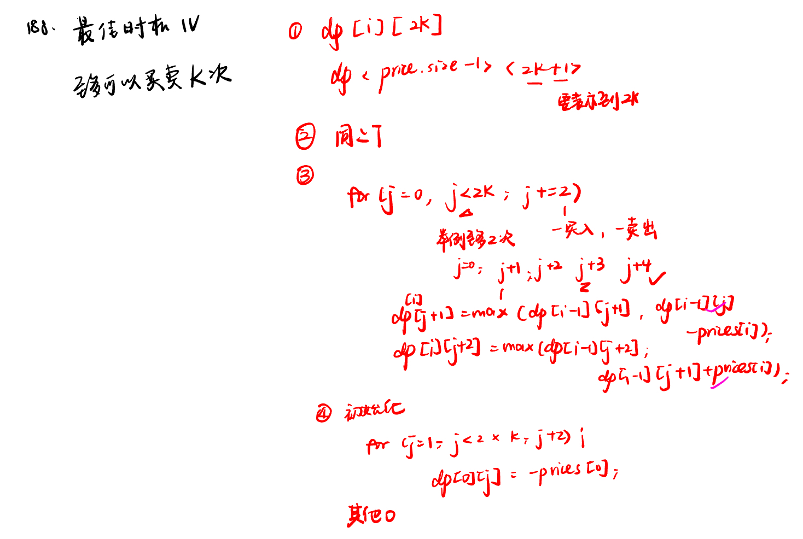
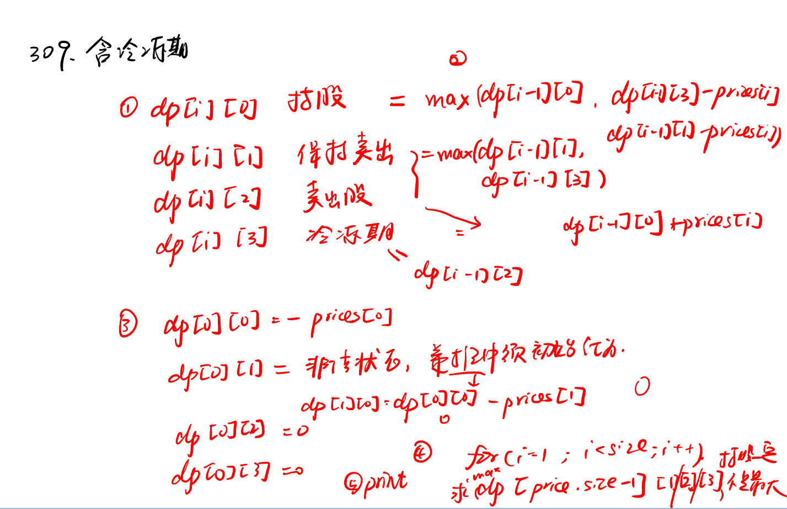
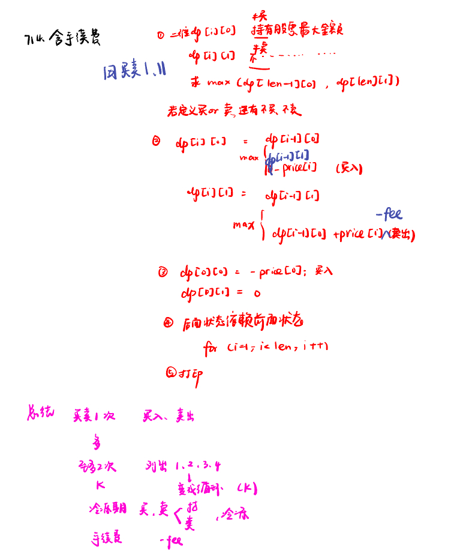
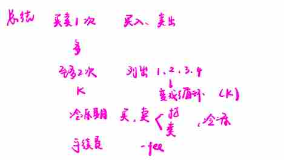

List: 188.买卖股票的最佳时机IV，309.最佳买卖股票时机含冷冻期，714.买卖股票的最佳时机含手续费，股票总结

[188.买卖股票的最佳时机IVbest-time-to-buy-and-sell-stock-iv](#01)，[309.最佳买卖股票时机含冷冻期best-time-to-buy-and-sell-stock-with-cooldown](#02)，[714.买卖股票的最佳时机含手续费best-time-to-buy-and-sell-stock-with-transaction-fee](#03)，[股票总结](#04)

# <span id="01">188.买卖股票的最佳时机IVbest-time-to-buy-and-sell-stock-iv</span>

[Leetcode](https://leetcode.cn/problems/best-time-to-buy-and-sell-stock-iv/description/) 

[Learning Materials](https://programmercarl.com/0188.买卖股票的最佳时机IV.html#算法公开课)



```python
class Solution:
    def maxProfit(self, k: int, prices: List[int]) -> int:
        dp = [[0] * (2 * k + 1) for _ in range(len(prices))]
        for j in range(1, 2 * k, 2):
            dp[0][j] = - prices[0]
        for i in range(1, len(prices)):
            for j in range(0, 2 * k, 2):
                dp[i][j + 1] = max(dp[i - 1][j + 1], dp[i - 1][j] - prices[i])
                dp[i][j + 2] = max(dp[i - 1][j + 2], dp[i - 1][j + 1] + prices[i])
        return dp[len(prices) - 1][2 * k]
```

# <span id="02">309.最佳买卖股票时机含冷冻期best-time-to-buy-and-sell-stock-with-cooldown</span>

[Leetcode](https://leetcode.cn/problems/best-time-to-buy-and-sell-stock-with-cooldown/description/) 

[Learning Materials](https://programmercarl.com/0309.%E6%9C%80%E4%BD%B3%E4%B9%B0%E5%8D%96%E8%82%A1%E7%A5%A8%E6%97%B6%E6%9C%BA%E5%90%AB%E5%86%B7%E5%86%BB%E6%9C%9F.html#%E7%AE%97%E6%B3%95%E5%85%AC%E5%BC%80%E8%AF%BE)



```python
class Solution:
    def maxProfit(self, prices: List[int]) -> int:
        dp = [[0] * 4 for i in range(len(prices))]
        dp[0][0] = -prices[0]
        dp[0][1] = 0
        dp[0][2] = 0
        dp[0][3] = 0
        for i in range(1, len(prices)):
            dp[i][0] = max(dp[i - 1][0], dp[i - 1][3] - prices[i], dp[i - 1][1] - prices[i])
            dp[i][1] = max(dp[i - 1][1], dp[i - 1][3])
            dp[i][2] = dp[i - 1][0] + prices[i]
            dp[i][3] = dp[i - 1][2]
        return max(dp[len(prices) - 1][1], dp[len(prices) - 1][2], dp[len(prices) - 1][3])
```

# <span id="03">714.买卖股票的最佳时机含手续费best-time-to-buy-and-sell-stock-with-transaction-fee</span>

[Leetcode](https://leetcode.cn/problems/best-time-to-buy-and-sell-stock-with-transaction-fee/description/) 

[Learning Materials](https://programmercarl.com/0714.%E4%B9%B0%E5%8D%96%E8%82%A1%E7%A5%A8%E7%9A%84%E6%9C%80%E4%BD%B3%E6%97%B6%E6%9C%BA%E5%90%AB%E6%89%8B%E7%BB%AD%E8%B4%B9%EF%BC%88%E5%8A%A8%E6%80%81%E8%A7%84%E5%88%92%EF%BC%89.html)



```python
class Solution:
    def maxProfit(self, prices: List[int], fee: int) -> int:
        dp = [[0] * 2 for _ in range(len(prices))]
        dp[0][0] = -prices[0]
        dp[0][1] = 0
        for i in range(1, len(prices)):
            dp[i][0] = max(dp[i - 1][0], dp[i - 1][1] - prices[i])
            dp[i][1] = max(dp[i - 1][0] + prices[i] - fee, dp[i - 1][1])
        return max(dp[len(prices) - 1][0], dp[len(prices) - 1][1])
```

# <span id="04">总结</span>



