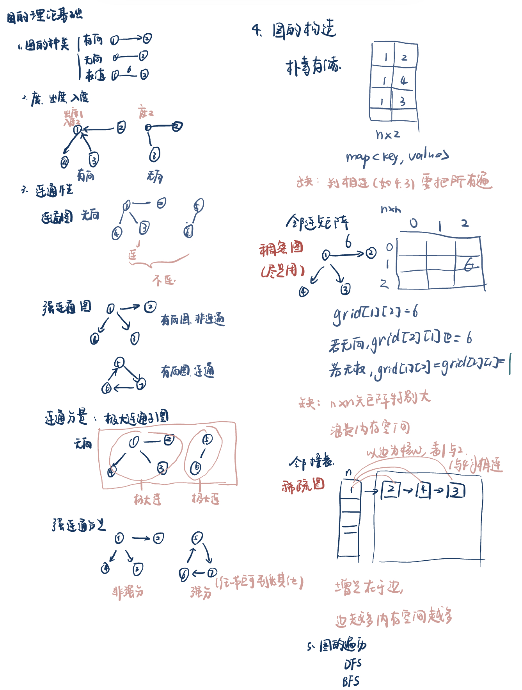
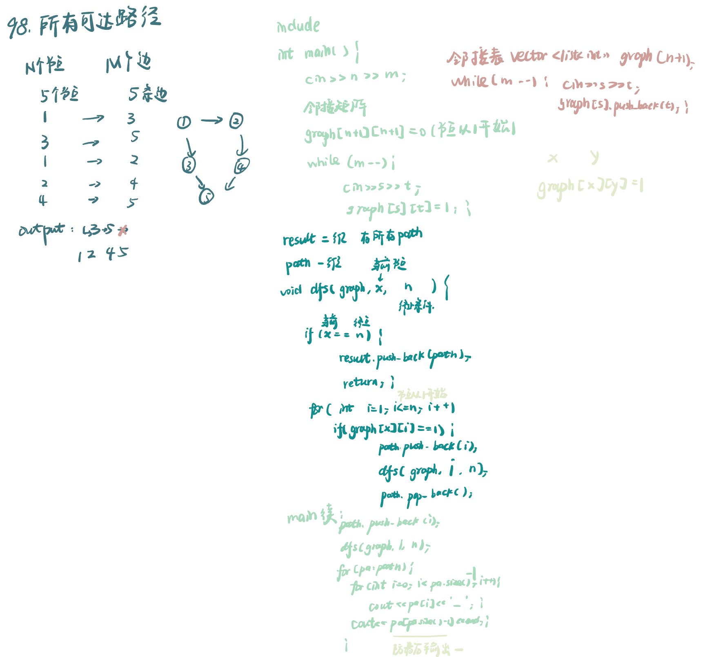
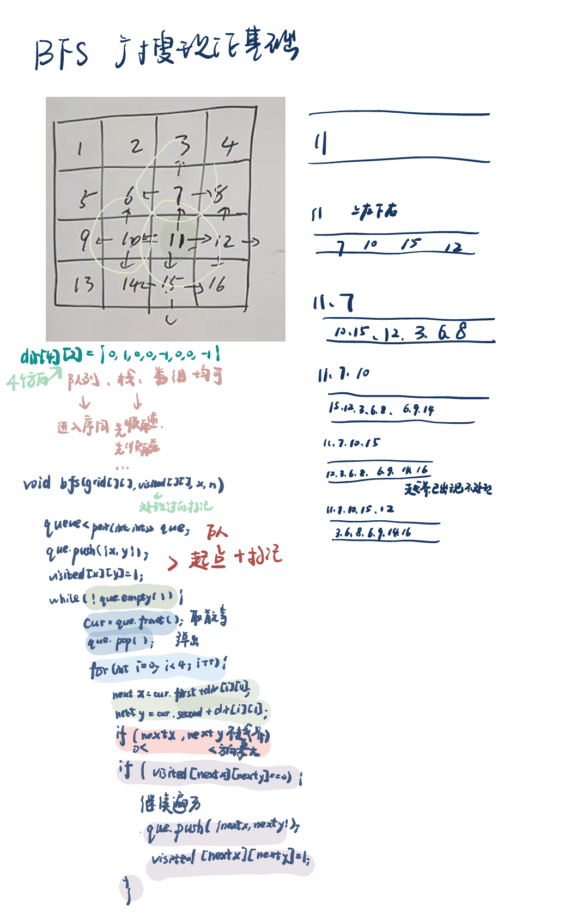

List: 图论理论基础，深度优先搜索理论基础，98. 所有可达路径，广度优先搜索理论基础

[图论理论基础](#01)，[](#02)，[](#03)，[](#04),[](#05)

# <span id="01">图论理论基础</span>

[Learning Materials](https://programmercarl.com/kamacoder/%E5%9B%BE%E8%AE%BA%E7%90%86%E8%AE%BA%E5%9F%BA%E7%A1%80.html)



# <span id="02">深度优先搜索理论基础</span>

[Learning Materials](https://programmercarl.com/kamacoder/%E5%9B%BE%E8%AE%BA%E6%B7%B1%E6%90%9C%E7%90%86%E8%AE%BA%E5%9F%BA%E7%A1%80.html)


# <span id="03">98. 所有可达路径</span>

[ACM模式coder](https://kamacoder.com/problempage.php?pid=1170) 

[Learning Materials](https://programmercarl.com/kamacoder/0098.%E6%89%80%E6%9C%89%E5%8F%AF%E8%BE%BE%E8%B7%AF%E5%BE%84.html)



## 邻接矩阵法：

```python
result = []
path = []

def dfs(graph, x, n):
    if x == n:
        result.append(path[:])
        return
    for i in range(1, n + 1):
        if graph[x][i] == 1:
            path.append(i)
            dfs(graph, i, n)
            path.pop()

def main():
    n, m = map(int, input().split())
    graph = [[0] * (n + 1) for _ in range(n + 1)]
    for _ in range(m):
        s, t = map(int, input().split())
        graph[s][t] = 1
    path.append(1)
    dfs(graph, 1, n)
    if not result:
        print(-1)
    else:
        for p in result:
            print(' '.join(map(str, p)))
if __name__ == "__main__":
    main()
```

## 邻接表法：

```python
from collections import defaultdict

result = []
path = []

def dfs(graph, x, n):
    if x == n:
        result.append(path[:])
        return
    for i in graph[x]: #和邻接矩阵的区别之处，及没有if语句
        path.append(i)
        dfs(graph, i, n)
        path.pop()

def main():
    n, m = map(int, input().split())
    graph = defaultdict(list) #和邻接矩阵的区别之处
    for _ in range(m):
        s, t = map(int, input().split())
        graph[s].append(t) #和邻接矩阵的区别之处
    path.append(1)
    dfs(graph, 1, n)
    if not result:
        print(-1)
    else:
        for p in result:
            print(' '.join(map(str, p)))
if __name__ == "__main__":
    main()
```


# <span id="04">广度优先搜索理论基础</span> 

[Learning Materials](https://programmercarl.com/kamacoder/%E5%9B%BE%E8%AE%BA%E5%B9%BF%E6%90%9C%E7%90%86%E8%AE%BA%E5%9F%BA%E7%A1%80.html)



