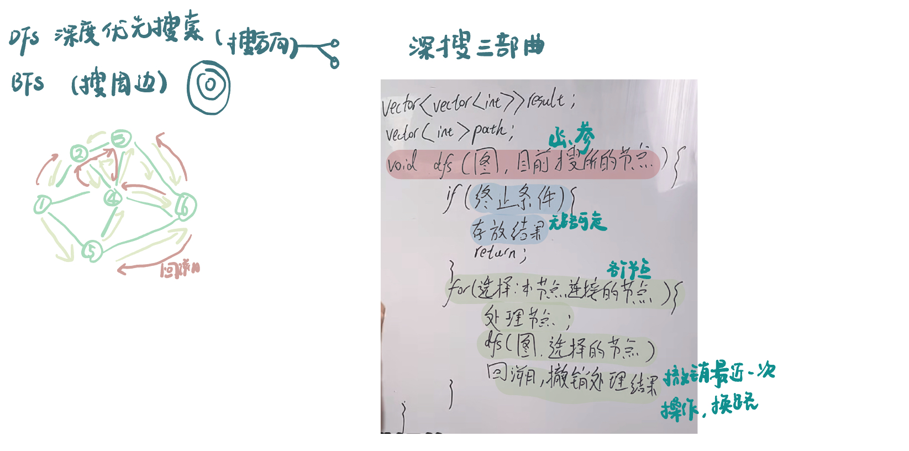

List: 图论理论基础，深度优先搜索理论基础，98. 所有可达路径，广度优先搜索理论基础

[图论理论基础](#01)，，，,

# 图论理论基础

[Learning Materials](https://programmercarl.com/kamacoder/%E5%9B%BE%E8%AE%BA%E7%90%86%E8%AE%BA%E5%9F%BA%E7%A1%80.html)

# 深度优先搜索理论基础

[Learning Materials](https://programmercarl.com/kamacoder/%E5%9B%BE%E8%AE%BA%E6%B7%B1%E6%90%9C%E7%90%86%E8%AE%BA%E5%9F%BA%E7%A1%80.html)

# 98. 所有可达路径

[ACM模式coder](https://kamacoder.com/problempage.php?pid=1170) 

[Learning Materials](https://programmercarl.com/kamacoder/0098.%E6%89%80%E6%9C%89%E5%8F%AF%E8%BE%BE%E8%B7%AF%E5%BE%84.html)

# 广度优先搜索理论基础 

[Learning Materials](https://programmercarl.com/kamacoder/%E5%9B%BE%E8%AE%BA%E5%B9%BF%E6%90%9C%E7%90%86%E8%AE%BA%E5%9F%BA%E7%A1%80.html)

