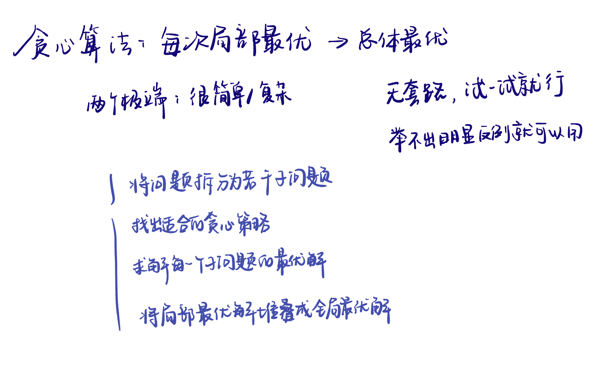

List: 理论基础，455.分发饼干，376. 摆动序列，53. 最大子序和

[理论基础](#01)，，，

# 理论基础

[Learning Materials](https://programmercarl.com/%E8%B4%AA%E5%BF%83%E7%AE%97%E6%B3%95%E7%90%86%E8%AE%BA%E5%9F%BA%E7%A1%80.html)

# 理论基础

[Leetcode]() 

[Learning Materials]()

# 理论基础

[Leetcode]() 

[Learning Materials]()

# 理论基础

[Leetcode]() 

[Learning Materials]()

