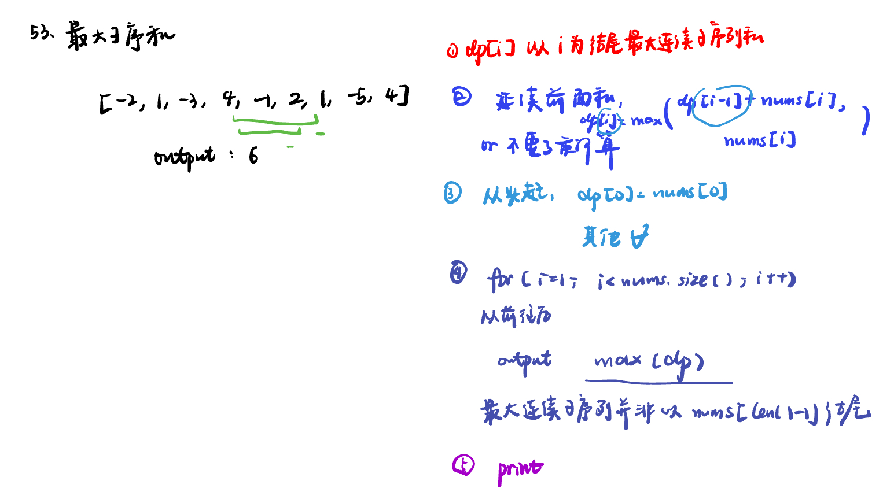

List: 理论基础，455.分发饼干，376. 摆动序列，53. 最大子序和

[理论基础](#01)，[455.分发饼干assign-cookies](#02)，[376. 摆动序列wiggle-subsequence](#03)，[53. 最大子序和maximum-subarray](#04)

# <span id="01">理论基础</span>


[Learning Materials](https://programmercarl.com/%E8%B4%AA%E5%BF%83%E7%AE%97%E6%B3%95%E7%90%86%E8%AE%BA%E5%9F%BA%E7%A1%80.html)


# <span id="02">455.分发饼干assign-cookies</span>

[Leetcode](https://leetcode.cn/problems/assign-cookies/description/) 

[Learning Materials](https://programmercarl.com/0455.%E5%88%86%E5%8F%91%E9%A5%BC%E5%B9%B2.html#%E7%AE%97%E6%B3%95%E5%85%AC%E5%BC%80%E8%AF%BE)


## 大饼干喂大孩子

```python
class Solution:
    def findContentChildren(self, g: List[int], s: List[int]) -> int:
        g.sort()
        s.sort()
        result = 0
        index = len(s) - 1
        for i in range(len(g) - 1, -1, -1):
            if index >= 0 and s[index] >= g[i]:
                result += 1
                index -= 1
        return result
```

顺序不能换：外面的 for 是里的下标 i 是固定移动的，而 if 里面的下标 index 是符合条件才移动的。如果 for 控制的是饼干， if 控制胃口，找不到。

## 小孩子吃小饼干

```python
class Solution:
    def findContentChildren(self, g: List[int], s: List[int]) -> int:
        g.sort()
        s.sort()
        result = 0
        index = 0
        for i in range(len(s)):
            if index < len(g) and s[i] >= g[index]:
                result += 1
                index += 1
        return result
```

# <span id="03">376. 摆动序列wiggle-subsequence</span>

[Leetcode](https://leetcode.cn/problems/wiggle-subsequence/) 

[Learning Materials](https://programmercarl.com/0376.%E6%91%86%E5%8A%A8%E5%BA%8F%E5%88%97.html#%E7%AE%97%E6%B3%95%E5%85%AC%E5%BC%80%E8%AF%BE)


```python
class Solution:
    def wiggleMaxLength(self, nums: List[int]) -> int:
        if len(nums) == 1:
            return 1
        prediff = 0
        curdiff = 0
        result = 1
        for i in range(len(nums) - 1):
            curdiff = nums[i + 1] - nums[i]
            if (prediff >= 0 and curdiff < 0) or (prediff <= 0 and curdiff > 0):
                result += 1
                prediff = curdiff
        return result
```

# <span id="04">53. 最大子序和maximum-subarray</span>

[Leetcode](https://leetcode.cn/problems/maximum-subarray/description/) 

[Learning Materials](https://programmercarl.com/0053.%E6%9C%80%E5%A4%A7%E5%AD%90%E5%BA%8F%E5%92%8C.html#%E7%AE%97%E6%B3%95%E5%85%AC%E5%BC%80%E8%AF%BE)



```python
class Solution:
    def maxSubArray(self, nums: List[int]) -> int:
        result = float('-inf')
        count = 0
        for i in range(len(nums)):
            count += nums[i]
            if count > result:
                result = count
            if count < 0:
                count = 0
        return result
```
