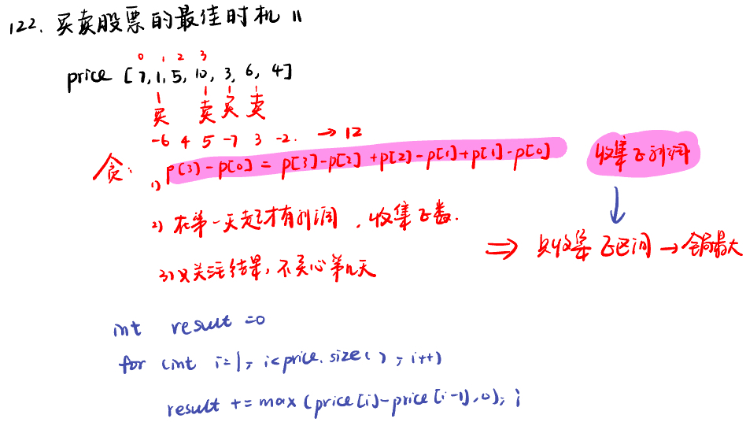
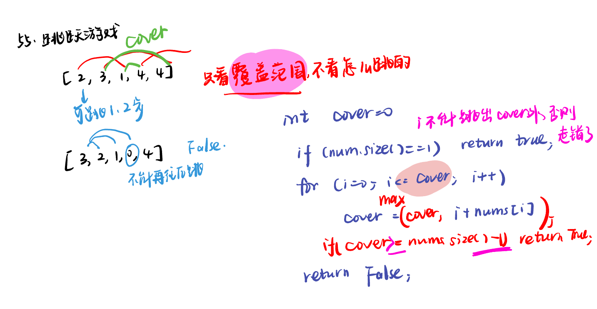
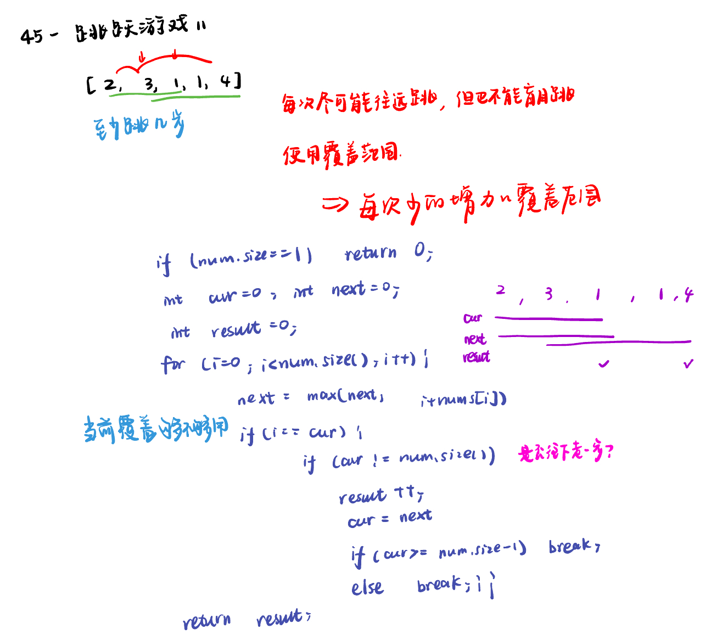
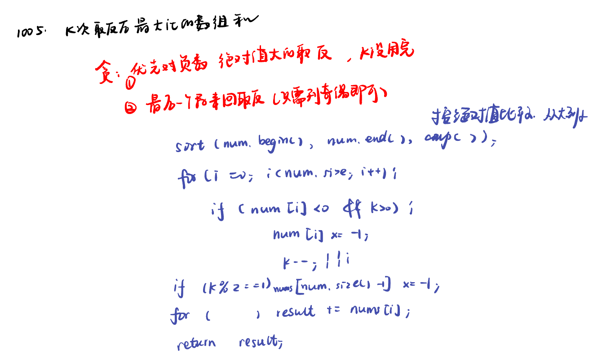

List: 122.买卖股票的最佳时机II，55. 跳跃游戏，45.跳跃游戏II，1005.K次取反后最大化的数组和

[122.买卖股票的最佳时机 IIbest-time-to-buy-and-sell-stock-ii](#01)，[55. 跳跃游戏jump-game](#02)，[45.跳跃游戏 IIjump-game-ii](#03)，[](#04)

# <span id="01">122.买卖股票的最佳时机 IIbest-time-to-buy-and-sell-stock-ii</span>

[Leetcode](https://leetcode.cn/problems/best-time-to-buy-and-sell-stock-ii/description/) 

[Learning Materials](https://programmercarl.com/0122.%E4%B9%B0%E5%8D%96%E8%82%A1%E7%A5%A8%E7%9A%84%E6%9C%80%E4%BD%B3%E6%97%B6%E6%9C%BAII.html)



```python
class Solution:
    def maxProfit(self, prices: List[int]) -> int:
        result = 0
        for i in range(1, len(prices)):
            result += max(prices[i] - prices[i - 1], 0)
        return result
```

# <span id="02">55. 跳跃游戏jump-game</span>

[Leetcode](https://leetcode.cn/problems/jump-game/description/) 

[Learning Materials](https://programmercarl.com/0055.%E8%B7%B3%E8%B7%83%E6%B8%B8%E6%88%8F.html#%E7%AE%97%E6%B3%95%E5%85%AC%E5%BC%80%E8%AF%BE)



```python
class Solution:
    def canJump(self, nums: List[int]) -> bool:
        cover = 0
        if len(nums) == 1:
            return True
        i = 0
        while i <= cover:
            cover = max(cover, i + nums[i])
            if cover >= len(nums) - 1: # 如果覆盖范围能够到达或超过数组的最后一个位置，返回 True
                return True
            i += 1
        return False
```

# <span id="03">45.跳跃游戏 IIjump-game-ii</span>

[Leetcode](https://leetcode.cn/problems/jump-game-ii/description/) 

[Learning Materials](https://programmercarl.com/0045.%E8%B7%B3%E8%B7%83%E6%B8%B8%E6%88%8FII.html#%E7%AE%97%E6%B3%95%E5%85%AC%E5%BC%80%E8%AF%BE)



```python
class Solution:
    def jump(self, nums: List[int]) -> int:
        cur = 0
        ans = 0
        cover = 0
        if len(nums) == 1:
            return 0
        for i in range(len(nums)):
            cover = max(cover, i + nums[i])
            if i == cur:
                if cur != len(nums) - 1:
                    cur = cover
                    ans += 1
                    if cur >= len(nums) - 1:
                        break
                else:
                    break
        return ans
```

## 优化：

```python
class Solution:
    def jump(self, nums: List[int]) -> int:
        cur = 0
        ans = 0
        cover = 0
        if len(nums) == 1:
            return 0
        for i in range(len(nums) - 1):
            cover = max(cover, i + nums[i])
            if i == cur:
                cur = cover
                ans += 1
        return ans
```

- 精髓在于控制移动下标 i 只移动到 nums.size() - 2 的位置，所以移动下标只要遇到当前覆盖最远距离的下标，直接步数加一.

- 移动下标只要遇到当前覆盖最远距离的下标，直接步数加一，不考虑是不是终点的情况。只要让移动下标，最大只能移动到 nums.size - 2 的地方就可以了.

  - 因为当移动下标指向 nums.size - 2 时：如果移动下标等于当前覆盖最大距离下标， 需要再走一步（即 ans++），因为最后一步一定是可以到的终点。（题目假设总是可以到达数组的最后一个位置），如果移动下标不等于当前覆盖最大距离下标，说明当前覆盖最远距离就可以直接达到终点了，不需要再走一步。

# <span id="04">1005.K次取反后最大化的数组和maximize-sum-of-array-after-k-negations</span>

[Leetcode](https://leetcode.cn/problems/maximize-sum-of-array-after-k-negations/) 

[Learning Materials](https://programmercarl.com/1005.K%E6%AC%A1%E5%8F%96%E5%8F%8D%E5%90%8E%E6%9C%80%E5%A4%A7%E5%8C%96%E7%9A%84%E6%95%B0%E7%BB%84%E5%92%8C.html#%E7%AE%97%E6%B3%95%E5%85%AC%E5%BC%80%E8%AF%BE)



