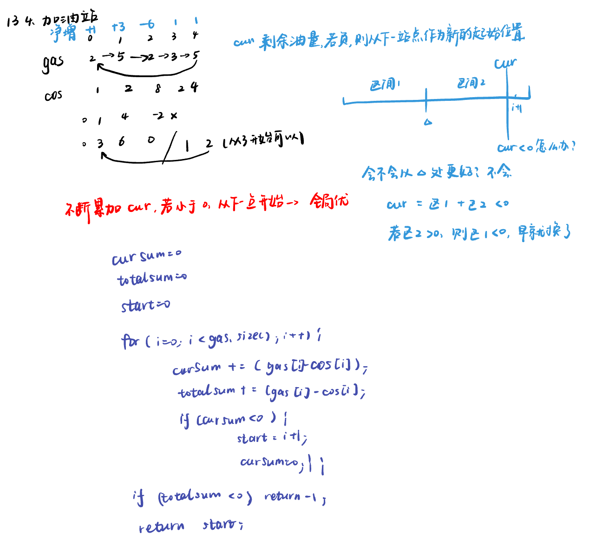
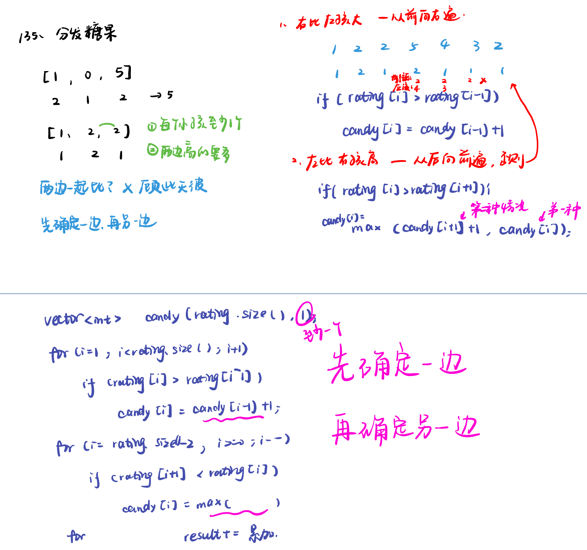
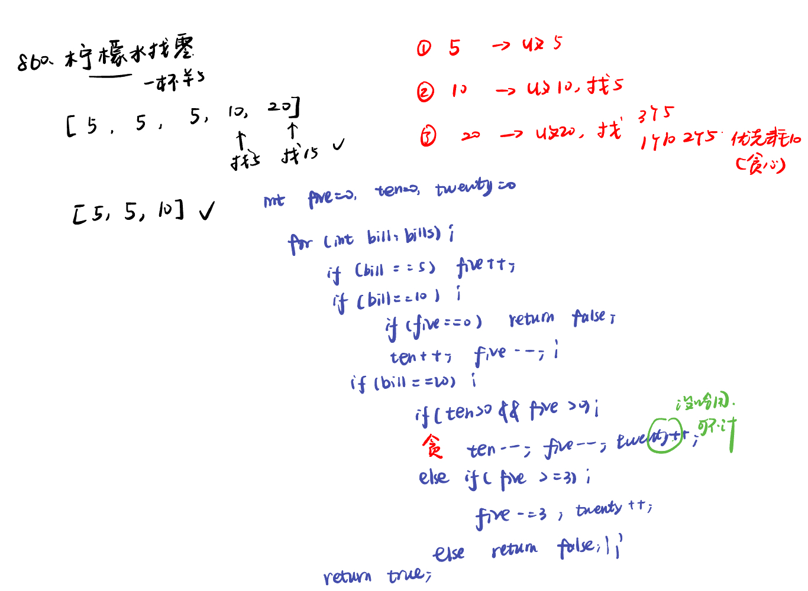
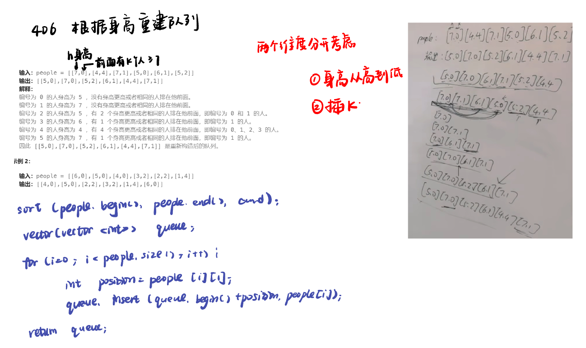

List: 134. 加油站，135. 分发糖果，860.柠檬水找零，406.根据身高重建队列

[134. 加油站gas-station](#01)，[135. 分发糖果candy](#02)，[860.柠檬水找零lemonade-change](#03)，[406.根据身高重建队列queue-reconstruction-by-height](#04)

# <span id="01">134. 加油站gas-station</span>

[Leetcode](https://leetcode.cn/problems/gas-station/description/) 

[Learning Materials](https://programmercarl.com/0134.加油站.html)



```python
class Solution:
    def canCompleteCircuit(self, gas: List[int], cost: List[int]) -> int:
        cur = 0
        total = 0
        start = 0
        for i in range(len(gas)):
            cur += gas[i] - cost[i]
            total += gas[i] - cost[i]
            if cur < 0:
                cur = 0
                start = i + 1
        if total < 0:
            return -1
        return start
```

## 另一种方法：全局贪心选择

- 情况一：如果gas的总和小于cost总和，那么无论从哪里出发，一定是跑不了一圈的

- 情况二：rest[i] = gas[i]-cost[i]为一天剩下的油，i从0开始计算累加到最后一站，如果累加没有出现负数，说明从0出发，油就没有断过，那么0就是起点。

- 情况三：如果累加的最小值是负数，汽车就要从非0节点出发，从后向前，看哪个节点能把这个负数填平，能把这个负数填平的节点就是出发节点。

```python
class Solution:
    def canCompleteCircuit(self, gas: List[int], cost: List[int]) -> int:
        cur = 0 # 当前累计的剩余油量
        minfuel = float('inf') # 从起点出发，油箱里的油量最小值
        for i in range(len(gas)):
            cur += gas[i] - cost[i]
            if cur < minfuel:
                minfuel = cur
                
        if cur < 0:
            return -1 # 情况1：整个行程的总消耗大于总供给，无法完成一圈

        if minfuel > 0:
            return 0 # 情况2：从起点出发到任何一个加油站时油箱的剩余油量都不会小于0，可以从起点出发完成一圈
        
        for i in range(len(gas) - 1, -1, -1):
            minfuel += gas[i] - cost[i]
            if minfuel >= 0:
                return i # 情况3：找到一个位置使得从该位置出发油箱的剩余油量不会小于0，返回该位置的索引
        return -1
```

# <span id="02">135. 分发糖果candy</span>

本题涉及到一个思想，就是想处理好一边再处理另一边，不要两边想着一起兼顾，后面还会有题目用到这个思路

[Leetcode](https://leetcode.cn/problems/candy/description/) 

[Learning Materials](https://programmercarl.com/0135.%E5%88%86%E5%8F%91%E7%B3%96%E6%9E%9C.html#%E7%AE%97%E6%B3%95%E5%85%AC%E5%BC%80%E8%AF%BE)



```python
class Solution:
    def candy(self, ratings: List[int]) -> int:
        candy = [1] * len(ratings)
        for i in range(1, len(ratings)):
            if ratings[i] > ratings[i - 1]:
                candy[i] = candy[i - 1] + 1
        for i in range(len(ratings) - 2, -1, -1):
            if ratings[i] > ratings[i + 1]:
                candy[i] = max(candy[i + 1] + 1, candy[i])
        return sum(candy)
```

# <span id="03">860.柠檬水找零lemonade-change</span>

[Leetcode](https://leetcode.cn/problems/lemonade-change/description/) 

[Learning Materials](https://programmercarl.com/0860.%E6%9F%A0%E6%AA%AC%E6%B0%B4%E6%89%BE%E9%9B%B6.html#%E7%AE%97%E6%B3%95%E5%85%AC%E5%BC%80%E8%AF%BE)



```python
class Solution:
    def lemonadeChange(self, bills: List[int]) -> bool:
        five = 0
        ten = 0
        twenty = 0
        for i in range(len(bills)):
            if bills[i] == 5:
                five += 1
            if bills[i] == 10:
                if five > 0:
                    five -= 1
                    ten += 1
                else:
                    return False
            if bills[i] == 20:
                if five > 0 and ten > 0:
                    ten -= 1
                    five -= 1
                    twenty += 1
                elif five >= 3:
                    five -= 3
                    twenty += 1
                else:
                    return False
        return True
```

# <span id="04">406.根据身高重建队列queue-reconstruction-by-height</span>

[Leetcode](https://leetcode.cn/problems/queue-reconstruction-by-height/description/) 

[Learning Materials](https://programmercarl.com/0406.%E6%A0%B9%E6%8D%AE%E8%BA%AB%E9%AB%98%E9%87%8D%E5%BB%BA%E9%98%9F%E5%88%97.html#%E7%AE%97%E6%B3%95%E5%85%AC%E5%BC%80%E8%AF%BE)



