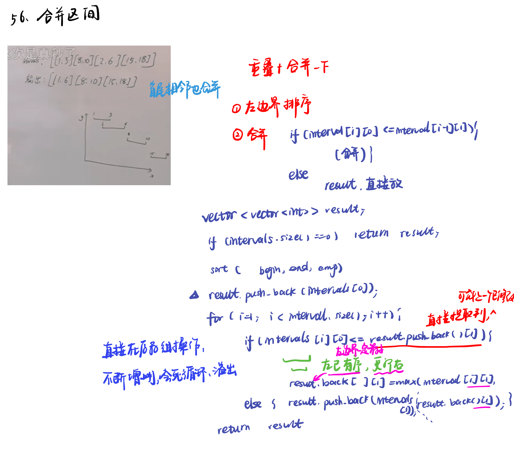
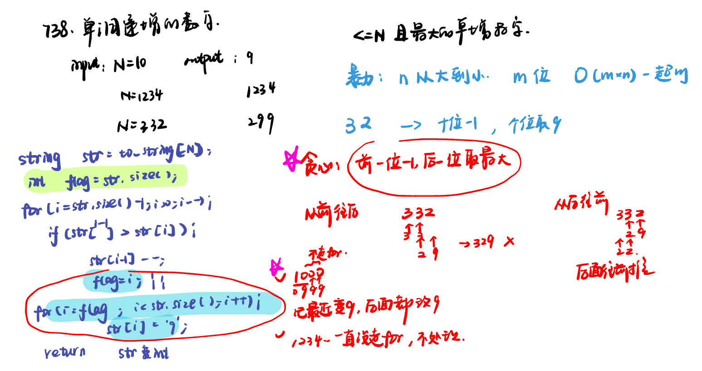
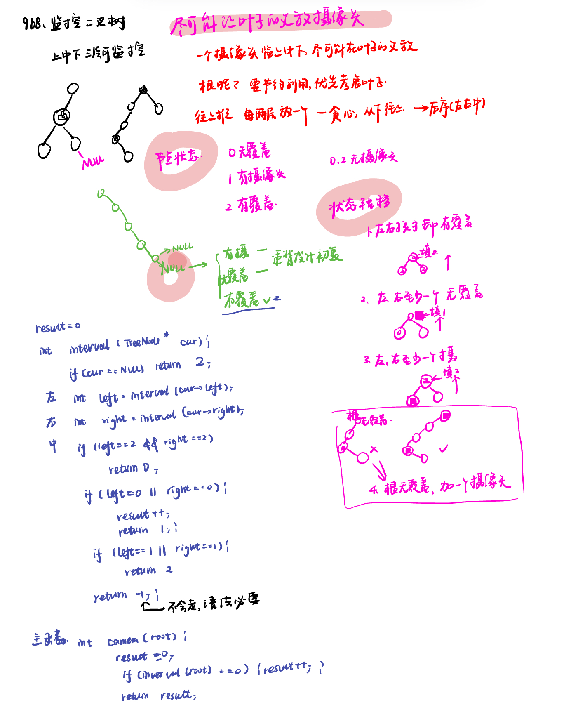

List: 56. 合并区间，738.单调递增的数字，968.监控二叉树，总结

[56. 合并区间merge-intervals](#01)，[738.单调递增的数字monotone-increasing-digits](#02)，[968.监控二叉树binary-tree-cameras](#03)，[](#04),[](#05)

# <span id="01">56. 合并区间merge-intervals</span>

[Leetcode](https://leetcode.cn/problems/merge-intervals/description/) 

[Learning Materials](https://programmercarl.com/0056.%E5%90%88%E5%B9%B6%E5%8C%BA%E9%97%B4.html)



```python
class Solution:
    def merge(self, intervals: List[List[int]]) -> List[List[int]]:
        result = []
        if len(intervals) == 0:
            return result
        intervals.sort(key = lambda x: x[0])
        result.append(intervals[0])
        for i in range(1, len(intervals)):
            if intervals[i][0] <= result[-1][1]:
                result[-1][1] = max(result[-1][1], intervals[i][1])
            else:
                result.append(intervals[i])
        return result
```

# <span id="02">738.单调递增的数字monotone-increasing-digits</span>

[Leetcode](https://leetcode.cn/problems/monotone-increasing-digits/description/) 

[Learning Materials](https://programmercarl.com/0738.%E5%8D%95%E8%B0%83%E9%80%92%E5%A2%9E%E7%9A%84%E6%95%B0%E5%AD%97.html)



```python
class Solution:
    def monotoneIncreasingDigits(self, n: int) -> int:
        string = str(n)
        flag = len(string)
        # flag用来标记赋值9从哪里开始
        # 设置为字符串长度，为了防止第二个for循环在flag没有被赋值的情况下执行
        for i in range(len(string) - 1, 0, -1):
            # 如果当前字符比前一个字符小，说明需要修改前一个字符
            if string[i - 1] > string[i]:
                string = string[:i - 1] + str(int(string[i - 1]) - 1) + string[i:]
                flag = i 
        for i in range(flag, len(string)):
            string = string[:i] + '9' + string[i + 1:]
        return int(string)
```

# <span id="03">968.监控二叉树binary-tree-cameras</span>

[Leetcode](https://leetcode.cn/problems/binary-tree-cameras/description/) 

[Learning Materials](https://programmercarl.com/0968.%E7%9B%91%E6%8E%A7%E4%BA%8C%E5%8F%89%E6%A0%91.html#%E7%AE%97%E6%B3%95%E5%85%AC%E5%BC%80%E8%AF%BE)



```python
# Definition for a binary tree node.
# class TreeNode:
#     def __init__(self, val=0, left=None, right=None):
#         self.val = val
#         self.left = left
#         self.right = right
class Solution:
    def __init__(self):
        self.result = 0
    def minCameraCover(self, root: Optional[TreeNode]) -> int:
        if self.interval(root) == 0:
            self.result += 1
        return self.result
    def interval(self, cur):
        if not cur:
            return 2
        left = self.interval(cur.left)
        right = self.interval(cur.right)
        if left == 2 and right == 2:
            return 0
        if left == 0 or right == 0:
            self.result += 1
            return 1
        if left == 1 or right == 1:
            return 2
```

# <span id="04">理论基础</span>

- 两个维度的权衡：不要顾此失彼，要先确定一个维度，再确定另一个一个维度。

- 区间问题：前后两个的判断


