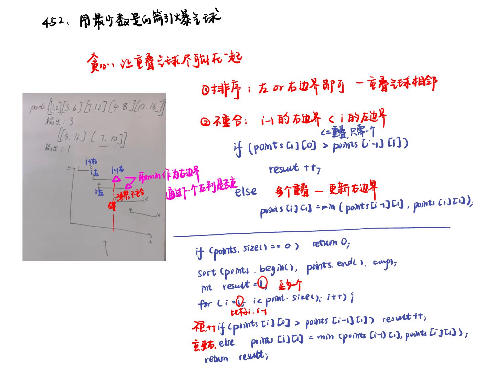

List: 重叠区间：452. 用最少数量的箭引爆气球，435. 无重叠区间，763.划分字母区间

[452. 用最少数量的箭引爆气球minimum-number-of-arrows-to-burst-balloons](#01)，[](#02)，[](#03)

# <span id="01">452. 用最少数量的箭引爆气球minimum-number-of-arrows-to-burst-balloons</span>

[Leetcode](https://leetcode.cn/problems/minimum-number-of-arrows-to-burst-balloons/) 

[Learning Materials](https://programmercarl.com/0452.%E7%94%A8%E6%9C%80%E5%B0%91%E6%95%B0%E9%87%8F%E7%9A%84%E7%AE%AD%E5%BC%95%E7%88%86%E6%B0%94%E7%90%83.html)



```python
class Solution:
    def findMinArrowShots(self, points: List[List[int]]) -> int:
        if len(points) == 0:
            return 0
        points.sort(key = lambda x: x[0])
        result = 1
        for i in range(1, len(points)):
            if points[i][0] > points[i - 1][1]:
                result += 1
            else:
                points[i][1] = min(points[i][1], points[i - 1][1])
        return result
```

# <span id="02">理论基础</span>

[Leetcode]() 

[Learning Materials]()


# <span id="03">理论基础</span>

[Leetcode]() 

[Learning Materials]()


