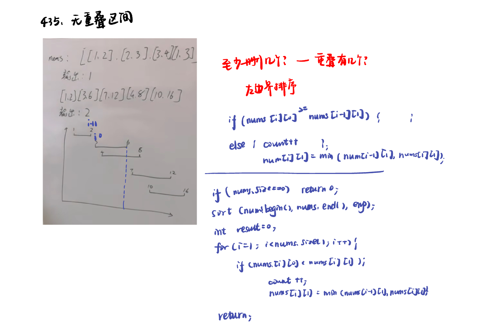
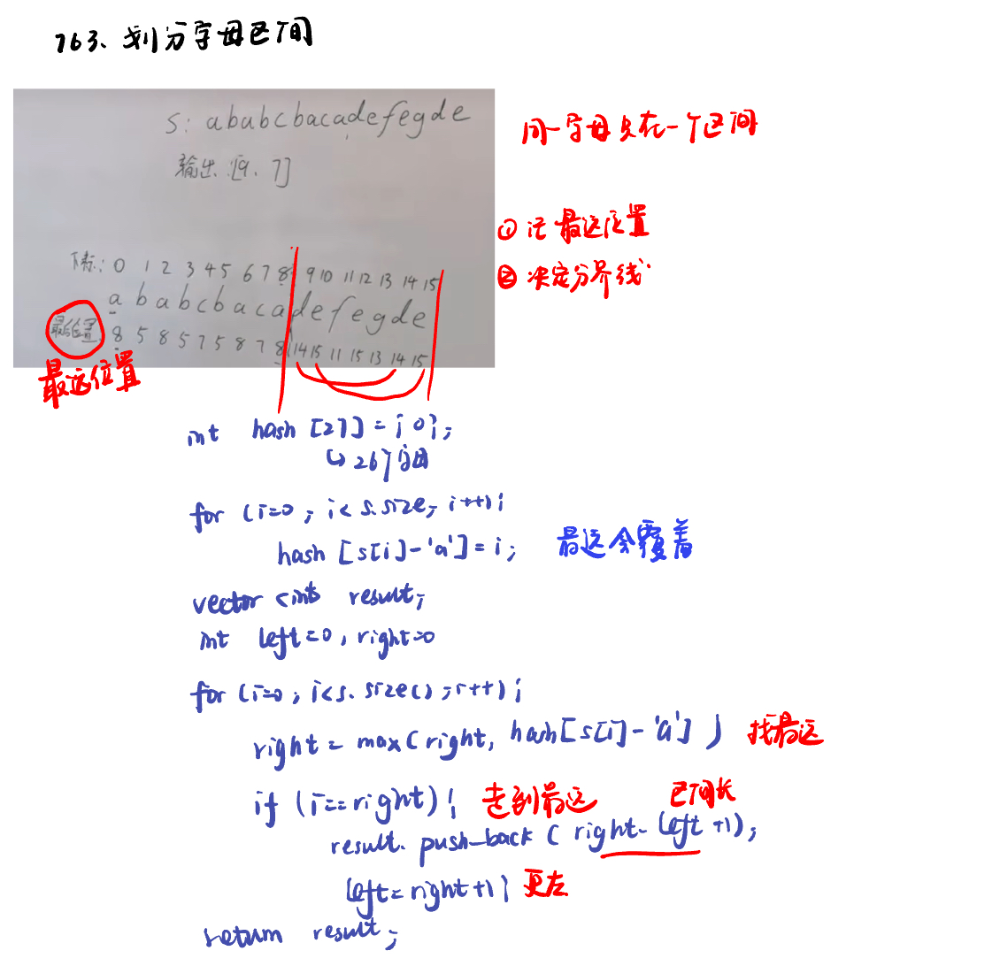

List: 重叠区间：452. 用最少数量的箭引爆气球，435. 无重叠区间，763.划分字母区间

[452. 用最少数量的箭引爆气球minimum-number-of-arrows-to-burst-balloons](#01)，[435. 无重叠区间non-overlapping-intervals](#02)，[](#03)

# <span id="01">452. 用最少数量的箭引爆气球minimum-number-of-arrows-to-burst-balloons</span>

[Leetcode](https://leetcode.cn/problems/minimum-number-of-arrows-to-burst-balloons/) 

[Learning Materials](https://programmercarl.com/0452.%E7%94%A8%E6%9C%80%E5%B0%91%E6%95%B0%E9%87%8F%E7%9A%84%E7%AE%AD%E5%BC%95%E7%88%86%E6%B0%94%E7%90%83.html)


```python
class Solution:
    def findMinArrowShots(self, points: List[List[int]]) -> int:
        if len(points) == 0:
            return 0
        points.sort(key = lambda x: x[0])
        result = 1
        for i in range(1, len(points)):
            if points[i][0] > points[i - 1][1]:
                result += 1
            else:
                points[i][1] = min(points[i][1], points[i - 1][1])
        return result
```

# <span id="02">435. 无重叠区间non-overlapping-intervals</span>

[Leetcode](https://leetcode.cn/problems/non-overlapping-intervals/description/) 

[Learning Materials](https://programmercarl.com/0435.%E6%97%A0%E9%87%8D%E5%8F%A0%E5%8C%BA%E9%97%B4.html#%E7%AE%97%E6%B3%95%E5%85%AC%E5%BC%80%E8%AF%BE)




```python
class Solution:
    def eraseOverlapIntervals(self, intervals: List[List[int]]) -> int:
        if len(intervals) == 0:
            return 0
        intervals.sort(key = lambda x: x[0])
        count = 0
        for i in range(1, len(intervals)):
            if intervals[i][0] < intervals[i - 1][1]:
                count += 1
                intervals[i][1] = min(intervals[i][1], intervals[i - 1][1]) #相当于已经重叠的本个已经“删掉”，判断上一个和下一个是否还重叠
        return count
```

## 直接用上个题的代码：

- 弓箭的数量就相当于是非交叉区间的数量，只要把弓箭那道题目代码里射爆气球的判断条件加个等号（认为[0，1][1，2]不是相邻区间），然后用总区间数减去弓箭数量 就是要移除的区间数量了。

```python
class Solution:
    def eraseOverlapIntervals(self, points: List[List[int]]) -> int:
        if len(points) == 0:
            return 0
        points.sort(key = lambda x: x[0])
        result = 1
        for i in range(1, len(points)):
            if points[i][0] >= points[i - 1][1]:
                result += 1
            else:
                points[i][1] = min(points[i][1], points[i - 1][1])
        return len(points) - result
#弓箭的数量就相当于是非交叉区间的数量
```

# <span id="03">763.划分字母区间partition-labels</span>

[Leetcode](https://leetcode.cn/problems/partition-labels/description/) 

[Learning Materials](https://programmercarl.com/0763.%E5%88%92%E5%88%86%E5%AD%97%E6%AF%8D%E5%8C%BA%E9%97%B4.html#%E7%AE%97%E6%B3%95%E5%85%AC%E5%BC%80%E8%AF%BE)



```python
class Solution:
    def partitionLabels(self, s: str) -> List[int]:
        last_occ = {}
        for i, ch in enumerate(s):
            last_occ[ch] = i 
        result = []
        left = right = 0
        for i, ch in enumerate(s):
            right = max(right, last_occ[ch])
            if i == right:
                result.append(right - left + 1)
                left = right + 1
        return result
```


## 还用之前射箭的思路：


### 代码思路解析（LeetCode 763. 划分字母区间）

该代码通过 **贪心算法 + 区间合并** 解决问题，核心思路分为两步：

1. **统计每个字符的区间**：记录每个字母第一次和最后一次出现的下标位置
2. **合并重叠区间**：将字符区间按起始位置排序后合并，无法合并时产生一个分割点

---

### 逐行注释代码

```python
class Solution:
    def countLabels(self, s):
        # 初始化哈希表：26个字母，每个对应[起始位置, 结束位置]
        hash = [[float('-inf'), float('-inf')] for _ in range(26)]
        
        # 遍历字符串，记录每个字符的起始和结束位置
        for i in range(len(s)):
            char_index = ord(s[i]) - ord('a')  # 字符映射到0-25
            if hash[char_index][0] == float('-inf'):  # 首次出现时记录起始位置
                hash[char_index][0] = i 
            hash[char_index][1] = i  # 每次更新结束位置
        
        # 过滤未出现的字符（起始位置未被修改的）
        hash_filter = []
        for i in range(len(hash)):
            if hash[i][0] != float('-inf'):
                hash_filter.append(hash[i])
        return hash_filter

    def partitionLabels(self, s: str) -> List[int]:
        res = []
        hash = self.countLabels(s)  # 获取所有字符的区间
        hash.sort(key=lambda x: x[0])  # 按起始位置排序
        
        rightBoard = hash[0][1]  # 当前区间的右边界
        leftBoard = 0  # 当前区间的左边界
        
        # 合并重叠区间
        for i in range(1, len(hash)):
            if hash[i][0] > rightBoard:  # 新区间与当前区间无重叠
                res.append(rightBoard - leftBoard + 1)  # 记录当前区间长度
                leftBoard = hash[i][0]  # 重置左边界为新区间起始
            rightBoard = max(rightBoard, hash[i][1])  # 扩展右边界
            
        res.append(rightBoard - leftBoard + 1)  # 记录最后一个区间
        return res
```

---

### 关键图解说明

#### 示例：`s = "ababcbacadefegdehijhklij"`
1. **统计字符区间**：
   • a: [0, 8]
   • b: [1, 5]
   • c: [4, 7]
   • d: [9, 14]
   • ...其他略

2. **合并区间流程**：
   | 步骤 | 当前区间 | 下一个区间 | 操作 |
   |---|---|---|---|
   | 1 | [0,8] | [1,5] | 合并 → [0,8] |
   | 2 | [0,8] | [4,7] | 合并 → [0,8] |
   | 3 | [0,8] | [9,14] | 无法合并 → 记录长度9，重置区间为[9,14] |
   | ... | ... | ... | ... |

3. **最终结果**：`[9,7,8]` （即示例答案）

---

### 算法复杂度
• **时间复杂度**：O(n)，遍历字符串两次
• **空间复杂度**：O(1)，固定使用26字母的哈希表

该解法通过 **贪心地合并字符区间**，最终得到每个片段的最大可能长度，完美满足题目要求。
